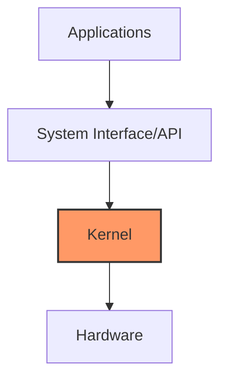
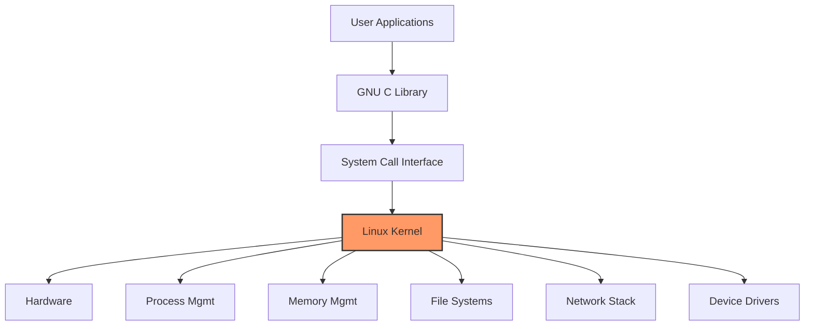
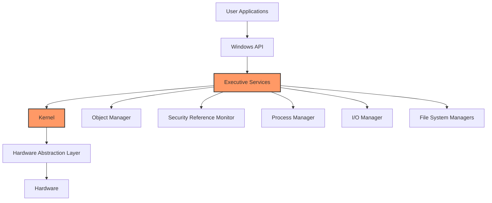

# Operating System Structure

## Introduction

An operating system (OS) is a complex piece of software that manages computer hardware and provides services for computer programs. To handle these diverse responsibilities effectively, operating systems are organized into distinct structural components, each with specific functions. Understanding this structure helps us grasp how an OS works internally and how it interacts with software and hardware.

In this tutorial, we'll explore the various approaches to organizing an operating system, examine its key components, and understand how they interact to create a functional computing environment.

## Basic Operating System Structure

At its core, an operating system can be viewed as having a layered architecture. Let's examine the main structural components:

### 1. The Kernel

The kernel is the heart of any operating system—it's the core component that:
- Manages hardware resources
- Provides essential services to system programs and applications
- Maintains security and isolation between processes



There are several different types of kernel designs:

#### Monolithic Kernel

In a monolithic kernel design, all OS services run in kernel space. This approach offers high performance but can be less modular.

Examples: Linux, traditional UNIX systems

```
User Applications
-----------------
      ↓ ↑
System Call Interface
-----------------
  File  | Process | Memory | Device
 System | Manager | Manager| Drivers
-----------------
    Hardware
```

#### Microkernel

Microkernels keep only essential services in kernel space and run other services as user processes. This design improves reliability and modularity at the cost of some performance overhead.

Examples: MINIX, QNX

```
User Applications  |  System Services
-----------------------------------
          ↓ ↑           ↓ ↑
        System Call Interface
-----------------------------------
     Message     |    Memory    
     Passing     |   Management  
-----------------------------------
          Hardware
```

#### Hybrid Kernel

Hybrid kernels combine elements of both monolithic and microkernel designs to balance performance and modularity.

Examples: Windows NT (Windows 10, 11), macOS (XNU kernel)

### 2. System Programs

System programs provide a convenient environment for program development and execution. They include:
- Command interpreters (shells)
- File utilities
- Programming language support
- Program loading and execution

### 3. User Interface

Modern operating systems typically offer one or both of these interfaces:

- **Command-Line Interface (CLI)**: Text-based interface where users type commands
- **Graphical User Interface (GUI)**: Visual interface with windows, icons, and menus

## System Calls

System calls are the interface through which user programs request services from the operating system kernel. They act as the gateway between user space and kernel space.

### Common Types of System Calls

1. **Process Control**: create, terminate, wait, allocate memory
2. **File Management**: create, delete, open, close, read, write
3. **Device Management**: request device, release device, read, write
4. **Information Maintenance**: get/set time, get/set system data
5. **Communication**: create/delete connection, send/receive messages

### Example: Simple System Call in C

Here's a simple example of using system calls to read from a file in C:

```c
#include <stdio.h>
#include <fcntl.h>
#include <unistd.h>

int main() {
    int fd, count;
    char buffer[100];
    
    // Open system call
    fd = open("example.txt", O_RDONLY);
    if (fd < 0) {
        printf("Error opening file
");
        return 1;
    }
    
    // Read system call
    count = read(fd, buffer, 100);
    buffer[count] = '\0';
    
    printf("Read %d bytes: %s
", count, buffer);
    
    // Close system call
    close(fd);
    
    return 0;
}
```

Input (example.txt):
```
Hello, operating system!
```

Output:
```
Read 24 bytes: Hello, operating system!
```

## Operating System Services

Operating systems provide a variety of services that create a secure and efficient environment for running applications:

### 1. Process Management

The OS manages processes (running programs) by:
- Creating and terminating processes
- Suspending and resuming processes
- Providing mechanisms for process synchronization
- Handling inter-process communication

### 2. Memory Management

Memory management involves:
- Tracking memory usage (which parts are used and by whom)
- Allocating and deallocating memory as needed
- Implementing virtual memory to provide the illusion of more memory than physically available

### 3. File System Management

The file system provides organization, storage, retrieval, naming, and protection of data:
- Files: Named collections of related data
- Directories: Organizational structures that contain files and other directories
- Access methods: Ways to store, retrieve, and update file data

### 4. I/O System Management

Operating systems manage all input/output operations:
- Buffering: Storing data temporarily while transferring between devices
- Caching: Keeping frequently accessed data in faster storage
- Spooling: Holding output for devices like printers that cannot accept interleaved data

### 5. Protection and Security

Modern operating systems implement various security measures:
- User authentication
- Permission systems
- Resource isolation
- Memory protection

## Real-World Operating System Structures

Let's look at how these concepts appear in real-world operating systems:

### Linux Structure

Linux follows a monolithic kernel design with loadable module support:



### Windows Structure

Windows uses a hybrid kernel architecture with layered design:



## Practical Example: Writing a Simple Shell

To illustrate how operating system structures work together, let's create a simple shell program that interacts with the OS through system calls:

```c
#include <stdio.h>
#include <stdlib.h>
#include <string.h>
#include <unistd.h>
#include <sys/wait.h>

#define MAX_INPUT_SIZE 1024
#define MAX_ARGS 64

void execute_command(char **args) {
    pid_t pid = fork();
    
    if (pid < 0) {
        // Error forking
        perror("fork failed");
    } else if (pid == 0) {
        // Child process
        if (execvp(args[0], args) == -1) {
            perror("Command not found");
            exit(EXIT_FAILURE);
        }
    } else {
        // Parent process
        wait(NULL);
    }
}

int main() {
    char input[MAX_INPUT_SIZE];
    char *args[MAX_ARGS];
    
    while (1) {
        printf("myshell> ");
        if (!fgets(input, MAX_INPUT_SIZE, stdin)) {
            break;
        }
        
        // Remove trailing newline
        input[strcspn(input, "
")] = 0;
        
        // Exit command
        if (strcmp(input, "exit") == 0) {
            break;
        }
        
        // Parse input into arguments
        char *token = strtok(input, " ");
        int arg_count = 0;
        
        while (token != NULL && arg_count < MAX_ARGS - 1) {
            args[arg_count++] = token;
            token = strtok(NULL, " ");
        }
        args[arg_count] = NULL;
        
        if (arg_count > 0) {
            execute_command(args);
        }
    }
    
    printf("Goodbye!
");
    return 0;
}
```

Sample input/output:
```
myshell> ls
file1.txt file2.txt program.c
myshell> echo hello world
hello world
myshell> pwd
/home/user/projects
myshell> exit
Goodbye!
```

This shell program demonstrates:
1. Process creation through `fork()`
2. Program execution through `execvp()`
3. Process synchronization using `wait()`
4. System call interactions for I/O operations

## Summary

Operating system structure provides the foundation for how an OS functions and interacts with hardware and software. Key takeaways include:

- Operating systems typically use a layered architecture with the kernel at the core
- Different kernel designs (monolithic, microkernel, hybrid) offer various tradeoffs
- System calls provide the interface between user applications and the kernel
- OS services include process management, memory management, file systems, I/O management, and security
- Understanding OS structure is essential for system programming and optimization

## Exercises

1. Compare and contrast monolithic kernels and microkernels. What are the advantages and disadvantages of each?
2. Identify five system calls on your operating system and describe their purpose.
3. Extend the simple shell example to include built-in commands that don't require creating a new process.
4. Draw a diagram of your operating system's structure based on research.
5. Write a program that uses at least three different system calls and explain how they interact with the kernel.

## Additional Resources

- "Operating System Concepts" by Silberschatz, Galvin, and Gagne
- "Modern Operating Systems" by Andrew S. Tanenbaum
- The Linux Kernel documentation: [https://www.kernel.org/doc/html/latest/](https://www.kernel.org/doc/html/latest/)
- "The Design and Implementation of the FreeBSD Operating System"