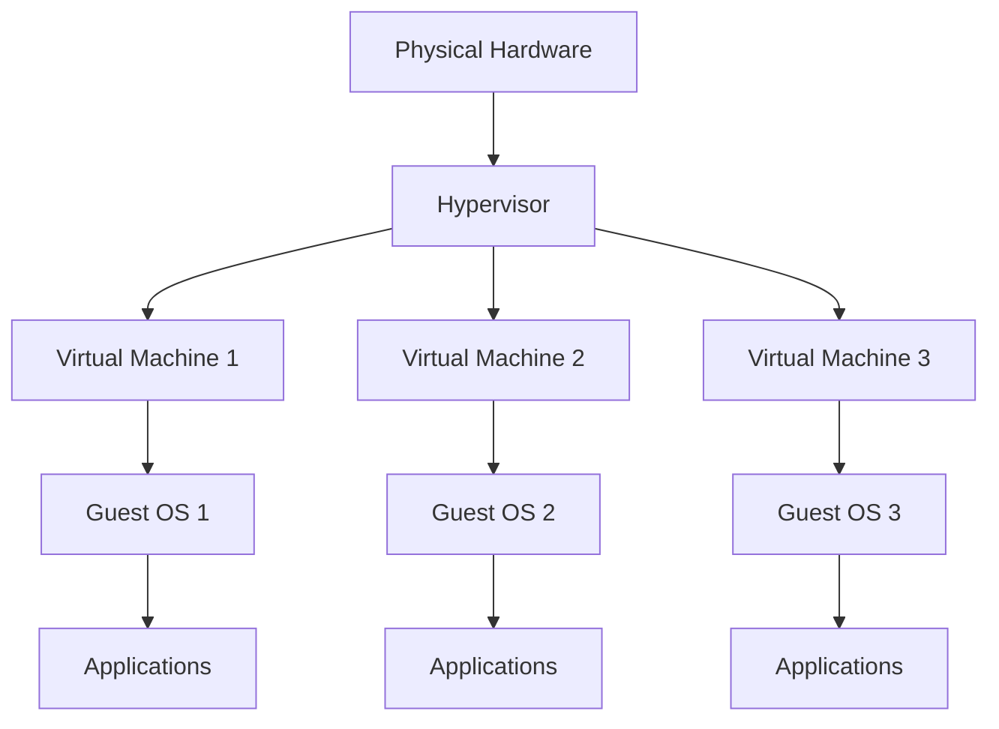
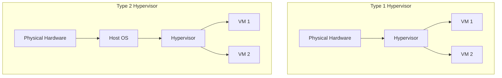

# Virtualization Basics

## Introduction

Virtualization is a foundational technology that allows one physical computer system to run multiple virtual instances of operating systems simultaneously. Each virtual instance operates as if it has exclusive access to dedicated hardware, while in reality, the physical resources are being shared and managed by specialized software.

In today's computing landscape, virtualization has become essential for efficient resource utilization, system security, development, and cloud computing infrastructure. This technology fundamentally changed how we approach computing resources by transforming physical hardware into software-defined systems.

## What is Virtualization?

Virtualization creates a simulated, or "virtual" computing environment as opposed to a physical one. It uses software to create an abstraction layer over computer hardware that allows the hardware elements of a single computer—processors, memory, storage, and more—to be divided into multiple virtual computers, commonly called Virtual Machines (VMs).

### Key Concepts

- **Host System**: The physical computer that provides the resources for virtualization
- **Guest System**: A virtual machine running on the host system
- **Hypervisor**: Software or firmware that creates and runs virtual machines
- **Virtual Machine**: A software computer that, like a physical computer, runs an operating system and applications

## How Virtualization Works

At its core, virtualization technology separates the physical hardware from the operating system through a layer called a hypervisor.



### Types of Hypervisors

There are two primary types of hypervisors:

1. **Type 1 (Bare-Metal) Hypervisors**: Run directly on the host's hardware to control the hardware and manage guest operating systems.
   - Examples: VMware ESXi, Microsoft Hyper-V, Xen
   
2. **Type 2 (Hosted) Hypervisors**: Run on a conventional operating system just as other computer programs do.
   - Examples: VirtualBox, VMware Workstation, Parallels Desktop



## Creating Your First Virtual Machine

Let's walk through a basic example of creating a virtual machine using VirtualBox, a popular Type 2 hypervisor:

### Step 1: Install VirtualBox

First, download and install VirtualBox from the official website and follow the installation wizard.

### Step 2: Create a New Virtual Machine

```
1. Open VirtualBox
2. Click on "New" button
3. Provide a name for your VM (e.g., "MyFirstVM")
4. Select the type of OS (e.g., "Linux")
5. Select the version (e.g., "Ubuntu 64-bit")
6. Click "Next"
```

### Step 3: Allocate Memory (RAM)

```
1. Set the amount of RAM to allocate to the VM
   (recommended minimum 1024MB for Linux)
2. Click "Next"
```

### Step 4: Create a Virtual Hard Disk

```
1. Select "Create a virtual hard disk now"
2. Click "Create"
3. Choose the hard disk file type (usually VDI)
4. Select storage type (usually "Dynamically allocated")
5. Set the size for your virtual hard disk
   (recommended minimum 10GB)
6. Click "Create"
```

### Step 5: Install an Operating System

```
1. Select your new VM and click "Start"
2. You'll be prompted to select a start-up disk
3. Select your ISO file (e.g., Ubuntu ISO)
4. Follow the OS installation wizard
```

## Virtualization Technologies

### 1. Full Virtualization

Full virtualization creates a complete simulation of the underlying hardware. The guest OS is unmodified and unaware that it's running in a virtualized environment.

Example code for checking if your processor supports hardware virtualization (Linux):

```bash
grep -E 'vmx|svm' /proc/cpuinfo
```

Output if virtualization is supported:
```
flags        : ... vmx ...
```

### 2. Paravirtualization

In paravirtualization, the guest OS is aware it's running on a hypervisor and contains special modified drivers, known as "enlightened I/O."

Example of a paravirtualized driver in Linux:

```c
static struct virtio_driver virtio_net_driver = {
    .feature_table = features,
    .feature_table_size = ARRAY_SIZE(features),
    .driver.name = KBUILD_MODNAME,
    .driver.owner = THIS_MODULE,
    .id_table = id_table,
    .probe = virtnet_probe,
    .remove = virtnet_remove,
    .config_changed = virtnet_config_changed,
};
```

### 3. Container-based Virtualization

Containers share the host system's kernel but maintain isolated user spaces.

Example Docker command to run an Ubuntu container:

```bash
docker run -it ubuntu bash
```

Output:
```
root@7b79af9dd3b4:/#
```

## Practical Applications of Virtualization

### Server Consolidation

Rather than running multiple physical servers at low utilization rates, companies can consolidate many virtual servers onto fewer physical machines.

**Example Scenario:**
```
Before Virtualization:
- Web Server: Physical machine using 20% of resources
- Database Server: Physical machine using 30% of resources
- Mail Server: Physical machine using 15% of resources
- File Server: Physical machine using 10% of resources

After Virtualization:
- Single Physical Server running:
  - Web Server VM
  - Database Server VM
  - Mail Server VM
  - File Server VM
  - Total resource utilization: 75%
```

### Development and Testing

Virtualization allows developers to:
- Test software in different OS environments
- Create isolated sandbox environments
- Simulate production configurations

**Example Development Workflow:**

```bash
# Clone a VM for testing
VBoxManage clonevm "ProductionVM" --name "TestVM" --register

# Create a snapshot before making changes
VBoxManage snapshot "TestVM" take "before-updates"

# After testing, revert if needed
VBoxManage snapshot "TestVM" restore "before-updates"
```

### Disaster Recovery

Virtual machines can be backed up and restored more easily than physical systems.

**Example Backup Script:**

```bash
#!/bin/bash
# Simple VM backup script

VM_NAME="CriticalServer"
BACKUP_DIR="/backup/vms"
DATE=$(date +%Y-%m-%d)

# Export the VM
VBoxManage export $VM_NAME -o "$BACKUP_DIR/$VM_NAME-$DATE.ova"

# Keep only the last 5 backups
ls -t $BACKUP_DIR/$VM_NAME-*.ova | tail -n +6 | xargs rm -f
```

## Benefits of Virtualization

1. **Resource Efficiency**: Maximize hardware utilization
2. **Isolation**: Applications and services run in separate environments
3. **Portability**: Virtual machines can be moved between physical hosts
4. **Scalability**: Easily deploy new virtual machines as needed
5. **Reduced Costs**: Less physical hardware, power, cooling, and space
6. **Faster Provisioning**: Deploy new systems in minutes instead of days
7. **Simplified Disaster Recovery**: Easier backups and failover

## Limitations and Challenges

1. **Performance Overhead**: Virtual machines have performance penalties
2. **Resource Contention**: VMs compete for underlying physical resources
3. **Management Complexity**: More systems to monitor and maintain
4. **Licensing Considerations**: Software licensing can be complex in virtual environments
5. **Security Concerns**: Hypervisor vulnerabilities can affect all VMs

## Virtualization Performance Monitoring

It's essential to monitor VM performance. Here's how to check CPU usage in a Linux VM:

```bash
top
```

Output:
```
top - 14:23:45 up 3 days, 2:42, 1 user, load average: 0.15, 0.10, 0.09
Tasks: 105 total,   1 running, 104 sleeping,   0 stopped,   0 zombie
%Cpu(s):  2.3 us,  0.7 sy,  0.0 ni, 96.7 id,  0.3 wa,  0.0 hi,  0.0 si,  0.0 st
MiB Mem :   3950.1 total,   2208.3 free,    715.0 used,   1026.8 buff/cache
MiB Swap:   2048.0 total,   2048.0 free,      0.0 used.   2960.5 avail Mem
```

## Summary

Virtualization technology allows us to run multiple operating systems on a single physical machine, providing significant benefits for resource utilization, flexibility, and management. We've covered:

- The fundamental concepts of virtualization
- How hypervisors create and manage virtual machines
- Different types of virtualization technologies
- Practical applications in real-world scenarios
- Benefits and limitations of virtualization
- Basic monitoring techniques

As cloud computing continues to dominate the IT landscape, understanding virtualization basics becomes increasingly essential for programmers and system administrators alike.

## Exercises

1. Install VirtualBox and create a Linux virtual machine.
2. Experiment with VM snapshots: create a snapshot, make changes to the VM, then restore to the snapshot.
3. Try creating multiple VMs and set up a simple network between them.
4. Compare the performance of an application running on your host OS vs. running in a VM.
5. Research container technologies like Docker and compare them to traditional virtual machines.

## Additional Resources

- [VirtualBox Documentation](https://www.virtualbox.org/wiki/Documentation)
- [KVM Documentation](https://www.linux-kvm.org/page/Documents)
- [Proxmox VE Documentation](https://pve.proxmox.com/wiki/Documentation)
- [Docker Documentation](https://docs.docker.com/)
- Book: "Mastering KVM Virtualization" by Humble Devassy Chirammal