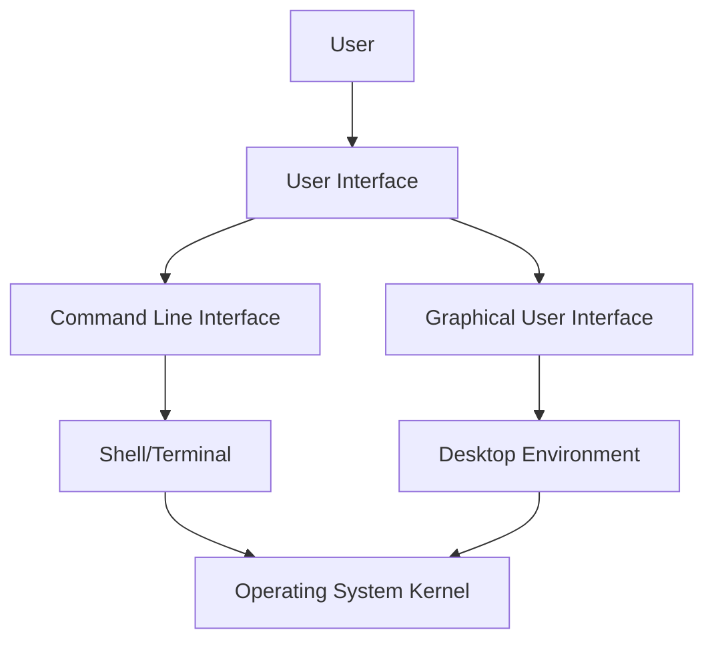

# User Interface and Shell

## Introduction

When you interact with a computer, you're communicating through what's called a **user interface**. Think of it as the "face" of your operating system—it's how you tell the computer what to do and how the computer shows you the results. The **shell** is a specific type of user interface that interprets your commands and acts as an intermediary between you and the operating system's core (kernel).

In this guide, we'll explore different types of user interfaces, with a special focus on shells, and understand how they form a crucial layer in operating system architecture.

## Types of User Interfaces

Operating systems provide two main types of user interfaces:

1. **Command Line Interface (CLI)** - Text-based interface where users type commands
2. **Graphical User Interface (GUI)** - Visual interface with windows, icons, and mouse interaction

Let's explore each of these in detail.



## Command Line Interface (CLI)

The Command Line Interface, often accessed through a terminal emulator, allows users to interact with the operating system by typing text commands.

### What is a Shell?

A **shell** is a program that provides the command-line interface, interpreting the commands you type and converting them into instructions that the operating system can understand. 

Common shells include:

- **Bash** (Bourne Again SHell) - Default on most Linux distributions and macOS (until Catalina)
- **Zsh** (Z Shell) - Default on macOS since Catalina
- **PowerShell** - Modern shell for Windows systems
- **Cmd.exe** - Traditional Windows command interpreter

### Basic Shell Commands

Here are some fundamental commands that work in most shell environments:

#### Listing Files and Directories

```bash
ls                  # List files and directories (Unix/Linux/macOS)
dir                 # List files and directories (Windows CMD)
Get-ChildItem       # List files and directories (PowerShell)
```

**Example Input and Output:**

```
$ ls
Documents  Downloads  Pictures  Music  Desktop
```

#### Changing Directories

```bash
cd Documents        # Change to Documents directory
cd ..               # Go up one directory level
cd ~                # Go to home directory (Unix/Linux/macOS)
cd /                # Go to root directory
```

**Example Input and Output:**

```
$ pwd
/home/user
$ cd Documents
$ pwd
/home/user/Documents
$ cd ..
$ pwd
/home/user
```

#### Creating and Removing Directories

```bash
mkdir NewFolder     # Create a directory called NewFolder
rmdir EmptyFolder   # Remove an empty directory
rm -r Folder        # Remove a directory and its contents (use with caution!)
```

**Example Input and Output:**

```
$ mkdir Projects
$ ls
Documents  Downloads  Pictures  Music  Desktop  Projects
$ rmdir Projects
$ ls
Documents  Downloads  Pictures  Music  Desktop
```

### Shell Scripting

Shells aren't just for running commands—they're also programming environments. You can write **shell scripts** to automate tasks using commands and programming constructs.

Here's a simple Bash script example:

```bash
#!/bin/bash

# A simple greeting script
echo "Hello, what's your name?"
read name
echo "Nice to meet you, $name!"
echo "Today is $(date)"
echo "Your current working directory is $(pwd)"
```

**How to run this script:**

1. Save it as `greeting.sh`
2. Make it executable: `chmod +x greeting.sh`
3. Run it: `./greeting.sh`

**Example Output:**

```
Hello, what's your name?
John
Nice to meet you, John!
Today is Tue Mar 18 10:30:45 EDT 2025
Your current working directory is /home/john/scripts
```

## Graphical User Interface (GUI)

The Graphical User Interface allows users to interact with the computer using visual elements like windows, icons, menus, and a pointing device (usually a mouse).

### Components of a GUI

1. **Desktop** - The main workspace where you can place files, folders, and shortcuts
2. **Windows** - Rectangular areas that contain applications or file views
3. **Icons** - Small pictures representing files, folders, or applications
4. **Menus** - Lists of commands or options
5. **Widgets** - Interactive components like buttons, text fields, and checkboxes

### Desktop Environments

On Linux, the GUI is provided by a desktop environment. Popular options include:

- **GNOME** - Modern, minimalist interface used by Ubuntu and Fedora
- **KDE Plasma** - Feature-rich, customizable environment
- **Xfce** - Lightweight environment for older computers
- **MATE** - Traditional environment based on GNOME 2

Windows uses its own proprietary desktop environment that has evolved through versions like Windows 7, 8, 10, and 11. macOS uses Aqua, a consistent interface that has evolved gradually.

## The Relationship Between GUI and CLI

Modern operating systems provide both GUI and CLI interfaces, and they can work together:

- **Terminal Emulators** - GUI applications that provide access to the command line
- **GUI File Managers** - Often have options to open a terminal in the current directory
- **System Management** - Some tasks are easier in GUI, others in CLI

Many power users switch between both interfaces depending on the task at hand.

## Practical Examples

### Example 1: Managing Files

**GUI Approach:**
1. Open File Explorer (Windows) or Finder (macOS)
2. Navigate to folder by clicking
3. Right-click and select "New Folder"
4. Type name and press Enter
5. Drag files into the folder

**CLI Approach:**
```bash
cd Documents
mkdir ProjectAlpha
mv report.pdf budget.xlsx meeting-notes.txt ProjectAlpha/
```

### Example 2: System Information

**GUI Approach:**
1. Windows: Open System Information from Start Menu
2. macOS: Click Apple menu > About This Mac

**CLI Approach:**
```bash
# On Linux:
uname -a                  # Basic OS information
cat /etc/os-release       # Distribution details
lscpu                     # CPU information

# On macOS:
system_profiler SPHardwareDataType   # Hardware overview

# On Windows (PowerShell):
Get-ComputerInfo          # Detailed system information
```

**Example Output (Linux):**

```
$ uname -a
Linux ubuntu-desktop 5.15.0-60-generic #66-Ubuntu SMP Fri Jan 20 14:29:49 UTC 2023 x86_64 x86_64 x86_64 GNU/Linux

$ cat /etc/os-release
NAME="Ubuntu"
VERSION="22.04.2 LTS (Jammy Jellyfish)"
ID=ubuntu
ID_LIKE=debian
PRETTY_NAME="Ubuntu 22.04.2 LTS"
VERSION_ID="22.04"
HOME_URL="https://www.ubuntu.com/"
SUPPORT_URL="https://help.ubuntu.com/"
BUG_REPORT_URL="https://bugs.launchpad.net/ubuntu/"
PRIVACY_POLICY_URL="https://www.ubuntu.com/legal/terms-and-policies/privacy-policy"
VERSION_CODENAME=jammy
UBUNTU_CODENAME=jammy
```

### Example 3: Process Management

**GUI Approach:**
1. Windows: Open Task Manager (Ctrl+Shift+Esc)
2. macOS: Open Activity Monitor
3. Linux: Open System Monitor

**CLI Approach:**
```bash
# View running processes
ps aux                    # Detailed process list (Unix/Linux/macOS)
Get-Process               # List processes (PowerShell)

# Kill a process
kill 1234                 # Kill process with PID 1234 (Unix/Linux/macOS)
taskkill /PID 1234        # Kill process with PID 1234 (Windows)
```

## Advanced Shell Features

### Environment Variables

Environment variables store system-wide information that programs can access:

```bash
# View all environment variables
env                       # Unix/Linux/macOS
Get-ChildItem Env:        # PowerShell

# Set an environment variable for the current session
export PATH=$PATH:/new/path   # Unix/Linux/macOS
$env:PATH += ";C:
ew\path"   # PowerShell

# View a specific variable
echo $HOME                # Unix/Linux/macOS
$env:USERPROFILE          # PowerShell
```

### Redirection and Pipes

The shell allows you to redirect output to files or other programs:

```bash
# Redirect output to a file
ls > file_list.txt

# Append output to a file
echo "New line" >> notes.txt

# Pipe output from one command to another
ls -la | grep "document"

# Redirect both output and errors
command > output.txt 2> errors.txt
```

### Job Control

You can manage multiple processes from a single terminal:

```bash
long_running_command &    # Run in background
jobs                      # List background jobs
fg 1                      # Bring job 1 to foreground
bg 2                      # Continue job 2 in background
Ctrl+Z                    # Suspend current foreground job
```

## Summary

The user interface is your gateway to interacting with an operating system. While GUIs offer intuitive, visual ways to work with your computer, CLIs through shells provide powerful, efficient methods to perform tasks, especially for automation and complex operations.

Understanding both interfaces gives you flexibility and enhances your ability to use computers effectively. As you continue your journey into operating systems, you'll discover that many advanced operations are more efficient through the command line, while everyday tasks might be quicker through the GUI.

## Exercises

1. Try these basic shell commands on your system and observe the output:
   - `pwd` (print working directory)
   - `echo $PATH` (view the PATH environment variable)
   - `ls -l` (list files with detailed information)

2. Create a simple shell script that:
   - Creates a directory named "BackupFiles"
   - Copies all `.txt` files from the current directory into it
   - Prints a message showing how many files were copied

3. Compare how you would perform these tasks in both CLI and GUI:
   - Finding all files larger than 1MB
   - Checking disk space usage
   - Setting file permissions

## Additional Resources

- **Books**:
  - "The Linux Command Line" by William Shotts
  - "PowerShell in a Month of Lunches" by Don Jones and Jeffery Hicks

- **Online Tutorials**:
  - Linux Command Library (commands explanation and examples)
  - Shell scripting guides for Bash/PowerShell
  - Interactive shell learning platforms

- **Tools**:
  - Terminal emulators: iTerm2 (macOS), Windows Terminal, GNOME Terminal
  - Shell enhancers: Oh My Zsh, Starship prompt