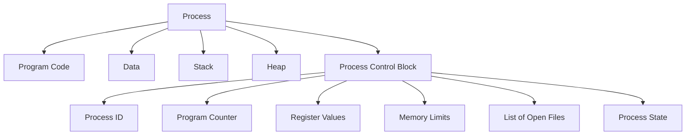
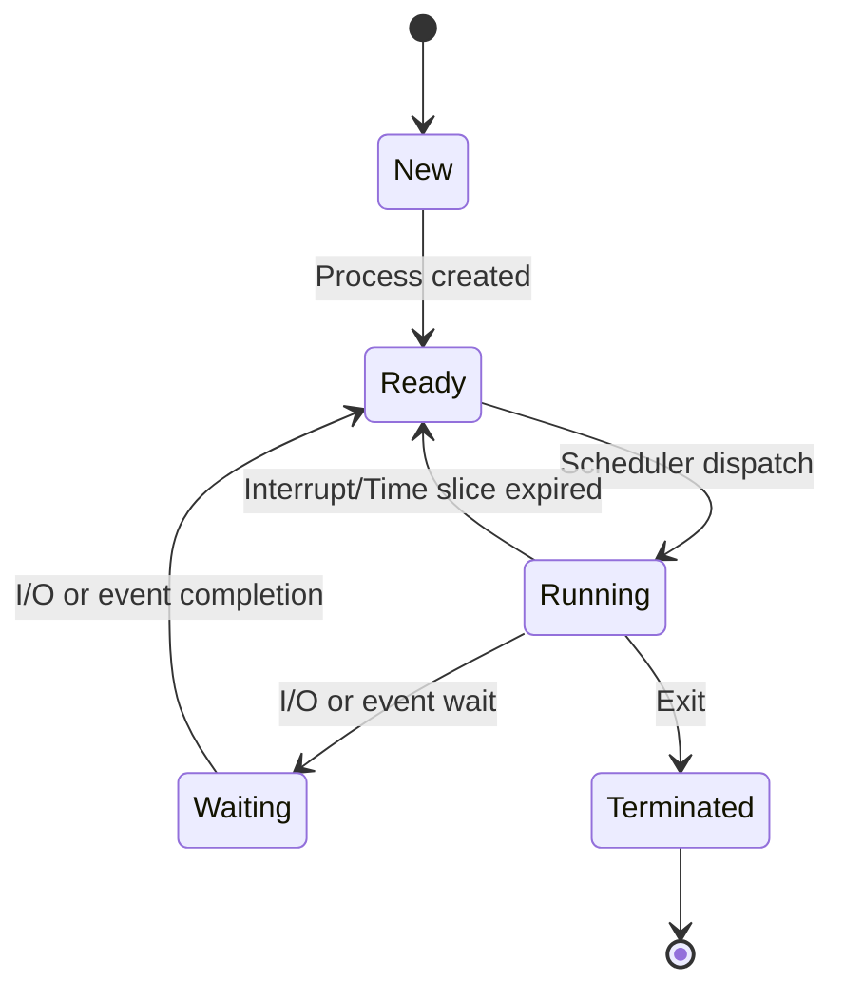
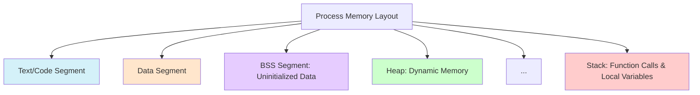

# Process Concept

## Introduction

In computing, a **process** is one of the most fundamental concepts you'll encounter. Simply put, a process is a program in execution. When you run an application on your computer—whether it's a web browser, a text editor, or a game—you're creating and using processes.

Understanding processes is crucial for any programmer because they form the backbone of how operating systems manage and execute the programs we write. In this guide, we'll explore what processes are, how they work, and why they matter in modern computing.

## What is a Process?

### Definition

A process is an instance of a program in execution. It's important to distinguish between a program and a process:

- A **program** is a passive entity: a file containing instructions stored on disk
- A **process** is an active entity: a program that's been loaded into memory and is currently executing

When you double-click an application icon, the operating system transforms that static program into a dynamic process by:
1. Loading the program code into memory
2. Allocating resources needed for execution
3. Beginning execution at the program's entry point

### Process Components

A process consists of several key components:

- **Program code**: The executable instructions
- **Data**: Variables and other information the program needs
- **Resources**: Files, I/O devices, and other resources allocated to the process
- **Process state**: Current activity information including program counter, register values, etc.
- **Process Control Block (PCB)**: Data structure maintained by the OS to track information about the process

Let's visualize the components of a process:



## Process States

During its lifecycle, a process transitions through various states. The basic states include:

1. **New**: The process is being created
2. **Ready**: The process is waiting to be assigned to a processor
3. **Running**: Instructions are being executed
4. **Waiting/Blocked**: The process is waiting for some event to occur (such as I/O completion)
5. **Terminated**: The process has finished execution

Here's a state diagram showing the transitions:



## Process Control Block (PCB)

The Process Control Block (PCB) is a data structure that contains all the information about a process. It serves as the process's representation in the operating system. Think of it as an ID card or profile that the OS uses to track and manage the process.

A PCB typically includes:

- **Process ID (PID)**: Unique identifier for the process
- **Process State**: Current state (running, waiting, etc.)
- **Program Counter**: Address of the next instruction to execute
- **CPU Registers**: Contents of processor registers
- **CPU Scheduling Information**: Priority and scheduling queue pointers
- **Memory Management Information**: Base and limit registers, page tables
- **Accounting Information**: CPU used, time limits, etc.
- **I/O Status Information**: List of open files, pending I/O requests, etc.

## Process in Memory

A process in memory typically has the following segments:

- **Text segment**: Contains the executable code
- **Data segment**: Contains global and static variables
- **Heap**: Dynamically allocated memory during program run time
- **Stack**: Temporary data storage (function parameters, return addresses, local variables)

Here's a simplified view of process memory layout:



## Process Creation

Processes are created in several ways:

1. **System initialization**: When an OS boots, it creates several processes
2. **User request**: When a user launches an application
3. **Process creation**: A running process can create another process

In most operating systems, a process can create a new process using system calls. In Unix/Linux systems, the `fork()` system call creates a new process by duplicating the calling process. The new process becomes the child of the original (parent) process.

Let's look at a simple example in C:

```c
#include <stdio.h>
#include <unistd.h>

int main() {
    pid_t pid;
    
    // Create a new process
    pid = fork();
    
    if (pid < 0) {
        // Error occurred
        fprintf(stderr, "Fork Failed");
        return 1;
    } else if (pid == 0) {
        // Child process
        printf("I am the child process with ID: %d
", getpid());
        printf("My parent's ID: %d
", getppid());
    } else {
        // Parent process
        printf("I am the parent process with ID: %d
", getpid());
        printf("My child's ID: %d
", pid);
    }
    
    return 0;
}
```

When executed, this program might produce output like:

```
I am the parent process with ID: 5678
My child's ID: 5679
I am the child process with ID: 5679
My parent's ID: 5678
```

Notice how both the parent and child execute concurrently after the `fork()` call, and each has its own unique process ID.

## Process Termination

Processes can terminate in several ways:

1. **Normal completion**: The process executes an exit system call
2. **Error**: The process encounters an unrecoverable error
3. **Killed by another process**: A process with appropriate permissions can terminate another
4. **Resource limits**: The OS may terminate processes that exceed allocated resources

In Unix/Linux systems, a process can terminate using the `exit()` system call, and one process can terminate another using the `kill()` system call.

## Practical Applications

### Process Management in Task Managers

Task managers (like Windows Task Manager or macOS Activity Monitor) allow users to view and manage running processes. They display information such as:

- Process name and ID
- CPU and memory usage
- User who started the process
- Start time and elapsed time

### Multi-process Applications

Many modern applications use multiple processes for better performance and reliability:

- **Web browsers**: Often run each tab in a separate process so that if one tab crashes, the entire browser doesn't crash
- **Server applications**: May create a new process for each client connection
- **Parallel computing**: Dividing a task among multiple processes to utilize multiple CPU cores

## Process vs. Thread

It's worth briefly mentioning the difference between processes and threads:

- A **process** is an independent program execution with its own memory space
- A **thread** is a lightweight process that shares the same memory space with other threads in the same process

Threads allow a process to perform multiple tasks concurrently while sharing resources like memory and files.

## Summary

The process concept is fundamental to understanding how operating systems manage program execution. In this guide, we've covered:

- What a process is and how it differs from a program
- The components and states of a process
- How the Process Control Block (PCB) represents a process in the OS
- Process memory layout
- How processes are created and terminated
- Practical applications of processes in modern computing

Understanding processes provides a foundation for learning more advanced concepts like threads, scheduling, synchronization, and interprocess communication.

## Exercises for Practice

1. Write a simple program that creates a child process using `fork()` and has the child execute a different program using `exec()`.
2. Use a system monitoring tool on your computer to observe processes. Identify the processes using the most CPU and memory.
3. Create a program that demonstrates zombie and orphan processes.
4. Research and compare how processes are managed in different operating systems (Windows, Linux, macOS).

## Additional Resources

- Operating System Concepts by Silberschatz, Galvin, and Gagne
- Modern Operating Systems by Andrew S. Tanenbaum
- The Linux Programming Interface by Michael Kerrisk
- [Operating Systems: Three Easy Pieces](http://pages.cs.wisc.edu/~remzi/OSTEP/) (free online textbook)