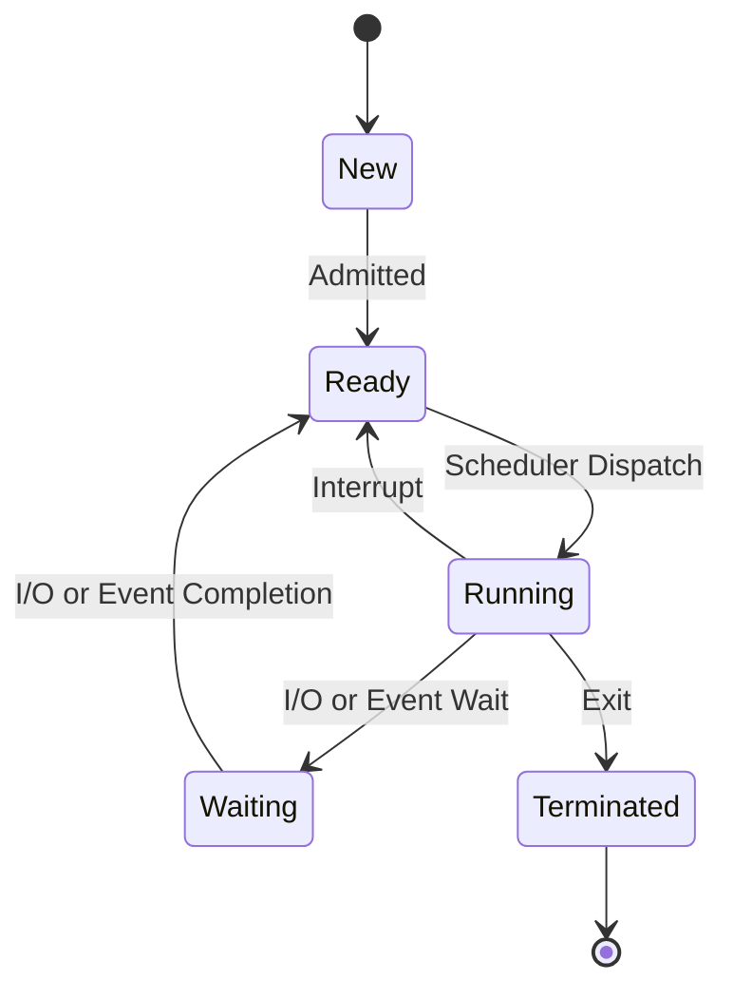

# Process Scheduling

## Introduction

Process scheduling is a fundamental concept in operating systems that determines which process runs at a given time. In a multi-tasking environment, the CPU switches rapidly between processes, giving the illusion that multiple programs are running simultaneously. The component of the operating system responsible for this decision-making is called the **scheduler**, and the algorithm it uses is called the **scheduling algorithm**.

Understanding process scheduling is crucial for developers because it directly impacts application performance, responsiveness, and resource utilization. Even as a beginner programmer, having knowledge of how your programs are scheduled by the operating system can help you write more efficient code.

## Why Process Scheduling is Necessary

Imagine your computer as a chef in a busy restaurant. The chef (CPU) can only prepare one dish (process) at a time, but there are multiple orders (programs) waiting to be prepared. How does the chef decide which dish to prepare next? This is essentially what process scheduling is about.

Process scheduling is necessary because:

1. **CPU Utilization**: To keep the CPU as busy as possible
2. **Fairness**: To give each process a fair share of the CPU time
3. **Throughput**: To maximize the number of processes completed per unit time
4. **Response Time**: To minimize the time between request submission and first response
5. **Turnaround Time**: To minimize the time between process submission and completion

## Process States and Scheduling

Before diving into scheduling algorithms, let's understand the life cycle of a process:



- **New**: Process is being created
- **Ready**: Process is waiting to be assigned to the CPU
- **Running**: Instructions are being executed
- **Waiting**: Process is waiting for some event to occur
- **Terminated**: Process has finished execution

The scheduler primarily deals with processes in the ready state, deciding which one should be moved to the running state.

## Types of Schedulers

Operating systems typically employ three types of schedulers:

1. **Long-term Scheduler (Job Scheduler)**: Controls the degree of multiprogramming (number of processes in memory)
2. **Medium-term Scheduler**: Handles swapping (moving processes between main memory and disk)
3. **Short-term Scheduler (CPU Scheduler)**: Decides which ready process gets CPU time next

As beginners, we'll focus mainly on the short-term scheduler, which is what most people refer to when discussing process scheduling.

## Common Scheduling Algorithms

Let's explore the most common scheduling algorithms with examples:

### First-Come, First-Served (FCFS)

This is the simplest scheduling algorithm where processes are executed in the order they arrive.

**Example:**

Consider three processes with their arrival times and burst times (execution time):

| Process | Arrival Time | Burst Time |
| ------- | ------------ | ---------- |
| P1      | 0            | 24         |
| P2      | 2            | 3          |
| P3      | 4            | 6          |

With FCFS, the execution order would be: P1 → P2 → P3

```
P1                          |
                            |
P2                          |-->
                               |
P3                          |----->
-----|-----|-----|-----|-----|-----|--
0     5     10    15    20    25    30    35
```

**Implementation in C:**

```c
#include <stdio.h>

struct Process {
    int id;
    int arrival_time;
    int burst_time;
    int waiting_time;
    int turnaround_time;
};

void calculateTimes(struct Process processes[], int n) {
    // First process has 0 waiting time
    processes[0].waiting_time = 0;
    
    // Calculate waiting time for each process
    for (int i = 1; i < n; i++) {
        processes[i].waiting_time = processes[i-1].waiting_time + 
                                    processes[i-1].burst_time;
    }
    
    // Calculate turnaround time for each process
    for (int i = 0; i < n; i++) {
        processes[i].turnaround_time = processes[i].waiting_time + 
                                       processes[i].burst_time;
    }
}

void displayResults(struct Process processes[], int n) {
    int total_waiting_time = 0, total_turnaround_time = 0;
    
    printf("
Process\tBurst Time\tWaiting Time\tTurnaround Time
");
    
    for (int i = 0; i < n; i++) {
        total_waiting_time += processes[i].waiting_time;
        total_turnaround_time += processes[i].turnaround_time;
        
        printf("%d\t%d\t\t%d\t\t%d
", processes[i].id, 
               processes[i].burst_time, processes[i].waiting_time, 
               processes[i].turnaround_time);
    }
    
    printf("
Average Waiting Time: %.2f", (float)total_waiting_time / n);
    printf("
Average Turnaround Time: %.2f
", (float)total_turnaround_time / n);
}

int main() {
    struct Process processes[] = {
        {1, 0, 24, 0, 0},
        {2, 0, 3, 0, 0},
        {3, 0, 6, 0, 0}
    };
    
    int n = sizeof(processes) / sizeof(processes[0]);
    
    calculateTimes(processes, n);
    displayResults(processes, n);
    
    return 0;
}
```

**Output:**
```
Process Burst Time      Waiting Time    Turnaround Time
1       24              0               24
2       3               24              27
3       6               27              33

Average Waiting Time: 17.00
Average Turnaround Time: 28.00
```

**Advantages**:
- Simple and easy to implement
- Fair in the sense that processes are executed in the order they arrive

**Disadvantages**:
- Can lead to the "convoy effect" where short processes wait for a long process to finish
- Not optimal for interactive systems due to potentially long waiting times

### Shortest Job First (SJF)

This algorithm selects the process with the shortest burst time next.

**Example:**

Using the same processes:

| Process | Arrival Time | Burst Time |
| ------- | ------------ | ---------- |
| P1      | 0            | 24         |
| P2      | 2            | 3          |
| P3      | 4            | 6          |

With SJF, the execution order would be: P2 → P3 → P1

```
P2    |-->
         |
P3    |----->
             |
P1    |------------------------->
-----|-----|-----|-----|-----|-----|--
0     5     10    15    20    25    30    35
```

**Implementation in Python:**

```python
def sjf_scheduling(processes):
    n = len(processes)
    
    # Sort processes by burst time
    processes.sort(key=lambda x: x[1])
    
    waiting_time = [0] * n
    turnaround_time = [0] * n
    
    # Calculate waiting time
    for i in range(1, n):
        waiting_time[i] = waiting_time[i-1] + processes[i-1][1]
    
    # Calculate turnaround time
    for i in range(n):
        turnaround_time[i] = waiting_time[i] + processes[i][1]
    
    # Calculate averages
    avg_waiting_time = sum(waiting_time) / n
    avg_turnaround_time = sum(turnaround_time) / n
    
    # Display results
    print("Process\tBurst Time\tWaiting Time\tTurnaround Time")
    for i in range(n):
        print(f"{processes[i][0]}\t{processes[i][1]}\t\t{waiting_time[i]}\t\t{turnaround_time[i]}")
    
    print(f"
Average Waiting Time: {avg_waiting_time:.2f}")
    print(f"Average Turnaround Time: {avg_turnaround_time:.2f}")

# Process ID and Burst Time
processes = [
    ["P1", 24],
    ["P2", 3],
    ["P3", 6]
]

sjf_scheduling(processes)
```

**Output:**
```
Process Burst Time      Waiting Time    Turnaround Time
P2      3               0               3
P3      6               3               9
P1      24              9               33

Average Waiting Time: 4.00
Average Turnaround Time: 15.00
```

**Advantages**:
- Optimal for minimizing average waiting time
- Better for interactive systems than FCFS

**Disadvantages**:
- Requires knowledge of burst time in advance, which is often not available
- May lead to starvation of longer processes if shorter processes keep arriving

### Round Robin (RR)

This algorithm assigns each process a small unit of CPU time called a quantum or time slice. After this time elapses, the process is preempted and added to the end of the ready queue.

**Example:**

Using the same processes with a time quantum of 4:

| Process | Arrival Time | Burst Time |
| ------- | ------------ | ---------- |
| P1      | 0            | 24         |
| P2      | 0            | 3          |
| P3      | 0            | 6          |

With RR, the execution order would be: P1(4) → P2(3) → P3(4) → P1(4) → P3(2) → P1(4) → P1(4) → P1(4) → P1(4)

```
P1    |-->|                |-->|                |-->|    |-->|    |-->|
         |                    |                    |       |       |
P2    |-->|
         |
P3       |-->|                |-->|
-----|-----|-----|-----|-----|-----|-----|-----|-----|-----|
0     4     7     11    15    19    21    25    29    33
```

**Implementation in Java:**

```java
import java.util.*;

class Process {
    int id;
    int burstTime;
    int remainingTime;
    
    public Process(int id, int burstTime) {
        this.id = id;
        this.burstTime = burstTime;
        this.remainingTime = burstTime;
    }
}

public class RoundRobin {
    public static void main(String[] args) {
        List<Process> processes = new ArrayList<>();
        processes.add(new Process(1, 24));
        processes.add(new Process(2, 3));
        processes.add(new Process(3, 6));
        
        int timeQuantum = 4;
        
        roundRobinScheduling(processes, timeQuantum);
    }
    
    public static void roundRobinScheduling(List<Process> processes, int timeQuantum) {
        Queue<Process> readyQueue = new LinkedList<>(processes);
        List<Process> completed = new ArrayList<>();
        
        int currentTime = 0;
        int[] waitingTime = new int[processes.size()];
        int[] turnaroundTime = new int[processes.size()];
        
        System.out.println("Process execution order:");
        
        while (!readyQueue.isEmpty()) {
            Process currentProcess = readyQueue.poll();
            
            System.out.print("P" + currentProcess.id + " ");
            
            // Execute for time quantum or until completion
            int executionTime = Math.min(timeQuantum, currentProcess.remainingTime);
            currentTime += executionTime;
            currentProcess.remainingTime -= executionTime;
            
            // If process is not completed, add it back to queue
            if (currentProcess.remainingTime > 0) {
                readyQueue.add(currentProcess);
            } else {
                // Calculate turnaround time
                turnaroundTime[currentProcess.id - 1] = currentTime;
                // Add to completed list
                completed.add(currentProcess);
            }
        }
        
        // Calculate waiting time
        for (Process p : completed) {
            waitingTime[p.id - 1] = turnaroundTime[p.id - 1] - p.burstTime;
        }
        
        // Calculate averages
        double avgWaitingTime = Arrays.stream(waitingTime).average().orElse(0);
        double avgTurnaroundTime = Arrays.stream(turnaroundTime).average().orElse(0);
        
        System.out.println("

Process\tBurst Time\tWaiting Time\tTurnaround Time");
        for (int i = 0; i < processes.size(); i++) {
            Process p = processes.get(i);
            System.out.println(p.id + "\t" + p.burstTime + "\t\t" + waitingTime[i] + "\t\t" + turnaroundTime[i]);
        }
        
        System.out.printf("
Average Waiting Time: %.2f
", avgWaitingTime);
        System.out.printf("Average Turnaround Time: %.2f
", avgTurnaroundTime);
    }
}
```

**Output:**
```
Process execution order:
P1 P2 P3 P1 P3 P1 P1 P1 P1 

Process Burst Time      Waiting Time    Turnaround Time
1       24              9               33
2       3               4               7
3       6               13              19

Average Waiting Time: 8.67
Average Turnaround Time: 19.67
```

**Advantages**:
- Fair allocation of CPU time
- Better response time for interactive processes
- No process has to wait too long for CPU time

**Disadvantages**:
- Higher overhead due to context switching
- Performance depends heavily on the choice of time quantum

### Priority Scheduling

This algorithm assigns each process a priority, and the process with the highest priority gets CPU time next.

**Example:**

Consider the following processes with their priorities (lower number means higher priority):

| Process | Arrival Time | Burst Time | Priority |
| ------- | ------------ | ---------- | -------- |
| P1      | 0            | 10         | 3        |
| P2      | 0            | 5          | 1        |
| P3      | 0            | 8          | 2        |

With Priority Scheduling, the execution order would be: P2 → P3 → P1

**Implementation in C++:**

```cpp
#include <iostream>
#include <algorithm>
#include <vector>
using namespace std;

struct Process {
    int id;
    int burstTime;
    int priority;
    int waitingTime;
    int turnaroundTime;
};

bool compareByPriority(const Process& a, const Process& b) {
    return a.priority < b.priority;
}

void priorityScheduling(vector<Process>& processes) {
    int n = processes.size();
    
    // Sort by priority (lower number = higher priority)
    sort(processes.begin(), processes.end(), compareByPriority);
    
    // Calculate waiting time
    processes[0].waitingTime = 0;
    for (int i = 1; i < n; i++) {
        processes[i].waitingTime = processes[i-1].waitingTime + processes[i-1].burstTime;
    }
    
    // Calculate turnaround time
    for (int i = 0; i < n; i++) {
        processes[i].turnaroundTime = processes[i].waitingTime + processes[i].burstTime;
    }
    
    // Calculate averages
    double totalWaitingTime = 0, totalTurnaroundTime = 0;
    for (int i = 0; i < n; i++) {
        totalWaitingTime += processes[i].waitingTime;
        totalTurnaroundTime += processes[i].turnaroundTime;
    }
    
    double avgWaitingTime = totalWaitingTime / n;
    double avgTurnaroundTime = totalTurnaroundTime / n;
    
    // Display results
    cout << "Process\tBurst Time\tPriority\tWaiting Time\tTurnaround Time
";
    for (int i = 0; i < n; i++) {
        cout << processes[i].id << "\t" << processes[i].burstTime << "\t\t"
             << processes[i].priority << "\t\t" << processes[i].waitingTime << "\t\t"
             << processes[i].turnaroundTime << endl;
    }
    
    cout << "
Average Waiting Time: " << avgWaitingTime << endl;
    cout << "Average Turnaround Time: " << avgTurnaroundTime << endl;
}

int main() {
    vector<Process> processes = {
        {1, 10, 3, 0, 0},
        {2, 5, 1, 0, 0},
        {3, 8, 2, 0, 0}
    };
    
    priorityScheduling(processes);
    
    return 0;
}
```

**Output:**
```
Process Burst Time      Priority        Waiting Time    Turnaround Time
2       5               1               0               5
3       8               2               5               13
1       10              3               13              23

Average Waiting Time: 6
Average Turnaround Time: 13.67
```

**Advantages**:
- Can prioritize certain processes based on their importance
- Useful when some processes are more critical than others

**Disadvantages**:
- May lead to starvation of lower priority processes
- Priority inversion may occur if a high-priority process depends on a low-priority process

## Real-World Applications

Process scheduling is not just a theoretical concept; it has many practical applications:

### 1. Desktop Operating Systems

When you're using your computer and have multiple applications open, process scheduling ensures that all applications get a fair share of CPU time. This is why you can listen to music while browsing the web and working on a document simultaneously.

### 2. Server Environments

In web servers handling thousands of requests simultaneously, scheduling algorithms ensure that each request is processed efficiently and that the server remains responsive under heavy load.

### 3. Real-Time Systems

Systems like air traffic control, medical equipment, and industrial automation use specialized real-time scheduling algorithms to ensure that critical operations meet their deadlines.

### 4. Mobile Devices

On your smartphone, process scheduling helps balance between responsive user interface, background processes, and power efficiency.

## Implementing a Simple Scheduler

Let's implement a simple round-robin scheduler in JavaScript to demonstrate the concept:

```javascript
class Process {
  constructor(id, burstTime) {
    this.id = id;
    this.burstTime = burstTime;
    this.remainingTime = burstTime;
    this.waitingTime = 0;
    this.turnaroundTime = 0;
  }
}

function roundRobinScheduler(processes, quantum) {
  let time = 0;
  const readyQueue = [...processes];
  const ganttChart = [];
  
  // Continue until all processes are completed
  while (readyQueue.length > 0) {
    const currentProcess = readyQueue.shift();
    
    // Execute process for quantum time or until completion
    const executeTime = Math.min(quantum, currentProcess.remainingTime);
    time += executeTime;
    currentProcess.remainingTime -= executeTime;
    
    // Add to Gantt chart
    ganttChart.push({
      process: currentProcess.id,
      startTime: time - executeTime,
      endTime: time
    });
    
    // If process is not complete, add it back to the queue
    if (currentProcess.remainingTime > 0) {
      readyQueue.push(currentProcess);
    } else {
      // Calculate turnaround time (completion time)
      currentProcess.turnaroundTime = time;
    }
  }
  
  // Calculate waiting time
  for (let p of processes) {
    p.waitingTime = p.turnaroundTime - p.burstTime;
  }
  
  return {
    processes,
    ganttChart,
    avgWaitingTime: processes.reduce((sum, p) => sum + p.waitingTime, 0) / processes.length,
    avgTurnaroundTime: processes.reduce((sum, p) => sum + p.turnaroundTime, 0) / processes.length
  };
}

// Example usage
const processList = [
  new Process(1, 10),
  new Process(2, 5),
  new Process(3, 8)
];

const result = roundRobinScheduler(processList, 2);

console.log("Gantt Chart:");
for (let entry of result.ganttChart) {
  console.log(`Process ${entry.process}: ${entry.startTime} - ${entry.endTime}`);
}

console.log("
Process\tBurst Time\tWaiting Time\tTurnaround Time");
for (let p of result.processes) {
  console.log(`${p.id}\t${p.burstTime}\t\t${p.waitingTime}\t\t${p.turnaroundTime}`);
}

console.log(`
Average Waiting Time: ${result.avgWaitingTime.toFixed(2)}`);
console.log(`Average Turnaround Time: ${result.avgTurnaroundTime.toFixed(2)}`);
```

This implementation demonstrates how a round-robin scheduler works and provides visual feedback through a Gantt chart.

## Advanced Scheduling Concepts

As you progress in your understanding, consider exploring these advanced concepts:

### Multilevel Queue Scheduling

Processes are permanently assigned to a queue based on some property (e.g., foreground vs. background processes), and each queue has its own scheduling algorithm.

### Multilevel Feedback Queue Scheduling

Similar to multilevel queue, but processes can move between queues based on their behavior and CPU usage patterns.

### Fair-Share Scheduling

Ensures that each user or group gets a fair proportion of CPU time, regardless of how many processes they have.

## Summary

Process scheduling is a critical function of operating systems that determines how CPU time is allocated among competing processes. We've explored several key scheduling algorithms, each with its own strengths and weaknesses:

- **First-Come, First-Served (FCFS)**: Simple but can lead to long waiting times
- **Shortest Job First (SJF)**: Optimal for average waiting time but may cause starvation
- **Round Robin (RR)**: Fair and good for interactive systems but involves overhead
- **Priority Scheduling**: Allows importance-based execution but may lead to starvation

In practice, modern operating systems use sophisticated hybrid algorithms that combine elements of these basic approaches to achieve the best performance across a wide range of workloads.

## Exercises

1. Implement the Shortest Remaining Time First (SRTF) scheduling algorithm, which is a preemptive variant of SJF.
2. Consider five processes with the following burst times: P1=10, P2=5, P3=8, P4=3, P5=2. Calculate the average waiting time and average turnaround time using:
   - FCFS scheduling
   - SJF scheduling
   - Round Robin scheduling with a quantum of 2
3. Design a scheduling algorithm that balances between fairness and efficiency, and implement it in your preferred programming language.
4. Research how the operating system you use implements process scheduling and write a brief report.

## Additional Resources

- "Operating System Concepts" by Silberschatz, Galvin, and Gagne
- "Modern Operating Systems" by Andrew S. Tanenbaum
- The Linux Kernel documentation on the Completely Fair Scheduler (CFS)
- MIT OpenCourseWare lectures on Operating Systems

By understanding process scheduling, you've taken an important step in comprehending how operating systems manage resources efficiently. This knowledge will help you write more efficient programs and understand performance characteristics of your applications.