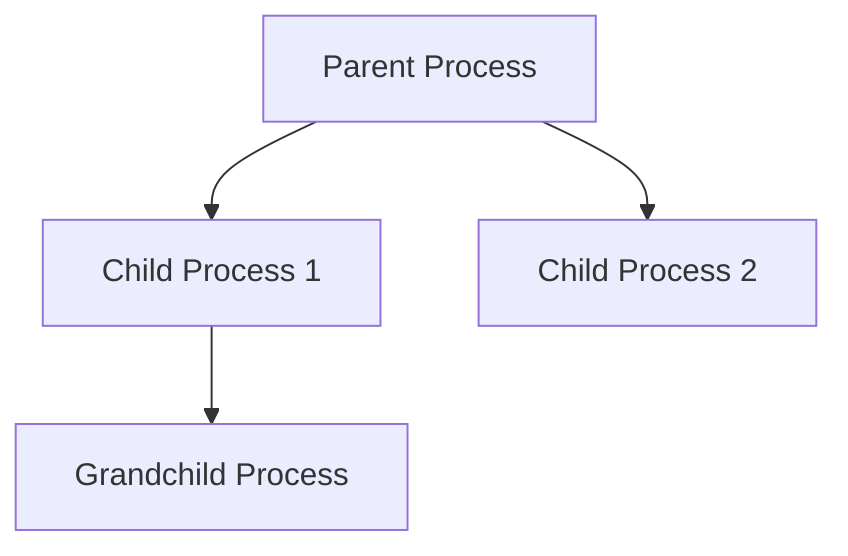

# Process Creation and Termination

## Introduction

Processes are fundamental units of execution in modern operating systems. When you run a program on your computer, the operating system creates a process for it. Understanding how processes are created and terminated is essential for anyone learning programming or operating systems.

In this guide, we'll explore the lifecycle of a process from birth to termination, covering:
- How processes are created
- Parent-child relationships
- Process termination mechanisms
- Implementation in various programming languages
- Common pitfalls and best practices

## Process Creation

### What is a Process?

Before diving into creation, let's clarify what a process is:

A process is an instance of a program in execution. It includes the program code, its current activity, and the following resources:

- Program counter (instruction pointer)
- Process stack
- Data section
- Heap

Each process has its own memory space and resources allocated by the operating system.

### Process Creation Mechanisms

Operating systems create processes through several mechanisms:

1. **System Initialization**: When an OS boots, it creates several processes.
2. **User Request**: When a user runs a program.
3. **Process Spawning**: An existing process creates a new process.

The most common mechanism for programmatically creating processes is through system calls provided by the operating system.

### Process Creation in UNIX/Linux Systems

In UNIX-like systems, processes are created using the `fork()` and `exec()` system calls:

1. `fork()`: Creates a new process by duplicating the calling process.
2. `exec()`: Replaces the current process image with a new process image.

Let's see these in action with a C example:

```c
#include <stdio.h>
#include <stdlib.h>
#include <unistd.h>

int main() {
    pid_t pid;
    
    // Create a child process
    pid = fork();
    
    if (pid < 0) {
        // Error occurred
        fprintf(stderr, "Fork Failed
");
        return 1;
    } else if (pid == 0) {
        // Child process
        printf("Child process: PID = %d
", getpid());
        printf("Child's parent: PPID = %d
", getppid());
        
        // Replace process image with '/bin/ls'
        execlp("/bin/ls", "ls", "-l", NULL);
        
        // The following code will only execute if execlp fails
        printf("execlp failed!
");
        return 1;
    } else {
        // Parent process
        printf("Parent process: PID = %d
", getpid());
        printf("Parent's child: PID = %d
", pid);
        
        // Wait for child to complete
        wait(NULL);
        printf("Child complete
");
    }
    
    return 0;
}
```

Output:
```
Parent process: PID = 3456
Parent's child: PID = 3457
Child process: PID = 3457
Child's parent: PPID = 3456
total 16
-rw-r--r-- 1 user user  647 Nov 10 15:30 process_example.c
-rwxr-xr-x 1 user user 8440 Nov 10 15:31 a.out
Child complete
```

### Process Creation in Windows

Windows uses a different approach with the `CreateProcess()` function, which combines the functionality of both `fork()` and `exec()`:

```c
#include <windows.h>
#include <stdio.h>

int main() {
    STARTUPINFO si;
    PROCESS_INFORMATION pi;
    
    // Initialize the structures
    ZeroMemory(&si, sizeof(si));
    si.cb = sizeof(si);
    ZeroMemory(&pi, sizeof(pi));
    
    // Create the child process
    if (!CreateProcess(
        "C:\\Windows\\System32\
otepad.exe", // Application name
        NULL,                                 // Command line
        NULL,                                 // Process security attributes
        NULL,                                 // Thread security attributes
        FALSE,                                // Handle inheritance
        0,                                    // Creation flags
        NULL,                                 // Environment
        NULL,                                 // Current directory
        &si,                                  // Startup info
        &pi)                                  // Process information
    ) {
        printf("CreateProcess failed (%d).
", GetLastError());
        return 1;
    }
    
    printf("Parent process created child with PID: %d
", pi.dwProcessId);
    
    // Wait for the child process to exit
    WaitForSingleObject(pi.hProcess, INFINITE);
    
    // Close process and thread handles
    CloseHandle(pi.hProcess);
    CloseHandle(pi.hThread);
    
    printf("Child process has exited
");
    
    return 0;
}
```

### Parent-Child Relationship

When a process creates another process, a parent-child relationship is established:



Key aspects of this relationship:

1. **Resource Sharing**:
   - Child processes may share resources with parents
   - In some systems, children get copies of parent's resources
   - In others, they share directly with the parent

2. **Execution**:
   - Parent and children typically execute concurrently
   - Parent may wait for children to terminate

3. **Address Space**:
   - Child may be a duplicate of the parent (fork)
   - Child may have a new program loaded into it (exec)

## Process Termination

Processes terminate for various reasons:

### Normal Termination

A process terminates normally when it:
- Completes its final statement and requests the OS to delete it via the `exit()` system call
- Returns from the main function
- Reaches the end of main in languages that implicitly return

In C/C++:
```c
// Explicit termination
exit(0);  // Successful termination
exit(1);  // Termination with error
```

In Python:
```python
import sys
# Normal termination
sys.exit(0)
# Termination with error
sys.exit(1)
```

In Java:
```java
// Normal termination
System.exit(0);
// Termination with error
System.exit(1);
```

### Abnormal Termination

A process may terminate abnormally due to:

1. **Fatal Errors**:
   - Segmentation fault (accessing invalid memory)
   - Division by zero
   - Invalid instruction

2. **External Termination**:
   - Killed by another process (usually by the parent or admin)
   - System shutdown

Example of handling abnormal termination in C:

```c
#include <stdio.h>
#include <stdlib.h>
#include <signal.h>

void sigHandler(int sigNum) {
    printf("Received signal %d, cleaning up and exiting
", sigNum);
    // Perform cleanup operations here
    exit(sigNum);
}

int main() {
    // Register signal handlers
    signal(SIGINT, sigHandler);  // Ctrl+C
    signal(SIGTERM, sigHandler); // Termination request
    
    printf("Process ID: %d
", getpid());
    printf("Running... Press Ctrl+C to terminate
");
    
    // Keep process running
    while(1) {
        sleep(1);
    }
    
    return 0;
}
```

### Zombie and Orphan Processes

When dealing with process termination, two special cases can occur:

1. **Zombie Processes**:
   - A process that has terminated but its entry remains in the process table
   - Occurs when a parent doesn't wait for or acknowledge a child's termination
   - Takes up resources until the parent collects the exit status

2. **Orphan Processes**:
   - A process whose parent has terminated
   - Usually adopted by the init process (PID 1) in UNIX-like systems

### Termination Cleanup

When a process terminates, the operating system performs cleanup:

1. Close open files
2. Release allocated memory
3. Remove process from scheduling queues
4. Update process table
5. Notify parent process (if applicable)

## Implementation Examples

### Process Creation and Termination in Python

Python provides the `subprocess` module for creating processes:

```python
import subprocess
import os

# Print current process ID
print(f"Parent process ID: {os.getpid()}")

# Create a child process
try:
    # Run the 'ls -l' command
    child = subprocess.Popen(['ls', '-l'], 
                            stdout=subprocess.PIPE,
                            stderr=subprocess.PIPE)
    
    # Get output from child process
    stdout, stderr = child.communicate()
    
    # Print child's return code and output
    print(f"Child process ID: {child.pid}")
    print(f"Child exit code: {child.returncode}")
    print("Child output:")
    print(stdout.decode())
    
except Exception as e:
    print(f"Error: {e}")
```

### Process Creation and Termination in Java

Java provides the `ProcessBuilder` class for process management:

```java
import java.io.BufferedReader;
import java.io.InputStreamReader;
import java.io.IOException;

public class ProcessDemo {
    public static void main(String[] args) {
        try {
            // Print current process info
            System.out.println("Parent process: " + ProcessHandle.current().pid());
            
            // Create a process builder
            ProcessBuilder processBuilder = new ProcessBuilder();
            
            // Set the command to execute
            if (System.getProperty("os.name").toLowerCase().contains("windows")) {
                processBuilder.command("cmd.exe", "/c", "dir");
            } else {
                processBuilder.command("ls", "-l");
            }
            
            // Start the process
            Process process = processBuilder.start();
            
            // Print child process ID
            System.out.println("Child process: " + process.pid());
            
            // Read the output
            BufferedReader reader = new BufferedReader(
                new InputStreamReader(process.getInputStream()));
            
            String line;
            System.out.println("Output:");
            while ((line = reader.readLine()) != null) {
                System.out.println(line);
            }
            
            // Wait for the process to complete
            int exitCode = process.waitFor();
            System.out.println("Child process exited with code: " + exitCode);
            
        } catch (IOException | InterruptedException e) {
            e.printStackTrace();
        }
    }
}
```

## Real-World Applications

### Web Servers

Web servers like Apache and Nginx use process creation for handling client requests:

1. A main (parent) process initializes and listens for connections
2. When a request comes in, it creates a child process to handle it
3. The child process terminates after serving the request

This model allows the server to handle multiple requests concurrently.

### Shell Commands

When you run commands in a terminal or shell:

1. The shell creates a new process for each command
2. The shell (parent) may wait for the command (child) to complete
3. The command process terminates when done, returning control to the shell

Example shell script demonstrating process creation:

```bash
#!/bin/bash

echo "Shell PID: $$"

# Create a child process
echo "Starting child process..."
ls -l &
child_pid=$!
echo "Child PID: $child_pid"

# Wait for child to complete
wait $child_pid
echo "Child process completed"
```

### Build Systems

Build systems like Make create processes to compile code:

1. The build system parses a configuration file
2. It creates processes for compilation steps
3. It manages dependencies between these processes
4. Each compilation process terminates when done

## Process Management Best Practices

1. **Always collect exit statuses** of child processes to avoid zombies
2. **Handle signals properly** to ensure graceful termination
3. **Release resources** before termination
4. **Use proper error handling** when creating processes
5. **Limit the number of concurrent processes** to prevent resource exhaustion

## Summary

Process creation and termination are fundamental concepts in operating systems:

- Processes are created via system calls like `fork()` and `exec()` in UNIX or `CreateProcess()` in Windows
- Parent processes create child processes, establishing a hierarchical relationship
- Processes terminate normally when they complete execution or abnormally due to errors or external signals
- Special cases like zombie and orphan processes require proper handling
- Different programming languages provide various abstractions for process management
- Process management is crucial in many real-world applications like web servers, shells, and build systems

Understanding how processes work helps programmers write more efficient and robust software that interacts properly with the operating system.

## Exercises

1. Write a program that creates a child process to compute the Fibonacci sequence while the parent process computes factorial values.
2. Modify the process creation example to handle zombie processes correctly.
3. Create a simple shell that can run basic commands and report their exit status.
4. Implement a program that demonstrates how signal handlers can be used for graceful process termination.
5. Compare process creation performance between different operating systems or programming languages.

## Additional Resources

- **Books**:
  - "Operating System Concepts" by Silberschatz, Galvin, and Gagne
  - "Advanced Programming in the UNIX Environment" by Stevens and Rago

- **Online Documentation**:
  - Man pages for fork, exec, wait, and exit
  - Microsoft's documentation on process management

- **Courses**:
  - Operating Systems courses on platforms like Coursera and edX
  - Linux Foundation training on process management