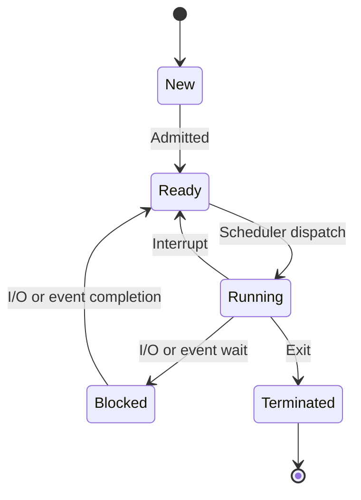

# Process States

## Introduction

When you run a program on your computer, the operating system creates a process to execute it. But what happens to this process during its lifetime? Does it run continuously from start to finish, or does it go through different states? Understanding process states is crucial for grasping how modern operating systems manage multiple programs efficiently.

In this tutorial, we'll explore the different states a process can be in, how transitions occur between these states, and why this knowledge matters for writing efficient programs.

## What is a Process?

Before diving into process states, let's clarify what a process is:

A **process** is a program in execution. When you run a program (like a web browser or a game), the operating system loads it into memory and creates a process that includes:

- The program code
- Current activity (represented by the program counter)
- Process stack (containing temporary data)
- Data section (containing global variables)
- Heap (for dynamically allocated memory)

Each process has a unique Process ID (PID) assigned by the operating system.

## Basic Process States

In its simplest form, a process can exist in three fundamental states:

1. **Running**: The process is currently being executed on the CPU
2. **Ready**: The process is ready to run but waiting for CPU time
3. **Blocked (Waiting)**: The process is waiting for some event (like I/O completion) before it can continue

Let's visualize these states and the transitions between them:



## Detailed Process States

In practice, modern operating systems define more states to manage processes efficiently:

### 1. New (Created)

When a process is first created but not yet admitted to the pool of executable processes. The operating system is performing initialization and resource allocation.

```c
// Example: Creating a new process in C using fork()
#include <stdio.h>
#include <unistd.h>

int main() {
    pid_t pid = fork();  // Create a new process
    
    if (pid < 0) {
        // Error occurred
        fprintf(stderr, "Fork failed
");
        return 1;
    } else if (pid == 0) {
        // Child process
        printf("Child process created with PID: %d
", getpid());
    } else {
        // Parent process
        printf("Parent process. Child PID: %d
", pid);
    }
    
    return 0;
}
```

**Output:**
```
Parent process. Child PID: 1234
Child process created with PID: 1234
```

### 2. Ready

The process is loaded into main memory and is waiting to be assigned to a processor. The process has all the resources it needs to run, except for the CPU.

### 3. Running

The process is currently being executed by the CPU. In a single-core processor, only one process can be in the running state at any given time.

### 4. Blocked (Waiting)

The process is waiting for some event to occur, such as I/O completion, resource availability, or receipt of a signal. It cannot proceed until the event happens.

```python
# Example: A Python process that becomes blocked waiting for user input
import time

print("Program started")
user_input = input("Enter some text (program is BLOCKED until you enter): ")
print(f"You entered: {user_input}")
print("Program continuing...")
```

### 5. Suspended (Swapped)

Modern operating systems often include two additional states:
- **Suspended Ready**: Process is removed from memory and placed on disk but is ready to run when loaded back
- **Suspended Blocked**: Process is both blocked and swapped out to disk

### 6. Terminated

The process has finished execution or has been terminated by the operating system. Some resources may still be held until the parent process collects exit status information.

## Process State Transitions

Understanding how processes move between states is essential:

1. **New → Ready**: When the system is ready to admit the process
2. **Ready → Running**: When the scheduler selects the process for execution
3. **Running → Ready**: When the scheduler interrupts the process (time quantum expires in time-sharing systems)
4. **Running → Blocked**: When the process requests I/O or resource that isn't immediately available
5. **Blocked → Ready**: When the I/O or event the process was waiting for completes
6. **Running → Terminated**: When the process completes execution or is aborted

## Process Control Block (PCB)

The operating system maintains information about each process in a data structure called the Process Control Block (PCB). The PCB contains:

- Process ID
- Process State
- Program Counter
- CPU registers
- CPU scheduling information
- Memory management information
- I/O status information
- Accounting information

When a process state changes, the operating system updates the relevant fields in its PCB.

## Practical Example: Process States in Action

Let's walk through a scenario showing different process states:

```c
#include <stdio.h>
#include <unistd.h>
#include <fcntl.h>

int main() {
    int fd;
    char buffer[100];
    
    printf("Process is RUNNING
");
    
    // Process will become BLOCKED during file open
    printf("Opening file (might BLOCK if file system busy)...
");
    fd = open("example.txt", O_RDONLY);
    
    if (fd < 0) {
        printf("File open failed
");
        return 1;
    }
    
    printf("File opened, process is RUNNING again
");
    
    // Process will become BLOCKED during read
    printf("Reading from file (will BLOCK)...
");
    int bytes_read = read(fd, buffer, sizeof(buffer)-1);
    
    if (bytes_read >= 0) {
        buffer[bytes_read] = '\0';
        printf("Read completed, process is RUNNING
");
        printf("Content: %s
", buffer);
    }
    
    close(fd);
    
    // Process will TERMINATE
    printf("Process will TERMINATE
");
    return 0;
}
```

## Real-World Applications

### 1. Task Managers

When you open Task Manager (Windows) or Activity Monitor (macOS), you can see processes in different states. Understanding these states helps you diagnose issues when your computer seems slow or unresponsive.

### 2. Debugging Applications

When debugging, knowledge of process states helps identify when a process is stuck (blocked) waiting for a resource or when it's consuming excessive CPU time (running state).

### 3. Server Management

On web servers, administrators monitor process states to ensure optimal performance. Too many blocked processes might indicate I/O bottlenecks, while too many ready processes could suggest insufficient CPU resources.

## Process States in Different Operating Systems

While the fundamental concepts remain similar, different operating systems may use slightly different terminology:

| State | Windows | Linux | macOS |
|-------|---------|-------|-------|
| New | Created | Creating | Created |
| Ready | Ready | Runnable | Ready |
| Running | Running | Running | Running |
| Blocked | Waiting | Sleeping/Waiting | Blocked |
| Terminated | Terminated | Zombie/Dead | Terminated |

## Common Pitfalls and Issues

### 1. Deadlocks

A deadlock occurs when two or more processes are blocked forever, waiting for each other. Understanding process states helps in detecting and preventing deadlocks.

### 2. Starvation

Starvation happens when a process remains in the ready state for an extended period without getting CPU time. Fair scheduling algorithms help prevent starvation.

### 3. Thrashing

Thrashing occurs when the operating system spends more time swapping processes between memory and disk than executing them. This happens when there are too many processes in the suspended states.

## Summary

Process states represent the different conditions a process can be in during its lifetime. The basic states include New, Ready, Running, Blocked, and Terminated, with some operating systems adding suspended states.

Understanding process states is fundamental to:
- Developing efficient programs
- Debugging application issues
- Managing system resources
- Understanding operating system behavior

By grasping how processes transition between these states, you'll have a better understanding of what's happening under the hood when you run programs on your computer.

## Exercises

1. Write a simple program that demonstrates a process transitioning from running to blocked state.
2. Use your operating system's task manager to identify processes in different states.
3. Research and explain how multithreaded processes affect process states.
4. Implement a simple program that creates child processes and observe their states.

## Additional Resources

- [Operating System Concepts](https://www.os-book.com/) by Silberschatz, Galvin, and Gagne
- The Linux Programming Interface by Michael Kerrisk
- [Modern Operating Systems](https://www.pearson.com/en-us/subject-catalog/p/modern-operating-systems/P200000003295) by Andrew S. Tanenbaum