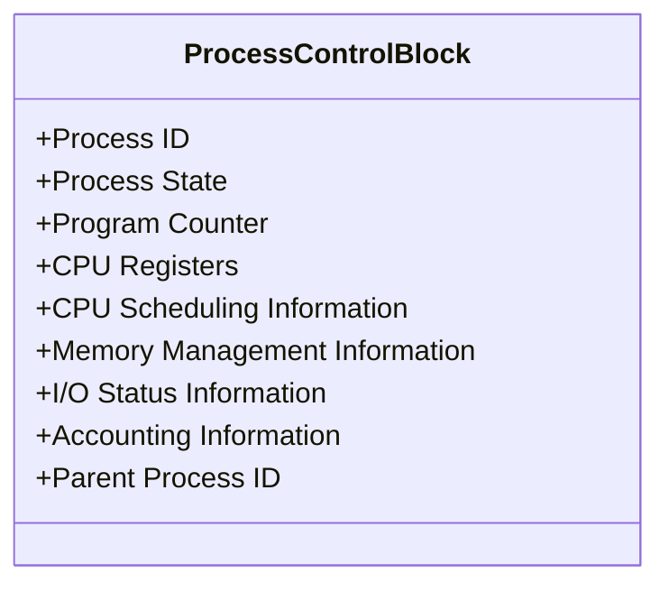

# Process Control Block

## Introduction

When you run multiple applications on your computer simultaneously - perhaps a web browser, music player, and text editor - have you ever wondered how your computer manages all these programs efficiently? The answer lies in a fundamental operating system data structure called the **Process Control Block (PCB)**.

A Process Control Block (PCB) is a data structure maintained by the operating system that contains all the information needed to manage a process. Think of it as an ID card or a record that the operating system keeps for each process running on your computer. This data structure is crucial for process management and enables multitasking in modern operating systems.

## What is a Process Control Block?

### Definition

A Process Control Block (PCB) is a data structure created by the operating system for each process when it is created. The PCB contains critical information about the process, including:

- Process identification
- Process state
- CPU scheduling information
- Memory management information
- I/O status information
- Accounting information

The PCB serves as the repository for any information that may vary from process to process.

### Visual Representation

Here's a simplified diagram of what a Process Control Block might look like:



## Components of a PCB

Let's break down the key components of a Process Control Block:

### 1. Process Identification

Each process is assigned a unique identifier, typically a number, called the **Process ID (PID)**. This identifier helps the operating system distinguish between different processes.

```c
// Example of how a PID might be stored in a PCB
typedef struct {
    int process_id;  // Unique identifier for the process
    // Other PCB fields...
} PCB;
```

### 2. Process State

The process state reflects the current activity of the process. Common process states include:

- **New**: The process is being created
- **Ready**: The process is waiting to be assigned to a processor
- **Running**: The process is currently executing
- **Waiting/Blocked**: The process is waiting for some event to occur (like I/O completion)
- **Terminated**: The process has finished execution

### 3. Program Counter

The program counter indicates the address of the next instruction to be executed for this process.

### 4. CPU Registers

When a process is interrupted, the CPU registers' values must be saved to allow the process to continue correctly later. These include:
- Accumulators
- Index registers
- Stack pointers
- General-purpose registers

### 5. CPU Scheduling Information

This includes:
- Process priority
- Pointers to scheduling queues
- Other scheduling parameters

### 6. Memory Management Information

Information about the memory allocated to the process, such as:
- Base and limit registers
- Page tables
- Segment tables

### 7. I/O Status Information

This includes:
- List of open files
- I/O device allocations
- I/O request pending

### 8. Accounting Information

Statistics about the process, such as:
- CPU time used
- Time limits
- Account numbers
- Job or process numbers

## PCB Implementation Example

Here's a simplified example of how a PCB might be implemented in C:

```c
typedef enum {
    NEW,
    READY,
    RUNNING,
    WAITING,
    TERMINATED
} ProcessState;

typedef struct {
    // Process Identification
    int process_id;
    int parent_process_id;
    
    // Process State
    ProcessState state;
    
    // CPU Registers and Context
    void* program_counter;
    int registers[16];  // Simplified representation of CPU registers
    
    // CPU Scheduling Information
    int priority;
    int* scheduling_queue_pointer;
    int time_slice;
    
    // Memory Management Information
    void* memory_base;
    int memory_limit;
    
    // I/O Status Information
    int open_files[20];  // Array of file descriptors
    
    // Accounting Information
    int cpu_time_used;
    int wall_clock_time;
    int time_limit;
} ProcessControlBlock;
```

## How the Operating System Uses PCBs

PCBs are crucial for process management. Here's how the operating system uses them:

### Context Switching

When the CPU switches from executing one process to another, the operating system performs a context switch:

1. Save the state of the old process into its PCB
2. Load the saved state of the new process from its PCB

```c
void context_switch(ProcessControlBlock* old_process, ProcessControlBlock* new_process) {
    // Save current CPU state to the old process's PCB
    save_context(old_process);
    
    // Load the new process's context from its PCB
    load_context(new_process);
    
    // Update the process states
    old_process->state = READY;
    new_process->state = RUNNING;
}
```

### Process Creation

When a new process is created (often through fork() in Unix-like systems), the operating system:

1. Creates a new PCB
2. Allocates space for the process
3. Initializes the PCB

```c
ProcessControlBlock* create_process(int parent_pid) {
    // Allocate memory for a new PCB
    ProcessControlBlock* new_pcb = malloc(sizeof(ProcessControlBlock));
    
    // Initialize the PCB with default values
    new_pcb->process_id = get_next_pid();  // Generate a unique PID
    new_pcb->parent_process_id = parent_pid;
    new_pcb->state = NEW;
    
    // Allocate resources and set up initial values
    // ...
    
    return new_pcb;
}
```

### Process Scheduling

The CPU scheduler selects a process from the ready queue based on the scheduling information in the PCBs:

```c
ProcessControlBlock* select_next_process(ProcessControlBlock** ready_queue, int queue_size) {
    ProcessControlBlock* highest_priority_process = NULL;
    int highest_priority = -1;
    
    // Find the highest priority process
    for (int i = 0; i < queue_size; i++) {
        if (ready_queue[i]->priority > highest_priority) {
            highest_priority = ready_queue[i]->priority;
            highest_priority_process = ready_queue[i];
        }
    }
    
    return highest_priority_process;
}
```

## Real-World Example: Linux Process Management

In Linux, the PCB is represented by the `task_struct` structure (defined in `<linux/sched.h>`). Here's a simplified version of what it looks like:

```c
struct task_struct {
    // Process identification
    pid_t pid;
    pid_t tgid;
    
    // Process state
    volatile long state;
    
    // Scheduling information
    int prio;
    int static_prio;
    unsigned int rt_priority;
    
    // Memory management
    struct mm_struct *mm;
    
    // File system info
    struct fs_struct *fs;
    
    // Files
    struct files_struct *files;
    
    // And many more fields...
};
```

You can actually see information about processes in Linux by looking at the `/proc` directory. For example, to see information about a process with PID 1234:

```bash
cat /proc/1234/status
```

This will display various pieces of information from that process's PCB, such as its state, memory usage, and parent PID.

## PCB Management in Action

Let's understand how PCBs are used in a practical scenario:

1. You click on the Firefox icon to open a web browser
2. The operating system creates a new process and allocates a PCB for it
3. The PCB is initialized with a unique PID, default state (NEW), and other values
4. The process state changes to READY and it's placed in the ready queue
5. When the scheduler selects this process, its state changes to RUNNING
6. If you start another application, the browser might be interrupted:
   - Its context (registers, program counter) is saved in its PCB
   - Its state changes to READY
   - The new application's process becomes RUNNING
7. The browser and other applications take turns executing as the scheduler switches between them

## Why PCBs Matter

PCBs are fundamental to modern computing because they enable:

1. **Multitasking**: Running multiple processes concurrently
2. **Context Switching**: Saving and restoring process execution states
3. **Process Scheduling**: Determining which process runs next
4. **Process Synchronization**: Managing process interactions
5. **Process Accounting**: Tracking resource usage

Without PCBs, computers would be limited to running one program at a time, requiring users to completely finish with one application before starting another.

## Summary

The Process Control Block is a vital data structure that serves as the backbone of process management in operating systems. It contains all the information necessary to track a process's state and resources, enabling multitasking, efficient scheduling, and smooth transitions between executing processes.

By maintaining detailed information about each process, the operating system can create the illusion that multiple processes are running simultaneously, even on a system with a single CPU.

## Exercises

1. Design a simple PCB structure for a basic operating system that manages only three states: READY, RUNNING, and TERMINATED.

2. Write pseudocode for a function that performs context switching between two processes.

3. Research how different operating systems implement their version of a PCB (Windows, macOS, Linux) and compare their approaches.

4. Implement a basic process simulator in a programming language of your choice that creates PCBs and manages simple context switching.

## Additional Resources

- *Operating System Concepts* by Abraham Silberschatz, Peter B. Galvin, and Greg Gagne
- *Modern Operating Systems* by Andrew S. Tanenbaum
- The Linux kernel source code (specifically the `task_struct` in `<linux/sched.h>`)
- [Operating Systems: Three Easy Pieces](http://pages.cs.wisc.edu/~remzi/OSTEP/) (free online book)