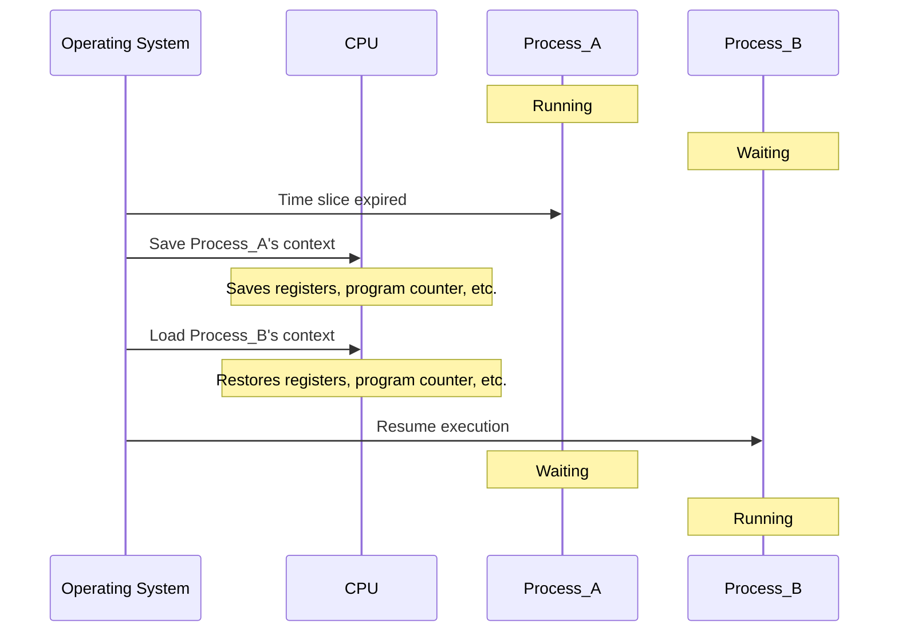
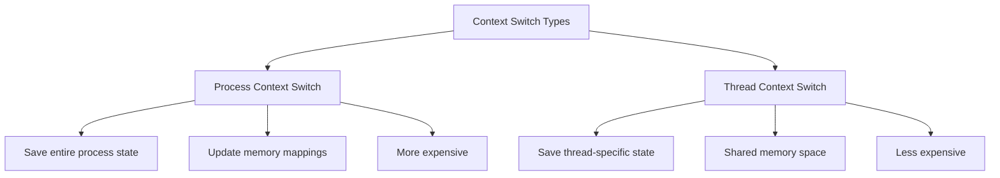

# Context Switching

## Introduction

Have you ever wondered how your computer can run multiple programs at the same time? Or how your operating system manages to keep everything running smoothly when you have a dozen applications open? The answer lies in a fundamental concept called **context switching**.

Context switching is the mechanism that allows an operating system to handle multiple processes or threads by swapping them in and out of the CPU. It's like a chef who needs to prepare multiple dishes simultaneously but only has one cooking station - the chef must switch between dishes, remembering exactly where they left off each time.

In this article, we'll explore how context switching works, why it's necessary, and the performance implications it introduces.

## What is a Context Switch?

A **context switch** occurs when the CPU switches from executing one process to another. When this happens, the operating system must:

1. Save the state of the currently running process
2. Load the saved state of the next process to run
3. Resume execution of the new process

The "context" in context switching refers to the set of CPU register values, program counter, memory mapping information, and other data that defines the current state of a process.

## When Does Context Switching Occur?

Context switches happen for several reasons:

- **Multitasking**: When the operating system needs to give CPU time to different processes
- **Interrupts**: When hardware devices need immediate attention
- **System Calls**: When a process requests a service from the operating system
- **Thread Switching**: When switching between threads within the same process

## Context Switching Process: Step by Step

Let's break down what happens during a context switch:



1. **Save Process State**: The operating system saves the current process's state, including:
   - CPU registers
   - Program counter
   - Stack pointer
   - Memory mapping information

2. **Select Next Process**: The scheduler determines which process should run next.

3. **Load Process State**: The operating system loads the saved state of the selected process.

4. **Update Memory Management**: If necessary, the OS updates memory mappings, TLB entries, and other memory management structures.

5. **Resume Execution**: The CPU continues execution of the new process from where it last stopped.

## Cost of Context Switching

Context switching isn't free - it introduces several types of overhead:

- **Direct CPU Cost**: Time spent saving and restoring registers and state
- **Cache Pollution**: Cold caches after switching to a different process
- **TLB Flushing**: Translation Lookaside Buffer entries may need to be invalidated
- **Pipeline Stalls**: CPU pipelines may need to be flushed

Let's look at a simple example to illustrate the performance impact:

```c
// With frequent context switching
void with_context_switching() {
    for (int i = 0; i < 1000000; i++) {
        // Perform a system call that causes a context switch
        getpid();  // Example of a lightweight system call
    }
}

// Without frequent context switching
void without_context_switching() {
    // No system calls inside the loop
    int pid = getpid();  // Only one context switch
    for (int i = 0; i < 1000000; i++) {
        // Process data without causing context switches
        // ...
    }
}
```

If we were to time these functions, we'd find that `with_context_switching()` takes significantly longer to execute, demonstrating the overhead introduced by frequent context switches.

## Context Switching vs. Thread Switching

Context switching between threads of the same process is generally less expensive than switching between different processes. This is because threads within the same process share the same memory space, so the memory management information doesn't need to be updated.



## Real-World Example: Web Server

Let's consider a real-world application: a web server handling multiple client requests.

```javascript
// Simplified pseudo-code for a web server
function handleRequest(request) {
    // Process incoming HTTP request
    parseRequest(request);
    
    // Read from database (might cause context switch due to I/O)
    const data = database.query(request.params);
    
    // Process data (CPU-bound work)
    const result = processData(data);
    
    // Send response (might cause context switch due to I/O)
    sendResponse(result);
}

// In a multi-threaded server:
while (true) {
    const request = acceptConnection();  // Context switch likely here
    
    // Create thread or use thread pool
    Thread.spawn(() => {
        handleRequest(request);
    });
}
```

In this example:
1. The server accepts a connection (potential context switch due to network I/O)
2. A new thread handles the request (thread context switch)
3. Database access may trigger I/O waits (more context switches)
4. Sending the response may cause more I/O waits (more context switches)

A busy web server might experience thousands of context switches per second!

## Optimizing for Context Switches

Developers can minimize the impact of context switching with these techniques:

1. **Batch Processing**: Group similar operations to reduce system call frequency
2. **Asynchronous I/O**: Use non-blocking I/O to reduce thread switches
3. **Thread Pooling**: Reuse threads instead of creating new ones
4. **Affinity Setting**: Keep processes/threads on the same CPU core
5. **Work Stealing**: Allow idle threads to take work from busy ones

Here's a before-and-after optimization example:

```javascript
// Before optimization: Many small I/O operations
function unoptimized() {
    for (let i = 0; i < 1000; i++) {
        fs.writeSync(fd, "x");  // Each write is a separate system call
    }
}

// After optimization: Batched I/O
function optimized() {
    const buffer = "x".repeat(1000);
    fs.writeSync(fd, buffer);  // Single system call
}
```

The optimized version would cause far fewer context switches and run much faster.

## Measuring Context Switches

Many operating systems provide tools to measure context switching:
- Linux: `vmstat`, `perf`
- Windows: Performance Monitor
- macOS: Activity Monitor, `dtrace`

For example, on Linux you might use:

```bash
vmstat 1
```

This will show context switches per second in the "cs" column.

## Summary

Context switching is a fundamental mechanism that allows operating systems to multitask and handle multiple processes efficiently. While essential for modern computing, context switches introduce performance overhead that developers should be aware of when building high-performance applications.

Understanding how and when context switches occur can help you design more efficient systems and debug performance issues in your applications.

## Exercises

1. Write a program that intentionally causes many context switches (hint: use system calls in a loop) and measure its performance.
2. Modify the program to reduce context switches and compare the performance difference.
3. Use your operating system's tools to monitor context switch rates while running different applications.
4. Research how different programming languages and frameworks handle concurrency and how their approaches affect context switching.

## Further Reading

- Process scheduling algorithms
- CPU time slicing techniques
- Memory management in operating systems
- User space vs. kernel space context switches
- Cooperative vs. preemptive multitasking