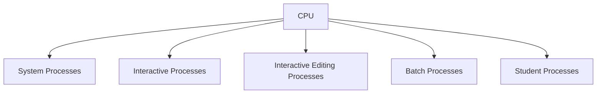
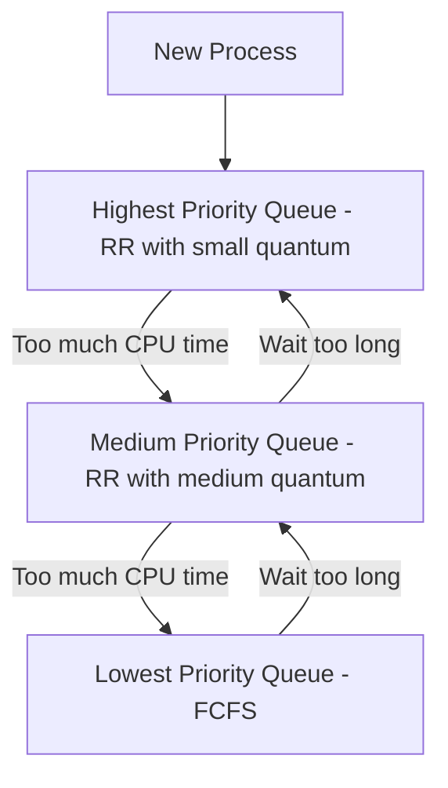

```mermaid
gantt
    title Priority Scheduling
    dateFormat s
    axisFormat %S
    
    section Processes
    P1  :0, 10s
    P2  :10, 1s
    P4  :11, 1s
    P3  :12, 2s
```

```mermaid
gantt
    title Round Robin Scheduling (Quantum = 4)
    dateFormat s
    axisFormat %S
    
    section Processes
    P1 (1st)  :0, 4s
    P2 (1st)  :4, 4s
    P3 (1st)  :8, 4s
    P1 (2nd)  :12, 4s
    P2 (2nd)  :16, 1s
    P3 (2nd)  :17, 4s
    P1 (3rd)  :21, 2s
```

# CPU Scheduling Algorithms

## Introduction

CPU scheduling is a fundamental concept in operating systems that determines which process runs on the CPU at any given time. Efficient CPU scheduling is crucial for maximizing system performance, resource utilization, and user satisfaction. In this article, we'll explore various CPU scheduling algorithms, understand how they work, and see how they affect overall system performance.

When multiple processes are ready to execute, the operating system must decide which process to run next. This decision is made by the CPU scheduler using specific scheduling algorithms. Each algorithm has different characteristics that make it suitable for different scenarios.

## Why CPU Scheduling Matters

Before diving into the algorithms, let's understand why CPU scheduling is important:

1. **CPU Utilization**: Keep the CPU as busy as possible
2. **Throughput**: Maximize the number of processes completed per time unit
3. **Turnaround Time**: Minimize the time from process submission to completion
4. **Waiting Time**: Minimize the time processes spend waiting in the ready queue
5. **Response Time**: Minimize the time from request submission to first response
6. **Fairness**: Ensure all processes get a fair share of CPU time

## Key CPU Scheduling Algorithms

Let's explore the most common CPU scheduling algorithms used in modern operating systems:

### First-Come, First-Served (FCFS)

This is the simplest scheduling algorithm where processes are executed in the order they arrive in the ready queue.

#### How FCFS Works

1. Processes are added to a queue as they arrive
2. The CPU executes processes in the order they were added to the queue
3. Once a process starts executing, it runs until completion
4. Non-preemptive scheduling (a running process is not interrupted)

#### Example

Let's consider three processes P1, P2, and P3 with arrival times and burst times:

```
Process | Arrival Time | Burst Time
--------|--------------|----------
   P1   |      0       |     24
   P2   |      1       |      3
   P3   |      2       |      3
```

The Gantt chart for FCFS scheduling would look like:

```mermaid
gantt
    title FCFS Scheduling
    dateFormat s
    axisFormat %S
    
    section Processes
    P1  :0, 24s
    P2  :24, 3s
    P3  :27, 3s
```



**Calculations:**
- Waiting Time for P1 = 0 (first process)
- Waiting Time for P2 = 23 (P1's completion time - P2's arrival time)
- Waiting Time for P3 = 25 (P2's completion time - P3's arrival time)
- Average Waiting Time = (0 + 23 + 25) / 3 = 16

#### Advantages and Disadvantages

**Advantages:**
- Simple to implement
- No starvation (every process eventually gets executed)

**Disadvantages:**
- Suffers from "convoy effect" - short processes wait for long processes
- High average waiting time, especially if process execution times vary widely
- Not suitable for interactive systems due to potentially long response times

### Shortest Job First (SJF)

SJF prioritizes processes with the shortest execution time (burst time).

#### How SJF Works

1. When the CPU is available, the scheduler selects the process with the shortest burst time
2. Can be preemptive or non-preemptive:
   - Non-preemptive: Once a process starts, it runs until completion
   - Preemptive: If a new process arrives with a shorter burst time than the remaining time of the current process, the CPU is reassigned (also called Shortest Remaining Time First)

#### Example (Non-preemptive SJF)

Using the same processes:

```
Process | Arrival Time | Burst Time
--------|--------------|----------
   P1   |      0       |     24
   P2   |      1       |      3
   P3   |      2       |      3
```

The Gantt chart for non-preemptive SJF would look like:

```mermaid
gantt
    title Non-preemptive SJF Scheduling
    dateFormat s
    axisFormat %S
    
    section Processes
    P1  :0, 24s
    P2  :24, 3s
    P3  :27, 3s
```



In this specific example, the result is the same as FCFS because P1 arrived first and was already running before other processes arrived.

#### Example (Preemptive SJF)

For preemptive SJF (Shortest Remaining Time First):

```mermaid
gantt
    title Preemptive SJF Scheduling
    dateFormat s
    axisFormat %S
    
    section Processes
    P1  :0, 1s
    P2  :1, 3s
    P3  :4, 3s
    P1 (remaining)  :7, 23s
```



**Calculations for preemptive SJF:**
- Waiting Time for P1 = 0 + (7 - 1) = 6 (initial wait + wait after preemption)
- Waiting Time for P2 = 0
- Waiting Time for P3 = 1 (P2's completion time - P3's arrival time)
- Average Waiting Time = (6 + 0 + 1) / 3 = 2.33

#### Advantages and Disadvantages

**Advantages:**
- Provides minimum average waiting time among all scheduling algorithms
- Good for batch systems where burst times are known in advance

**Disadvantages:**
- Difficult to predict burst times accurately
- Can lead to starvation of longer processes if shorter jobs keep arriving
- Requires knowledge of process execution times beforehand

### Priority Scheduling

Priority scheduling assigns a priority value to each process, and the CPU is allocated to the process with the highest priority.

#### How Priority Scheduling Works

1. Each process is assigned a priority (usually a number - lower number often means higher priority)
2. The CPU is allocated to the process with the highest priority
3. Can be preemptive or non-preemptive
4. When processes have equal priorities, FCFS is used

#### Example (Non-preemptive Priority Scheduling)

Consider these processes:

```
Process | Arrival Time | Burst Time | Priority
--------|--------------|------------|----------
   P1   |      0       |     10     |     3
   P2   |      1       |      1     |     1
   P3   |      2       |      2     |     4
   P4   |      3       |      1     |     2
```

The Gantt chart would look like:



#### Advantages and Disadvantages

**Advantages:**
- Suitable for real-time systems and scenarios where certain processes need preference
- Flexible - priorities can be assigned based on various factors

**Disadvantages:**
- Can lead to starvation of low-priority processes
- Priority inversion problem - lower priority process holds a resource needed by higher priority process
- Priority determination can be complex

To avoid starvation, priority scheduling can be enhanced with aging - gradually increasing the priority of processes that wait too long.

### Round Robin (RR)

Round Robin is designed specifically for time-sharing systems. Each process gets a small unit of CPU time (time quantum), and after this time has elapsed, the process is preempted and added to the back of the ready queue.

#### How Round Robin Works

1. Processes are kept in a circular queue
2. Each process gets a fixed time quantum (usually 10-100 milliseconds)
3. After a process executes for its time quantum, it's preempted and placed at the back of the queue
4. If a process completes before its time quantum expires, the next process is scheduled immediately

#### Example

Consider these processes with a time quantum of 4 units:

```
Process | Arrival Time | Burst Time
--------|--------------|----------
   P1   |      0       |     10
   P2   |      1       |      5
   P3   |      2       |      8
```

The Gantt chart would look like:



#### Advantages and Disadvantages

**Advantages:**
- Fair allocation of CPU time to all processes
- Good for interactive systems - responsive to user input
- Low average waiting time for short processes
- No starvation - every process gets CPU time

**Disadvantages:**
- Higher average turnaround time compared to SJF
- Time quantum selection is critical:
  - Too large → similar to FCFS
  - Too small → too many context switches, reducing efficiency

### Multilevel Queue Scheduling

This algorithm partitions the ready queue into several separate queues, each with its own scheduling algorithm.

#### How Multilevel Queue Works

1. Processes are permanently assigned to a queue based on properties like process type, memory size, etc.
2. Each queue has its own scheduling algorithm
3. There must be scheduling between queues, typically fixed-priority preemptive scheduling

For example, a system might have:
- Foreground (interactive) queue: Round Robin
- Background (batch) queue: FCFS



#### Advantages and Disadvantages

**Advantages:**
- Can handle different types of processes efficiently
- Suitable for systems with clear process categories

**Disadvantages:**
- Complex implementation
- Lower-priority queues may starve
- Inflexible - processes cannot move between queues

### Multilevel Feedback Queue Scheduling

This is an improvement over the multilevel queue that allows processes to move between queues based on their behavior.

#### How Multilevel Feedback Queue Works

1. Processes can move between different priority queues based on their CPU bursts
2. If a process uses too much CPU time, it's moved to a lower-priority queue
3. If a process waits too long, it can be moved to a higher-priority queue (aging)
4. Typically, new processes start in the highest-priority queue



#### Advantages and Disadvantages

**Advantages:**
- Adaptive to changing system conditions
- Favors I/O-bound and short processes
- Prevents starvation through aging
- Most flexible and sophisticated scheduling algorithm

**Disadvantages:**
- Most complex to implement
- Can have high overhead due to moving processes between queues
- Parameters must be carefully tuned for optimal performance

## Implementing CPU Scheduling in C

Let's see a simple implementation of the FCFS algorithm in C:

```c
#include <stdio.h>

// Structure to represent a process
typedef struct {
    int id;
    int arrival_time;
    int burst_time;
    int waiting_time;
    int turnaround_time;
} Process;

// Function to calculate waiting time and turnaround time
void calculateTimes(Process processes[], int n) {
    // First process has 0 waiting time
    processes[0].waiting_time = 0;
    
    // Calculate waiting time for each process
    for (int i = 1; i < n; i++) {
        processes[i].waiting_time = processes[i-1].waiting_time + 
                                   processes[i-1].burst_time;
    }
    
    // Calculate turnaround time for each process
    for (int i = 0; i < n; i++) {
        processes[i].turnaround_time = processes[i].waiting_time + 
                                      processes[i].burst_time;
    }
}

// Function to display the process details
void displayProcesses(Process processes[], int n) {
    float avg_waiting_time = 0, avg_turnaround_time = 0;
    
    printf("
Process\tArrival Time\tBurst Time\tWaiting Time\tTurnaround Time
");
    
    for (int i = 0; i < n; i++) {
        printf("P%d\t%d\t\t%d\t\t%d\t\t%d
", 
               processes[i].id, 
               processes[i].arrival_time,
               processes[i].burst_time, 
               processes[i].waiting_time, 
               processes[i].turnaround_time);
               
        avg_waiting_time += processes[i].waiting_time;
        avg_turnaround_time += processes[i].turnaround_time;
    }
    
    avg_waiting_time /= n;
    avg_turnaround_time /= n;
    
    printf("
Average Waiting Time: %.2f", avg_waiting_time);
    printf("
Average Turnaround Time: %.2f
", avg_turnaround_time);
}

int main() {
    // Example processes
    Process processes[] = {
        {1, 0, 24, 0, 0},
        {2, 1, 3, 0, 0},
        {3, 2, 3, 0, 0}
    };
    
    int n = sizeof(processes) / sizeof(processes[0]);
    
    // Sort processes by arrival time (for FCFS)
    for (int i = 0; i < n - 1; i++) {
        for (int j = 0; j < n - i - 1; j++) {
            if (processes[j].arrival_time > processes[j+1].arrival_time) {
                Process temp = processes[j];
                processes[j] = processes[j+1];
                processes[j+1] = temp;
            }
        }
    }
    
    calculateTimes(processes, n);
    
    printf("First-Come, First-Served (FCFS) Scheduling:
");
    displayProcesses(processes, n);
    
    return 0;
}
```

Sample output:
```
First-Come, First-Served (FCFS) Scheduling:

Process Arrival Time    Burst Time      Waiting Time    Turnaround Time
P1      0               24              0               24
P2      1               3               23              26
P3      2               3               26              29

Average Waiting Time: 16.33
Average Turnaround Time: 26.33
```

## Real-World Applications

Understanding CPU scheduling is crucial for:

1. **Operating System Design** - Different OS kernels use variations of these algorithms:
   - Linux: Completely Fair Scheduler (CFS), a variant of fair scheduling
   - Windows: Multilevel feedback queue with priority boosting
   - macOS: Multilevel queue with round-robin for user tasks

2. **Server Performance Tuning** - Web servers and database servers often allow adjustment of scheduling parameters to optimize performance for specific workloads.

3. **Real-Time Systems** - Medical devices, flight control systems, and industrial control systems use specialized scheduling algorithms to ensure time-critical operations execute on time.

4. **Mobile Devices** - Battery life optimization requires intelligent CPU scheduling to balance performance and power consumption.

## Performance Comparison

Here's a quick comparison of the algorithms we've discussed:

| Algorithm | Average Waiting Time | Overhead | Starvation | Suitable For |
|-----------|---------------------|----------|------------|--------------|
| FCFS | High | Low | No | Batch systems |
| SJF | Minimum | Medium | Possible | Batch systems with known burst times |
| Priority | Varies | Medium | Possible | Real-time systems |
| Round Robin | Medium | High | No | Interactive systems |
| Multilevel Queue | Varies | High | Possible | Systems with distinct process categories |
| Multilevel Feedback Queue | Low | Very High | No | General purpose systems |

## Summary

CPU scheduling is a critical component of operating system design that directly impacts system performance, responsiveness, and resource utilization. Different scheduling algorithms serve different purposes:

- **FCFS** is simple but can lead to convoy effect
- **SJF** provides optimal average waiting time but requires knowing burst times
- **Priority scheduling** is flexible but can cause starvation
- **Round Robin** is excellent for time-sharing systems with good responsiveness
- **Multilevel Queue** efficiently handles different categories of processes
- **Multilevel Feedback Queue** adapts to changing conditions but is complex to implement

Modern operating systems often use hybrid approaches, combining aspects of multiple algorithms to balance efficiency, fairness, and responsiveness.

## Exercises

1. Implement the Round Robin scheduling algorithm in a programming language of your choice.
2. Calculate the average waiting time and turnaround time for the following processes using SJF:
   - P1: Arrival time = 0, Burst time = 7
   - P2: Arrival time = 2, Burst time = 4
   - P3: Arrival time = 4, Burst time = 1
   - P4: Arrival time = 5, Burst time = 4
3. Design a scheduling algorithm that would be suitable for a real-time system where some processes have hard deadlines.
4. Explain how you would implement aging in a priority scheduling system to prevent starvation.
5. Compare and contrast the scheduler implementations in Linux and Windows operating systems.

## Further Reading

- Operating System Concepts by Silberschatz, Galvin, and Gagne
- Modern Operating Systems by Andrew S. Tanenbaum
- Linux Kernel Development by Robert Love
- The Linux Programming Interface by Michael Kerrisk