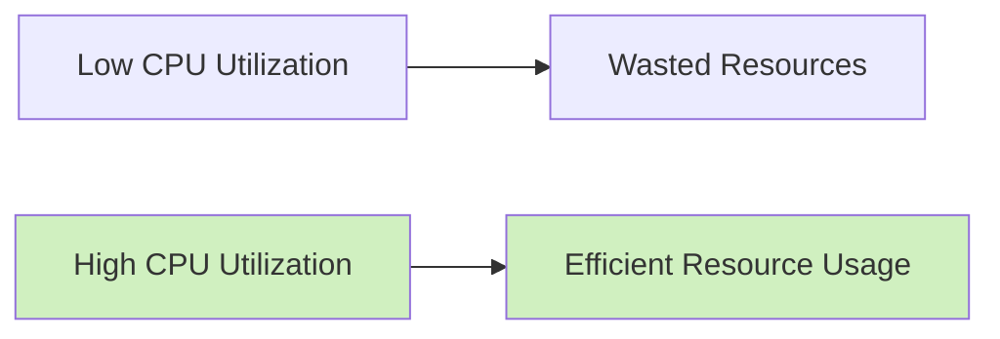
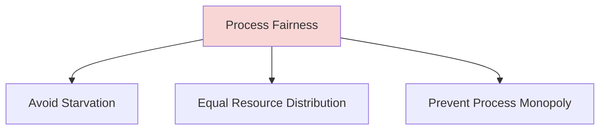
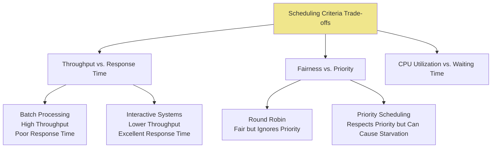

# Scheduling Criteria

## Introduction

When multiple processes are ready to execute in a computer system, the operating system must decide which process should run next. This decision is made by the **CPU scheduler** based on several criteria or objectives. Scheduling criteria are the metrics and considerations that operating systems use to evaluate different scheduling algorithms and decide which process gets CPU time.

Understanding these criteria is fundamental to grasping how modern operating systems work and why certain scheduling algorithms are preferred in specific scenarios. In this guide, we'll explore the major scheduling criteria and how they influence process management decisions.

## Key Scheduling Criteria

### CPU Utilization

CPU utilization represents how busy the processor is. The goal is to keep the CPU as busy as possible, ideally reaching close to 100% utilization.



**Example:**
If a system has 80% CPU utilization, it means the processor is idle 20% of the time. Scheduling algorithms aim to minimize this idle time.

### Throughput

Throughput measures the number of processes completed per unit time. Higher throughput indicates that more processes are being serviced in a given timeframe.

```javascript
// Simple throughput calculation
function calculateThroughput(processesCompleted, timeInterval) {
  return processesCompleted / timeInterval;
}

// Example
const completedProcesses = 120;
const timeIntervalInHours = 2;
const throughput = calculateThroughput(completedProcesses, timeIntervalInHours);
console.log(`System throughput: ${throughput} processes per hour`); // Output: System throughput: 60 processes per hour
```

### Turnaround Time

Turnaround time is the total time taken from when a process is submitted to when it completes execution. It includes:
- Waiting time in the ready queue
- Execution time on the CPU
- Time spent performing I/O operations

```
Turnaround Time = Completion Time - Arrival Time
```

**Example:**
If Process A arrives at time 0 and completes at time 10, its turnaround time is 10 units.

### Waiting Time

Waiting time is the total time a process spends waiting in the ready queue.

```
Waiting Time = Turnaround Time - Burst Time
```

Where burst time is the total time needed by the process for CPU execution.

**Practical Example:**

```python
def calculate_waiting_time(processes):
    n = len(processes)
    waiting_time = [0] * n
    
    # First process has 0 waiting time
    waiting_time[0] = 0
    
    # Calculate waiting time for each process
    for i in range(1, n):
        waiting_time[i] = processes[i-1][1] + waiting_time[i-1]
    
    return waiting_time

# Example processes with burst times (process_id, burst_time)
processes = [(1, 6), (2, 8), (3, 7), (4, 3)]
waiting_times = calculate_waiting_time(processes)

print("Process ID\tBurst Time\tWaiting Time")
for i in range(len(processes)):
    print(f"{processes[i][0]}\t\t{processes[i][1]}\t\t{waiting_times[i]}")

# Output:
# Process ID    Burst Time    Waiting Time
# 1             6             0
# 2             8             6
# 3             7             14
# 4             3             21
```

### Response Time

Response time is the time from submission of a process until the first response is produced. This is particularly important for interactive systems where users expect quick feedback.

```
Response Time = First Response Time - Arrival Time
```

This metric is crucial for applications where user experience matters, such as desktop environments or web servers.

### Fairness

Fairness ensures that each process gets a fair share of CPU time and no process suffers from starvation (indefinite waiting).



### Priority Accommodation

Some processes are more critical than others and should be given preferential treatment. A good scheduling algorithm should respect process priorities while still maintaining reasonable performance for lower-priority processes.

**Example:**
In a real-time system monitoring nuclear reactor temperatures, the temperature-checking process would have higher priority than a user interface update process.

## Real-World Applications

### Case Study: Web Server Scheduling

A web server must handle thousands of requests simultaneously. Let's examine how different scheduling criteria affect its performance:

```javascript
// Simplified web server request handling with priority
class WebServer {
  constructor() {
    this.requestQueue = [];
  }
  
  addRequest(request) {
    // Add request to queue
    this.requestQueue.push(request);
    
    // Sort based on priority (lower number = higher priority)
    this.requestQueue.sort((a, b) => a.priority - b.priority);
  }
  
  processNextRequest() {
    if (this.requestQueue.length > 0) {
      const request = this.requestQueue.shift();
      console.log(`Processing request: ${request.id} with priority ${request.priority}`);
      // Process the request...
      return request;
    }
    return null;
  }
}

// Example usage
const server = new WebServer();
server.addRequest({ id: "req1", priority: 3, type: "static-content" });
server.addRequest({ id: "req2", priority: 1, type: "payment-processing" });
server.addRequest({ id: "req3", priority: 2, type: "database-query" });

// First processed: req2 (highest priority)
server.processNextRequest();
// Next: req3
server.processNextRequest();
// Finally: req1
server.processNextRequest();
```

In this example:
- **Priority Accommodation**: Payment processing requests get higher priority
- **Response Time**: By prioritizing certain requests, the system provides faster response to critical operations
- **Fairness**: All requests eventually get processed, preventing starvation

### Case Study: Mobile Operating System

Modern smartphones run multiple applications simultaneously. The scheduling criteria balance between:

1. **Battery Efficiency**: Processes that minimize power consumption get preference
2. **User Experience**: Foreground apps receive higher priority for better responsiveness
3. **Background Processing**: System maintenance tasks run at lower priorities

For example, when you're using a navigation app while music plays in the background, the scheduler prioritizes:
1. The navigation app (foreground, user-interactive)
2. The music playback (background, but user-noticeable if interrupted)
3. Email sync (background, non-time-critical)

## Trade-offs Between Criteria

It's important to understand that optimizing for one criterion often comes at the expense of others:



## Optimizing for Different Environments

Different computing environments prioritize different scheduling criteria:

| Environment | Primary Criteria | Secondary Criteria |
|-------------|------------------|-------------------|
| Batch Systems | Throughput, CPU Utilization | Turnaround Time |
| Interactive Systems | Response Time, Fairness | Throughput |
| Real-time Systems | Meeting Deadlines, Priority | Throughput |
| Mobile Devices | Power Efficiency, Response Time | CPU Utilization |

## Implementing Basic Scheduling Logic

Here's a simplified implementation of a scheduler that evaluates processes based on multiple criteria:

```python
class Process:
    def __init__(self, pid, burst_time, priority, arrival_time=0):
        self.pid = pid
        self.burst_time = burst_time
        self.priority = priority  # Lower number means higher priority
        self.arrival_time = arrival_time
        self.remaining_time = burst_time
        self.start_time = None
        self.completion_time = None
    
    def calculate_metrics(self):
        if self.completion_time is not None and self.start_time is not None:
            self.turnaround_time = self.completion_time - self.arrival_time
            self.waiting_time = self.turnaround_time - self.burst_time
            self.response_time = self.start_time - self.arrival_time
            return True
        return False
    
    def __str__(self):
        metrics = self.calculate_metrics()
        if metrics:
            return f"Process {self.pid}: Turnaround={self.turnaround_time}, Wait={self.waiting_time}, Response={self.response_time}"
        return f"Process {self.pid}: Not completed"

def sjf_scheduler(processes):
    """Shortest Job First scheduler"""
    current_time = 0
    completed_processes = []
    remaining_processes = sorted(processes, key=lambda p: p.burst_time)
    
    while remaining_processes:
        process = remaining_processes.pop(0)
        process.start_time = current_time
        current_time += process.burst_time
        process.completion_time = current_time
        completed_processes.append(process)
    
    return completed_processes

# Example usage
processes = [
    Process(1, 6, 3),
    Process(2, 8, 2),
    Process(3, 7, 1),
    Process(4, 3, 4)
]

print("Scheduling using Shortest Job First:")
completed = sjf_scheduler(processes)
for process in completed:
    print(process)

# Calculate average waiting time
avg_waiting_time = sum(p.waiting_time for p in completed) / len(completed)
print(f"Average waiting time: {avg_waiting_time}")
```

## Summary

Scheduling criteria provide the foundation for evaluating CPU scheduling algorithms. The key points to remember are:

1. **No Perfect Algorithm**: There's no single scheduling algorithm that optimizes all criteria simultaneously.
2. **Context Matters**: The best scheduling approach depends on the specific computing environment and its requirements.
3. **Trade-offs**: Improving one criterion typically comes at the cost of another.
4. **Common Criteria**: CPU utilization, throughput, turnaround time, waiting time, response time, fairness, and priority accommodation are the fundamental metrics used to evaluate scheduling performance.

Understanding these criteria allows system designers to select or design scheduling algorithms tailored to their specific needs, whether they're building real-time systems, interactive applications, or batch processing environments.

## Exercises

1. Calculate the average waiting time and turnaround time for the following processes using First-Come-First-Served scheduling:
   - Process P1: Arrival time = 0, Burst time = 5
   - Process P2: Arrival time = 1, Burst time = 3
   - Process P3: Arrival time = 2, Burst time = 8
   - Process P4: Arrival time = 3, Burst time = 2

2. Design a scheduling algorithm that balances both response time and throughput. Explain your approach and its trade-offs.

3. Consider a system where some processes are I/O-bound (short CPU bursts) and others are CPU-bound (long CPU bursts). Which scheduling criteria would you prioritize and why?

## Additional Resources

- Operating System Concepts by Silberschatz, Galvin, and Gagne
- Modern Operating Systems by Andrew S. Tanenbaum
- MIT OpenCourseWare: Operating Systems Engineering