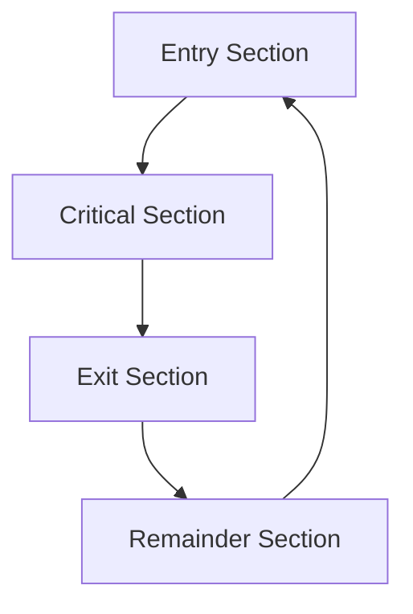
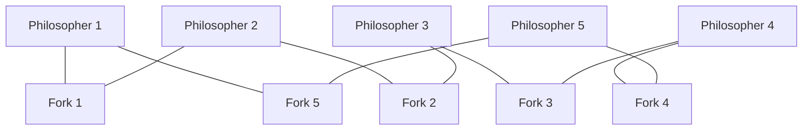

# Process Synchronization

## Introduction

When multiple processes execute concurrently in an operating system, they often need to access and manipulate shared resources such as variables, files, or devices. Without proper coordination, these concurrent accesses can lead to inconsistent or unpredictable results. **Process synchronization** provides mechanisms to coordinate the execution of multiple processes, ensuring they work together harmoniously without interfering with each other.

Imagine multiple chefs working in the same kitchen: without coordination, they might collide, use the same utensils simultaneously, or add the same ingredients twice. Process synchronization is like establishing kitchen rules to ensure everyone can work efficiently without creating chaos.

## The Critical Section Problem

### What is a Critical Section?

A **critical section** is a segment of code in which a process accesses shared resources that must not be accessed by other processes simultaneously. Only one process should be allowed to execute its critical section at any given time.



### Requirements for a Solution

Any solution to the critical section problem must satisfy these three requirements:

1. **Mutual Exclusion**: Only one process can execute in its critical section at any time.
2. **Progress**: Processes outside their critical sections cannot block other processes from entering their critical sections.
3. **Bounded Waiting**: A process requesting to enter its critical section will eventually be allowed to do so (no indefinite postponement).

## Race Conditions

A **race condition** occurs when multiple processes access and manipulate shared data concurrently, and the final result depends on the order of execution. This typically leads to unexpected and erroneous results.

Let's look at a simple example of a race condition:

```c
// Shared variable
int counter = 0;

// Process 1
void process1() {
    int temp = counter;
    temp = temp + 1;
    counter = temp;
}

// Process 2
void process2() {
    int temp = counter;
    temp = temp + 1;
    counter = temp;
}
```

If both processes execute concurrently, the final value of `counter` might be 1 instead of the expected 2 because:

1. Process 1 reads `counter` (value 0)
2. Process 2 reads `counter` (value 0)
3. Process 1 increments temp to 1
4. Process 2 increments temp to 1
5. Process 1 writes 1 to `counter`
6. Process 2 writes 1 to `counter`

The result is 1, not 2!

## Synchronization Mechanisms

### 1. Mutex Locks

A **mutex** (mutual exclusion) lock is the simplest synchronization tool. It has two states: locked and unlocked. Only one process can hold the lock at any time.

```c
// Pseudocode for mutex lock
acquire_lock() {
    while (lock == "LOCKED") {
        // Wait
    }
    lock = "LOCKED";
}

release_lock() {
    lock = "UNLOCKED";
}

// Example usage
acquire_lock();
// Critical section here
release_lock();
```

### 2. Semaphores

A **semaphore** is a more versatile synchronization tool that maintains a count. It can be used for both mutual exclusion and condition synchronization.

**Types of Semaphores:**
- **Binary Semaphore**: Can have only two values (0 and 1), similar to a mutex
- **Counting Semaphore**: Can have arbitrary nonnegative values

```c
// Pseudocode for semaphore operations
wait(S) {
    while (S <= 0) {
        // Wait
    }
    S--;
}

signal(S) {
    S++;
}

// Example usage (mutual exclusion)
wait(mutex);
// Critical section here
signal(mutex);
```

### 3. Monitors

A **monitor** is a high-level synchronization construct that encapsulates shared data and the procedures that operate on them. It ensures that only one process can be active within the monitor at any time.

```java
// Java example of using synchronized methods (similar to monitor concept)
class Counter {
    private int count = 0;
    
    public synchronized void increment() {
        count++;
    }
    
    public synchronized int getCount() {
        return count;
    }
}
```

## Common Synchronization Problems

### 1. The Producer-Consumer Problem

In this problem, producers create data items and place them in a buffer, while consumers remove and use these items. Synchronization is needed to ensure producers don't add items to a full buffer and consumers don't remove from an empty buffer.

```java
class BoundedBuffer {
    private final int[] buffer = new int[BUFFER_SIZE];
    private int count = 0, in = 0, out = 0;
    private final Semaphore mutex = new Semaphore(1);
    private final Semaphore empty = new Semaphore(BUFFER_SIZE);
    private final Semaphore full = new Semaphore(0);
    
    public void produce(int item) throws InterruptedException {
        empty.acquire();  // Wait if buffer is full
        mutex.acquire();  // Ensure mutual exclusion
        
        buffer[in] = item;
        in = (in + 1) % BUFFER_SIZE;
        count++;
        
        mutex.release();
        full.release();   // Signal that buffer has items
    }
    
    public int consume() throws InterruptedException {
        full.acquire();   // Wait if buffer is empty
        mutex.acquire();  // Ensure mutual exclusion
        
        int item = buffer[out];
        out = (out + 1) % BUFFER_SIZE;
        count--;
        
        mutex.release();
        empty.release();  // Signal that buffer has space
        return item;
    }
}
```

### 2. The Readers-Writers Problem

In this problem, multiple processes want to read or write to a shared resource. Multiple readers can access the resource simultaneously, but writers need exclusive access.

```java
class ReadersWriterLock {
    private int readers = 0;
    private boolean isWriting = false;
    
    public synchronized void acquireReadLock() throws InterruptedException {
        while (isWriting) {
            wait();
        }
        readers++;
    }
    
    public synchronized void releaseReadLock() {
        readers--;
        if (readers == 0) {
            notifyAll();
        }
    }
    
    public synchronized void acquireWriteLock() throws InterruptedException {
        while (readers > 0 || isWriting) {
            wait();
        }
        isWriting = true;
    }
    
    public synchronized void releaseWriteLock() {
        isWriting = false;
        notifyAll();
    }
}
```

### 3. The Dining Philosophers Problem

Five philosophers sit around a table with five forks. Each philosopher needs two forks to eat. This problem demonstrates the challenge of deadlock avoidance.



A solution involves breaking symmetry (e.g., one philosopher picks up forks in reverse order) or using a waiter (semaphore) to limit the number of philosophers who can try to eat simultaneously.

```java
class DiningPhilosophers {
    private final int NUM_PHILOSOPHERS = 5;
    private final Semaphore[] forks = new Semaphore[NUM_PHILOSOPHERS];
    private final Semaphore maxDiners = new Semaphore(NUM_PHILOSOPHERS - 1);
    
    public DiningPhilosophers() {
        for (int i = 0; i < NUM_PHILOSOPHERS; i++) {
            forks[i] = new Semaphore(1);
        }
    }
    
    public void philosopher(int id) throws InterruptedException {
        while (true) {
            think(id);
            
            maxDiners.acquire();  // Prevents deadlock
            
            forks[id].acquire();  // Pick up left fork
            forks[(id + 1) % NUM_PHILOSOPHERS].acquire();  // Pick up right fork
            
            eat(id);
            
            forks[id].release();  // Put down left fork
            forks[(id + 1) % NUM_PHILOSOPHERS].release();  // Put down right fork
            
            maxDiners.release();
        }
    }
    
    private void think(int id) {
        System.out.println("Philosopher " + id + " is thinking");
        // Thinking simulation
    }
    
    private void eat(int id) {
        System.out.println("Philosopher " + id + " is eating");
        // Eating simulation
    }
}
```

## Deadlocks

A **deadlock** occurs when processes are waiting indefinitely for resources held by each other. For a deadlock to occur, four conditions must be present:

1. **Mutual Exclusion**: Resources cannot be shared
2. **Hold and Wait**: Processes hold resources while waiting for others
3. **No Preemption**: Resources cannot be forcibly taken from processes
4. **Circular Wait**: A circular chain of processes exists where each process holds resources needed by the next

### Deadlock Prevention

To prevent deadlocks, we need to ensure at least one of the four necessary conditions cannot hold:

- **Mutual Exclusion**: Make resources sharable (when possible)
- **Hold and Wait**: Require processes to request all resources at once
- **No Preemption**: Allow resources to be taken away if a process is waiting too long
- **Circular Wait**: Impose a total ordering on resources

## Real-World Applications of Synchronization

1. **Database Management Systems**: Implement locking mechanisms to ensure data consistency during concurrent transactions.

2. **Operating Systems**: Use synchronization primitives to coordinate access to system resources.

3. **Web Servers**: Employ synchronization techniques to handle multiple client requests concurrently.

4. **Banking Systems**: Ensure that account operations (deposits, withdrawals) are synchronized to maintain accurate balances.

5. **Airline Reservation Systems**: Prevent multiple users from booking the same seat simultaneously.

## Example: Thread Synchronization in Python

```python
import threading

# Shared resource
counter = 0
counter_lock = threading.Lock()

def increment_counter():
    global counter
    for _ in range(100000):
        # Without synchronization
        # counter += 1
        
        # With synchronization
        with counter_lock:
            counter += 1

# Create threads
threads = []
for _ in range(5):
    thread = threading.Thread(target=increment_counter)
    threads.append(thread)
    thread.start()

# Wait for all threads to complete
for thread in threads:
    thread.join()

print(f"Final counter value: {counter}")
```

**Output without synchronization** (may vary):
```
Final counter value: 342651
```

**Output with synchronization**:
```
Final counter value: 500000
```

## Summary

Process synchronization is essential for ensuring correct and predictable behavior in concurrent systems. We've explored:

- The critical section problem and its requirements
- Race conditions and their consequences
- Various synchronization mechanisms (mutex locks, semaphores, monitors)
- Classic synchronization problems (producer-consumer, readers-writers, dining philosophers)
- Deadlocks and strategies for preventing them
- Real-world applications of synchronization techniques

Understanding synchronization is crucial for developing reliable concurrent systems, from simple multithreaded applications to complex distributed systems.

## Additional Resources

- Try implementing the producer-consumer problem yourself using different synchronization primitives
- Experiment with deadlock scenarios and implement solutions to prevent them
- Practice implementing thread-safe data structures
- Explore more advanced concurrency patterns like barriers, latches, and rendezvoused