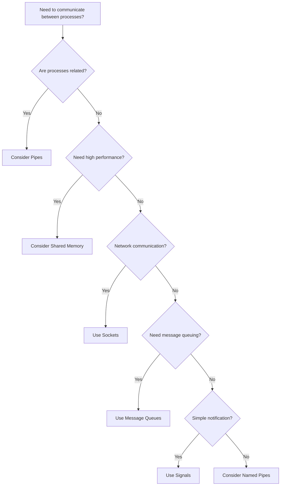
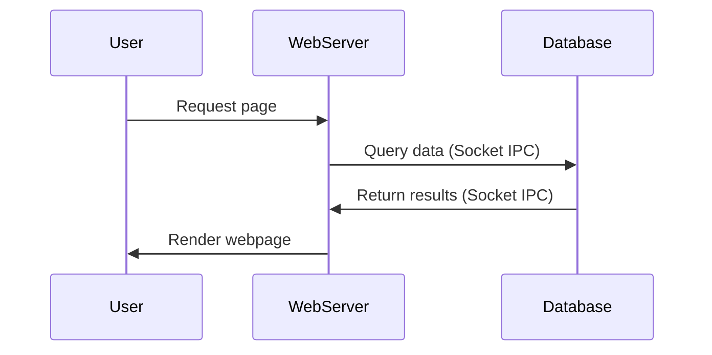
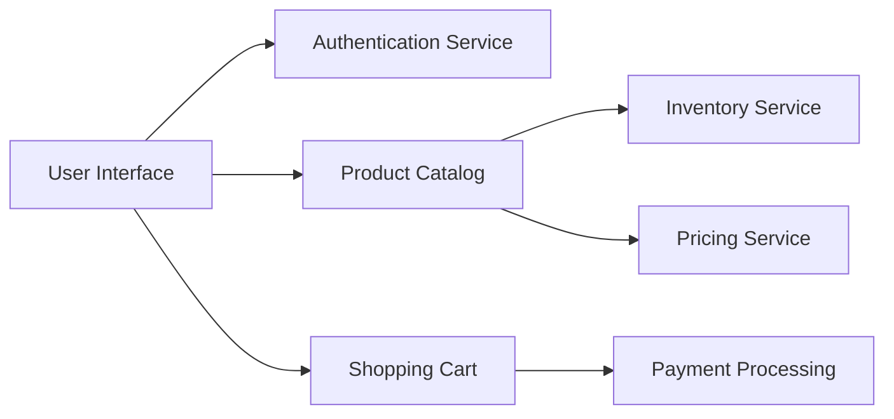

# Interprocess Communication

## Introduction

Interprocess Communication (IPC) is a fundamental concept in operating systems that allows separate processes to communicate and share data with each other. In modern computing environments, applications often need to work together, exchange information, and coordinate their activities.

Think of processes as independent programs running on your computer. By default, these processes are isolated from each other for security and stability reasons. IPC provides controlled methods for breaking this isolation when necessary, enabling processes to collaborate effectively.

## Why Do We Need IPC?

Imagine you're working on a computer with multiple applications running:
- A web browser displaying a webpage
- A text editor where you're writing code
- A music player providing background music

These applications run as separate processes, but sometimes they need to interact:
- You may want to copy text from the browser to paste into your text editor
- Your music player might need to respond to system-wide volume controls
- A chat application might need to notify you of new messages

Without IPC, these interactions would be impossible. IPC provides the mechanisms that make modern multitasking operating systems practical and powerful.

## Key IPC Mechanisms

Let's explore the main methods processes use to communicate with each other:

### 1. Pipes

Pipes are one of the simplest forms of IPC, creating a channel where data can flow from one process to another.

#### Unnamed Pipes

Unnamed pipes are typically used between related processes (like a parent and child). In most Unix-like systems, you've probably used pipes in the command line:

```bash
ls -l | grep "file"
```

In this example, the output of `ls -l` is piped into `grep "file"`.

Let's implement a simple pipe in C:

```c
#include <stdio.h>
#include <stdlib.h>
#include <unistd.h>

int main() {
    int pipefd[2];
    pid_t pid;
    char buffer[20];
    
    // Create pipe
    if (pipe(pipefd) == -1) {
        perror("pipe");
        exit(EXIT_FAILURE);
    }
    
    // Fork process
    pid = fork();
    
    if (pid == -1) {
        perror("fork");
        exit(EXIT_FAILURE);
    }
    
    if (pid == 0) { // Child process
        close(pipefd[1]); // Close write end
        
        // Read from pipe
        read(pipefd[0], buffer, sizeof(buffer));
        printf("Child received: %s
", buffer);
        
        close(pipefd[0]);
        exit(EXIT_SUCCESS);
    } else { // Parent process
        close(pipefd[0]); // Close read end
        
        // Write to pipe
        write(pipefd[1], "Hello from parent!", 18);
        
        close(pipefd[1]);
        wait(NULL); // Wait for child to finish
        exit(EXIT_SUCCESS);
    }
    
    return 0;
}
```

Output:
```
Child received: Hello from parent!
```

#### Named Pipes (FIFOs)

Named pipes work similarly but exist as files in the filesystem, allowing unrelated processes to communicate.

```c
// Process 1: Creating and writing to a named pipe
#include <stdio.h>
#include <stdlib.h>
#include <unistd.h>
#include <fcntl.h>
#include <sys/stat.h>
#include <sys/types.h>
#include <string.h>

int main() {
    int fd;
    char *myfifo = "/tmp/myfifo";
    char message[] = "Hello via FIFO!";
    
    // Create named pipe
    mkfifo(myfifo, 0666);
    
    // Open FIFO for writing
    fd = open(myfifo, O_WRONLY);
    write(fd, message, strlen(message) + 1);
    close(fd);
    
    return 0;
}
```

```c
// Process 2: Reading from a named pipe
#include <stdio.h>
#include <stdlib.h>
#include <unistd.h>
#include <fcntl.h>
#include <sys/stat.h>
#include <sys/types.h>

int main() {
    int fd;
    char *myfifo = "/tmp/myfifo";
    char buffer[100];
    
    // Open FIFO for reading
    fd = open(myfifo, O_RDONLY);
    read(fd, buffer, sizeof(buffer));
    printf("Received: %s
", buffer);
    close(fd);
    
    // Remove the FIFO
    unlink(myfifo);
    
    return 0;
}
```

Output from Process 2:
```
Received: Hello via FIFO!
```

### 2. Message Queues

Message queues allow processes to exchange discrete messages. Unlike pipes, which stream bytes, message queues maintain message boundaries and can handle multiple messages with different priorities.

Here's a basic example using POSIX message queues:

```c
// Sender
#include <stdio.h>
#include <stdlib.h>
#include <string.h>
#include <mqueue.h>

int main() {
    mqd_t mq;
    struct mq_attr attr;
    char buffer[] = "Hello from message queue!";
    
    // Set up message queue attributes
    attr.mq_flags = 0;
    attr.mq_maxmsg = 10;
    attr.mq_msgsize = 100;
    attr.mq_curmsgs = 0;
    
    // Create message queue
    mq = mq_open("/myqueue", O_CREAT | O_WRONLY, 0644, &attr);
    
    // Send message
    mq_send(mq, buffer, strlen(buffer) + 1, 0);
    printf("Message sent!
");
    
    // Close and unlink queue
    mq_close(mq);
    
    return 0;
}
```

```c
// Receiver
#include <stdio.h>
#include <stdlib.h>
#include <mqueue.h>

int main() {
    mqd_t mq;
    struct mq_attr attr;
    char buffer[100];
    unsigned int prio;
    
    // Open message queue
    mq = mq_open("/myqueue", O_RDONLY);
    mq_getattr(mq, &attr);
    
    // Receive message
    mq_receive(mq, buffer, attr.mq_msgsize, &prio);
    printf("Received: %s
", buffer);
    
    // Clean up
    mq_close(mq);
    mq_unlink("/myqueue");
    
    return 0;
}
```

Output from the receiver:
```
Received: Hello from message queue!
```

### 3. Shared Memory

Shared memory is one of the fastest IPC methods, allowing multiple processes to access the same memory region directly. However, it requires careful synchronization to prevent race conditions.

```c
// Process creating and writing to shared memory
#include <stdio.h>
#include <stdlib.h>
#include <string.h>
#include <sys/mman.h>
#include <sys/stat.h>
#include <fcntl.h>
#include <unistd.h>

int main() {
    const char *name = "/my_shared_memory";
    const char *message = "Hello from shared memory!";
    int fd;
    void *addr;
    
    // Create shared memory object
    fd = shm_open(name, O_CREAT | O_RDWR, 0666);
    ftruncate(fd, 4096);
    
    // Map shared memory
    addr = mmap(NULL, 4096, PROT_WRITE, MAP_SHARED, fd, 0);
    
    // Write to shared memory
    strcpy(addr, message);
    
    printf("Message written to shared memory
");
    
    return 0;
}
```

```c
// Process reading from shared memory
#include <stdio.h>
#include <stdlib.h>
#include <sys/mman.h>
#include <sys/stat.h>
#include <fcntl.h>
#include <unistd.h>

int main() {
    const char *name = "/my_shared_memory";
    int fd;
    void *addr;
    
    // Open shared memory object
    fd = shm_open(name, O_RDONLY, 0666);
    
    // Map shared memory
    addr = mmap(NULL, 4096, PROT_READ, MAP_SHARED, fd, 0);
    
    // Read from shared memory
    printf("Received: %s
", (char *)addr);
    
    // Clean up
    munmap(addr, 4096);
    shm_unlink(name);
    
    return 0;
}
```

Output from the reader:
```
Received: Hello from shared memory!
```

### 4. Sockets

Sockets are versatile IPC mechanisms that allow communication between processes, even across different computers in a network. They're the foundation of internet communication.

Let's create a simple local socket example:

```c
// Server
#include <stdio.h>
#include <stdlib.h>
#include <string.h>
#include <unistd.h>
#include <sys/socket.h>
#include <sys/un.h>

#define SOCKET_PATH "/tmp/test_socket"

int main() {
    int server_fd, client_fd;
    struct sockaddr_un address;
    char buffer[100];
    
    // Create socket
    server_fd = socket(AF_UNIX, SOCK_STREAM, 0);
    
    // Setup address structure
    memset(&address, 0, sizeof(address));
    address.sun_family = AF_UNIX;
    strncpy(address.sun_path, SOCKET_PATH, sizeof(address.sun_path) - 1);
    unlink(SOCKET_PATH);
    
    // Bind socket to address
    bind(server_fd, (struct sockaddr *)&address, sizeof(address));
    
    // Listen for connections
    listen(server_fd, 5);
    printf("Server waiting for connections...
");
    
    // Accept connection
    client_fd = accept(server_fd, NULL, NULL);
    
    // Receive message
    recv(client_fd, buffer, 100, 0);
    printf("Received: %s
", buffer);
    
    // Send response
    char response[] = "Message received by server";
    send(client_fd, response, strlen(response) + 1, 0);
    
    // Clean up
    close(client_fd);
    close(server_fd);
    unlink(SOCKET_PATH);
    
    return 0;
}
```

```c
// Client
#include <stdio.h>
#include <stdlib.h>
#include <string.h>
#include <unistd.h>
#include <sys/socket.h>
#include <sys/un.h>

#define SOCKET_PATH "/tmp/test_socket"

int main() {
    int client_fd;
    struct sockaddr_un address;
    char buffer[100];
    
    // Create socket
    client_fd = socket(AF_UNIX, SOCK_STREAM, 0);
    
    // Setup address structure
    memset(&address, 0, sizeof(address));
    address.sun_family = AF_UNIX;
    strncpy(address.sun_path, SOCKET_PATH, sizeof(address.sun_path) - 1);
    
    // Connect to server
    connect(client_fd, (struct sockaddr *)&address, sizeof(address));
    
    // Send message
    char message[] = "Hello from client!";
    send(client_fd, message, strlen(message) + 1, 0);
    
    // Receive response
    recv(client_fd, buffer, 100, 0);
    printf("Server response: %s
", buffer);
    
    // Clean up
    close(client_fd);
    
    return 0;
}
```

Output:
```
Server: Received: Hello from client!
Client: Server response: Message received by server
```

### 5. Signals

Signals are a lightweight method to notify processes about specific events. They're often used for simple notifications rather than data transfer.

```c
#include <stdio.h>
#include <stdlib.h>
#include <unistd.h>
#include <signal.h>

void signal_handler(int signal_num) {
    printf("Received signal %d
", signal_num);
}

int main() {
    pid_t pid = fork();
    
    if (pid == -1) {
        perror("fork");
        exit(EXIT_FAILURE);
    }
    
    if (pid > 0) { // Parent process
        sleep(1); // Give child time to set up handler
        printf("Parent sending signal to child (PID: %d)
", pid);
        kill(pid, SIGUSR1);
        wait(NULL); // Wait for child to finish
    } else { // Child process
        signal(SIGUSR1, signal_handler);
        printf("Child process waiting for signal...
");
        pause(); // Wait for signal
        printf("Child process exiting
");
    }
    
    return 0;
}
```

Output:
```
Child process waiting for signal...
Parent sending signal to child (PID: [child_pid])
Received signal 10
Child process exiting
```

## Choosing the Right IPC Method

Each IPC mechanism has its strengths and weaknesses:



Guidelines for choosing:

1. **Pipes**: Best for simple, one-way communication between related processes
2. **Named Pipes**: Good for communication between unrelated processes on the same machine
3. **Message Queues**: Ideal when you need to manage multiple messages with priorities
4. **Shared Memory**: Use when performance is critical and large amounts of data need to be shared
5. **Sockets**: Best for network communication or when processes might run on different machines
6. **Signals**: Use for simple notifications without data transfer

## Real-World Applications

### Example 1: Database and Web Application

A common scenario involves a web server and a database server communicating:



The web server and database typically communicate using sockets, allowing them to run on separate machines if needed.

### Example 2: Microservices Architecture

Modern applications often use a microservices approach, with many small, specialized processes:



These services typically communicate using HTTP/REST APIs or message queues, both built on socket-based IPC mechanisms.

### Example 3: Operating System Components

In your operating system, various components communicate constantly:

- Your window manager sends signals to applications when you resize windows
- Copy and paste operations use shared memory to transfer data between applications
- System services communicate with applications using a variety of IPC methods

## Common Challenges in IPC

1. **Synchronization**: Ensuring processes don't access shared resources simultaneously
2. **Deadlocks**: Preventing situations where processes are waiting for each other indefinitely
3. **Security**: Limiting which processes can communicate with each other
4. **Performance**: Minimizing overhead, especially for high-frequency communication

## Practical Exercise: Simple Chat System

Let's create a simple two-process chat system using named pipes:

```c
// chat_process_a.c
#include <stdio.h>
#include <stdlib.h>
#include <string.h>
#include <fcntl.h>
#include <sys/stat.h>
#include <sys/types.h>
#include <unistd.h>

#define PIPE_A_TO_B "/tmp/pipe_a_to_b"
#define PIPE_B_TO_A "/tmp/pipe_b_to_a"
#define BUFFER_SIZE 1024

int main() {
    int fd_write, fd_read;
    char buffer[BUFFER_SIZE];
    
    // Create named pipes
    mkfifo(PIPE_A_TO_B, 0666);
    mkfifo(PIPE_B_TO_A, 0666);
    
    printf("Process A started. Type messages and press Enter to send.
");
    
    while (1) {
        // Open write pipe
        fd_write = open(PIPE_A_TO_B, O_WRONLY);
        
        // Get message from user
        printf("You: ");
        fgets(buffer, BUFFER_SIZE, stdin);
        
        // Send message
        write(fd_write, buffer, strlen(buffer) + 1);
        close(fd_write);
        
        // Check for exit command
        if (strncmp(buffer, "exit", 4) == 0) {
            break;
        }
        
        // Open read pipe
        fd_read = open(PIPE_B_TO_A, O_RDONLY);
        
        // Read response
        read(fd_read, buffer, BUFFER_SIZE);
        printf("Process B: %s", buffer);
        close(fd_read);
        
        // Check if other process wants to exit
        if (strncmp(buffer, "exit", 4) == 0) {
            break;
        }
    }
    
    // Clean up
    unlink(PIPE_A_TO_B);
    unlink(PIPE_B_TO_A);
    printf("Chat ended.
");
    
    return 0;
}
```

```c
// chat_process_b.c
#include <stdio.h>
#include <stdlib.h>
#include <string.h>
#include <fcntl.h>
#include <sys/stat.h>
#include <sys/types.h>
#include <unistd.h>

#define PIPE_A_TO_B "/tmp/pipe_a_to_b"
#define PIPE_B_TO_A "/tmp/pipe_b_to_a"
#define BUFFER_SIZE 1024

int main() {
    int fd_write, fd_read;
    char buffer[BUFFER_SIZE];
    
    printf("Process B started. Waiting for messages...
");
    
    while (1) {
        // Open read pipe
        fd_read = open(PIPE_A_TO_B, O_RDONLY);
        
        // Read message
        read(fd_read, buffer, BUFFER_SIZE);
        printf("Process A: %s", buffer);
        close(fd_read);
        
        // Check for exit command
        if (strncmp(buffer, "exit", 4) == 0) {
            break;
        }
        
        // Open write pipe
        fd_write = open(PIPE_B_TO_A, O_WRONLY);
        
        // Get response from user
        printf("You: ");
        fgets(buffer, BUFFER_SIZE, stdin);
        
        // Send response
        write(fd_write, buffer, strlen(buffer) + 1);
        close(fd_write);
        
        // Check if we want to exit
        if (strncmp(buffer, "exit", 4) == 0) {
            break;
        }
    }
    
    printf("Chat ended.
");
    
    return 0;
}
```

To use this simple chat system:
1. Compile both programs: `gcc chat_process_a.c -o process_a` and `gcc chat_process_b.c -o process_b`
2. Run them in separate terminals: `./process_a` and `./process_b`
3. Type messages in either terminal and see them appear in the other
4. Type "exit" to end the chat session

## Summary

Interprocess Communication (IPC) is a fundamental concept in operating systems that enables separate processes to exchange data and synchronize their actions. We've explored several key IPC mechanisms:

1. **Pipes and Named Pipes**: Simple channels for data transfer
2. **Message Queues**: Structured message passing with priority support
3. **Shared Memory**: High-performance shared data regions
4. **Sockets**: Versatile communication channels that work across networks
5. **Signals**: Lightweight notification system

Each mechanism has its own strengths and is suited to different scenarios. Understanding IPC is crucial for developing complex, modular applications and operating system components.

## Additional Resources

To deepen your understanding of IPC, consider exploring:

1. POSIX IPC specifications
2. Advanced synchronization mechanisms like semaphores and mutexes
3. Higher-level IPC frameworks like D-Bus or gRPC
4. Distributed systems concepts that build on IPC principles

## Exercises

1. Modify the chat system example to support multiple clients using sockets
2. Implement a producer-consumer problem using shared memory and semaphores
3. Create a simple task distribution system using message queues
4. Design a file monitoring service that uses signals to notify applications when files change
5. Compare the performance of different IPC methods by transferring large amounts of data

## Further Reading

- Stevens, W. R. (2003). UNIX Network Programming, Volume 2: Interprocess Communications
- Tanenbaum, A. S. (2014). Modern Operating Systems
- The Linux Programming Interface by Michael Kerrisk