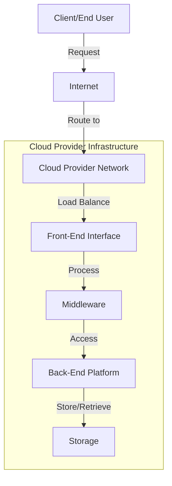

# Cloud Computing Basics

## Introduction

Cloud computing has revolutionized how we build, deploy, and manage applications and services. At its core, cloud computing is the delivery of computing services—including servers, storage, databases, networking, software, and analytics—over the internet ("the cloud") to offer faster innovation, flexible resources, and economies of scale.

In this guide, we'll explore the fundamental concepts of cloud computing, understand its different service models and deployment types, and see how it's applied in real-world scenarios.

## What is Cloud Computing?

Cloud computing allows users to access and use computing resources on-demand without direct active management by the user. Instead of owning and maintaining physical data centers and servers, individuals and organizations can access technology services, such as computing power, storage, and databases, on an as-needed basis from a cloud provider.

### Key Characteristics of Cloud Computing

- **On-demand self-service**: Users can provision resources automatically without requiring human interaction with service providers
- **Broad network access**: Capabilities are available over the network and accessed through standard mechanisms
- **Resource pooling**: Provider's computing resources are pooled to serve multiple consumers
- **Rapid elasticity**: Capabilities can be elastically provisioned and released to scale rapidly with demand
- **Measured service**: Cloud systems automatically control and optimize resource use through metering capabilities

## Cloud Service Models

Cloud computing services generally fall into three categories, often referred to as the "cloud computing stack":

### Infrastructure as a Service (IaaS)

IaaS provides the fundamental building blocks of cloud IT—virtual machines, storage, networks, and operating systems. Users have control over operating systems, storage, deployed applications, and possibly limited control of networking components.

**Example**: Amazon EC2, Google Compute Engine, Microsoft Azure VMs

```javascript
// Example of provisioning a virtual machine using AWS SDK
const AWS = require('aws-sdk');
const ec2 = new AWS.EC2({ region: 'us-west-2' });

const params = {
  ImageId: 'ami-0c55b159cbfafe1f0',
  InstanceType: 't2.micro',
  MinCount: 1,
  MaxCount: 1,
  KeyName: 'my-key-pair',
  SecurityGroupIds: ['sg-12345678']
};

ec2.runInstances(params, (err, data) => {
  if (err) {
    console.error('Could not create instance', err);
    return;
  }
  const instanceId = data.Instances[0].InstanceId;
  console.log('Created instance', instanceId);
});
```

Output:
```
Created instance i-1234567890abcdef0
```

### Platform as a Service (PaaS)

PaaS provides the runtime environment for applications, development and deployment tools, and other services. It allows users to focus on developing and running applications without the complexity of maintaining the underlying infrastructure.

**Example**: Heroku, Google App Engine, Microsoft Azure App Services

```javascript
// Example of deploying an application to Heroku using CLI
// (This would be executed from the command line, not as JavaScript code)
// $ heroku create my-app-name
// $ git push heroku main
```

### Software as a Service (SaaS)

SaaS delivers software applications over the internet, on a subscription basis. Users don't need to install, maintain, or upgrade software—the cloud provider manages everything.

**Example**: Google Workspace, Microsoft 365, Salesforce

```javascript
// Example of using a SaaS API (Salesforce) to query contacts
const jsforce = require('jsforce');
const conn = new jsforce.Connection();

conn.login('user@example.com', 'password', (err, userInfo) => {
  if (err) {
    console.error(err);
    return;
  }
  
  conn.query('SELECT Id, Name, Email FROM Contact LIMIT 10', (err, result) => {
    if (err) {
      console.error(err);
      return;
    }
    console.log(`Total records: ${result.totalSize}`);
    console.log(JSON.stringify(result.records, null, 2));
  });
});
```

## Cloud Deployment Models

### Public Cloud

Services are delivered over the public internet and available to anyone who wants to purchase them. They are owned and operated by third-party cloud service providers.

**Advantages**:
- No capital expenditures
- High scalability
- Pay-per-use pricing

**Example providers**: AWS, Microsoft Azure, Google Cloud Platform

### Private Cloud

Cloud infrastructure is operated solely for a single organization. It can be managed internally or by a third party, and hosted either internally or externally.

**Advantages**:
- Greater control
- Enhanced security
- Customization options

**Implementation example**: VMware vSphere, OpenStack

### Hybrid Cloud

A composition of two or more distinct cloud infrastructures (private, community, or public) that remain unique entities but are bound together by technology that enables data and application portability.

**Advantages**:
- Flexibility
- Workload optimization
- Cost efficiency for variable workloads

**Example scenario**: An organization might use public cloud services for high-volume, less-sensitive needs while keeping critical applications in their private cloud.

### Multi-Cloud

Using multiple cloud computing services from different providers in a single heterogeneous architecture.

**Advantages**:
- Avoiding vendor lock-in
- Best-of-breed functionality
- Geographic coverage

## Cloud Computing Architecture



## Real-World Applications of Cloud Computing

### Case Study 1: Netflix

Netflix migrated from traditional data centers to AWS cloud, which enabled them to handle massive global streaming demand with high reliability. This move allowed Netflix to:

- Scale dynamically based on user demand
- Implement microservices architecture
- Deploy updates continuously without service disruption
- Expand globally with minimal infrastructure investment

### Case Study 2: Small Business Web Application

A small e-commerce business can leverage cloud computing to:

```javascript
// Example of using cloud storage for product images
const { Storage } = require('@google-cloud/storage');
const storage = new Storage();
const bucket = storage.bucket('my-product-images');

// Upload a product image
async function uploadProductImage(fileName, filePath) {
  await bucket.upload(filePath, {
    destination: fileName,
    metadata: {
      cacheControl: 'public, max-age=31536000',
    }
  });
  
  console.log(`${fileName} uploaded to ${bucket.name}.`);
  return `https://storage.googleapis.com/${bucket.name}/${fileName}`;
}

// Usage
uploadProductImage('product-123.jpg', './images/product-123.jpg')
  .then(url => console.log(`Image accessible at: ${url}`))
  .catch(err => console.error('Upload failed:', err));
```

Output:
```
product-123.jpg uploaded to my-product-images.
Image accessible at: https://storage.googleapis.com/my-product-images/product-123.jpg
```

### Benefits for the small business:
- Reduced upfront infrastructure costs
- Ability to scale during busy shopping seasons
- Improved reliability and disaster recovery
- Focus on business logic rather than infrastructure maintenance

## Key Cloud Computing Technologies

### Virtualization

Virtualization is the foundation of cloud computing. It allows multiple virtual machines to run on a single physical machine, effectively sharing the physical machine's resources (CPU, memory, storage).

### Containers

Containers package an application and its dependencies together, ensuring consistent operation across environments. Docker is the most popular containerization platform.

```dockerfile
# Example Dockerfile for a simple Node.js application
FROM node:14-alpine
WORKDIR /app
COPY package*.json ./
RUN npm install
COPY . .
EXPOSE 3000
CMD ["node", "app.js"]
```

### Serverless Computing

Serverless computing allows developers to build and run applications without thinking about servers. The cloud provider manages the infrastructure, and you only pay for the exact amount of resources consumed by your application.

```javascript
// AWS Lambda function example
exports.handler = async (event) => {
  const name = event.queryStringParameters?.name || 'World';
  
  const response = {
    statusCode: 200,
    headers: {
      'Content-Type': 'application/json'
    },
    body: JSON.stringify({
      message: `Hello, ${name}!`
    })
  };
  
  return response;
};
```

## Getting Started with Cloud Computing

### Step 1: Choose a Cloud Provider

For beginners, it's advisable to start with one of the major cloud providers:
- Amazon Web Services (AWS)
- Microsoft Azure
- Google Cloud Platform (GCP)

Each provider offers free tiers or credits for new users, which is perfect for learning.

### Step 2: Set Up Your Account

Sign up for an account with your chosen provider and set up billing information (though you can often use the free tier without any charges).

### Step 3: Explore Basic Services

Start with fundamental services like:
- Virtual machines (EC2 in AWS, VMs in Azure, Compute Engine in GCP)
- Storage services (S3 in AWS, Blob Storage in Azure, Cloud Storage in GCP)
- Database services (RDS in AWS, Cosmos DB in Azure, Cloud SQL in GCP)

### Step 4: Deploy a Simple Application

Try deploying a basic web application to get hands-on experience:

```javascript
// Simple Express.js application
const express = require('express');
const app = express();
const port = process.env.PORT || 3000;

app.get('/', (req, res) => {
  res.send('Hello from the cloud!');
});

app.listen(port, () => {
  console.log(`Application running on port ${port}`);
});
```

## Cloud Computing Best Practices

1. **Security first**: Always implement proper security measures like encryption, access controls, and regular security audits
2. **Cost monitoring**: Set up budget alerts and regularly review your cloud spending
3. **Automation**: Use Infrastructure as Code (IaC) tools like Terraform or CloudFormation
4. **Right-sizing**: Choose appropriate instance sizes for your workloads
5. **Backup and disaster recovery**: Implement regular backups and have a disaster recovery plan

## Summary

Cloud computing has transformed how we build and deploy applications by providing on-demand access to computing resources. The three main service models—IaaS, PaaS, and SaaS—offer different levels of management and control, while various deployment models like public, private, and hybrid clouds provide flexibility for different organizational needs.

By leveraging cloud technologies, developers can focus more on building applications and less on managing infrastructure, resulting in faster innovation and reduced time-to-market.

## Exercises

1. **Exercise 1**: Sign up for a free tier account with a cloud provider of your choice and launch a virtual machine.
2. **Exercise 2**: Deploy a simple web application (like a "Hello World" app) to a PaaS platform.
3. **Exercise 3**: Create a storage bucket and upload/download files programmatically using the provider's SDK.
4. **Exercise 4**: Set up a simple database instance and connect to it from your local machine.
5. **Exercise 5**: Implement a simple serverless function that returns the current time when invoked.

## Additional Resources

- Cloud provider documentation:
  - [AWS Documentation](https://docs.aws.amazon.com/)
  - [Microsoft Azure Documentation](https://docs.microsoft.com/azure/)
  - [Google Cloud Documentation](https://cloud.google.com/docs)
- Online learning platforms with cloud computing courses:
  - Coursera
  - Udemy
  - A Cloud Guru
  - Cloud Academy
- Official certification paths:
  - AWS Certified Cloud Practitioner
  - Microsoft Certified: Azure Fundamentals
  - Google Cloud Certified: Cloud Digital Leader