# Cloud Computing Service Models: IaaS, PaaS, and SaaS

## Introduction

Cloud computing has revolutionized how businesses and individuals utilize computing resources. Instead of building and maintaining physical infrastructure, cloud computing offers various services over the internet on a pay-as-you-go basis. The three primary service models in cloud computing are:

- **Infrastructure as a Service (IaaS)**
- **Platform as a Service (PaaS)**
- **Software as a Service (SaaS)**

Each model offers different levels of control, flexibility, and management responsibility. Understanding these models is essential for making informed decisions about which cloud services best suit your needs.

## Cloud Service Models Overview

Let's visualize the relationship between these service models and what each one manages:

```mermaid
graph TD
    subgraph "Traditional On-premises"
        A[Applications] --> B[Data]
        B --> C[Runtime]
        C --> D[Middleware]
        D --> E[OS]
        E --> F[Virtualization]
        F --> G[Servers]
        G --> H[Storage]
        H --> I[Networking]
    end
    
    subgraph "IaaS"
        J[Applications] --> K[Data]
        K --> L[Runtime]
        L --> M[Middleware]
        M --> N[OS]
        N --> O[Virtualization]
        style O fill:#d9f7be
        style P fill:#d9f7be
        style Q fill:#d9f7be
        style R fill:#d9f7be
        O --> P[Servers]
        P --> Q[Storage]
        Q --> R[Networking]
    end
    
    subgraph "PaaS"
        S[Applications] --> T[Data]
        style U fill:#d9f7be
        style V fill:#d9f7be
        style W fill:#d9f7be
        style X fill:#d9f7be
        style Y fill:#d9f7be
        style Z fill:#d9f7be
        style AA fill:#d9f7be
        T --> U[Runtime]
        U --> V[Middleware]
        V --> W[OS]
        W --> X[Virtualization]
        X --> Y[Servers]
        Y --> Z[Storage]
        Z --> AA[Networking]
    end
    
    subgraph "SaaS"
        style BB fill:#d9f7be
        style CC fill:#d9f7be
        style DD fill:#d9f7be
        style EE fill:#d9f7be
        style FF fill:#d9f7be
        style GG fill:#d9f7be
        style HH fill:#d9f7be
        style II fill:#d9f7be
        BB[Applications] --> CC[Data]
        CC --> DD[Runtime]
        DD --> EE[Middleware]
        EE --> FF[OS]
        FF --> GG[Virtualization]
        GG --> HH[Servers]
        HH --> II[Storage]
        II --> JJ[Networking]
        style JJ fill:#d9f7be
    end
    
    classDef customer fill:#ffffff,stroke:#333,stroke-width:2px
    classDef provider fill:#d9f7be,stroke:#333,stroke-width:2px
    
    class A,B,C,D,E,F,G,H,I,J,K,L,M,N,O,P,Q,R,S,T,U,V,W,X,Y,Z,AA,BB,CC,DD,EE,FF,GG,HH,II,JJ customer
```



*Green components are managed by the cloud provider, white components are managed by you.*

## Infrastructure as a Service (IaaS)

### What is IaaS?

IaaS provides virtualized computing resources over the internet. With IaaS, you rent IT infrastructure—servers, virtual machines, storage, networks, and operating systems—from a cloud provider on a pay-as-you-go basis.

### Key Characteristics

- **Maximum Control**: You have more direct control over your computing resources.
- **Flexibility**: Easily scale up or down based on demand.
- **Minimal Provider Management**: Provider manages only the physical hardware and network.
- **User Responsibility**: You're responsible for operating systems, middleware, applications, and data.

### Real-World Examples

- **Amazon Web Services (AWS) EC2**: Provides virtual servers in the cloud.
- **Microsoft Azure Virtual Machines**: Offers Windows and Linux virtual machines.
- **Google Cloud Compute Engine**: Delivers scalable virtual machine instances.

### Practical Example: Setting Up a Virtual Machine with AWS CLI

```bash
# Install AWS CLI
pip install awscli

# Configure AWS CLI with your credentials
aws configure

# Launch an EC2 instance (Ubuntu Server)
aws ec2 run-instances \
  --image-id ami-0c55b159cbfafe1f0 \
  --count 1 \
  --instance-type t2.micro \
  --key-name MyKeyPair \
  --security-group-ids sg-903004f8 \
  --subnet-id subnet-6e7f829e

# Output will show instance details including instance-id
```

### When to Use IaaS

- When you need maximum control over your infrastructure
- For applications with unpredictable or fluctuating demand
- For startups and small companies wanting to avoid capital expenditure on hardware
- When rapidly growing your infrastructure
- For temporary infrastructure needs (testing and development)

## Platform as a Service (PaaS)

### What is PaaS?

PaaS provides a platform and environment that allows developers to build, test, and deploy applications without worrying about underlying infrastructure. The provider manages the hardware and software required for application development.

### Key Characteristics

- **Development Focus**: Focus on application development without infrastructure concerns.
- **Built-in Tools**: Provides development tools, middleware, and database management systems.
- **Streamlined Workflow**: Simplified deployment and scaling of applications.
- **User Responsibility**: You manage only your applications and data.

### Real-World Examples

- **Heroku**: Platform for building and deploying web applications.
- **Google App Engine**: Platform for developing and hosting web applications.
- **Microsoft Azure App Service**: Build and host web applications.

### Practical Example: Deploying an Application on Heroku

First, create a simple Node.js application:

```javascript
// app.js
const express = require('express');
const app = express();
const port = process.env.PORT || 3000;

app.get('/', (req, res) => {
  res.send('Hello from PaaS example!');
});

app.listen(port, () => {
  console.log(`App listening at http://localhost:${port}`);
});
```

Create a `package.json` file:

```json
{
  "name": "paas-example",
  "version": "1.0.0",
  "description": "Simple PaaS example",
  "main": "app.js",
  "scripts": {
    "start": "node app.js"
  },
  "dependencies": {
    "express": "^4.17.1"
  }
}
```

Deploy to Heroku:

```bash
# Install Heroku CLI
npm install -g heroku

# Login to Heroku
heroku login

# Create a new Heroku app
heroku create my-paas-example

# Push your code to Heroku
git push heroku main

# Open your app in a browser
heroku open
```

### When to Use PaaS

- When you want to focus on developing, testing, and deploying applications
- For collaborative development projects
- When you want to reduce coding time
- When you need to deploy web or mobile applications quickly
- For applications requiring frequent updates or enhancements

## Software as a Service (SaaS)

### What is SaaS?

SaaS delivers software applications over the internet, eliminating the need for installation and maintenance. Users access these applications via a web browser, with the provider handling all infrastructure, maintenance, and updates.

### Key Characteristics

- **Zero Infrastructure Management**: No hardware or software to install or maintain.
- **Accessibility**: Access applications from anywhere with an internet connection.
- **Automatic Updates**: Software updates and patches are handled by the provider.
- **Subscription Model**: Typically follows a subscription-based pricing model.

### Real-World Examples

- **Google Workspace**: Online productivity and collaboration tools.
- **Microsoft 365**: Office applications with cloud-based services.
- **Salesforce**: Customer relationship management (CRM) platform.
- **Dropbox**: Cloud storage and file synchronization.

### Practical Example: Integrating with a SaaS API

Here's how to integrate with the Dropbox API to list files in a JavaScript application:

```javascript
// First, install the Dropbox SDK
// npm install dropbox

const { Dropbox } = require('dropbox');

// Initialize the Dropbox client with an access token
const dbx = new Dropbox({ 
  accessToken: 'YOUR_ACCESS_TOKEN' 
});

// List files in the root directory
async function listFiles() {
  try {
    const response = await dbx.filesListFolder({
      path: ''
    });
    
    console.log('Files in your Dropbox:');
    response.result.entries.forEach(file => {
      console.log(`${file.name} (${file['.tag']})`);
    });
  } catch (error) {
    console.error('Error listing files:', error);
  }
}

listFiles();
```

Output example:
```
Files in your Dropbox:
vacation_photo.jpg (file)
work_documents (folder)
resume.pdf (file)
project_notes.txt (file)
```

### When to Use SaaS

- When you need ready-to-use applications with minimal setup
- For applications that aren't needed frequently (such as tax software)
- For mobile or web applications that need both web and mobile access
- When collaborating with external partners
- For startups or businesses with limited IT resources

## Comparing the Service Models

Let's compare these three service models based on different factors:

| Factor | IaaS | PaaS | SaaS |
|--------|------|------|------|
| **Control** | High (OS level and up) | Medium (Application level) | Low (User settings only) |
| **Management Responsibility** | You manage OS, middleware, applications | You manage applications | Minimal management |
| **Customization** | High | Medium | Low to None |
| **Scalability** | Manual scaling | Easy scaling | Automatic scaling |
| **Technical Knowledge Required** | High | Medium | Low |
| **Use Cases** | Virtual servers, storage, networks | Application development, testing | Ready-to-use applications |

## Choosing the Right Service Model

To determine which service model is right for your needs, consider these questions:

1. **How much control do you need?**
   - Maximum control → IaaS
   - Development control only → PaaS
   - Minimal control needed → SaaS

2. **What are your in-house technical capabilities?**
   - Strong IT team → IaaS or PaaS
   - Development team only → PaaS
   - Limited technical resources → SaaS

3. **What's your budget model?**
   - Capital expenditure → On-premises
   - Operational expenditure → Cloud services

4. **How quickly do you need to deploy?**
   - Immediate deployment → SaaS
   - Quick application deployment → PaaS
   - Custom infrastructure → IaaS

## Summary

Cloud computing service models provide different levels of control and responsibility:

- **IaaS** offers the most control but requires you to manage more components.
- **PaaS** simplifies application development by handling the underlying infrastructure.
- **SaaS** provides ready-to-use applications with minimal management on your part.

Understanding these service models helps you make informed decisions about which cloud services best suit your organization's needs, technical capabilities, and budget.

## Exercises

1. **Basic Understanding**: Identify which service model (IaaS, PaaS, or SaaS) would be most appropriate for each scenario:
   - A startup with no IT staff needs email and document collaboration tools
   - A development team needs to quickly deploy and test a new web application
   - A company wants to migrate its existing on-premises servers to the cloud

2. **Hands-on Practice**: 
   - Create a free tier account on a cloud provider (AWS, Azure, or Google Cloud)
   - Launch a virtual machine (IaaS)
   - Deploy a simple web application using a PaaS service

3. **Research Project**:
   - Choose a cloud provider and research which IaaS, PaaS, and SaaS offerings they provide
   - Compare pricing models and features between providers

## Additional Resources

- Cloud provider documentation:
  - [AWS Cloud Computing](https://aws.amazon.com/what-is-cloud-computing/)
  - [Microsoft Azure Cloud Computing](https://azure.microsoft.com/en-us/overview/what-is-cloud-computing/)
  - [Google Cloud Platform](https://cloud.google.com/docs/overview)

- Online courses:
  - Cloud Computing Fundamentals on platforms like Coursera, edX, or Udemy
  - Cloud provider certification paths (AWS Certified Cloud Practitioner, AZ-900, etc.)

- Community resources:
  - Stack Overflow for specific implementation questions
  - GitHub repositories with sample cloud applications