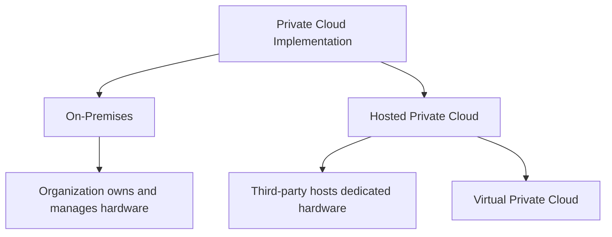
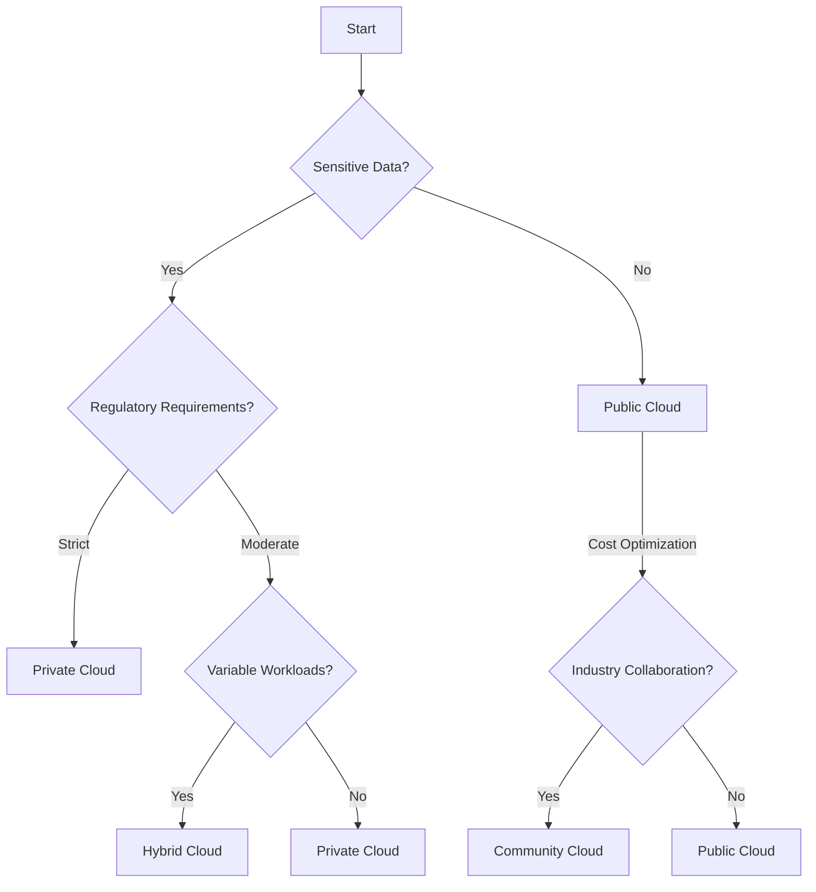

# Deployment Models in Cloud Computing

## Introduction

When organizations decide to move their infrastructure, applications, or data to the cloud, one of the first decisions they face is choosing the right deployment model. Cloud deployment models define how cloud services are made available to users, where the infrastructure is located, who manages it, and who can access it.

In this guide, we'll explore the four main cloud deployment models:
- Public Cloud
- Private Cloud
- Hybrid Cloud
- Community Cloud

Understanding these models is crucial for making informed decisions about your cloud strategy based on your specific requirements for security, cost, performance, and compliance.

## Public Cloud

### What is a Public Cloud?

A public cloud is a deployment model where computing resources are owned and operated by a third-party cloud service provider and delivered over the internet. These resources are available to the general public or a large industry group.

### Characteristics

- **Shared Infrastructure**: Resources are shared among multiple customers
- **Pay-as-you-go**: Users pay only for the resources they consume
- **Managed by Provider**: The cloud provider is responsible for all maintenance and management
- **Easily Accessible**: Services can be accessed from anywhere via the internet

### Advantages

- **Cost Efficiency**: No upfront capital expenditure for hardware
- **Scalability**: Easy to scale resources up or down based on demand
- **Reliability**: Distributed infrastructure offers high availability
- **Simplified Management**: Provider handles infrastructure maintenance

### Disadvantages

- **Limited Control**: Less control over underlying infrastructure
- **Security Concerns**: Data shares infrastructure with other organizations
- **Compliance Issues**: May not meet certain regulatory requirements

### Real-World Example

A startup company builds its entire web application on Amazon Web Services (AWS). They use:
- EC2 instances for compute
- S3 for storage
- RDS for database
- CloudFront for content delivery

This allows them to rapidly deploy their application without investing in physical hardware, and easily scale as their user base grows.

### Common Public Cloud Providers

- Amazon Web Services (AWS)
- Microsoft Azure
- Google Cloud Platform (GCP)
- IBM Cloud
- Oracle Cloud

## Private Cloud

### What is a Private Cloud?

A private cloud is a deployment model where cloud infrastructure is dedicated to a single organization. It can be hosted on-premises or by a third-party provider, but the services and infrastructure are maintained on a private network.

### Characteristics

- **Dedicated Resources**: Infrastructure used by only one organization
- **Enhanced Control**: Full control over infrastructure and security
- **Customization**: Can be tailored to meet specific business needs
- **Limited Access**: Restricted to specific users within the organization

### Advantages

- **Security**: Better data security and privacy controls
- **Compliance**: Easier to meet regulatory requirements
- **Performance**: Optimized for the organization's specific workloads
- **Control**: Greater control over hardware and software configurations

### Disadvantages

- **Higher Costs**: Requires capital expenditure and ongoing maintenance
- **Limited Scalability**: Bounded by the deployed hardware capacity
- **Resource Expertise**: Requires IT staff with cloud expertise

### Real-World Example

A financial institution develops a private cloud to host its sensitive banking applications and customer data. By maintaining a private cloud, they can:

- Implement strict security protocols
- Ensure data sovereignty and compliance with banking regulations
- Customize the infrastructure for their specific transaction processing needs
- Maintain full control over all systems and data

### Implementation Options



## Hybrid Cloud

### What is a Hybrid Cloud?

A hybrid cloud combines public and private cloud environments, allowing data and applications to be shared between them. It provides greater flexibility by allowing workloads to move between private and public clouds as computing needs and costs change.

### Characteristics

- **Integrated Environments**: Combines public and private cloud resources
- **Workload Distribution**: Allows optimal placement of workloads
- **Data Portability**: Data can move between environments
- **Unified Management**: Requires tools to manage across cloud boundaries

### Advantages

- **Flexibility**: Use private cloud for sensitive workloads and public cloud for others
- **Cost Optimization**: Balance between capital and operational expenses
- **Scalability**: Burst to public cloud when private resources are insufficient
- **Business Continuity**: Improved disaster recovery and business continuity options

### Disadvantages

- **Complexity**: More complex to set up and manage
- **Integration Challenges**: Ensuring seamless operation between environments
- **Security Concerns**: Security policies must work across cloud boundaries
- **Skills Gap**: Requires expertise in multiple cloud environments

### Real-World Example

A healthcare organization uses a hybrid cloud approach where:

- Patient data and electronic health records are stored in an on-premises private cloud to ensure HIPAA compliance
- Their public-facing website and appointment scheduling system run on a public cloud
- During high-demand periods (like flu season), they can burst additional compute capacity to the public cloud

### Code Example: Cloud Bursting Configuration

```yaml
# Example Kubernetes configuration for cloud bursting
apiVersion: v1
kind: ConfigMap
metadata:
  name: cloud-burst-config
data:
  PRIVATE_CLUSTER: "healthcare-private"
  PUBLIC_CLUSTER: "healthcare-public-azure"
  BURST_THRESHOLD: "85%"
  BURST_SERVICES: "appointment-system,patient-portal"
  SENSITIVE_SERVICES: "patient-records,billing"
```

## Community Cloud

### What is a Community Cloud?

A community cloud is a collaborative deployment model where infrastructure is shared between several organizations with common concerns such as security, compliance, or industry-specific requirements. It can be managed internally or by a third party.

### Characteristics

- **Shared Among Organizations**: Infrastructure shared by organizations with common interests
- **Collaborative**: Resources and costs shared among participants
- **Specialized**: Designed for specific industry or compliance needs
- **Semi-private**: More private than public, but shared within a community

### Advantages

- **Cost Sharing**: Infrastructure costs distributed among community members
- **Compliance**: Designed to meet industry-specific regulations
- **Collaboration**: Facilitates sharing of resources and data within the community
- **Security**: More secure than public cloud for specific community needs

### Disadvantages

- **Limited Availability**: Only available to community members
- **Shared Responsibility**: Governance can be complex with multiple stakeholders
- **Limited Scalability**: Typically smaller scale than public clouds

### Real-World Example

A group of research universities creates a community cloud for sharing research data and computing resources. This allows them to:

- Share the cost of high-performance computing infrastructure
- Collaborate on research projects more efficiently
- Ensure data security while still enabling collaboration
- Comply with academic and research-specific regulations

## Comparing Deployment Models

| Feature | Public Cloud | Private Cloud | Hybrid Cloud | Community Cloud |
|---------|-------------|--------------|--------------|-----------------|
| Cost | Pay-as-you-go | High initial investment | Balanced costs | Shared costs |
| Security | Basic | High | Customizable | Industry-specific |
| Scalability | Excellent | Limited | Good | Moderate |
| Control | Limited | High | Moderate | Shared |
| Management | Provider | Organization | Both | Community or third-party |
| Best for | General usage, variable workloads | Sensitive data, specific requirements | Varied workloads with some sensitive data | Organizations with common goals |

## Multi-Cloud Strategy

Beyond the four main deployment models, many organizations are adopting a multi-cloud strategy, where they use services from multiple cloud providers. This approach:

- Avoids vendor lock-in
- Allows using best-of-breed services from different providers
- Provides redundancy if one provider has an outage
- Can optimize costs by choosing the most cost-effective provider for each service

However, multi-cloud strategies introduce additional complexity in management, security, and integration.

## Choosing the Right Deployment Model

Selecting the appropriate cloud deployment model depends on several factors:

1. **Security Requirements**: How sensitive is your data?
2. **Regulatory Compliance**: What regulations must you adhere to?
3. **Performance Needs**: What are your latency and bandwidth requirements?
4. **Budget Constraints**: What is your available budget for cloud services?
5. **Existing Infrastructure**: What systems do you already have in place?
6. **Scalability Needs**: How much will your resource needs fluctuate?

### Decision Flow Example



## Summary

Cloud deployment models define how cloud services are provisioned, managed, and accessed. Each model offers different trade-offs in terms of cost, control, security, and scalability:

- **Public Cloud**: Offers cost-effective, scalable resources delivered over the internet
- **Private Cloud**: Provides dedicated resources with enhanced security and control
- **Hybrid Cloud**: Combines public and private clouds for optimal flexibility
- **Community Cloud**: Shares infrastructure among organizations with common interests

The right deployment model for your organization depends on your specific requirements, including security needs, regulatory compliance, performance expectations, and budget constraints.

## Exercises and Learning Activities

1. **Deployment Model Assessment**:
   Analyze your current or planned application and determine which cloud deployment model would be most suitable. Document your reasoning.

2. **Cost Comparison**:
   Create a spreadsheet comparing the estimated costs of running your application in different deployment models over a 3-year period.

3. **Hybrid Cloud Design**:
   Design a hybrid cloud architecture for a fictitious company that has both public-facing web applications and sensitive internal systems.

4. **Multi-Cloud Strategy**:
   Research and document how you would implement a multi-cloud strategy using services from two major cloud providers for a web application with a database backend.

## Additional Resources

- Cloud Security Alliance (CSA) - For best practices in cloud security
- National Institute of Standards and Technology (NIST) - For cloud computing standards
- Major cloud providers' documentation for detailed implementation guidelines
- Industry-specific compliance guides for regulated sectors (healthcare, finance, etc.)