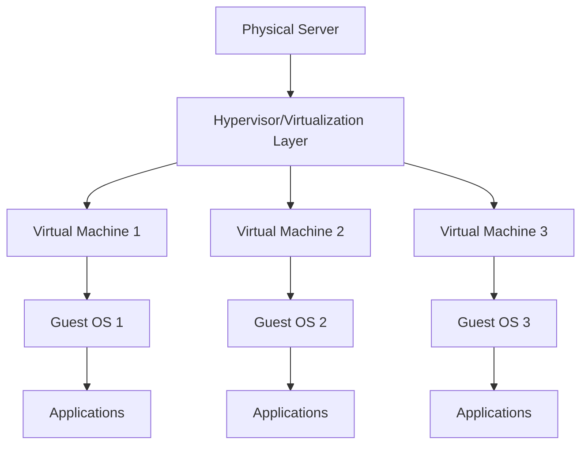
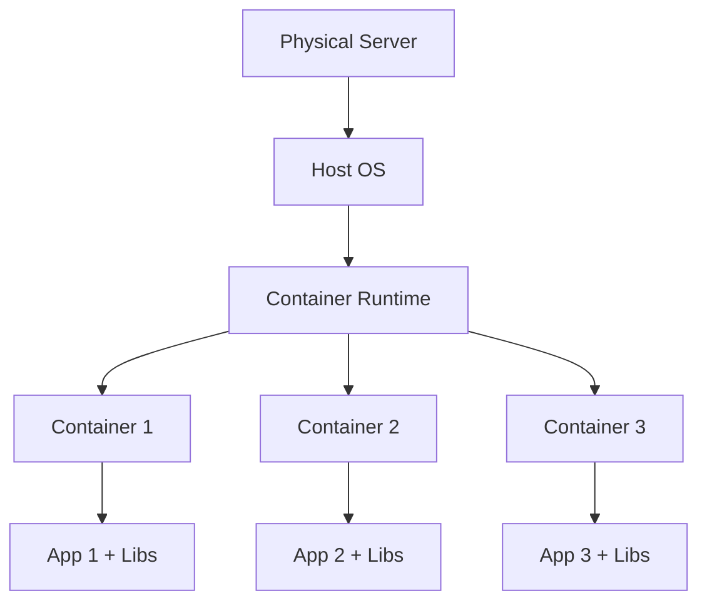

# Virtualization in Cloud

## Introduction

Virtualization is a foundational technology that powers modern cloud computing. At its core, virtualization allows multiple virtual systems to run on a single physical hardware system. This technology enables cloud providers to efficiently share computing resources among multiple users, maximize hardware utilization, and provide scalable, cost-effective services.

In this guide, we'll explore what virtualization is, how it works in cloud environments, the different types of virtualization technologies, and practical applications that demonstrate its importance.

## What is Virtualization?

Virtualization is the process of creating virtual (rather than actual) versions of computing resources such as:

- Computer hardware platforms
- Storage devices
- Network resources
- Operating systems

Through virtualization, a single physical machine can host multiple virtual machines (VMs), each functioning as if it were a separate computer with its own operating system and applications.



## How Virtualization Works

Virtualization relies on a software layer called a **hypervisor** (or Virtual Machine Monitor) that sits between the hardware and the virtual machines. The hypervisor:

1. Manages and allocates physical resources (CPU, memory, storage, network)
2. Creates and runs virtual machines
3. Ensures VMs are isolated from each other
4. Translates instructions from VMs to the physical hardware

This abstraction allows multiple operating systems to run concurrently on the same physical server without interfering with each other.

## Types of Virtualization in Cloud

### 1. Hardware Virtualization (Server Virtualization)

Hardware virtualization is the most common form, where a single physical machine hosts multiple VMs.

#### Example: Creating a VM using AWS EC2

```bash
# Using AWS CLI to launch an EC2 instance (a virtual machine in AWS cloud)
aws ec2 run-instances \
    --image-id ami-0c55b159cbfafe1f0 \
    --instance-type t2.micro \
    --key-name MyKeyPair \
    --security-group-ids sg-903004f8 \
    --subnet-id subnet-6e7f829e
```

This command creates a virtual machine in AWS with specified configurations, running on shared physical hardware.

### 2. Storage Virtualization

Storage virtualization pools physical storage from multiple devices into a single storage unit that can be centrally managed.

#### Example: Using Cloud Storage APIs

```javascript
// JavaScript example using AWS SDK to interact with virtualized storage
const AWS = require('aws-sdk');
const s3 = new AWS.S3();

// Upload a file to S3 (virtualized storage)
const uploadParams = {
  Bucket: 'my-bucket',
  Key: 'sample-file.txt',
  Body: 'Hello, this is stored in virtualized cloud storage!'
};

s3.upload(uploadParams, (err, data) => {
  if (err) {
    console.log("Error", err);
  } if (data) {
    console.log("Upload Success", data.Location);
  }
});
```

### 3. Network Virtualization

Network virtualization combines hardware and software network resources into a single, software-based virtual network.

#### Example: Creating a Virtual Network in Azure

```bash
# Azure CLI command to create a virtual network
az network vnet create \
  --resource-group MyResourceGroup \
  --name MyVNet \
  --address-prefix 10.0.0.0/16 \
  --subnet-name MySubnet \
  --subnet-prefix 10.0.0.0/24
```

### 4. Desktop Virtualization

Desktop virtualization separates the desktop environment from the physical machine, allowing users to access their desktops remotely.

### 5. Application Virtualization

Application virtualization enables applications to run in environments separate from the underlying operating system.

## Virtualization Technologies

### Hypervisors

Hypervisors come in two main types:

1. **Type 1 (Bare-metal)**: Runs directly on the host's hardware
   - Examples: VMware ESXi, Microsoft Hyper-V, Xen

2. **Type 2 (Hosted)**: Runs as an application on a conventional operating system
   - Examples: VMware Workstation, Oracle VirtualBox

### Containers

Containers are a lightweight alternative to full virtualization, sharing the host system's kernel but running in isolated user spaces.



#### Docker Example

```bash
# Pull a container image
docker pull nginx

# Run a container
docker run -d -p 8080:80 nginx

# List running containers
docker ps
```

Output:
```
CONTAINER ID   IMAGE    COMMAND                  CREATED         STATUS         PORTS                  NAMES
3f4e8da2a423   nginx    "/docker-entrypoint.…"   2 seconds ago   Up 1 second    0.0.0.0:8080->80/tcp   brave_hopper
```

## Benefits of Virtualization in Cloud Computing

1. **Resource Efficiency**: Higher utilization of physical hardware
2. **Cost Reduction**: Lower hardware and operational costs
3. **Scalability**: Easily scale resources up or down
4. **Isolation**: Applications run in isolated environments
5. **Flexibility**: Run different operating systems on the same hardware
6. **Disaster Recovery**: Simplified backup and recovery processes
7. **Testing and Development**: Create isolated environments for testing

## Practical Implementation: Setting Up a Virtual Machine

Let's walk through a basic example of creating a VM using VirtualBox (a Type 2 hypervisor):

1. **Installation**:
   Download and install VirtualBox from the official website

2. **Create a New VM**:
   ```
   VBoxManage createvm --name "MyFirstVM" --ostype "Ubuntu_64" --register
   ```

3. **Configure VM**:
   ```
   VBoxManage modifyvm "MyFirstVM" --memory 2048 --cpus 2
   ```

4. **Create a Virtual Hard Disk**:
   ```
   VBoxManage createhd --filename "MyFirstVM.vdi" --size 20000
   ```

5. **Attach the Hard Disk**:
   ```
   VBoxManage storagectl "MyFirstVM" --name "SATA Controller" --add sata
   VBoxManage storageattach "MyFirstVM" --storagectl "SATA Controller" --port 0 --device 0 --type hdd --medium "MyFirstVM.vdi"
   ```

6. **Attach Installation ISO**:
   ```
   VBoxManage storageattach "MyFirstVM" --storagectl "SATA Controller" --port 1 --device 0 --type dvddrive --medium /path/to/ubuntu.iso
   ```

7. **Start the VM**:
   ```
   VBoxManage startvm "MyFirstVM"
   ```

## Cloud Virtualization Services

Major cloud providers offer various virtualization services:

### Amazon Web Services (AWS)
- **EC2 (Elastic Compute Cloud)**: Virtual servers
- **EBS (Elastic Block Store)**: Virtualized storage
- **VPC (Virtual Private Cloud)**: Network virtualization
- **ECS/EKS**: Container orchestration

### Microsoft Azure
- **Azure Virtual Machines**: Compute virtualization
- **Azure Disk Storage**: Storage virtualization
- **Azure Virtual Network**: Network virtualization
- **Azure Kubernetes Service (AKS)**: Container orchestration

### Google Cloud Platform (GCP)
- **Compute Engine**: Virtual machines
- **Persistent Disk**: Virtualized storage
- **Cloud VPN**: Network virtualization
- **Google Kubernetes Engine (GKE)**: Container orchestration

## Virtualization vs. Containerization

While both technologies enable resource sharing, they differ in several ways:

| Feature | Virtualization | Containerization |
|---------|----------------|-----------------|
| Isolation Level | Complete isolation | Process-level isolation |
| Size | Larger (GBs) | Smaller (MBs) |
| Boot Time | Minutes | Seconds |
| Resource Overhead | Higher | Lower |
| OS | Each VM has its own OS | Shares host OS kernel |
| Use Case | Running different OS environments | Application deployment |

## Real-World Applications

### 1. Multi-tenant SaaS Applications

Cloud-based Software-as-a-Service applications use virtualization to isolate customer data and applications while sharing infrastructure.

```javascript
// Example of tenant isolation in a Node.js application
function getTenantData(req, res) {
  const tenantId = req.headers['x-tenant-id'];
  
  // Each tenant has their own isolated database connection
  const dbConnection = getDatabaseConnection(tenantId);
  
  dbConnection.query('SELECT * FROM customer_data', (err, results) => {
    if (err) {
      return res.status(500).send(err);
    }
    res.json(results);
  });
}
```

### 2. Development and Testing Environments

Developers use virtualization to create consistent environments across development, testing, and production.

```bash
# Using Vagrant (a VM management tool) to create development environments
cat > Vagrantfile << EOF
Vagrant.configure("2") do |config|
  config.vm.box = "ubuntu/bionic64"
  config.vm.network "forwarded_port", guest: 80, host: 8080
  config.vm.provision "shell", inline: <<-SHELL
    apt-get update
    apt-get install -y nginx
  SHELL
end
EOF

# Start the VM
vagrant up
```

### 3. Microservices Architecture

Containerization enables microservices to be deployed, scaled, and managed independently.

```yaml
# Example Kubernetes deployment for a microservice
apiVersion: apps/v1
kind: Deployment
metadata:
  name: payment-service
spec:
  replicas: 3
  selector:
    matchLabels:
      app: payment-service
  template:
    metadata:
      labels:
        app: payment-service
    spec:
      containers:
      - name: payment-api
        image: my-company/payment-service:v1.2
        ports:
        - containerPort: 8080
        resources:
          limits:
            cpu: "0.5"
            memory: "512Mi"
          requests:
            cpu: "0.2"
            memory: "256Mi"
```

## Challenges and Considerations

1. **Security**: Virtualization introduces new security challenges like VM escape and side-channel attacks
2. **Performance Overhead**: VMs can have performance overhead due to hypervisor layer
3. **Resource Management**: Properly allocating resources to prevent over-provisioning
4. **Compatibility**: Not all applications virtualize well
5. **Licensing**: Software licensing in virtualized environments can be complex

## Summary

Virtualization is the backbone of cloud computing, enabling efficient resource utilization, scalability, and flexibility. By abstracting physical hardware into virtual components, cloud providers can offer computing resources as services while optimizing costs and performance.

Whether through full virtual machines or lightweight containers, virtualization technologies allow organizations to build, deploy, and manage applications more efficiently than ever before.

As you continue your cloud computing journey, understanding virtualization concepts will help you make informed decisions about architecture, deployment, and resource management in the cloud.

## Practice Exercises

1. Set up a personal virtualization environment using VirtualBox or VMware
2. Create and run a Docker container with a simple web application
3. Compare the performance of a native application versus one running in a container
4. Design a simple cloud architecture that uses virtualization for a web application
5. Research how a specific cloud provider implements virtualization for their services

## Additional Resources

- [Official Docker Documentation](https://docs.docker.com/)
- [Kubernetes Learning Resources](https://kubernetes.io/docs/tutorials/)
- [AWS Virtualization Documentation](https://aws.amazon.com/what-is/virtualization/)
- [Microsoft Virtualization Blog](https://techcommunity.microsoft.com/t5/virtualization/bg-p/Virtualization)
- Online courses on cloud computing and virtualization from platforms like Coursera, Udemy, and edX