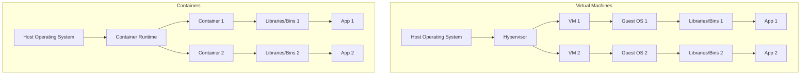
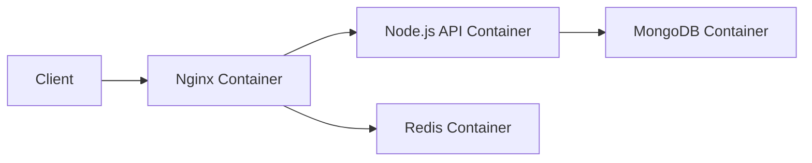

# Container Technology

## Introduction

Container technology has revolutionized how we develop, deploy, and manage applications in the cloud. Containers provide a lightweight, portable, and consistent environment for applications to run across different computing environments - from a developer's laptop to production servers.

Unlike traditional virtual machines that virtualize an entire operating system, containers virtualize at the application level, sharing the host system's kernel while maintaining isolation. This makes them faster to start, more resource-efficient, and perfectly suited for modern cloud-native applications.

In this guide, we'll explore container technology fundamentals, learn how to work with Docker (the most popular containerization platform), and understand how containers fit into the broader cloud computing ecosystem.

## What Are Containers?

Containers are lightweight, standalone, executable software packages that include everything needed to run an application:

- Code
- Runtime
- System tools
- System libraries
- Settings

By containerizing an application and its dependencies, you ensure it will run consistently regardless of the host environment.

### Containers vs. Virtual Machines

To understand containers better, let's compare them with traditional virtual machines:



Key differences:

| Containers | Virtual Machines |
|------------|------------------|
| Share the host OS kernel | Run a complete OS with its own kernel |
| Lightweight (MBs in size) | Heavyweight (GBs in size) |
| Start in seconds | Start in minutes |
| Less resource intensive | More resource intensive |
| Less isolated | More isolated |

## Container Fundamentals

### Container Images

A container image is a lightweight, standalone, executable package that includes everything needed to run an application. Think of it as a blueprint or template for creating containers.

Images are:
- **Immutable**: Once built, they don't change
- **Layered**: Built in layers to optimize storage and transfer
- **Shareable**: Can be stored in registries and pulled by others

### Container Registries

Container registries are repositories for storing and distributing container images. Popular registries include:

- Docker Hub (public)
- Google Container Registry
- Amazon Elastic Container Registry
- Azure Container Registry

### Container Lifecycle

The basic lifecycle of a container includes:

1. **Build**: Create a container image from a definition file
2. **Ship**: Push the image to a registry
3. **Run**: Pull the image and create a running container instance

## Getting Started with Docker

[Docker](https://www.docker.com/) is the most popular container platform. Let's see how to use it.

### Installing Docker

For most systems, you can follow the official installation guide:
- [Docker Desktop for Windows/Mac](https://www.docker.com/products/docker-desktop)
- [Docker Engine for Linux](https://docs.docker.com/engine/install/)

### Basic Docker Commands

Here are some essential Docker commands to get you started:

**Pull an image from Docker Hub:**

```bash
docker pull nginx
```

Output:
```
Using default tag: latest
latest: Pulling from library/nginx
a2abf6c4d29d: Pull complete
a9edb18cadd1: Pull complete
589b7251471a: Pull complete
186b1aaa4aa6: Pull complete
b4df32aa5a72: Pull complete
a0bcbecc962e: Pull complete
Digest: sha256:0d17b565c37bcbd895e9d92315a05c1c3c9a29f762b011a10c54a66cd53c9b31
Status: Downloaded newer image for nginx:latest
docker.io/library/nginx:latest
```

**List all images:**

```bash
docker images
```

Output:
```
REPOSITORY    TAG       IMAGE ID       CREATED        SIZE
nginx         latest    605c77e624dd   3 days ago     141MB
python        3.9       826f4f1d2aae   5 days ago     915MB
```

**Run a container:**

```bash
docker run -d -p 8080:80 --name my-nginx nginx
```

Output:
```
3a4e5f6d7c8b9a0b1c2d3e4f5a6b7c8d9e0f1a2b3c4d5e6f7a8b9c0d1e2f3
```

**List running containers:**

```bash
docker ps
```

Output:
```
CONTAINER ID   IMAGE     COMMAND                  CREATED         STATUS         PORTS                  NAMES
3a4e5f6d7c8b   nginx     "/docker-entrypoint.…"   2 minutes ago   Up 2 minutes   0.0.0.0:8080->80/tcp   my-nginx
```

**Stop a container:**

```bash
docker stop my-nginx
```

Output:
```
my-nginx
```

**Remove a container:**

```bash
docker rm my-nginx
```

Output:
```
my-nginx
```

## Creating Your First Dockerfile

A Dockerfile is a text file that contains instructions on how to build a Docker image.

Let's create a simple Dockerfile for a Python web application:

```dockerfile
# Use an official Python runtime as the base image
FROM python:3.9-slim

# Set the working directory in the container
WORKDIR /app

# Copy the requirements file into the container
COPY requirements.txt .

# Install dependencies
RUN pip install --no-cache-dir -r requirements.txt

# Copy the application code into the container
COPY app.py .

# Expose port 5000
EXPOSE 5000

# Define the command to run the application
CMD ["python", "app.py"]
```

For this example, let's assume you have:

**requirements.txt**:
```
flask==2.0.1
```

**app.py**:
```python
from flask import Flask

app = Flask(__name__)

@app.route('/')
def hello():
    return 'Hello, Docker World!'

if __name__ == '__main__':
    app.run(host='0.0.0.0', port=5000)
```

### Building and Running Your Image

To build the image:

```bash
docker build -t my-python-app .
```

Output:
```
Sending build context to Docker daemon  3.072kB
Step 1/7 : FROM python:3.9-slim
 ---> 2b6b61960974
Step 2/7 : WORKDIR /app
 ---> Using cache
 ---> 8d7e9f6e5a2b
Step 3/7 : COPY requirements.txt .
 ---> Using cache
 ---> 3c1d9f7b2a4e
Step 4/7 : RUN pip install --no-cache-dir -r requirements.txt
 ---> Using cache
 ---> 5a6b7c8d9e0f
Step 5/7 : COPY app.py .
 ---> Using cache
 ---> 1a2b3c4d5e6f
Step 6/7 : EXPOSE 5000
 ---> Using cache
 ---> 7a8b9c0d1e2f
Step 7/7 : CMD ["python", "app.py"]
 ---> Using cache
 ---> 3e4f5a6b7c8d
Successfully built 3e4f5a6b7c8d
Successfully tagged my-python-app:latest
```

To run the container:

```bash
docker run -d -p 5000:5000 --name my-app my-python-app
```

Output:
```
9a8b7c6d5e4f3a2b1c0d9e8f7a6b5c4d3e2f1a0b
```

Now you can access your application at http://localhost:5000.

## Docker Compose for Multi-Container Applications

Most real-world applications consist of multiple services. Docker Compose helps manage multi-container applications.

### Example: Web App with Database

Create a `docker-compose.yml` file:

```yaml
version: '3'

services:
  web:
    build: .
    ports:
      - "5000:5000"
    depends_on:
      - db
    environment:
      - DATABASE_URL=postgresql://postgres:password@db:5432/mydatabase

  db:
    image: postgres:13
    volumes:
      - postgres_data:/var/lib/postgresql/data
    environment:
      - POSTGRES_PASSWORD=password
      - POSTGRES_DB=mydatabase

volumes:
  postgres_data:
```

Run with:

```bash
docker-compose up -d
```

Output:
```
Creating network "myapp_default" with the default driver
Creating volume "myapp_postgres_data" with default driver
Creating myapp_db_1  ... done
Creating myapp_web_1 ... done
```

## Container Orchestration

For production environments, you'll need container orchestration to manage containers at scale. Popular orchestration platforms include:

- **Kubernetes**: The industry standard for container orchestration
- **Docker Swarm**: Docker's native clustering and scheduling tool
- **Amazon ECS**: Amazon's container orchestration service

Kubernetes manages containers across multiple hosts and provides:
- Automated deployment and scaling
- Load balancing
- Self-healing (restarts failed containers)
- Service discovery
- Storage orchestration

## Microservices Architecture

Containers pair perfectly with microservices architecture, where applications are built as a collection of loosely coupled services.

Benefits of microservices with containers:
- Independent deployment of services
- Technology diversity (different languages/frameworks per service)
- Resilience (failure in one service doesn't bring down the entire application)
- Scalability (scale individual services based on demand)

## Best Practices for Containerization

1. **Keep containers small**: Use minimal base images
2. **One concern per container**: Each container should run a single process
3. **Make containers immutable**: Don't modify running containers
4. **Use volume mounts for persistent data**: Containers themselves are ephemeral
5. **Implement health checks**: Ensure your application is truly running
6. **Don't run containers as root**: Use least privilege principle
7. **Use environment variables for configuration**: Don't hardcode configuration
8. **Tag images properly**: Don't rely on the `latest` tag in production

## Real-World Example: Containerized Blog Application

Let's examine a real-world example of containerizing a three-tier blog application:



Each component runs in its own container:
- **Nginx**: Serves static content and routes API requests
- **Node.js**: Handles application logic
- **MongoDB**: Stores blog posts and user data
- **Redis**: Caches frequently accessed data

This architecture allows each component to be developed, deployed, and scaled independently.

## Summary

Container technology has transformed how we build and deploy applications by providing a consistent environment from development to production. Key takeaways:

- Containers are lightweight, portable, and consistent environments for applications
- Docker is the most popular containerization platform
- Containers are perfect for microservices architecture
- Container orchestration platforms like Kubernetes help manage containers at scale
- Proper containerization follows specific best practices

## Exercises for Practice

1. Install Docker on your local machine
2. Containerize a simple web application using a Dockerfile
3. Create a multi-container application using Docker Compose
4. Push an image to Docker Hub
5. Explore Kubernetes basics by deploying your containerized application

## Additional Resources

- [Docker Documentation](https://docs.docker.com/)
- [Kubernetes Documentation](https://kubernetes.io/docs/home/)
- [The Docker Book](https://www.dockerbook.com/)
- [Container Security Best Practices](https://sysdig.com/blog/container-security-best-practices/)
- [Docker and Kubernetes: The Complete Guide](https://www.udemy.com/course/docker-and-kubernetes-the-complete-guide/)