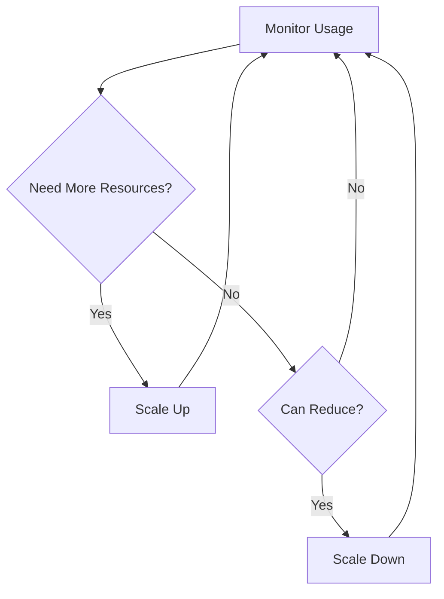

# Resource Allocation in Cloud Computing

## Introduction

Resource allocation is a fundamental concept in cloud computing that refers to how computing resources (such as CPU, memory, storage, and network bandwidth) are distributed among applications and users. Efficient resource allocation ensures that applications have the resources they need to run smoothly while minimizing waste and reducing costs.

In traditional on-premises environments, organizations had to purchase and maintain hardware based on peak demand forecasts, often leading to underutilized resources. Cloud computing revolutionizes this approach by allowing dynamic allocation of resources based on actual needs, enabling greater flexibility and cost-efficiency.

## Why Resource Allocation Matters

Resource allocation directly impacts:

- **Performance**: Properly allocated resources ensure applications run smoothly
- **Cost efficiency**: Optimized allocation prevents wasting money on unused resources
- **Scalability**: Effective allocation strategies allow applications to scale up or down as needed
- **Reliability**: Appropriate resource distribution prevents system failures due to resource exhaustion

## Types of Resource Allocation Models

Cloud providers typically offer several resource allocation models:

### Static Allocation

Static allocation involves provisioning a fixed amount of resources for a specific duration. This model is suitable for workloads with predictable resource requirements.


**Example**: Deploying a web server with 2 CPU cores and 4GB RAM for a month.

### Dynamic Allocation

Dynamic allocation adjusts resources based on changing demands. This model works well for applications with variable workloads.



**Example**: An e-commerce website that automatically scales during sales events and scales down during off-peak hours.

### On-Demand Allocation

Resources are provisioned when requested and released when no longer needed, with billing based on actual usage.

**Example**: Running data analysis jobs that process data in batches and release resources afterward.

## Resource Allocation Strategies

### 1. First-Come, First-Served (FCFS)

Resources are allocated to requests in the order they arrive.

```javascript
function fcfsAllocation(requests, availableResources) {
  const allocations = [];
  
  for (const request of requests) {
    if (request.resourceNeeded <= availableResources) {
      // Allocate resources to this request
      allocations.push({
        requestId: request.id,
        resourceAllocated: request.resourceNeeded
      });
      
      // Update available resources
      availableResources -= request.resourceNeeded;
    } else {
      // Not enough resources for this request
      allocations.push({
        requestId: request.id,
        resourceAllocated: 0,
        status: 'insufficient resources'
      });
    }
  }
  
  return allocations;
}
```

**Pros**: Simple to implement, fair in terms of arrival order  
**Cons**: Can lead to resource fragmentation, doesn't consider priority

### 2. Priority-Based Allocation

Resources are allocated based on request priority.

```python
def priority_allocation(requests, available_resources):
    # Sort requests by priority (higher number = higher priority)
    sorted_requests = sorted(requests, key=lambda x: x['priority'], reverse=True)
    
    allocations = []
    
    for request in sorted_requests:
        if request['resource_needed'] <= available_resources:
            # Allocate resources to this request
            allocations.append({
                'request_id': request['id'],
                'resource_allocated': request['resource_needed'],
                'status': 'allocated'
            })
            
            # Update available resources
            available_resources -= request['resource_needed']
        else:
            # Not enough resources for this request
            allocations.append({
                'request_id': request['id'],
                'resource_allocated': 0,
                'status': 'waiting'
            })
    
    return allocations
```

**Input Example**:
```python
requests = [
    {'id': 'req1', 'resource_needed': 10, 'priority': 2},
    {'id': 'req2', 'resource_needed': 5, 'priority': 5},
    {'id': 'req3', 'resource_needed': 8, 'priority': 3}
]
available_resources = 15
```

**Output Example**:
```python
[
    {'request_id': 'req2', 'resource_allocated': 5, 'status': 'allocated'},
    {'request_id': 'req3', 'resource_allocated': 8, 'status': 'allocated'},
    {'request_id': 'req1', 'resource_allocated': 0, 'status': 'waiting'}
]
```

**Pros**: Ensures critical tasks get resources first  
**Cons**: Can lead to starvation of low-priority requests

### 3. Proportional Allocation

Resources are allocated proportionally to each request based on availability.

```python
def proportional_allocation(requests, available_resources):
    # Calculate total requested resources
    total_requested = sum(req['resource_needed'] for req in requests)
    
    # If we have enough resources for everyone
    if total_requested <= available_resources:
        return [{
            'request_id': req['id'],
            'resource_allocated': req['resource_needed'],
            'status': 'fully allocated'
        } for req in requests]
    
    # Otherwise, allocate proportionally
    allocations = []
    for request in requests:
        # Calculate proportion
        proportion = request['resource_needed'] / total_requested
        allocated = round(proportion * available_resources)
        
        allocations.append({
            'request_id': request['id'],
            'resource_allocated': allocated,
            'status': 'partially allocated'
        })
    
    return allocations
```

**Pros**: Fair distribution based on request size  
**Cons**: May not provide enough resources for any single task to complete successfully

## Real-World Cloud Resource Allocation Examples

### Example 1: Auto-scaling Web Application

Let's look at how AWS implements auto-scaling for resource allocation:

```yaml
AWSTemplateFormatVersion: '2010-09-09'
Resources:
  WebServerGroup:
    Type: AWS::AutoScaling::AutoScalingGroup
    Properties:
      AvailabilityZones:
        - us-east-1a
        - us-east-1b
      LaunchConfigurationName: !Ref LaunchConfig
      MinSize: '1'
      MaxSize: '5'
      DesiredCapacity: '2'
      # Scale up when CPU utilization is above 70%
      ScalingPolicies:
        - Name: ScaleUpPolicy
          AdjustmentType: ChangeInCapacity
          ScalingAdjustment: 1
          Cooldown: 60
```

This configuration:
- Sets minimum and maximum instance limits
- Starts with 2 instances
- Automatically adds more instances when CPU utilization exceeds 70%
- Distributes instances across multiple availability zones for reliability

### Example 2: Kubernetes Resource Allocation

Kubernetes uses resource requests and limits to allocate resources to containers:

```yaml
apiVersion: v1
kind: Pod
metadata:
  name: frontend
spec:
  containers:
  - name: app
    image: nginx
    resources:
      requests:
        memory: "64Mi"
        cpu: "250m"
      limits:
        memory: "128Mi"
        cpu: "500m"
```

In this example:
- The container requests a minimum of 64MB RAM and 0.25 CPU cores
- The container is limited to using a maximum of 128MB RAM and 0.5 CPU cores
- Kubernetes scheduler uses the requests to decide which node to place the pod on
- The limits ensure the container doesn't consume excessive resources

## Common Resource Allocation Challenges

### 1. Resource Contention

When multiple applications compete for the same resources, performance can suffer.

**Solution**: Implement resource isolation using containerization or virtualization technologies.

### 2. Over-provisioning

Allocating more resources than necessary leads to waste and increased costs.

**Solution**: Use monitoring tools to track actual usage and adjust allocations accordingly.

### 3. Under-provisioning

Not allocating enough resources can lead to performance issues or service outages.

**Solution**: Implement proper load testing and set up auto-scaling to handle unexpected demand spikes.

### 4. Resource Fragmentation

When resources become scattered across the infrastructure, it can be difficult to allocate larger chunks.

**Solution**: Implement defragmentation strategies or use resource consolidation techniques.

## Best Practices for Resource Allocation

1. **Start small and scale up**: Begin with minimal resources and increase as needed
2. **Monitor constantly**: Track resource usage to identify optimization opportunities
3. **Use auto-scaling**: Implement automatic scaling based on demand
4. **Set appropriate thresholds**: Define clear scaling triggers based on metrics like CPU, memory, and request rates
5. **Implement resource quotas**: Set limits to prevent any single application from consuming all resources
6. **Consider time-of-day patterns**: Allocate resources based on predictable usage patterns
7. **Use spot/preemptible instances**: Take advantage of lower-cost resources for non-critical workloads
8. **Implement graceful degradation**: Design systems to function with reduced resources when necessary

## Implementing Basic Resource Allocation in Node.js

Here's a simple example of a resource allocation service in Node.js:

```javascript
class ResourceAllocator {
  constructor(totalCpu, totalMemory) {
    this.totalCpu = totalCpu;
    this.totalMemory = totalMemory;
    this.availableCpu = totalCpu;
    this.availableMemory = totalMemory;
    this.allocations = {};
  }

  allocate(serviceId, requestedCpu, requestedMemory) {
    // Check if we have enough resources
    if (requestedCpu > this.availableCpu || requestedMemory > this.availableMemory) {
      return {
        success: false,
        message: 'Insufficient resources available'
      };
    }

    // Allocate resources
    this.availableCpu -= requestedCpu;
    this.availableMemory -= requestedMemory;
    
    // Store allocation
    this.allocations[serviceId] = {
      cpu: requestedCpu,
      memory: requestedMemory,
      timestamp: Date.now()
    };

    return {
      success: true,
      allocation: this.allocations[serviceId]
    };
  }

  release(serviceId) {
    if (!this.allocations[serviceId]) {
      return {
        success: false,
        message: 'No allocation found for this service'
      };
    }

    // Return resources to available pool
    this.availableCpu += this.allocations[serviceId].cpu;
    this.availableMemory += this.allocations[serviceId].memory;

    // Remove allocation record
    const released = this.allocations[serviceId];
    delete this.allocations[serviceId];

    return {
      success: true,
      released
    };
  }

  getStatus() {
    return {
      total: {
        cpu: this.totalCpu,
        memory: this.totalMemory
      },
      available: {
        cpu: this.availableCpu,
        memory: this.availableMemory
      },
      utilization: {
        cpu: ((this.totalCpu - this.availableCpu) / this.totalCpu * 100).toFixed(2) + '%',
        memory: ((this.totalMemory - this.availableMemory) / this.totalMemory * 100).toFixed(2) + '%'
      },
      allocations: this.allocations
    };
  }
}

// Example usage
const allocator = new ResourceAllocator(8, 16384); // 8 CPUs, 16GB RAM

// Allocate resources for a web server
const webServerAllocation = allocator.allocate('web-server', 2, 4096);
console.log('Web server allocation:', webServerAllocation);

// Allocate resources for a database
const dbAllocation = allocator.allocate('database', 4, 8192);
console.log('Database allocation:', dbAllocation);

// Check status
console.log('Current status:', allocator.getStatus());

// Release web server resources
console.log('Releasing web server:', allocator.release('web-server'));

// Check status again
console.log('Updated status:', allocator.getStatus());
```

**Output**:
```
Web server allocation: {
  success: true,
  allocation: { cpu: 2, memory: 4096, timestamp: 1647356822123 }
}
Database allocation: {
  success: true,
  allocation: { cpu: 4, memory: 8192, timestamp: 1647356822124 }
}
Current status: {
  total: { cpu: 8, memory: 16384 },
  available: { cpu: 2, memory: 4096 },
  utilization: { cpu: '75.00%', memory: '75.00%' },
  allocations: {
    'web-server': { cpu: 2, memory: 4096, timestamp: 1647356822123 },
    'database': { cpu: 4, memory: 8192, timestamp: 1647356822124 }
  }
}
Releasing web server: {
  success: true,
  released: { cpu: 2, memory: 4096, timestamp: 1647356822123 }
}
Updated status: {
  total: { cpu: 8, memory: 16384 },
  available: { cpu: 4, memory: 8192 },
  utilization: { cpu: '50.00%', memory: '50.00%' },
  allocations: {
    'database': { cpu: 4, memory: 8192, timestamp: 1647356822124 }
  }
}
```

## Summary

Resource allocation is a critical aspect of cloud computing that determines how computing resources are distributed among applications and services. Efficient allocation strategies ensure optimal performance, cost savings, and scalability.

Key takeaways:

1. Cloud computing enables dynamic resource allocation based on actual needs
2. Different allocation models (static, dynamic, on-demand) suit different use cases
3. Allocation strategies include FCFS, priority-based, and proportional allocation
4. Challenges include contention, over/under-provisioning, and fragmentation
5. Best practices include starting small, constant monitoring, and using auto-scaling
6. Implementing resource allocation requires tracking available resources and managing allocations effectively

## Exercises

1. Design a resource allocation system for a multi-tenant SaaS application that ensures fair distribution of resources among customers.
2. Create a simple auto-scaling implementation that adjusts resources based on CPU utilization.
3. Implement a priority queue for resource allocation requests where higher-priority customers get resources first.
4. Analyze a real-world application and propose an optimal resource allocation strategy based on its usage patterns.
5. Extend the Node.js ResourceAllocator example to include timeout-based automatic resource release.

## Additional Resources

- Cloud provider documentation:
  - AWS Auto Scaling
  - Azure Autoscale
  - Google Cloud Autoscaler
- Kubernetes documentation on resource management
- Books on cloud architecture and resource optimization
- Online courses on cloud resource management

Armed with these concepts and best practices, you'll be well-equipped to implement efficient resource allocation strategies in your cloud applications, ensuring optimal performance while controlling costs.