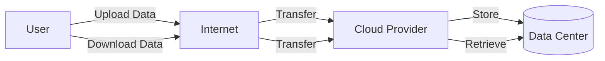

# Cloud Storage

## Introduction

Cloud storage is a fundamental component of cloud computing that allows you to store, access, and manage data over the internet instead of your local computer's hard drive. It provides a scalable, reliable, and cost-effective solution for storing and retrieving data remotely through cloud-based service providers.

Think of cloud storage as a virtual hard drive that you can access from anywhere with an internet connection. Unlike traditional storage devices that have physical limitations, cloud storage can scale dynamically based on your needs without requiring you to purchase additional hardware.

## How Cloud Storage Works

At its core, cloud storage works by storing your data on remote servers maintained by a cloud service provider. These servers are housed in data centers distributed across various geographical locations.



When you upload a file to cloud storage:

1. Your data is sent over the internet to the cloud provider's servers
2. The provider stores multiple copies across different locations for redundancy
3. You receive access credentials to retrieve the data when needed
4. The provider manages maintenance, security, and availability

## Types of Cloud Storage

Cloud storage comes in various forms, each designed for specific use cases:

### Object Storage

Object storage treats data as distinct units or objects, each with a unique identifier and metadata. This type is ideal for unstructured data like images, videos, and documents.

**Key Features:**
- Highly scalable (virtually unlimited storage capacity)
- HTTP-based access via APIs
- Flat address space (no folder hierarchy)
- Rich metadata capabilities

**Example Use Cases:**
- Storing website assets (images, videos)
- Backing up large datasets
- Content distribution
- Archiving data

### Block Storage

Block storage divides data into fixed-sized blocks, each with a unique address. It's similar to traditional hard drives and is ideal for applications that need low-latency access to storage.

**Key Features:**
- Low latency 
- High performance
- Ability to format with file systems
- Can be attached to one server at a time (typically)

**Example Use Cases:**
- Databases
- Enterprise applications
- Virtual machines storage
- High-performance computing

### File Storage

File storage organizes data in a hierarchical file system with folders and subfolders, similar to how you organize files on your computer.

**Key Features:**
- Familiar organization (directories and files)
- Easy to navigate and understand
- Support for file-locking and sharing
- Standard protocols (NFS, SMB)

**Example Use Cases:**
- Shared documents
- Content management systems
- Development environments
- Home directories

## Popular Cloud Storage Services

Let's look at some major cloud storage services offered by leading providers:

### Amazon Web Services (AWS)

- **Amazon S3 (Simple Storage Service)**: Object storage service
- **Amazon EBS (Elastic Block Store)**: Block storage for EC2 instances
- **Amazon EFS (Elastic File System)**: Managed file storage service

### Microsoft Azure

- **Azure Blob Storage**: Object storage solution
- **Azure Disk Storage**: Block storage for Azure VMs
- **Azure Files**: Managed file shares

### Google Cloud Platform (GCP)

- **Cloud Storage**: Object storage service
- **Persistent Disk**: Block storage for virtual machines
- **Filestore**: Managed file storage service

## Practical Implementation

Let's explore how to use cloud storage in practical scenarios. We'll focus on AWS S3 as an example:

### Setting Up AWS S3 Storage with Node.js

First, you need to install the AWS SDK:

```bash
npm install aws-sdk
```

Here's a simple example of uploading a file to S3:

```javascript
// Import required AWS SDK components
const AWS = require('aws-sdk');

// Configure AWS credentials
AWS.config.update({
  accessKeyId: 'YOUR_ACCESS_KEY',
  secretAccessKey: 'YOUR_SECRET_KEY',
  region: 'us-east-1'
});

// Create S3 service object
const s3 = new AWS.S3();

// Parameters for file upload
const uploadParams = {
  Bucket: 'my-example-bucket',
  Key: 'example-file.txt',
  Body: 'This is the content of my file.'
};

// Upload file to S3
s3.upload(uploadParams, function(err, data) {
  if (err) {
    console.log("Error", err);
  } if (data) {
    console.log("Upload Success", data.Location);
  }
});
```

**Output:**
```
Upload Success https://my-example-bucket.s3.amazonaws.com/example-file.txt
```

To download a file from S3:

```javascript
const AWS = require('aws-sdk');

// Configure AWS credentials
AWS.config.update({
  accessKeyId: 'YOUR_ACCESS_KEY',
  secretAccessKey: 'YOUR_SECRET_KEY',
  region: 'us-east-1'
});

// Create S3 service object
const s3 = new AWS.S3();

// Parameters for file download
const downloadParams = {
  Bucket: 'my-example-bucket',
  Key: 'example-file.txt'
};

// Download file from S3
s3.getObject(downloadParams, function(err, data) {
  if (err) {
    console.log("Error", err);
  } else {
    console.log("Success", data.Body.toString());
  }
});
```

**Output:**
```
Success This is the content of my file.
```

## Key Concepts in Cloud Storage

### Data Durability and Availability

Cloud storage providers typically guarantee high durability (99.999999999% or "11 nines") which means your data is extremely unlikely to be lost. Availability refers to how accessible your data is and is usually guaranteed at 99.9% to 99.99%, allowing for occasional maintenance or outages.

### Storage Classes/Tiers

Most cloud providers offer different storage tiers with varying costs and access characteristics:

- **Hot storage**: For frequently accessed data, higher cost but immediate access
- **Cool storage**: For less frequently accessed data, lower cost but potentially higher access fees
- **Cold storage**: For rarely accessed data (archives), very low storage cost but higher retrieval fees and longer retrieval times

### Security Features

Cloud storage includes several security mechanisms:

- **Encryption**: Data encryption at rest and in transit
- **Access Controls**: IAM (Identity and Access Management) policies
- **Audit logging**: Tracking who accessed what and when
- **Compliance certifications**: Many providers offer compliance with standards like HIPAA, PCI DSS, etc.

## Best Practices for Using Cloud Storage

1. **Implement proper security measures**
   - Use strong access controls
   - Enable encryption for sensitive data
   - Regularly rotate access keys

2. **Optimize for cost efficiency**
   - Choose appropriate storage tiers based on access patterns
   - Set up lifecycle policies to automatically move older data to cheaper tiers
   - Delete unnecessary data

3. **Plan for data backup and recovery**
   - Implement versioning where available
   - Set up cross-region replication for critical data
   - Test your recovery procedures regularly

4. **Monitor usage and performance**
   - Set up alerts for unusual access patterns
   - Track costs and usage metrics
   - Monitor performance for your applications

## Real-World Applications

### Case Study 1: Content Delivery Website

A website that delivers videos to users worldwide can use cloud storage to:
- Store original video files in standard storage
- Generate and store multiple resolution versions
- Distribute content via Content Delivery Networks (CDNs)
- Implement access controls for premium content

### Case Study 2: Mobile App with User-Generated Content

A mobile application that allows users to upload photos can:
- Store photos in object storage
- Generate and store thumbnails automatically
- Implement direct upload from mobile devices
- Set up automated backup and recovery

```javascript
// Example of generating a pre-signed URL for direct mobile uploads
const AWS = require('aws-sdk');
const s3 = new AWS.S3();

// Function to generate a pre-signed URL
function getPresignedUploadUrl(filename, contentType) {
  const params = {
    Bucket: 'user-generated-content',
    Key: `uploads/${Date.now()}-${filename}`,
    ContentType: contentType,
    Expires: 300 // URL expires in 5 minutes
  };
  
  return s3.getSignedUrl('putObject', params);
}

// Example usage
const uploadUrl = getPresignedUploadUrl('profile-pic.jpg', 'image/jpeg');
console.log(`Upload your file directly to: ${uploadUrl}`);
```

### Case Study 3: Data Analytics Pipeline

A data analytics system can use cloud storage to:
- Collect raw data in object storage
- Process data using serverless functions
- Store processed results in optimized formats
- Provide secure access to analytics dashboards

## Summary

Cloud storage is a versatile and essential component of modern computing infrastructure. It offers scalable, reliable, and cost-effective storage solutions for a wide range of applications. By understanding the different types of cloud storage, their characteristics, and best practices for implementation, you can leverage these services to build robust and efficient applications.

Key takeaways:
- Cloud storage comes in three main types: object, block, and file storage
- Each storage type has specific use cases and performance characteristics
- Major cloud providers offer various storage services with different features and pricing models
- Proper security, cost optimization, and backup strategies are essential
- Real-world applications can combine different storage types for optimal performance

## Exercises

1. Create a simple web application that allows users to upload files to AWS S3 or another cloud storage provider.
2. Implement a lifecycle policy that automatically moves files older than 30 days to a cheaper storage tier.
3. Build a backup solution that regularly copies important data to a different region.
4. Create a secure sharing mechanism that generates time-limited access links to private files.
5. Compare the costs and performance of different storage options for a specific use case.

## Additional Resources

- Cloud provider documentation:
  - [AWS S3 Documentation](https://docs.aws.amazon.com/s3/)
  - [Azure Storage Documentation](https://docs.microsoft.com/azure/storage/)
  - [Google Cloud Storage Documentation](https://cloud.google.com/storage/docs)

- Online courses and tutorials on cloud computing fundamentals
- Practice labs from cloud providers' free tier offerings
- Open-source tools for managing cloud storage