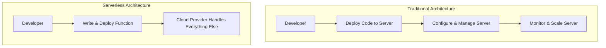
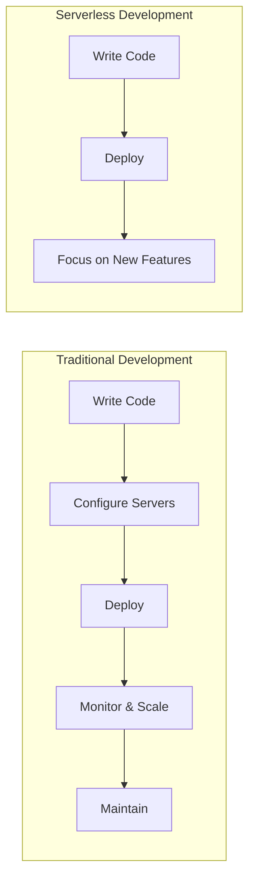

# Serverless Computing

## Introduction

Serverless computing is a cloud computing execution model where the cloud provider dynamically manages the allocation and provisioning of servers. A serverless application runs in stateless compute containers that are event-triggered, ephemeral (may last for only one invocation), and fully managed by the cloud provider.

Despite the name, servers are still involved in serverless computing. The term "serverless" refers to the fact that developers don't need to worry about server management, infrastructure maintenance, or scaling concerns. This allows them to focus entirely on writing code that serves their business needs.

## What is Serverless Computing?

Serverless computing (or simply serverless) is a cloud execution model with the following key characteristics:

1. **No server management**: Developers don't need to provision, maintain, or administer servers.
2. **Pay-per-use pricing**: You only pay for the exact amount of resources consumed by your application.
3. **Auto-scaling**: The platform automatically scales based on the traffic your application receives.
4. **Event-driven**: Functions are triggered by specific events (HTTP requests, database changes, file uploads, etc.).

Let's visualize the difference between traditional and serverless approaches:



## Serverless Computing Models

There are several models for serverless computing:

### 1. Function as a Service (FaaS)

FaaS is the most common serverless computing model. In this approach:

- Code is deployed as individual functions
- Functions are executed in response to events
- The execution environment is ephemeral (created for a single invocation)
- Popular FaaS platforms include AWS Lambda, Azure Functions, and Google Cloud Functions

### 2. Backend as a Service (BaaS)

BaaS provides pre-built backend services like:

- Authentication (Auth0, Firebase Auth)
- Databases (Firebase Realtime Database, AWS AppSync)
- Storage (Amazon S3, Google Cloud Storage)
- Third-party API integrations

### 3. Container as a Service (CaaS)

CaaS combines containers with serverless principles:

- Deploy containerized applications
- Container orchestration is managed by the provider
- Examples include AWS Fargate and Google Cloud Run

## Key Benefits of Serverless Computing

### 1. Reduced Operational Costs

With serverless computing, you only pay for what you use. There are no costs for idle resources:

```javascript
// Traditional Server Costs
const traditionalCost = {
  serverRunningCost: "$100/month",
  utilizationPercentage: "20%",
  effectiveCost: "$100/month (regardless of usage)"
};

// Serverless Costs
const serverlessCost = {
  invocationCost: "$0.0000002/request",
  numberOfRequests: "1,000,000/month",
  effectiveCost: "$0.20/month (exact usage)"
};
```

### 2. Automatic Scaling

Serverless platforms automatically scale to match your workload, without any manual intervention:

```javascript
// Traditional scaling requires manual configuration
const traditionalScaling = async () => {
  // Monitor server load
  const currentLoad = await monitorServerLoad();
  
  if (currentLoad > 80) {
    // Provision new server (takes minutes)
    await provisionNewServer();
    await configureServer();
    await deployApplication();
  }
};

// Serverless scaling happens automatically
const serverlessScaling = () => {
  // Nothing to do here! The platform handles it
  return "Automatically scales from 0 to thousands of concurrent executions";
};
```

### 3. Faster Time to Market

Developers can focus on writing code rather than managing infrastructure:



### 4. Built-in High Availability and Fault Tolerance

Most serverless platforms automatically distribute your application across multiple availability zones.

## Practical Implementation: AWS Lambda

Let's build a simple serverless API that returns a greeting message using AWS Lambda and API Gateway.

### Step 1: Create a Lambda Function

First, we'll create a simple Lambda function in Node.js:

```javascript
exports.handler = async (event) => {
    // Parse the name from query parameters
    const name = event.queryStringParameters?.name || 'World';
    
    // Create a response
    const response = {
        statusCode: 200,
        headers: {
            'Content-Type': 'application/json'
        },
        body: JSON.stringify({
            message: `Hello, ${name}!`,
            timestamp: new Date().toISOString()
        })
    };
    
    return response;
};
```

### Step 2: Configure API Gateway

After creating the Lambda function, you would:

1. Create a new API in API Gateway
2. Create a resource and method (GET)
3. Connect the method to your Lambda function
4. Deploy the API

### Step 3: Test the API

Once deployed, you can test your API:

```bash
# Request
curl https://your-api-id.execute-api.region.amazonaws.com/prod/hello?name=Alice

# Response
{
  "message": "Hello, Alice!",
  "timestamp": "2023-08-15T14:30:25.123Z"
}
```

## Real-World Use Cases

### 1. Web Applications

Serverless is excellent for web applications with variable traffic:

```javascript
// Example of a serverless function for user registration
exports.registerUser = async (event) => {
    try {
        const { email, password, name } = JSON.parse(event.body);
        
        // Validate inputs
        if (!email || !password || !name) {
            return {
                statusCode: 400,
                body: JSON.stringify({ error: 'Missing required fields' })
            };
        }
        
        // Hash password (in a real app, you'd use a proper password hashing library)
        const hashedPassword = await hashPassword(password);
        
        // Store user in database
        const user = await storeUserInDatabase({
            email,
            password: hashedPassword,
            name,
            createdAt: new Date().toISOString()
        });
        
        return {
            statusCode: 201,
            body: JSON.stringify({
                message: 'User registered successfully',
                userId: user.id
            })
        };
    } catch (error) {
        console.error('Error registering user:', error);
        return {
            statusCode: 500,
            body: JSON.stringify({ error: 'Failed to register user' })
        };
    }
};
```

### 2. Data Processing

Serverless is ideal for event-driven data processing:

```javascript
// Process image uploads
exports.processImage = async (event) => {
    // Get the S3 bucket and key from the event
    const bucket = event.Records[0].s3.bucket.name;
    const key = event.Records[0].s3.object.key;
    
    console.log(`Processing image from ${bucket}/${key}`);
    
    try {
        // Download the image
        const imageData = await downloadFromS3(bucket, key);
        
        // Resize the image
        const resizedImage = await resizeImage(imageData, 800, 600);
        
        // Add watermark
        const watermarkedImage = await addWatermark(resizedImage, 'Copyright 2023');
        
        // Upload processed image
        const processedKey = `processed/${key}`;
        await uploadToS3(bucket, processedKey, watermarkedImage);
        
        console.log(`Successfully processed image: ${bucket}/${processedKey}`);
        return {
            statusCode: 200,
            body: JSON.stringify({ 
                message: 'Image processed successfully',
                original: key,
                processed: processedKey
            })
        };
    } catch (error) {
        console.error('Error processing image:', error);
        return {
            statusCode: 500,
            body: JSON.stringify({ error: 'Failed to process image' })
        };
    }
};
```

### 3. Scheduled Tasks

Serverless functions can be scheduled to run periodically:

```javascript
// Daily database backup function
exports.backupDatabase = async (event) => {
    const timestamp = new Date().toISOString().replace(/[:.]/g, '-');
    const backupName = `backup-${timestamp}`;
    
    console.log(`Starting database backup: ${backupName}`);
    
    try {
        // Export data from database
        const data = await exportDatabase();
        
        // Compress data
        const compressedData = await compressData(data);
        
        // Store backup in S3
        await uploadToS3('my-backups-bucket', `${backupName}.zip`, compressedData);
        
        // Log backup details
        await logBackupDetails({
            name: backupName,
            size: compressedData.length,
            timestamp: new Date().toISOString(),
            status: 'success'
        });
        
        console.log(`Database backup completed successfully: ${backupName}`);
        return { status: 'success', backupName };
    } catch (error) {
        console.error(`Database backup failed: ${error}`);
        
        // Log failure
        await logBackupDetails({
            name: backupName,
            timestamp: new Date().toISOString(),
            status: 'failed',
            error: error.message
        });
        
        return { status: 'failed', error: error.message };
    }
};
```

## Challenges and Limitations

While serverless computing offers many benefits, it also comes with some challenges:

### 1. Cold Starts

When a function hasn't been used for a while, it might experience a "cold start":

```javascript
// Measuring cold start times
const measureExecutionTime = async (func) => {
    const start = Date.now();
    await func();
    return Date.now() - start;
};

// First invocation (cold start)
const coldStartTime = await measureExecutionTime(myServerlessFunction);
console.log(`Cold start time: ${coldStartTime}ms`); // Might be 500-1000ms

// Subsequent invocation (warm start)
const warmStartTime = await measureExecutionTime(myServerlessFunction);
console.log(`Warm start time: ${warmStartTime}ms`); // Might be 10-50ms
```

### 2. Execution Limits

Serverless platforms impose limits on execution time, memory, and payload size:

```javascript
// This function might time out if it takes too long
exports.processBigData = async (event) => {
    // AWS Lambda has a maximum timeout of 15 minutes
    // If your processing takes longer, you'll need to redesign
    
    // Process data here...
    
    return { status: 'success' };
};
```

### 3. Statelessness

Serverless functions are stateless by design, which can be challenging for some applications:

```javascript
// Don't do this in serverless functions
let counter = 0;  // This state will NOT persist between invocations

exports.handler = async (event) => {
    counter++;  // This counter will reset to 0 frequently
    
    return {
        statusCode: 200,
        body: JSON.stringify({ count: counter })
    };
};

// Instead, use external services for state
exports.betterHandler = async (event) => {
    // Get current count from database
    const currentCount = await getCountFromDatabase();
    
    // Increment counter
    const newCount = currentCount + 1;
    
    // Save new count to database
    await saveCountToDatabase(newCount);
    
    return {
        statusCode: 200,
        body: JSON.stringify({ count: newCount })
    };
};
```

## Popular Serverless Platforms

Here's a comparison of popular serverless platforms:

| Platform | Provider | Features | Languages Supported |
|----------|----------|----------|---------------------|
| AWS Lambda | Amazon Web Services | Extensive ecosystem, high scalability | Node.js, Python, Java, Go, .NET, Ruby |
| Azure Functions | Microsoft | Tight integration with Azure services | Node.js, Python, C#, F#, Java, PowerShell |
| Google Cloud Functions | Google | Simplified event-driven computing | Node.js, Python, Go, Java, .NET, Ruby, PHP |
| Cloudflare Workers | Cloudflare | Edge computing, low latency | JavaScript, WebAssembly |
| Vercel | Vercel | Optimized for frontend frameworks | Node.js, Python, Go, Ruby |

## Getting Started: Building Your First Serverless Function

Let's create a simple "Hello World" function using the Serverless Framework:

### Step 1: Install the Serverless Framework

```bash
npm install -g serverless
```

### Step 2: Create a New Serverless Project

```bash
serverless create --template aws-nodejs --path my-serverless-function
cd my-serverless-function
```

### Step 3: Edit the `serverless.yml` File

```yaml
service: hello-world-api

provider:
  name: aws
  runtime: nodejs14.x
  region: us-east-1

functions:
  hello:
    handler: handler.hello
    events:
      - http:
          path: hello
          method: get
```

### Step 4: Edit the `handler.js` File

```javascript
'use strict';

module.exports.hello = async (event) => {
  const name = event.queryStringParameters?.name || 'World';
  
  return {
    statusCode: 200,
    body: JSON.stringify(
      {
        message: `Hello, ${name}!`,
        timestamp: new Date().toISOString(),
      },
    ),
  };
};
```

### Step 5: Deploy Your Function

```bash
serverless deploy
```

### Step 6: Test Your Function

Once deployed, you'll receive a URL that you can use to test your function:

```bash
curl https://your-api-id.execute-api.us-east-1.amazonaws.com/dev/hello?name=Serverless
```

## Summary

Serverless computing represents a significant shift in how we develop and deploy applications. By abstracting away server management, it allows developers to focus on writing code that directly adds business value. 

Key takeaways:

1. Serverless doesn't mean "no servers," but rather "no server management"
2. Pay-per-use pricing can lead to significant cost savings for variable workloads
3. Auto-scaling happens out of the box, with no configuration needed
4. Event-driven architecture encourages modular, loosely coupled systems
5. Cold starts, execution limits, and statelessness present challenges to be aware of

Whether you're building a simple API, processing data in response to events, or creating a complete web application, serverless computing offers a compelling approach that can accelerate development and reduce operational overhead.

## Additional Resources

### Learning Resources

- [AWS Lambda Documentation](https://docs.aws.amazon.com/lambda/)
- [Serverless Framework Documentation](https://www.serverless.com/framework/docs/)
- [Azure Functions Documentation](https://docs.microsoft.com/en-us/azure/azure-functions/)

### Practice Exercises

1. **Basic Exercise**: Create a serverless function that returns the current time in different timezones based on a query parameter.

2. **Intermediate Exercise**: Build a serverless API for a todo list application with endpoints for creating, reading, updating, and deleting tasks.

3. **Advanced Exercise**: Create a serverless image processing pipeline that automatically resizes images uploaded to a storage bucket and generates thumbnails.

By embracing serverless computing, you're taking a significant step toward more efficient, scalable, and cost-effective cloud applications. Happy coding!