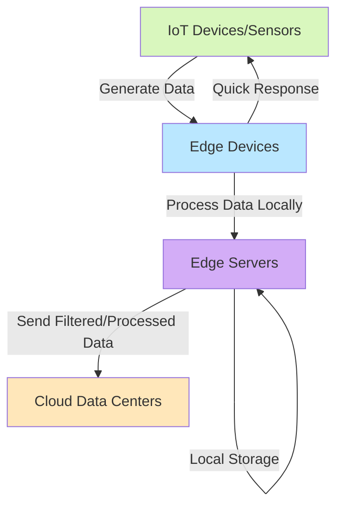

# Edge Computing

## Introduction

Edge computing is a distributed computing paradigm that brings computation and data storage closer to the sources of data. This proximity to data at its source can deliver strong business benefits: faster insights, improved response times and better bandwidth availability.

In traditional cloud computing models, data is processed in centralized data centers, which can be physically distant from where the data is generated. Edge computing shifts this processing closer to where data is created, reducing latency and bandwidth usage.

## What is Edge Computing?

Edge computing is a computing architecture that processes data at or near the "edge" of the network, where the physical devices (like sensors, smartphones, or machinery) generate or consume the data.



### Key Characteristics

- **Proximity**: Processing happens close to the data source
- **Low Latency**: Reduced delay in data processing and response
- **Bandwidth Efficiency**: Only relevant data is sent to the cloud
- **Distributed Processing**: Computing tasks are spread across many small devices
- **Offline Capability**: Can function even with intermittent cloud connectivity

## Why Edge Computing Matters

As IoT devices proliferate (estimated to reach 75 billion by 2025), the volume of data being generated has exploded. Sending all this data to centralized cloud servers creates several challenges:

1. **Bandwidth Constraints**: Moving vast amounts of data to the cloud is expensive and impractical
2. **Latency Issues**: Critical applications can't afford the delay of round trips to distant data centers
3. **Reliability Concerns**: Dependence on continuous internet connectivity
4. **Privacy & Security**: Sensitive data becomes vulnerable when transferred across networks
5. **Cost Factors**: Increasing cloud storage and processing costs

Edge computing addresses these challenges by processing data closer to its source.

## How Edge Computing Works

Let's break down the typical data flow in an edge computing architecture:

1. **Data Generation**: IoT devices, sensors, or user devices generate data
2. **Local Processing**: Edge devices analyze and process this data locally
3. **Filtering & Aggregation**: Only relevant information is extracted
4. **Action**: Immediate actions can be taken based on local processing
5. **Synchronization**: Selected data is eventually sent to the cloud for long-term storage or deeper analytics

### Example: Edge Computing Code Flow

Here's a simplified example of how code might run on an edge device using JavaScript:

```javascript
// Simple edge device data processing example
const sensorData = {
  temperature: 27.5,
  humidity: 65,
  motionDetected: true,
  timestamp: 1615283647
};

// Process data locally on the edge
function processEdgeData(data) {
  // 1. Check for critical conditions that need immediate response
  if (data.temperature > 30) {
    triggerCoolingSystem();
    return {
      action: "cooling_activated",
      critical: true,
      originalData: data
    };
  }
  
  // 2. Filter out unnecessary data to save bandwidth
  const relevantData = {
    tempAlert: data.temperature > 25,
    timestamp: data.timestamp
  };
  
  // 3. Only if motion is detected, include full details
  if (data.motionDetected) {
    relevantData.fullData = data;
  }
  
  return relevantData;
}

// The result of local processing
const processedData = processEdgeData(sensorData);

// Only send the processed data to the cloud
sendToCloud(processedData);

function triggerCoolingSystem() {
  console.log("Local action: Cooling system activated");
  // Direct hardware control code would go here
}

function sendToCloud(data) {
  console.log("Sending to cloud:", JSON.stringify(data));
  // API call to cloud service would go here
}
```

Input (raw sensor data):
```
{
  "temperature": 27.5,
  "humidity": 65,
  "motionDetected": true,
  "timestamp": 1615283647
}
```

Output (after edge processing):
```
Sending to cloud: {
  "tempAlert": true,
  "timestamp": 1615283647,
  "fullData": {
    "temperature": 27.5,
    "humidity": 65,
    "motionDetected": true,
    "timestamp": 1615283647
  }
}
```

This example shows how edge computing:
1. Processes data locally first
2. Takes immediate action when needed
3. Filters data before sending to the cloud
4. Only transmits what's necessary

## Edge Computing vs. Cloud Computing

While edge computing doesn't replace cloud computing, it complements it by addressing specific needs:

| Feature | Edge Computing | Cloud Computing |
|---------|----------------|-----------------|
| Location | Close to data source | Centralized data centers |
| Latency | Very low (1-5ms) | Higher (50-150ms+) |
| Bandwidth | Optimized usage | High bandwidth needs |
| Processing Power | Limited but sufficient | Nearly unlimited |
| Storage | Limited | Practically unlimited |
| Scalability | Physical scaling constraints | Highly elastic |
| Offline Operation | Possible | Not possible |
| Cost Model | Hardware investment | Pay-as-you-go |

## Edge Computing Architecture

A typical edge computing architecture has several tiers:

1. **End Devices**: Sensors, IoT devices, smartphones
2. **Edge Devices**: Gateways, local servers, specialized hardware
3. **Edge Data Centers**: Small data centers located near population centers
4. **Cloud**: Traditional cloud data centers

### Key Components

- **Edge Devices**: Physical hardware where processing occurs (e.g., IoT gateways, smart routers)
- **Edge Platform**: Software that enables and manages edge computing capabilities
- **Edge Analytics**: Processing and analyzing data at the edge
- **Edge Security**: Protecting distributed devices and data
- **Edge Orchestration**: Managing tasks across multiple edge devices

## Real-World Applications

### Smart Manufacturing

In a manufacturing plant, sensors on machinery collect data about equipment performance. Instead of sending all this data to the cloud, edge computing processes it locally to:

- Detect anomalies in real-time
- Predict maintenance needs
- Adjust operations immediately
- Only send aggregated reports to the cloud

```javascript
// Manufacturing machinery monitoring example
function monitorMachineHealth(sensorData) {
  // Analyze vibration patterns locally
  const vibrationPattern = analyzeVibration(sensorData.vibration);
  
  // Detect potential failures before they happen
  if (vibrationPattern.anomaly) {
    // Take immediate action
    slowDownMachine();
    alertMaintenance({
      machineId: sensorData.id,
      issue: vibrationPattern.anomalyType,
      urgency: vibrationPattern.severity
    });
    
    // Log complete data for this event only
    logCompleteData(sensorData);
  } else {
    // Just log summary data to save bandwidth
    logSummaryData({
      machineId: sensorData.id,
      operatingNormally: true,
      timestamp: sensorData.timestamp
    });
  }
}
```

### Autonomous Vehicles

Self-driving cars generate approximately 4TB of data per day. Edge computing enables:

- Real-time processing of sensor data
- Immediate decision-making
- Reduced dependency on cloud connectivity
- Enhanced safety through faster reactions

### Smart Cities

Edge computing helps cities become smarter by:

- Managing traffic lights based on current conditions
- Optimizing energy usage in public buildings
- Enhancing emergency response systems
- Improving public safety with real-time video analytics

### Healthcare

In healthcare settings, edge computing enables:

- Real-time patient monitoring
- Faster emergency response
- Enhanced data privacy
- Reduced bandwidth requirements for medical devices

### Retail

Retailers leverage edge computing for:

- Real-time inventory management
- Personalized in-store experiences
- Automated checkout systems
- Enhanced security and loss prevention

## Implementing Edge Computing: A Simple Example

Let's walk through a simple implementation of an edge computing solution using Node.js for a temperature monitoring system:

```javascript
// edge-device.js - Code running on the edge device
const mqtt = require('mqtt');
const sensorData = require('./sensors');

// Connect to local MQTT broker
const client = mqtt.connect('mqtt://localhost:1883');

// Data collection and processing interval (every 5 seconds)
setInterval(async () => {
  // 1. Collect data from sensors
  const readings = await sensorData.getTemperatureReadings();
  
  // 2. Process data locally at the edge
  const processedData = processReadings(readings);
  
  // 3. Take immediate action if needed
  if (processedData.alert) {
    triggerAlert(processedData.alertType);
  }
  
  // 4. Send only necessary data to the cloud
  client.publish('temperature/processed', JSON.stringify(processedData.cloudData));
  
}, 5000);

function processReadings(readings) {
  // Calculate average temperature
  const avgTemp = readings.reduce((sum, reading) => sum + reading.value, 0) / readings.length;
  
  // Check for anomalies locally
  const maxTemp = Math.max(...readings.map(r => r.value));
  const minTemp = Math.min(...readings.map(r => r.value));
  const variance = maxTemp - minTemp;
  
  let alert = false;
  let alertType = null;
  
  // Detect issues that need immediate attention
  if (maxTemp > 30) {
    alert = true;
    alertType = 'HIGH_TEMPERATURE';
  } else if (variance > 10) {
    alert = true;
    alertType = 'TEMPERATURE_INSTABILITY';
  }
  
  // Only send summarized data to cloud
  const cloudData = {
    timestamp: new Date().toISOString(),
    averageTemperature: avgTemp.toFixed(1),
    numReadings: readings.length,
    hasAlert: alert
  };
  
  return {
    alert,
    alertType,
    cloudData
  };
}

function triggerAlert(type) {
  console.log(`LOCAL ALERT: ${type} detected - taking immediate action`);
  // Code to trigger local systems (cooling, notifications, etc.)
}
```

This example demonstrates key edge computing principles:
- Local data collection and processing
- Real-time decision making
- Data filtering before cloud transmission
- Autonomous operation

## Challenges and Considerations

While edge computing offers many benefits, it also presents challenges:

1. **Device Management**: Maintaining distributed infrastructure
2. **Security Concerns**: Protecting numerous physical devices
3. **Limited Resources**: Working within hardware constraints
4. **Standardization**: Lack of universal protocols and standards
5. **Development Complexity**: Building for distributed environments

## Best Practices for Edge Computing

1. **Design for Offline Operation**: Applications should function even without cloud connectivity
2. **Implement Proper Security**: Secure both devices and data
3. **Consider Resource Limitations**: Optimize code for limited CPU, memory, and power
4. **Plan Data Synchronization**: Determine what data needs to move to the cloud and when
5. **Use Containerization**: Technologies like Docker make deployment more consistent
6. **Focus on Statelessness**: Design microservices that are resilient to restarts
7. **Monitor Edge Devices**: Implement proper monitoring and alerts

## Edge Computing Frameworks and Tools

Several tools and frameworks can help with edge computing implementation:

- **AWS IoT Greengrass**: Extends AWS capabilities to edge devices
- **Azure IoT Edge**: Microsoft's edge computing solution
- **Google Cloud IoT Edge**: Google's edge computing platform
- **EdgeX Foundry**: Open-source edge computing framework
- **Node-RED**: Visual tool for wiring together edge devices

## Summary

Edge computing represents a significant shift in how we process data, moving computation closer to data sources. This approach offers numerous benefits:

- Reduced latency for time-sensitive applications
- Decreased bandwidth usage and costs
- Enhanced privacy and security
- Improved reliability and resilience
- Better support for remote or disconnected operations

As IoT devices continue to proliferate and real-time processing becomes increasingly important, edge computing will play a crucial role in building efficient, responsive systems.

## Exercises

1. **Basic Edge Simulation**: Create a simple Node.js program that simulates an edge device processing sensor data locally before sending summaries to a "cloud" endpoint.

2. **Edge Decision Making**: Implement a program that makes autonomous decisions based on local data (e.g., adjusting settings based on temperature readings).

3. **Edge Data Filtering**: Build a system that collects data from multiple sources and filters it at the edge before transmission.

4. **Edge-Cloud Synchronization**: Create an application that works offline and synchronizes with the cloud when connectivity is restored.

## Additional Resources

- **Edge Computing Books**:
  - "Edge Computing: Models, Technologies and Applications"
  - "Fog and Edge Computing: Principles and Paradigms"

- **Online Courses**:
  - EdX: Introduction to Edge Computing
  - Coursera: Cloud Computing Specialization (includes edge computing)

- **Communities and Forums**:
  - Edge Computing Consortium
  - Linux Foundation's LF Edge

- **Documentation**:
  - AWS IoT Greengrass Documentation
  - Microsoft Azure IoT Edge Documentation
  - EdgeX Foundry Documentation