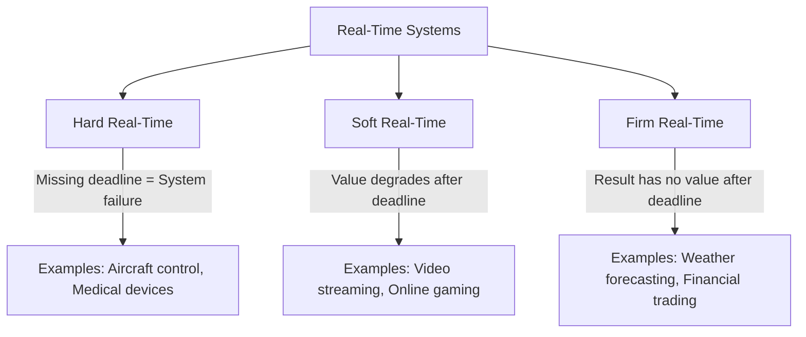

# Real-Time System Concepts

## Introduction

Real-time systems are specialized computing systems that must produce correct results within specific time constraints. Unlike general-purpose computers where performance is measured by throughput or average response time, real-time systems are evaluated by their ability to meet deadlines. These systems are critical in applications where timing is essential, such as industrial automation, medical devices, aerospace, and automotive control systems.

In this article, we'll explore the fundamental concepts of real-time systems, their characteristics, types, and how they differ from conventional computing systems.

## What is a Real-Time System?

A real-time system is a computing system that must respond to events or process data within predetermined time constraints. The correctness of these systems depends not only on the logical result of the computation but also on the time at which the result is produced.

Consider this definition: 

> A real-time system is one in which the correctness of the computations not only depends on their logical correctness but also on the time at which the result is produced. If the timing constraints are not met, system failure is said to have occurred.

### Key Characteristics of Real-Time Systems

Real-time systems are distinguished by several key characteristics:

1. **Time Constraints**: Operations must complete within specified deadlines.
2. **Predictability**: The system's behavior must be deterministic.
3. **Reliability**: The system must function correctly under all specified conditions.
4. **Responsiveness**: The system must respond to external events within guaranteed timeframes.
5. **Concurrency**: Multiple tasks often execute in parallel.
6. **Resource Adequacy**: Resources must be sufficient to handle peak loads.

## Types of Real-Time Systems

Real-time systems are typically categorized based on the consequences of missing deadlines:



### Hard Real-Time Systems

In hard real-time systems, missing a deadline is considered a system failure. These systems must guarantee that all deadlines will be met under all circumstances.

**Examples:**
- Aircraft flight control systems
- Medical life-support systems
- Automotive anti-lock braking systems
- Industrial robot controllers

### Soft Real-Time Systems

In soft real-time systems, missing a deadline reduces the system's value but doesn't cause a critical failure. These systems aim to meet deadlines but can tolerate occasional misses.

**Examples:**
- Video streaming applications
- Online gaming
- Virtual reality systems
- Multimedia applications

### Firm Real-Time Systems

Firm real-time systems fall between hard and soft. Missing a deadline doesn't cause system failure, but the result has no value after the deadline has passed.

**Examples:**
- Weather forecast calculations
- Financial trading systems
- Some telecommunications applications

## Time Constraints and Deadlines

Real-time systems deal with various types of timing constraints:

1. **Deadline**: The maximum time by which a task must complete.
2. **Release Time**: The earliest time at which a task can start execution.
3. **Execution Time**: The time required to complete a task without interruption.
4. **Response Time**: The time between the submission of a request and the beginning of the response.

## Real-Time Tasks

Real-time tasks are characterized by their timing parameters:

### Periodic Tasks

Tasks that execute at regular intervals:

```js
// Pseudo-code for a periodic task
function temperatureMonitor() {
  while (systemRunning) {
    readTemperatureSensor();
    processData();
    updateDisplay();
    sleep(PERIOD); // Wait until next period
  }
}
```

### Aperiodic Tasks

Tasks triggered by external events at irregular intervals:

```js
// Pseudo-code for an aperiodic task
function emergencyButtonHandler() {
  // This function is called whenever the emergency button is pressed
  stopAllMotors();
  soundAlarm();
  notifyOperator();
}
```

### Sporadic Tasks

Similar to aperiodic tasks, but with a minimum interval between consecutive arrivals:

```js
// Pseudo-code for a sporadic task handler
function motionDetector() {
  // This function is called when motion is detected
  // But no more frequently than MIN_INTERVAL
  if (timeElapsedSinceLastCall >= MIN_INTERVAL) {
    captureImage();
    analyzeMotion();
    triggerAlarmIfNeeded();
    lastCallTime = currentTime();
  }
}
```

## Real-Time Scheduling

Scheduling in real-time systems involves allocating CPU time to tasks in a way that allows them to meet their deadlines.

### Common Scheduling Algorithms

#### Rate Monotonic Scheduling (RMS)

A fixed-priority scheduling algorithm where tasks with shorter periods get higher priorities.

```c
// Example of priorities in RMS
// Task A: Period = 10ms, Priority = High
// Task B: Period = 20ms, Priority = Medium
// Task C: Period = 50ms, Priority = Low

void assignRMSPriorities(Task tasks[], int numTasks) {
  // Sort tasks based on their periods (shorter period = higher priority)
  for (int i = 0; i < numTasks - 1; i++) {
    for (int j = 0; j < numTasks - i - 1; j++) {
      if (tasks[j].period > tasks[j + 1].period) {
        // Swap tasks
        Task temp = tasks[j];
        tasks[j] = tasks[j + 1];
        tasks[j + 1] = temp;
      }
    }
  }
  
  // Assign priorities (0 = highest)
  for (int i = 0; i < numTasks; i++) {
    tasks[i].priority = i;
  }
}
```

#### Earliest Deadline First (EDF)

A dynamic scheduling algorithm that assigns priorities based on absolute deadlines.

```c
// Pseudo-code for EDF scheduling
void scheduleEDF(Task readyTasks[], int numTasks) {
  Task* nextTask = NULL;
  int earliestDeadline = INT_MAX;
  
  for (int i = 0; i < numTasks; i++) {
    if (readyTasks[i].deadline < earliestDeadline) {
      earliestDeadline = readyTasks[i].deadline;
      nextTask = &readyTasks[i];
    }
  }
  
  if (nextTask != NULL) {
    executeTask(nextTask);
  }
}
```

## Real-Time Communication

Real-time systems often require predictable communication between components.

### Time-Triggered Communication

Communication occurs at predetermined time intervals.

```c
// Example of time-triggered communication
void sensorNode() {
  while (1) {
    // Wait for the next time slot
    waitForTimeSlot();
    
    // Read sensor data
    SensorData data = readSensor();
    
    // Transmit during assigned time slot
    transmitData(data);
    
    // Calculate next transmission time
    nextTransmissionTime = currentTime() + TRANSMISSION_INTERVAL;
  }
}
```

### Event-Triggered Communication

Communication is initiated by specific events.

```c
// Example of event-triggered communication
void pressureSensor() {
  while (1) {
    // Continuously monitor the sensor
    PressureReading current = getPressure();
    
    // Check if pressure exceeds threshold
    if (current > PRESSURE_THRESHOLD) {
      // Generate event and transmit immediately
      PressureAlert alert = createAlert(current);
      transmitAlert(alert);
    }
    
    sleep(SAMPLING_INTERVAL);
  }
}
```

## Real-Time Operating Systems (RTOS)

An RTOS is an operating system specialized for real-time applications. They provide services that guarantee timing constraints.

### Key Features of an RTOS:

1. **Task Management**: Creating, scheduling, and synchronizing tasks.
2. **Interrupt Handling**: Quick response to external events.
3. **Memory Management**: Deterministic memory allocation and deallocation.
4. **Inter-Task Communication**: Mechanisms for tasks to communicate safely.
5. **Timer Management**: Precise timing services.

### Common RTOSes:

- FreeRTOS
- VxWorks
- QNX Neutrino
- RTLinux
- Zephyr OS

## Real-World Applications

### Automotive Systems

Modern vehicles contain numerous real-time systems, from engine control to safety features.

```c
// Example: ABS (Anti-lock Braking System) controller
void absController() {
  while (1) {
    // Read wheel speed sensors (typically runs at 100Hz or higher)
    WheelSpeeds speeds = readWheelSpeedSensors();
    
    // Detect wheel lock conditions
    for (int wheel = 0; wheel < NUM_WHEELS; wheel++) {
      if (isWheelLocking(speeds.wheel[wheel], vehicleSpeed)) {
        // Release brake pressure momentarily
        pulseABSValve(wheel);
      }
    }
    
    // This function must complete within 10ms to be effective
    sleepUntilNextPeriod();
  }
}
```

### Medical Devices

Patient monitoring systems and life-support equipment rely heavily on real-time processing.

```c
// Example: Patient monitoring system
void patientMonitor() {
  while (patientBeingMonitored) {
    // Collect vital signs (typically 1Hz sampling rate)
    VitalSigns vitals = collectVitalSigns();
    
    // Analyze for dangerous conditions
    if (analyzeVitals(vitals) == CRITICAL) {
      // Must respond within 500ms for critical conditions
      triggerAlarm();
      notifyMedicalStaff();
      logEvent();
    }
    
    // Update display
    updatePatientDisplay(vitals);
    
    wait(SAMPLING_PERIOD);
  }
}
```

### Industrial Automation

Manufacturing and process control systems use real-time computing to ensure precise operations.

```c
// Example: Industrial robot control
void robotArmController() {
  // Initialize position
  Position currentPos = readCurrentPosition();
  Position targetPos;
  
  while (systemActive) {
    // Get next target position from task queue
    targetPos = getNextTargetPosition();
    
    // Calculate path with real-time constraints
    Path trajectory = calculateTrajectory(currentPos, targetPos);
    
    // Follow path with precise timing (typically 1-10ms control loop)
    while (!positionReached(currentPos, targetPos)) {
      // Calculate next motor commands
      MotorCommands commands = calculateMotorCommands(trajectory, currentPos);
      
      // Send commands to motors
      setMotorCommands(commands);
      
      // Wait for precise control loop timing
      waitPreciseInterval(CONTROL_LOOP_PERIOD);
      
      // Update current position
      currentPos = readCurrentPosition();
    }
  }
}
```

## Challenges in Real-Time Systems

Real-time systems face several key challenges:

1. **Predictability**: Ensuring consistent timing under all conditions.
2. **Resource Constraints**: Many real-time systems have limited CPU, memory, and power.
3. **Validation and Verification**: Proving that timing requirements will always be met.
4. **Handling Overloads**: Gracefully managing situations when resources are insufficient.
5. **Complex Interactions**: Managing timing across distributed components.

## Design Principles for Real-Time Systems

When designing real-time systems:

1. **Understand Timing Requirements**: Clearly define all deadlines and timing constraints.
2. **Use Appropriate Scheduling**: Choose scheduling algorithms that match your requirements.
3. **Minimize Non-Determinism**: Avoid features that introduce timing uncertainty.
4. **Plan for Worst-Case Scenarios**: Design for worst-case execution times.
5. **Isolate Critical Components**: Separate time-critical code from non-critical code.
6. **Perform Thorough Testing**: Test under various load conditions.

## Summary

Real-time systems are specialized computing systems where timeliness is as important as functional correctness. They're categorized as hard, soft, or firm based on the consequences of missing deadlines. These systems require specialized scheduling algorithms, communication protocols, and operating systems to meet their timing constraints.

Real-time systems are essential in many critical applications, from automotive safety systems to medical devices and industrial automation. The design of these systems requires careful consideration of timing requirements, resource constraints, and failure modes.

As embedded systems become more prevalent in our daily lives, understanding real-time concepts becomes increasingly important for developers entering this specialized field.

## Additional Resources

- "Real-Time Systems" by Jane W.S. Liu
- "Hard Real-Time Computing Systems" by Giorgio Buttazzo
- FreeRTOS Documentation (https://www.freertos.org/documentation-and-books.html)
- "Real-Time Systems Design and Analysis" by Phillip A. Laplante

## Exercises

1. **Conceptual**: Identify three applications in your daily life that likely use real-time systems. For each, determine whether they are likely hard, soft, or firm real-time systems.

2. **Analysis**: Consider a traffic light control system. What timing constraints might exist? How would you categorize this system (hard, soft, or firm real-time)?

3. **Practical**: Using a programming language of your choice, implement a simple periodic task that reads a sensor value (you can simulate this) and prints it every 1 second. Measure how accurate your timing is.

4. **Advanced**: Research and compare two different real-time operating systems. What features do they provide for ensuring timing guarantees? How do their scheduling algorithms differ?

5. **Design Challenge**: Design a real-time system for monitoring the temperature in a server room. If the temperature exceeds a threshold, the system should activate cooling systems within a specified time limit. Outline the timing requirements, tasks, and potential scheduling approach.