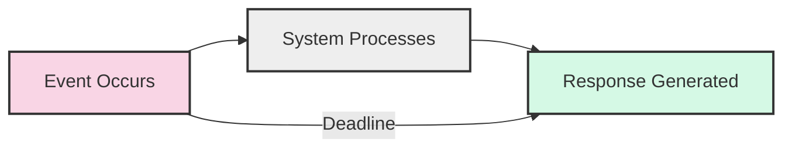
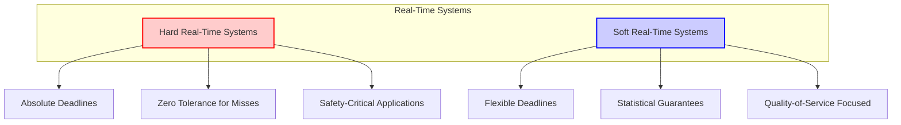

# Hard vs Soft Real-Time Systems

## Introduction

Real-time systems are computing environments that must process information and produce a response within a specified time constraint, known as a "deadline." Unlike general-purpose computing systems that prioritize throughput or average performance, real-time systems focus on meeting timing requirements to interact effectively with the physical world.

Real-time systems are typically categorized into two main types: **Hard Real-Time Systems** and **Soft Real-Time Systems**. The key difference lies in how they handle deadline misses and the consequences of those misses. This distinction is fundamental for developers working on time-sensitive applications, from industrial automation to multimedia streaming.

## Understanding Timing Constraints

Before diving deeper into hard and soft real-time systems, let's understand what timing constraints mean in the context of real-time operating systems:



Every real-time task has:
- A **release time** (when the task becomes available for execution)
- An **execution time** (how long it takes to complete)
- A **deadline** (when the response must be delivered)

## Hard Real-Time Systems

### Definition and Characteristics

A hard real-time system is one where:
- Meeting deadlines is **absolutely mandatory**
- Missing a deadline is considered a **system failure**
- Correct timing is as important as correct output

### Key Properties

1. **Deterministic behavior**: The system must guarantee response times under all circumstances
2. **Predictability**: Worst-case execution times must be known and bounded
3. **Reliability**: The system must function correctly even under peak load conditions
4. **Hardware-software co-design**: Often requires specialized hardware and optimized software

### Example Implementation

Here's a simplified example of a hard real-time task in C using a real-time operating system API:

```c
#include <rtems.h>

rtems_task hard_real_time_task(rtems_task_argument argument)
{
    rtems_status_code status;
    rtems_interval ticks_per_second;
    rtems_interval start_time, end_time, execution_time;
    rtems_interval deadline = 10; // 10 milliseconds deadline
    
    rtems_clock_get(RTEMS_CLOCK_GET_TICKS_PER_SECOND, &ticks_per_second);
    deadline = deadline * ticks_per_second / 1000; // Convert to ticks
    
    while (1) {
        rtems_clock_get(RTEMS_CLOCK_GET_TICKS_SINCE_BOOT, &start_time);
        
        // Critical real-time operation
        perform_critical_control_operation();
        
        rtems_clock_get(RTEMS_CLOCK_GET_TICKS_SINCE_BOOT, &end_time);
        execution_time = end_time - start_time;
        
        if (execution_time > deadline) {
            // Deadline missed - in a hard real-time system, this is catastrophic
            system_failure_handler();
        }
        
        // Wait for next period
        rtems_task_wake_after(PERIOD_IN_TICKS - execution_time);
    }
}
```

In this example:
- We define a task with a strict 10ms deadline
- We measure execution time precisely
- If the deadline is missed, we treat it as a system failure
- The task is periodic, ensuring predictable behavior

### Real-World Applications

Hard real-time systems are common in scenarios where failure could lead to catastrophic consequences:

1. **Aircraft flight control systems**
   - Must respond to pilot input and sensor data within microseconds
   - Failure could result in loss of aircraft control

2. **Automotive anti-lock braking systems**
   - Must monitor wheel speed and adjust brake pressure within milliseconds
   - Missed deadlines could lead to accidents

3. **Industrial robot control**
   - Precise timing for movement coordination
   - Delays could damage equipment or cause safety hazards

4. **Medical devices like pacemakers**
   - Must deliver electrical pulses at exact intervals
   - Timing failures could be life-threatening

## Soft Real-Time Systems

### Definition and Characteristics

A soft real-time system is one where:
- Meeting deadlines is **important but not critical**
- Occasional missed deadlines are tolerable
- System utility degrades as deadlines are missed, but doesn't fail completely
- Performance is often measured statistically (e.g., "95% of responses within deadline")

### Key Properties

1. **Graceful degradation**: System continues functioning even if deadlines are occasionally missed
2. **Statistical guarantees**: Focus on average-case performance rather than worst-case
3. **Flexibility**: Often implements priority scheduling to handle peak loads
4. **Resource optimization**: Balances timing requirements with resource efficiency

### Example Implementation

Here's an example of a soft real-time task for video frame processing:

```java
public class VideoFrameProcessor implements Runnable {
    private static final long TARGET_FRAME_TIME = 33; // ~30 FPS (33ms per frame)
    private long framesMissedDeadline = 0;
    private long totalFrames = 0;
    
    @Override
    public void run() {
        while (!Thread.interrupted()) {
            long startTime = System.currentTimeMillis();
            
            // Process video frame
            VideoFrame frame = frameQueue.take();
            processVideoFrame(frame);
            displayFrame(frame);
            
            long processingTime = System.currentTimeMillis() - startTime;
            totalFrames++;
            
            if (processingTime > TARGET_FRAME_TIME) {
                // Deadline missed, but system continues
                framesMissedDeadline++;
                System.out.println("Frame deadline missed: " + processingTime + "ms (target: " + TARGET_FRAME_TIME + "ms)");
                System.out.println("Quality of Service: " + ((totalFrames - framesMissedDeadline) * 100.0 / totalFrames) + "%");
            } else {
                // Sleep for remaining time until next frame
                try {
                    Thread.sleep(TARGET_FRAME_TIME - processingTime);
                } catch (InterruptedException e) {
                    Thread.currentThread().interrupt();
                }
            }
        }
    }
    
    private void processVideoFrame(VideoFrame frame) {
        // Apply filters, compression, etc.
    }
    
    private void displayFrame(VideoFrame frame) {
        // Render frame to screen
    }
}
```

In this example:
- We aim for 30 frames per second (33ms per frame)
- If processing takes longer, we don't fail catastrophically
- We track missed deadlines to monitor quality of service
- The system continues functioning even when deadlines are missed

### Real-World Applications

Soft real-time systems are common in scenarios where timing is important but not critical:

1. **Streaming media applications**
   - Occasional frame drops or buffering is acceptable
   - System prioritizes continuous playback over perfect timing

2. **Online gaming**
   - Aims for consistent response times
   - Brief latency spikes are tolerated

3. **Telecommunications systems**
   - Call quality degrades gracefully under high load
   - Occasional packet delays don't terminate connections

4. **Virtual reality environments**
   - Target frame rates for immersion
   - Momentary performance drops affect experience but aren't dangerous

## Comparing Hard and Soft Real-Time Systems

Let's compare these two approaches across several dimensions:

| Aspect | Hard Real-Time | Soft Real-Time |
|--------|---------------|---------------|
| **Deadline misses** | Not tolerated (system failure) | Occasionally acceptable |
| **Timing guarantee** | Absolute | Statistical |
| **Consequences** | Catastrophic failure | Degraded performance |
| **Design focus** | Worst-case execution time | Average-case performance |
| **Resource usage** | Often overprovisioned | Balanced/optimized |
| **Scheduling** | Static, predetermined | Dynamic, priority-based |
| **Testing** | Exhaustive verification | Statistical validation |
| **Cost** | Generally higher | Generally lower |



## Implementation Considerations

### Real-Time Operating System Selection

The choice between hard and soft real-time requirements significantly impacts RTOS selection:

- **For hard real-time systems**: Consider specialized RTOSes like VxWorks, QNX, or RTEMS that provide deterministic scheduling and bounded response times.

- **For soft real-time systems**: General-purpose operating systems with real-time extensions may suffice, such as Linux with PREEMPT_RT patches or Windows with real-time extensions.

### Code Example: Priority Inversion Problem

One common issue in real-time systems is priority inversion. Here's how it can be addressed:

```c
// Without priority inheritance - vulnerable to priority inversion
mutex_lock(&resource_mutex);
// Critical section
mutex_unlock(&resource_mutex);

// With priority inheritance - protects against priority inversion
pthread_mutexattr_t mutex_attr;
pthread_mutexattr_init(&mutex_attr);
pthread_mutexattr_setprotocol(&mutex_attr, PTHREAD_PRIO_INHERIT);

pthread_mutex_t resource_mutex;
pthread_mutex_init(&resource_mutex, &mutex_attr);

pthread_mutex_lock(&resource_mutex);
// Critical section
pthread_mutex_unlock(&resource_mutex);
```

### Measuring Real-Time Performance

Here's a simple C program to measure and evaluate the timing characteristics of a system:

```c
#include <stdio.h>
#include <time.h>

#define ITERATIONS 1000000
#define NSEC_PER_SEC 1000000000L

int main() {
    struct timespec start, end;
    long min_ns = NSEC_PER_SEC, max_ns = 0, total_ns = 0;
    
    for (int i = 0; i < ITERATIONS; i++) {
        clock_gettime(CLOCK_MONOTONIC, &start);
        
        // Task to measure (e.g., a critical calculation)
        volatile int result = 0;
        for (int j = 0; j < 1000; j++) {
            result += j;
        }
        
        clock_gettime(CLOCK_MONOTONIC, &end);
        
        long duration_ns = (end.tv_sec - start.tv_sec) * NSEC_PER_SEC + 
                           (end.tv_nsec - start.tv_nsec);
        
        if (duration_ns < min_ns) min_ns = duration_ns;
        if (duration_ns > max_ns) max_ns = duration_ns;
        total_ns += duration_ns;
    }
    
    printf("Timing statistics over %d iterations:
", ITERATIONS);
    printf("Min: %ld ns
", min_ns);
    printf("Max: %ld ns
", max_ns);
    printf("Avg: %ld ns
", total_ns / ITERATIONS);
    printf("Jitter: %ld ns
", max_ns - min_ns);
    
    return 0;
}
```

Output example:
```
Timing statistics over 1000000 iterations:
Min: 1250 ns
Max: 15789 ns
Avg: 1456 ns
Jitter: 14539 ns
```

For a hard real-time system, the jitter (max-min) needs to be very small and the maximum execution time must be below the deadline.

## Real-World Case Study: Autonomous Vehicles

Autonomous vehicles provide an excellent example of a system that combines both hard and soft real-time components:

### Hard Real-Time Components
- **Collision avoidance system**
  - Must detect obstacles and apply brakes within milliseconds
  - Failure to meet deadlines could result in accidents

- **Steering control**
  - Must maintain stable control with deterministic response times
  - Timing failures could cause loss of vehicle control

### Soft Real-Time Components
- **Infotainment system**
  - Occasional UI lags acceptable
  - Non-critical to safety

- **Route planning**
  - Can be processed with some flexibility
  - Temporary delays reduce user experience but aren't dangerous

This hybrid approach allows developers to allocate computing resources based on the criticality of each subsystem.

## Summary

Understanding the distinction between hard and soft real-time systems is crucial when designing time-sensitive applications:

- **Hard real-time systems** enforce strict deadlines where missing them constitutes a system failure. They're essential for safety-critical applications but require significant engineering effort and often specialized hardware.

- **Soft real-time systems** aim to meet deadlines but can tolerate occasional misses, resulting in degraded performance rather than failure. They're more flexible and often more cost-effective for applications where timing is important but not critical.

The choice between hard and soft real-time approaches should be based on:
1. The consequences of missing deadlines
2. The level of determinism required
3. Available resources and constraints
4. The nature of the physical processes being controlled

As computing systems increasingly interact with the physical world through IoT devices, robotics, and autonomous systems, understanding these real-time principles becomes increasingly important for software developers.

## Exercises

1. **Analysis Exercise**: Identify three applications in your daily life that likely use hard real-time systems and three that use soft real-time systems. Explain your reasoning.

2. **Programming Exercise**: Modify the timing measurement program provided in this lesson to evaluate the real-time performance of different sorting algorithms with varying input sizes. Compare the results and determine which algorithm might be more suitable for a real-time application.

3. **Design Challenge**: Design a simplified traffic light control system. Identify which components require hard real-time constraints and which can operate with soft real-time constraints. Explain your decisions.

4. **Research Project**: Investigate how virtualization technologies affect real-time performance. What techniques are used to provide real-time guarantees in virtualized environments?

## Additional Resources

- **Books**:
  - "Hard Real-Time Computing Systems" by Giorgio Buttazzo
  - "Real-Time Systems Design and Analysis" by Phillip A. Laplante

- **Online Courses**:
  - EdX: "Real-Time Systems"
  - Coursera: "Embedded Systems - Shape The World"

- **Tools**:
  - FreeRTOS: Popular open-source real-time operating system
  - Tracealyzer: Tool for visualizing and analyzing real-time behavior

- **Standards**:
  - POSIX 1003.1b: Real-time extensions for POSIX systems
  - AUTOSAR: Automotive open system architecture with real-time specifications