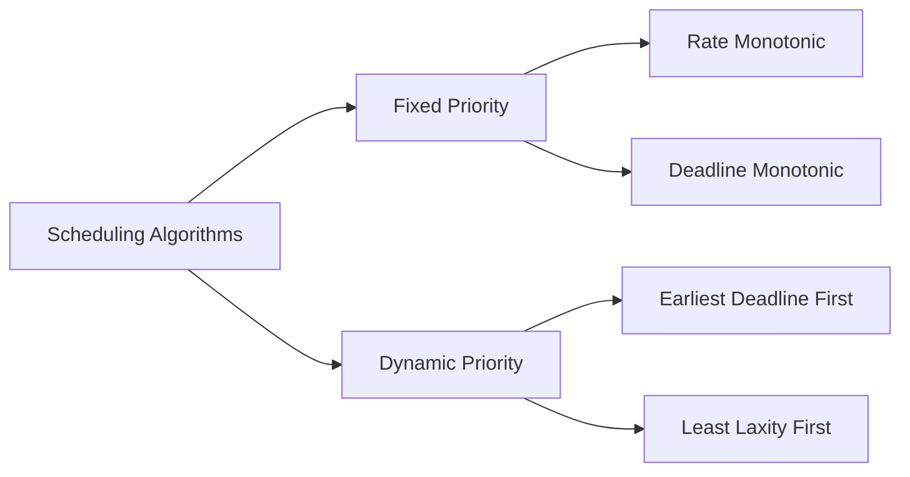
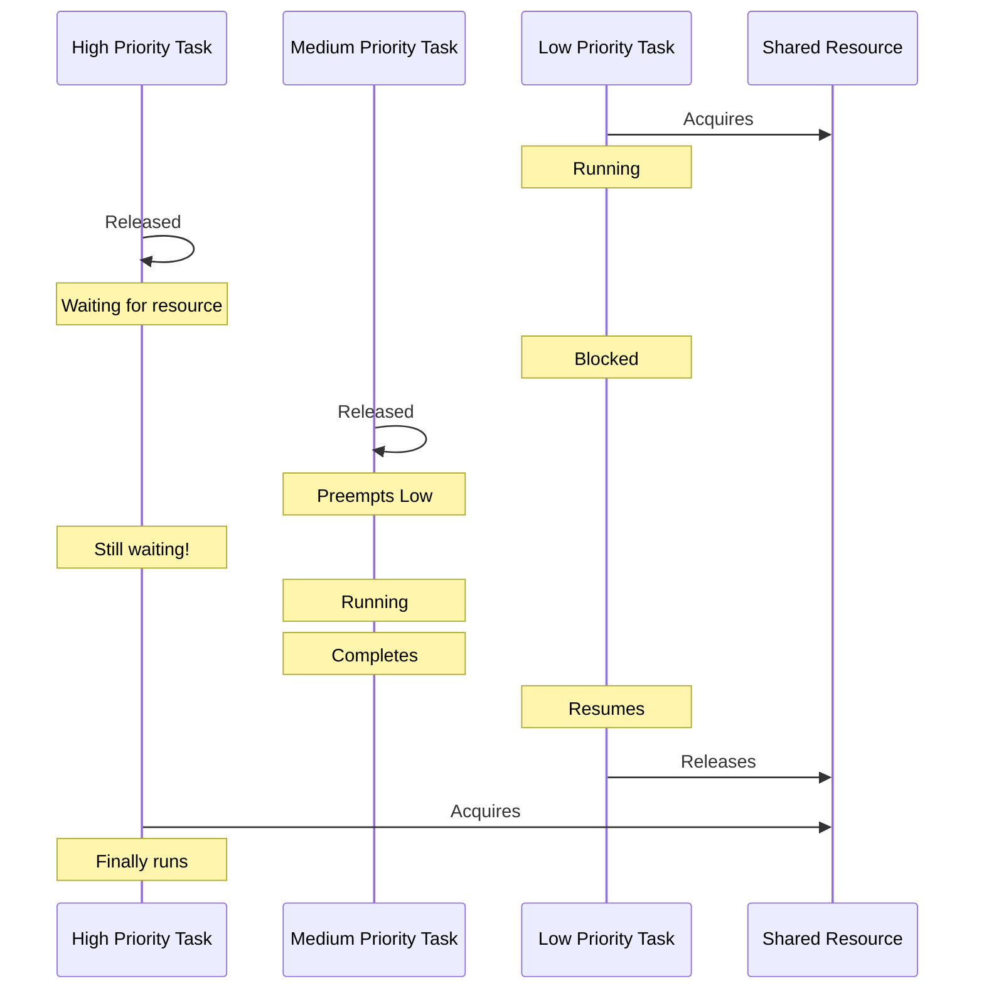

# Real-Time Scheduling

## Introduction

Real-time scheduling is a fundamental concept in Real-Time Operating Systems (RTOS) that deals with how tasks are allocated to processor resources when time constraints are critical. Unlike general-purpose operating systems that optimize for average performance or throughput, real-time scheduling algorithms focus on meeting deadlines and ensuring predictable timing behavior.

In this guide, we'll explore the principles of real-time scheduling, common algorithms, and practical applications in embedded systems and time-critical applications.

## Real-Time Tasks and Their Characteristics

Before diving into scheduling algorithms, let's understand the basic characteristics of real-time tasks:

### Types of Real-Time Tasks

1. **Periodic Tasks**: Execute at regular intervals
   - Example: Sensor reading every 10ms
   - Characterized by period (T) and execution time (C)

2. **Aperiodic Tasks**: Execute irregularly in response to events
   - Example: User input handling
   - Characterized by arrival time and execution time

3. **Sporadic Tasks**: Like aperiodic tasks but with minimum inter-arrival time
   - Example: Emergency brake handling in a car
   - Characterized by minimum interval between consecutive arrivals

### Task Timing Constraints

- **Deadline (D)**: Time by which task execution must complete
- **Release Time (r)**: Time when task becomes available for execution
- **Execution Time (C)**: Time required to complete the task
- **Period (T)**: For periodic tasks, time between consecutive releases

Let's visualize these concepts:

```mermaid
gantt
    title Task Timing Parameters
    dateFormat s
    axisFormat %S
    
    Task Release    :milestone, m1, 0, 0
    Task Execution  :active, e1, after m1, 5s
    Task Deadline   :milestone, m2, 10, 0
    
    Period          :period, after m1, 15s
```



## Real-Time Scheduling Algorithms

### Rate Monotonic Scheduling (RMS)

RMS is a static priority assignment algorithm where:
- Tasks with shorter periods get higher priorities
- It's optimal among fixed-priority algorithms for periodic tasks with deadlines equal to periods

Let's see how it works with an example:

```c
// Pseudo-code example of Rate Monotonic priority assignment
void assign_rm_priorities(Task tasks[], int n) {
    // Sort tasks by period (ascending)
    for (int i = 0; i < n - 1; i++) {
        for (int j = 0; j < n - i - 1; j++) {
            if (tasks[j].period > tasks[j + 1].period) {
                Task temp = tasks[j];
                tasks[j] = tasks[j + 1];
                tasks[j + 1] = temp;
            }
        }
    }
    
    // Assign priorities (lower number = higher priority)
    for (int i = 0; i < n; i++) {
        tasks[i].priority = i + 1;
    }
}
```

**RMS Schedulability Test**:
A set of n periodic tasks is schedulable under RMS if:

$$\sum_{i=1}^{n} \frac{C_i}{T_i} \leq n(2^{1/n} - 1)$$

For n approaching infinity, the utilization bound approaches ln(2) ≈ 0.693 or about 69.3%.

### Earliest Deadline First (EDF)

EDF is a dynamic priority scheduling algorithm where:
- Tasks with earlier absolute deadlines get higher priorities
- EDF is optimal for preemptive scheduling on a single processor
- It can achieve 100% utilization for periodic tasks

```c
// Pseudo-code for EDF scheduler
void edf_scheduler(Task ready_queue[]) {
    Task *next_task = NULL;
    int earliest_deadline = INT_MAX;
    
    for (int i = 0; i < ready_queue_size; i++) {
        if (ready_queue[i].absolute_deadline < earliest_deadline) {
            earliest_deadline = ready_queue[i].absolute_deadline;
            next_task = &ready_queue[i];
        }
    }
    
    if (next_task != NULL) {
        execute(next_task);
    }
}
```

**EDF Schedulability Test**:
A set of periodic tasks is schedulable under EDF if and only if:

$$\sum_{i=1}^{n} \frac{C_i}{T_i} \leq 1$$

### Deadline Monotonic Scheduling (DMS)

DMS is similar to RMS but prioritizes tasks based on their relative deadlines instead of periods:
- Tasks with shorter relative deadlines get higher priorities
- DMS is optimal among fixed-priority algorithms when deadlines can be less than periods

### Comparison of Scheduling Algorithms



## Implementation Example: Task Scheduling in FreeRTOS

FreeRTOS is a popular real-time operating system for embedded devices. Here's how to create and schedule tasks with priorities in FreeRTOS:

```c
#include "FreeRTOS.h"
#include "task.h"

// Task function prototypes
void vTask1(void *pvParameters);
void vTask2(void *pvParameters);

int main(void) {
    // Create two tasks with different priorities
    xTaskCreate(
        vTask1,                // Function that implements the task
        "Task 1",              // Text name for debugging
        configMINIMAL_STACK_SIZE,  // Stack size
        NULL,                  // Parameters to pass to the task
        2,                     // Priority (higher number = higher priority in FreeRTOS)
        NULL                   // Task handle
    );
    
    xTaskCreate(
        vTask2,
        "Task 2",
        configMINIMAL_STACK_SIZE,
        NULL,
        1,                     // Lower priority than Task 1
        NULL
    );
    
    // Start the scheduler
    vTaskStartScheduler();
    
    // Should never reach here
    for(;;);
}

void vTask1(void *pvParameters) {
    for(;;) {
        // Higher priority task code
        // E.g., handle critical sensor readings
        
        // Delay for 10ms (periodic task with period 10ms)
        vTaskDelay(pdMS_TO_TICKS(10));
    }
}

void vTask2(void *pvParameters) {
    for(;;) {
        // Lower priority task code
        // E.g., update display or log data
        
        // Delay for 100ms (periodic task with period 100ms)
        vTaskDelay(pdMS_TO_TICKS(100));
    }
}
```

## Practical Examples of Real-Time Scheduling

### Example 1: Automotive Engine Control Unit (ECU)

In an automotive ECU, multiple tasks run with different timing requirements:

1. **Ignition Control** (Priority: Highest)
   - Period: 5ms
   - Execution Time: 0.5ms
   - Critical for engine operation

2. **Fuel Injection**
   - Period: 10ms
   - Execution Time: 1ms
   - Affects engine performance and emissions

3. **Temperature Monitoring**
   - Period: 100ms
   - Execution Time: 2ms
   - Less time-critical but still important

4. **Diagnostic Systems** (Priority: Lowest)
   - Period: 1000ms
   - Execution Time: 5ms
   - Can be delayed if more critical tasks need the CPU

### Example 2: Industrial Control System

```c
// Example of task priorities in industrial control system
#define EMERGENCY_STOP_PRIORITY    5   // Highest priority
#define MOTION_CONTROL_PRIORITY    4
#define SENSOR_READING_PRIORITY    3
#define COMMUNICATION_PRIORITY     2
#define UI_UPDATE_PRIORITY         1   // Lowest priority

// Task creation example
void init_tasks(void) {
    xTaskCreate(emergency_stop_task, "EmergStop", STACK_SIZE, NULL, 
                EMERGENCY_STOP_PRIORITY, NULL);
    xTaskCreate(motion_control_task, "Motion", STACK_SIZE, NULL, 
                MOTION_CONTROL_PRIORITY, NULL);
    xTaskCreate(sensor_task, "Sensors", STACK_SIZE, NULL, 
                SENSOR_READING_PRIORITY, NULL);
    xTaskCreate(comm_task, "Comm", STACK_SIZE, NULL, 
                COMMUNICATION_PRIORITY, NULL);
    xTaskCreate(ui_task, "UI", STACK_SIZE, NULL, 
                UI_UPDATE_PRIORITY, NULL);
}
```

## Challenges in Real-Time Scheduling

### Priority Inversion

Priority inversion occurs when a higher-priority task is indirectly preempted by a lower-priority task.



**Solution**: Priority inheritance protocols where a lower-priority task temporarily inherits the priority of the highest-priority task waiting for the resource it holds.

### Jitter and Deadline Misses

- **Jitter**: Variation in the timing of task execution
- **Deadline Miss**: Failure to complete a task before its deadline

Monitoring these issues:

```c
// Pseudo-code for deadline monitoring
void task_wrapper(void (*task_function)(void*), void* parameters) {
    TickType_t start_time = xTaskGetTickCount();
    
    // Execute the actual task
    task_function(parameters);
    
    TickType_t end_time = xTaskGetTickCount();
    TickType_t execution_time = end_time - start_time;
    
    // Check if deadline was missed
    if (execution_time > TASK_DEADLINE) {
        log_deadline_miss(execution_time, TASK_DEADLINE);
    }
}
```

## Advanced Scheduling Concepts

### Mixed-Criticality Systems

These systems contain tasks with different levels of importance (criticality):
- Safety-critical tasks (must never miss deadlines)
- Mission-critical tasks (important but occasional deadline misses acceptable)
- Non-critical tasks (best effort)

### Server-Based Scheduling

Techniques like Polling Servers and Deferrable Servers help handle aperiodic tasks in a periodic task environment.

## Best Practices for Real-Time Scheduling

1. **Know Your Timing Requirements**: Measure and document execution times, periods, and deadlines
2. **Use Appropriate Scheduling Algorithm**: Match the algorithm to your application needs
3. **Account for Overheads**: Consider context switching and interrupt handling times
4. **Implement Monitoring**: Track deadline misses and jitter in development
5. **Use Rate Monotonic Analysis**: Verify schedulability before deployment
6. **Minimize Resource Sharing**: Reduce potential for priority inversion
7. **Plan for Overload**: Define graceful degradation strategies

## Summary

Real-time scheduling is crucial for systems with timing constraints. We've explored:

- Different types of real-time tasks and their characteristics
- Common scheduling algorithms including RMS, EDF, and DMS
- Implementation examples using FreeRTOS
- Practical applications in automotive and industrial systems
- Challenges like priority inversion and solutions
- Best practices for reliable real-time systems

The choice of scheduling algorithm depends on your specific requirements, including task characteristics, hardware constraints, and timing guarantees needed.

## Exercises

1. Calculate whether the following task set is schedulable using RMS:
   - Task A: Period = 20ms, Execution Time = 5ms
   - Task B: Period = 50ms, Execution Time = 10ms
   - Task C: Period = 100ms, Execution Time = 20ms

2. Implement a simple EDF scheduler for a set of periodic tasks.

3. Research and compare how different commercial RTOS implementations handle task scheduling.

## Further Resources

- "Hard Real-Time Computing Systems" by Giorgio Buttazzo
- FreeRTOS official documentation
- "Real-Time Systems: Design Principles for Distributed Embedded Applications" by Hermann Kopetz