# Priority Inversion

## Introduction

Priority inversion is a scenario in real-time operating systems where a high-priority task is indirectly preempted by a lower-priority task, effectively "inverting" the expected priority relationship. This phenomenon can cause serious problems in real-time systems where timing is critical, potentially leading to missed deadlines and unpredictable behavior.

In this article, we'll explore what priority inversion is, why it occurs, its consequences, and how to mitigate it with techniques like priority inheritance and priority ceiling protocols.

## Understanding Priority Inversion

### The Basic Concept

In priority-based scheduling, tasks with higher priority should execute before tasks with lower priority. However, when shared resources (like a mutex or semaphore) are involved, the following scenario can occur:

1. A high-priority task (H) tries to access a shared resource
2. The resource is already locked by a low-priority task (L)
3. H is blocked, waiting for L to release the resource
4. Meanwhile, a medium-priority task (M) preempts L
5. Now H is waiting for L, which is waiting for M to finish - effectively giving M higher priority than H

This situation, where the high-priority task has to wait for a medium-priority task because of a low-priority task holding a resource, is called priority inversion.

Let's visualize this scenario:

```mermaid
gantt
    title Priority Inversion Scenario
    dateFormat s
    axisFormat %S
    
    section Tasks
    Low Priority Task (L)     :l1, 0, 1s
    L has resource           :l2, after l1, 2s
    L preempted              :l3, after l2, 3s
    L continues              :l4, after l3, 1s
    
    section Resources
    Resource locked by L      :crit, resource, after l1, 6s
    
    section Tasks
    High Priority Task (H) blocked :crit, h1, after l2, 4s
    Medium Priority Task (M)      :m1, after l2, 3s
    H resumes                     :h2, after l4, 2s
```



### A Real-World Example

Imagine three tasks running in an embedded system:

- Task H (High priority): Controls critical safety systems
- Task M (Medium priority): Updates the user interface
- Task L (Low priority): Logs system information to storage

If Task L acquires a mutex to write to storage, and then Task H needs the same mutex to log a critical error, Task H must wait. While Task L is executing, Task M can preempt it to update the UI. Now Task H is waiting for Task L, which is waiting for Task M - creating priority inversion.

## Code Example: Priority Inversion in Action

Here's a simplified example in C that demonstrates priority inversion:

```c
#include <pthread.h>
#include <stdio.h>
#include <unistd.h>

pthread_mutex_t resource_mutex = PTHREAD_MUTEX_INITIALIZER;

void *low_priority_task(void *arg) {
    printf("Low-priority task started
");
    
    printf("Low-priority task acquiring mutex
");
    pthread_mutex_lock(&resource_mutex);
    printf("Low-priority task acquired mutex
");
    
    // Simulate work with the shared resource
    printf("Low-priority task using shared resource...
");
    sleep(2);  // During this time, both medium and high priority tasks can be scheduled
    
    printf("Low-priority task releasing mutex
");
    pthread_mutex_unlock(&resource_mutex);
    
    printf("Low-priority task finished
");
    return NULL;
}

void *medium_priority_task(void *arg) {
    printf("Medium-priority task started
");
    
    // Simulate CPU-intensive work
    printf("Medium-priority task executing (preempting low-priority task)...
");
    sleep(3);
    
    printf("Medium-priority task finished
");
    return NULL;
}

void *high_priority_task(void *arg) {
    printf("High-priority task started
");
    
    // Give low priority task time to acquire the mutex
    sleep(1);
    
    printf("High-priority task attempting to acquire mutex
");
    pthread_mutex_lock(&resource_mutex);
    printf("High-priority task acquired mutex
");
    
    // Simulate work with the shared resource
    printf("High-priority task using shared resource...
");
    sleep(1);
    
    printf("High-priority task releasing mutex
");
    pthread_mutex_unlock(&resource_mutex);
    
    printf("High-priority task finished
");
    return NULL;
}

int main() {
    pthread_t low, medium, high;
    pthread_attr_t attr;
    struct sched_param param;
    
    pthread_attr_init(&attr);
    pthread_attr_setschedpolicy(&attr, SCHED_FIFO);
    
    // Create low priority thread
    param.sched_priority = 10;
    pthread_attr_setschedparam(&attr, &param);
    pthread_create(&low, &attr, low_priority_task, NULL);
    
    // Create medium priority thread
    param.sched_priority = 20;
    pthread_attr_setschedparam(&attr, &param);
    pthread_create(&medium, &attr, medium_priority_task, NULL);
    
    // Create high priority thread
    param.sched_priority = 30;
    pthread_attr_setschedparam(&attr, &param);
    pthread_create(&high, &attr, high_priority_task, NULL);
    
    // Wait for all threads to complete
    pthread_join(low, NULL);
    pthread_join(medium, NULL);
    pthread_join(high, NULL);
    
    pthread_attr_destroy(&attr);
    pthread_mutex_destroy(&resource_mutex);
    
    return 0;
}
```

Expected output (timing may vary):

```
Low-priority task started
Low-priority task acquiring mutex
Low-priority task acquired mutex
Low-priority task using shared resource...
High-priority task started
High-priority task attempting to acquire mutex
Medium-priority task started
Medium-priority task executing (preempting low-priority task)...
Medium-priority task finished
Low-priority task releasing mutex
Low-priority task finished
High-priority task acquired mutex
High-priority task using shared resource...
High-priority task releasing mutex
High-priority task finished
```

Notice how the high-priority task must wait not only for the low-priority task but also for the medium-priority task to finish, demonstrating priority inversion.

## The Mars Pathfinder Incident

One of the most famous examples of priority inversion occurred on the Mars Pathfinder mission in 1997. The spacecraft began experiencing system resets due to a priority inversion problem in its real-time operating system.

What happened:
1. A high-priority task waited for a shared resource held by a low-priority task
2. Medium-priority tasks preempted the low-priority task 
3. This caused the high-priority task to miss its deadline
4. The system's watchdog timer detected the missed deadline and reset the system

Engineers diagnosed the problem remotely and enabled the VxWorks operating system's priority inheritance feature, which solved the issue. This real-world example shows how priority inversion can affect even the most carefully designed systems.

## Solutions to Priority Inversion

### Priority Inheritance Protocol

In priority inheritance, when a high-priority task blocks on a resource held by a lower-priority task, the lower-priority task temporarily inherits the priority of the blocked task until it releases the resource.

```mermaid
gantt
    title Priority Inheritance Protocol
    dateFormat s
    axisFormat %S
    
    section Tasks
    Low Priority Task (L)             :l1, 0, 1s
    L has resource                   :l2, after l1, 2s
    L inherits high priority         :crit, l3, after l2, 3s
    
    section Resources
    Resource locked by L              :crit, resource, after l1, 5s
    
    section Tasks
    High Priority Task (H) blocked     :h1, after l2, 3s
    Medium Priority Task (M) blocked   :m1, after l2, 3s
    H resumes                         :crit, h2, after l3, 2s
```



### Priority Ceiling Protocol

The priority ceiling protocol assigns each shared resource a priority ceiling, which is equal to the priority of the highest-priority task that will ever access it. When a task acquires a resource, its priority is temporarily raised to the resource's ceiling priority.

```mermaid
gantt
    title Priority Ceiling Protocol
    dateFormat s
    axisFormat %S
    
    section Tasks
    Low Priority Task (L)             :l1, 0, 1s
    L takes resource & raises to ceiling priority :crit, l2, after l1, 5s
    
    section Resources
    Resource locked by L              :crit, resource, after l1, 5s
    
    section Tasks
    Medium Priority Task (M) blocked   :m1, after l1, 5s
    High Priority Task (H) executes after L :crit, h1, after l2, 2s
```



### Immediate Priority Ceiling Protocol (IPCP)

IPCP is a variation where a task's priority is immediately raised to the ceiling priority when it acquires a resource, preventing any unnecessary preemption and making analysis simpler.

### Implementation Example: Priority Inheritance with POSIX Threads

Here's how to implement priority inheritance using POSIX mutexes:

```c
#include <pthread.h>
#include <stdio.h>
#include <unistd.h>

int main() {
    pthread_mutexattr_t mutex_attr;
    pthread_mutex_t mutex;
    
    // Initialize mutex attributes
    pthread_mutexattr_init(&mutex_attr);
    
    // Set the mutex protocol to priority inheritance
    pthread_mutexattr_setprotocol(&mutex_attr, PTHREAD_PRIO_INHERIT);
    
    // Initialize the mutex with the attributes
    pthread_mutex_init(&mutex, &mutex_attr);
    
    // Use the mutex as usual
    pthread_mutex_lock(&mutex);
    // Critical section
    pthread_mutex_unlock(&mutex);
    
    // Clean up
    pthread_mutex_destroy(&mutex);
    pthread_mutexattr_destroy(&mutex_attr);
    
    return 0;
}
```

## Analyzing and Preventing Priority Inversion

### Detection Methods

1. **Static analysis tools** can identify potential priority inversion scenarios by analyzing resource usage and task priorities.
2. **Runtime monitoring** can detect when priority inversions occur and log them for analysis.
3. **Simulation and testing** with different timing scenarios can help identify potential inversions before deployment.

### Best Practices

1. **Minimize shared resources** between tasks of different priorities.
2. **Keep critical sections short** to reduce the window of vulnerability.
3. **Use priority inheritance or priority ceiling protocols** in your RTOS.
4. **Document resource usage** and priority relationships between tasks.
5. **Consider using wait-free or lock-free data structures** for communication between tasks of different priorities.

## Summary

Priority inversion is a serious problem in real-time systems that can lead to missed deadlines and unpredictable behavior. It occurs when a high-priority task is indirectly blocked by a lower-priority task through a shared resource, and medium-priority tasks preempt the low-priority task.

The main solutions include:
- Priority inheritance, where a task inherits the priority of any higher-priority task it blocks
- Priority ceiling protocols, where tasks temporarily elevate to a pre-defined ceiling priority when accessing shared resources
- Careful system design that minimizes shared resources between tasks of different priorities

Understanding and addressing priority inversion is essential for developing reliable real-time systems, as demonstrated by real-world incidents like the Mars Pathfinder anomaly.

## Exercises

1. Implement a simple program that demonstrates priority inversion using POSIX threads.
2. Modify the program to use priority inheritance and observe how it changes the behavior.
3. Design a real-time system with three tasks of different priorities sharing two resources. Identify potential priority inversion scenarios and propose solutions.
4. Research how different real-time operating systems handle priority inversion and compare their approaches.

## Additional Resources

- "Real-Time Systems and Programming Languages" by Alan Burns and Andy Wellings
- "Hard Real-Time Computing Systems" by Giorgio Buttazzo
- [NASA's detailed analysis of the Mars Pathfinder priority inversion incident](https://www.cs.cornell.edu/courses/cs614/1999sp/papers/pathfinder.html)
- Your RTOS documentation for specific implementation details