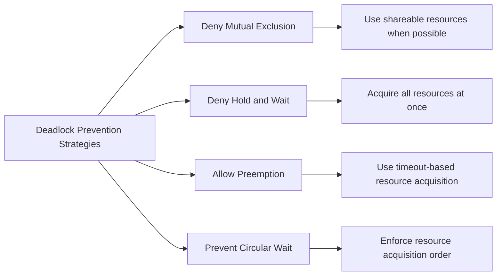

# Resource Allocation in Real-Time Operating Systems

## Introduction

In real-time operating systems (RTOS), resource allocation refers to the process of assigning system resources—such as CPU time, memory, I/O devices, and shared data structures—to tasks that need them. Unlike general-purpose operating systems, RTOSes must allocate resources in a way that ensures tasks can meet their timing constraints.

Resource allocation is a critical aspect of RTOS design because:

- Tasks in real-time systems have strict deadlines
- Multiple tasks often compete for limited resources
- Poor allocation strategies can lead to missed deadlines, priority inversion, or deadlocks
- In safety-critical systems, resource allocation failures can have serious consequences

This guide will walk you through the fundamental concepts of resource allocation in RTOSes, common challenges, and practical implementation techniques.

## Basic Concepts in RTOS Resource Allocation

### Types of Resources

In an RTOS, resources can be categorized as:

1. **Preemptible resources**: Resources that can be taken away from a task and given to another without adverse effects (e.g., CPU time)
2. **Non-preemptible resources**: Resources that cannot be taken away until the task voluntarily releases them (e.g., hardware peripherals, critical sections of code)
3. **Consumable resources**: Resources that can be created and destroyed (e.g., memory, message buffers)
4. **Non-consumable resources**: Resources that are used but not consumed (e.g., processors, I/O devices)

### Resource Allocation Policies

RTOSes implement various policies to determine how resources are allocated:

1. **Priority-based allocation**: Resources are allocated to tasks based on their priority levels
2. **Deadline-based allocation**: Resources are allocated based on which task has the earliest deadline
3. **Fair allocation**: Resources are distributed evenly among competing tasks
4. **Resource reservation**: Resources are reserved in advance for critical tasks

## Common Resource Allocation Mechanisms

### Semaphores

Semaphores are synchronization primitives used to control access to resources. They maintain a count that indicates the number of available resources.

```c
// Creating a binary semaphore (for single resource)
SemaphoreHandle_t mutex = xSemaphoreCreateBinary();

// Task that needs the resource
void task_function(void *parameters) {
    while (1) {
        // Attempt to acquire the resource
        if (xSemaphoreTake(mutex, portMAX_DELAY) == pdTRUE) {
            // Resource acquired, do something with it
            perform_operation_with_resource();
            
            // Release the resource when done
            xSemaphoreGive(mutex);
        }
        
        // Do other work that doesn't need the resource
        vTaskDelay(pdMS_TO_TICKS(100));
    }
}
```

### Mutexes

Mutexes (mutual exclusion semaphores) are specialized binary semaphores designed specifically for protecting shared resources and addressing priority inversion.

```c
// Creating a mutex
SemaphoreHandle_t mutex = xSemaphoreCreateMutex();

// Task that needs to access a shared resource
void sensor_processing_task(void *parameters) {
    while (1) {
        // Try to get exclusive access to the shared resource
        if (xSemaphoreTake(mutex, portMAX_DELAY) == pdTRUE) {
            // Critical section - access the shared resource
            read_sensor_data();
            process_sensor_data();
            update_shared_data_structure();
            
            // Release the mutex
            xSemaphoreGive(mutex);
        }
        
        vTaskDelay(pdMS_TO_TICKS(50));
    }
}
```

### Resource Ceiling Protocol

This protocol assigns a ceiling priority to each resource, which is equal to the highest priority of any task that might use it. When a task acquires a resource, its priority is temporarily elevated to the resource's ceiling priority.

```c
// Example implementation of resource ceiling protocol
void task_function(void *parameters) {
    while (1) {
        // Store original priority
        UBaseType_t original_priority = uxTaskPriorityGet(NULL);
        
        // Raise task's priority to resource ceiling priority
        vTaskPrioritySet(NULL, RESOURCE_CEILING_PRIORITY);
        
        // Access the resource
        access_shared_resource();
        
        // Restore original priority
        vTaskPrioritySet(NULL, original_priority);
        
        vTaskDelay(pdMS_TO_TICKS(100));
    }
}
```

## Deadlock Prevention and Avoidance

Deadlocks occur when tasks are permanently blocked waiting for resources held by other tasks. In real-time systems, deadlocks can be catastrophic, causing the system to miss critical deadlines or stop responding entirely.

### Deadlock Conditions

Four conditions must be present for deadlocks to occur:

1. **Mutual exclusion**: At least one resource must be non-shareable
2. **Hold and wait**: Tasks hold resources while waiting for others
3. **No preemption**: Resources cannot be forcibly taken from tasks
4. **Circular wait**: There exists a circular chain of tasks waiting for resources

### Deadlock Prevention Strategies

To prevent deadlocks, an RTOS can implement strategies that deny at least one of the four necessary conditions:



### Resource Acquisition with Timeout

A practical approach to avoid indefinite blocking is using timeouts when acquiring resources:

```c
// Try to acquire the resource with a timeout
if (xSemaphoreTake(mutex, pdMS_TO_TICKS(500)) == pdTRUE) {
    // Resource acquired, use it
    use_resource();
    
    // Release the resource
    xSemaphoreGive(mutex);
} else {
    // Timeout occurred, take alternate action
    handle_resource_acquisition_failure();
}
```

## Priority Inversion Problem

Priority inversion is a scenario where a high-priority task is indirectly preempted by a lower-priority task, effectively "inverting" the priority relationship.

### Example Scenario

1. Low-priority task L acquires a mutex
2. High-priority task H attempts to acquire the same mutex and blocks
3. Medium-priority task M preempts task L
4. Task H (high priority) is now waiting for task L (low priority), which is waiting for task M to complete

### Priority Inheritance Protocol

This protocol temporarily boosts the priority of a task holding a resource to the highest priority of any task waiting for that resource.

```c
// In FreeRTOS, using a mutex automatically implements priority inheritance
SemaphoreHandle_t mutex = xSemaphoreCreateMutex();

void low_priority_task(void *parameters) {
    while (1) {
        // When this task takes the mutex and a higher priority task
        // attempts to take it, this task's priority will be temporarily
        // raised to match the waiting task's priority
        if (xSemaphoreTake(mutex, portMAX_DELAY) == pdTRUE) {
            // Critical section
            perform_operations(); // During this time, priority may be boosted
            
            // Release mutex
            xSemaphoreGive(mutex); // Priority returns to normal
        }
        vTaskDelay(pdMS_TO_TICKS(200));
    }
}
```

## Practical Example: Sensor Data Processing System

Let's implement a practical example of resource allocation in an RTOS environment. This example involves multiple tasks with different priorities accessing shared sensors and processing resources.

```c
#include "FreeRTOS.h"
#include "task.h"
#include "semphr.h"

// Define task priorities
#define PRIORITY_HIGH    4
#define PRIORITY_MEDIUM  3
#define PRIORITY_LOW     2

// Shared resources
SemaphoreHandle_t sensor_mutex;
SemaphoreHandle_t data_processing_mutex;

// Simulated sensor data structure
typedef struct {
    int temperature;
    int humidity;
    int pressure;
} SensorData;

SensorData shared_sensor_data;

// High priority task: Critical sensor reading
void sensor_reading_task(void *parameters) {
    while (1) {
        // Acquire sensor resource
        if (xSemaphoreTake(sensor_mutex, pdMS_TO_TICKS(100)) == pdTRUE) {
            // Read from sensors (simulated)
            shared_sensor_data.temperature = read_temperature_sensor();
            shared_sensor_data.humidity = read_humidity_sensor();
            shared_sensor_data.pressure = read_pressure_sensor();
            
            // Release sensor resource
            xSemaphoreGive(sensor_mutex);
            
            // Critical readings happen every 50ms
            vTaskDelay(pdMS_TO_TICKS(50));
        } else {
            // Handle timeout - log error or take alternative action
            log_sensor_access_timeout();
        }
    }
}

// Medium priority task: Data processing
void data_processing_task(void *parameters) {
    SensorData local_sensor_data;
    
    while (1) {
        // First get the sensor data
        if (xSemaphoreTake(sensor_mutex, pdMS_TO_TICKS(100)) == pdTRUE) {
            // Copy shared data to local structure
            local_sensor_data = shared_sensor_data;
            
            // Release sensor resource immediately after copying
            xSemaphoreGive(sensor_mutex);
            
            // Now acquire processing resource
            if (xSemaphoreTake(data_processing_mutex, pdMS_TO_TICKS(150)) == pdTRUE) {
                // Process the data
                process_sensor_data(&local_sensor_data);
                
                // Release processing resource
                xSemaphoreGive(data_processing_mutex);
            } else {
                // Handle processing resource timeout
                log_processing_timeout();
            }
            
            // Processing happens every 100ms
            vTaskDelay(pdMS_TO_TICKS(100));
        } else {
            // Handle sensor data access timeout
            log_sensor_data_access_timeout();
            vTaskDelay(pdMS_TO_TICKS(20));
        }
    }
}

// Low priority task: Status reporting
void status_reporting_task(void *parameters) {
    SensorData local_sensor_data;
    
    while (1) {
        // Try to get latest sensor data
        if (xSemaphoreTake(sensor_mutex, pdMS_TO_TICKS(50)) == pdTRUE) {
            // Copy shared data to local structure
            local_sensor_data = shared_sensor_data;
            
            // Release sensor resource
            xSemaphoreGive(sensor_mutex);
            
            // Update system status display
            update_status_display(&local_sensor_data);
        } else {
            // If can't get latest data, use previous data
            update_status_display(&local_sensor_data);
        }
        
        // Status updates happen every 500ms
        vTaskDelay(pdMS_TO_TICKS(500));
    }
}

void app_main() {
    // Create mutexes for resource management
    sensor_mutex = xSemaphoreCreateMutex();
    data_processing_mutex = xSemaphoreCreateMutex();
    
    // Create tasks with appropriate priorities
    xTaskCreate(sensor_reading_task, "SensorReader", 2048, NULL, PRIORITY_HIGH, NULL);
    xTaskCreate(data_processing_task, "DataProcessor", 2048, NULL, PRIORITY_MEDIUM, NULL);
    xTaskCreate(status_reporting_task, "StatusReporter", 2048, NULL, PRIORITY_LOW, NULL);
}
```

### Analysis of the Example

1. **Resource Identification**: We identified two critical resources—sensor access and data processing capabilities
2. **Priority Assignment**: Tasks are assigned priorities based on their criticality
3. **Resource Protection**: Mutexes protect shared resources
4. **Timeout Usage**: All resource acquisitions use timeouts to prevent indefinite blocking
5. **Minimizing Resource Hold Time**: The tasks hold resources for the minimum time necessary

## Advanced Resource Allocation Techniques

### Resource Reservation

Some RTOSes support reserving resources in advance for critical tasks:

```c
// Pseudocode for resource reservation
resource_id = reserve_resource(RESOURCE_TYPE_CPU, 30); // Reserve 30% of CPU time
task_attach_resource(task_handle, resource_id);        // Attach reservation to task
```

### Bandwidth Inheritance Protocol

An extension of priority inheritance that considers both resource usage and execution time:

```c
// Pseudocode for bandwidth inheritance implementation
void task_function(void *parameters) {
    while (1) {
        // Request resource with bandwidth inheritance
        acquire_resource_with_bi(resource_id);
        
        // Use the resource
        use_resource();
        
        // Release the resource
        release_resource(resource_id);
        
        // Periodic delay
        task_delay(period);
    }
}
```

## Common Pitfalls in RTOS Resource Allocation

1. **Resource Leaks**: Failing to release resources after use
2. **Priority Ceiling Violations**: Setting ceiling priorities incorrectly
3. **Blocking in ISRs**: Attempting to acquire mutexes from interrupt service routines
4. **Excessive Critical Sections**: Holding resources longer than necessary
5. **Improper Timeout Handling**: Not handling resource acquisition timeouts properly

## Summary

Resource allocation in real-time operating systems is fundamentally about ensuring that tasks can access the resources they need while meeting their timing constraints. Key techniques include:

- Using appropriate synchronization primitives like mutexes and semaphores
- Implementing priority inheritance to prevent priority inversion
- Employing deadlock prevention strategies
- Minimizing resource hold times
- Using timeouts to avoid indefinite blocking

Effective resource allocation is crucial for building reliable real-time systems that can meet their timing requirements even under heavy load conditions.

## Exercises

1. Implement a resource manager that uses the resource ceiling protocol to prevent priority inversion
2. Modify the sensor data processing example to use resource timeouts that are proportional to task deadlines
3. Implement a deadlock detection algorithm for an RTOS
4. Design a system that demonstrates priority inheritance in action
5. Analyze a given RTOS application for potential resource allocation issues

## Additional Resources

- "Real-Time Systems Design and Analysis" by Phillip A. Laplante
- "Hard Real-Time Computing Systems" by Giorgio C. Buttazzo
- FreeRTOS documentation on mutex and semaphore usage
- "Operating Systems: Three Easy Pieces" for general resource allocation principles
- RTOSes like FreeRTOS, VxWorks, and QNX provide detailed documentation on their resource allocation mechanisms