# Periodic Task Scheduling

## Introduction

Periodic task scheduling is a fundamental concept in real-time operating systems (RTOS) where certain tasks must execute at fixed, regular intervals. This scheduling approach is crucial for systems that need predictable timing behavior, such as embedded systems, control applications, and IoT devices.

In real-time systems, a periodic task is one that:
- Repeats at a fixed time interval (period)
- Has a deadline by which it must complete execution
- Often has well-defined execution time requirements

Periodic task scheduling ensures that time-critical operations happen reliably and predictably, which is essential in applications ranging from medical devices to automotive systems.

## Key Concepts

### Task Parameters

Before diving into scheduling algorithms, let's understand the key parameters that define a periodic task:

- **Period (T)**: The fixed time interval between consecutive task activations
- **Execution Time (C)**: The time required to complete the task
- **Deadline (D)**: The time by which the task must complete
- **Release Time (r)**: The time when a task becomes available for execution

In many simple systems, the deadline equals the period (D = T), meaning the task must complete before its next instance arrives.

### Utilization

A critical concept in periodic task scheduling is **utilization**. For a single task, utilization is defined as:

U = C / T

For a system with n tasks, the total utilization is:

U = ∑(Ci / Ti) for i = 1 to n

This value tells us how much of the CPU time is required by the tasks. If U > 1, the task set is theoretically unschedulable because it requires more than 100% of the CPU time.

## Common Scheduling Algorithms

### Rate Monotonic Scheduling (RMS)

Rate Monotonic Scheduling is a fixed-priority scheduling algorithm where:
- Tasks with shorter periods get higher priorities
- Priorities remain fixed during execution
- It's an optimal static priority scheduling algorithm for tasks where deadlines equal periods

#### Schedulability Test for RMS

A set of n periodic tasks is guaranteed to be schedulable under RMS if:

U ≤ n × (2^(1/n) - 1)

For a large number of tasks (as n approaches infinity), this bound approaches ln(2) ≈ 0.693. This means RMS can guarantee schedulability if the total utilization is less than approximately 69.3% of the CPU time.

### Earliest Deadline First (EDF)

EDF is a dynamic priority scheduling algorithm where:
- The task with the earliest absolute deadline gets the highest priority
- Priorities are recalculated during run time
- EDF can achieve full processor utilization (up to 100%)

#### Schedulability Test for EDF

A set of periodic tasks is schedulable under EDF if and only if:

U ≤ 1

This means EDF can fully utilize the processor, making it more efficient than RMS in terms of schedulability.

## Implementation Examples

Let's look at how to implement periodic tasks in a typical RTOS environment.

### Example 1: Basic Periodic Task in FreeRTOS

```c
void periodic_task(void *parameters) {
    TickType_t last_wake_time;
    const TickType_t period = pdMS_TO_TICKS(1000); // 1 second period
    
    // Initialize the last wake time variable
    last_wake_time = xTaskGetTickCount();
    
    for (;;) {
        // Task code goes here
        printf("Periodic task executing at: %lu ms
", 
               (unsigned long)(xTaskGetTickCount() * portTICK_PERIOD_MS));
        
        // Wait for the next cycle, relative to the last wake time
        vTaskDelayUntil(&last_wake_time, period);
    }
}

int main(void) {
    // Create the periodic task
    xTaskCreate(
        periodic_task,        // Function that implements the task
        "PeriodicTask",       // Text name for the task
        configMINIMAL_STACK_SIZE,  // Stack size
        NULL,                 // Parameters
        1,                    // Priority
        NULL                  // Task handle
    );
    
    // Start the scheduler
    vTaskStartScheduler();
    
    // Should never reach here
    return 0;
}
```

This example creates a task that executes precisely every 1 second (1000 ms). The `vTaskDelayUntil` function is crucial here as it provides period-accurate scheduling by considering the actual execution time of the task.

### Example 2: Multiple Periodic Tasks with Different Periods

```c
void task_500ms(void *parameters) {
    TickType_t last_wake_time;
    const TickType_t period = pdMS_TO_TICKS(500);  // 500ms period
    
    last_wake_time = xTaskGetTickCount();
    
    for (;;) {
        // Task code
        printf("500ms task executing at: %lu ms
", 
               (unsigned long)(xTaskGetTickCount() * portTICK_PERIOD_MS));
        
        vTaskDelayUntil(&last_wake_time, period);
    }
}

void task_1000ms(void *parameters) {
    TickType_t last_wake_time;
    const TickType_t period = pdMS_TO_TICKS(1000);  // 1000ms period
    
    last_wake_time = xTaskGetTickCount();
    
    for (;;) {
        // Task code
        printf("1000ms task executing at: %lu ms
", 
               (unsigned long)(xTaskGetTickCount() * portTICK_PERIOD_MS));
        
        vTaskDelayUntil(&last_wake_time, period);
    }
}

int main(void) {
    // Create the tasks
    xTaskCreate(task_500ms, "Task500ms", configMINIMAL_STACK_SIZE, NULL, 2, NULL);
    xTaskCreate(task_1000ms, "Task1000ms", configMINIMAL_STACK_SIZE, NULL, 1, NULL);
    
    // Start the scheduler
    vTaskStartScheduler();
    
    return 0;
}
```

In this example, we create two tasks with different periods and priorities. According to Rate Monotonic Scheduling, we've assigned higher priority to the task with the shorter period (500ms).

#### Sample Output

```
500ms task executing at: 0 ms
1000ms task executing at: 0 ms
500ms task executing at: 500 ms
500ms task executing at: 1000 ms
1000ms task executing at: 1000 ms
500ms task executing at: 1500 ms
500ms task executing at: 2000 ms
1000ms task executing at: 2000 ms
...
```

## Visualizing Task Scheduling

Let's visualize the execution of periodic tasks using a Gantt chart:

```mermaid
gantt
    title Periodic Task Scheduling
    dateFormat  ss
    axisFormat %S
    
    section Task A (Period=2s)
    A1           :a1, 00, 1s
    A2           :a2, 02, 1s
    A3           :a3, 04, 1s
    A4           :a4, 06, 1s
    
    section Task B (Period=4s)
    B1           :b1, 01, 2s
    B2           :b2, 05, 2s
    
    section Task C (Period=8s)
    C1           :c1, 03, 3s
```



This visualization shows how three periodic tasks with different periods (2s, 4s, and 8s) might be scheduled over time.

## Real-World Applications

### Example 1: Temperature Monitoring System

In a temperature monitoring system for an industrial process:

- Task 1: Read temperature sensors every 100ms
- Task 2: Update control parameters every 500ms
- Task 3: Log data to storage every 1000ms
- Task 4: Update user interface every 2000ms

The system uses Rate Monotonic Scheduling to ensure the more time-critical sensor readings and control updates happen at higher priorities.

### Example 2: Automotive Engine Control Unit (ECU)

An engine control unit might have these periodic tasks:

- Fuel injection control: 10ms period
- Ignition timing: 10ms period
- Engine temperature monitoring: 100ms period
- Diagnostic checks: 1000ms period

These tasks have different criticality levels, where missing a deadline for fuel injection could cause engine misfires, while a delayed diagnostic check is less immediately critical.

## Challenges in Periodic Task Scheduling

### Jitter

Jitter refers to the variation in the actual execution start times of periodic tasks. Even in well-designed systems, various factors can cause jitter:

- Interrupt handling
- Cache misses
- Memory access delays
- Task blocking on resources

Reducing jitter is crucial for systems requiring precise timing, such as audio processing or motion control.

### Priority Inversion

Priority inversion occurs when a high-priority task is indirectly preempted by a low-priority task. This happens when:

1. A high-priority task needs a resource
2. That resource is held by a low-priority task
3. The high-priority task must wait for the low-priority task

Solutions include:
- Priority inheritance protocols
- Priority ceiling protocols
- Careful resource management

### Overload Handling

When the system becomes temporarily overloaded, some tasks may miss their deadlines. Good design includes:

- Task importance classification
- Graceful degradation strategies
- Overload detection mechanisms

## Implementation Tips

1. **Use Timer Services**: Many RTOSes provide timer services optimized for periodic task triggering.

2. **Consider Non-Preemptive Regions**: In critical sections, consider disabling preemption briefly to reduce jitter.

3. **Measure Actual Execution Times**: Don't rely solely on theoretical execution times. Measure and account for worst-case execution times.

4. **Check Schedulability Before Deployment**: Use schedulability analysis tools to verify your system can meet all deadlines.

5. **Optimize Task Code**: Keep periodic tasks as efficient as possible, especially those with short periods.

## Advanced Concepts

### Harmonic Task Sets

A harmonic task set is one where each period is an integer multiple of all shorter periods. For example, tasks with periods of 5ms, 10ms, and 20ms form a harmonic set.

Harmonic task sets have special properties:
- They're easier to schedule
- They can achieve higher utilization under RMS (up to 100%)
- They tend to have fewer preemptions

### Mixed-Criticality Systems

Modern systems often contain tasks with different levels of criticality. In such systems:
- Critical tasks must have guaranteed execution
- Less critical tasks can be temporarily suspended during overload
- Scheduling becomes more complex to ensure safety while maintaining performance

## Summary

Periodic task scheduling is a fundamental aspect of real-time systems that ensures time-critical operations occur reliably and predictably. We've covered:

- Key concepts like periods, deadlines, and utilization
- Popular scheduling algorithms (RMS and EDF)
- Implementation approaches with practical code examples
- Challenges like jitter and priority inversion
- Real-world applications and advanced concepts

By understanding these principles, you can design robust real-time systems that meet their timing requirements while making efficient use of system resources.

## Exercises

1. Calculate the processor utilization for a system with three tasks having the following parameters:
   - Task 1: Period = 10ms, Execution time = 2ms
   - Task 2: Period = 20ms, Execution time = 5ms
   - Task 3: Period = 40ms, Execution time = 8ms
   
   Is this task set schedulable under RMS? Under EDF?

2. Modify the FreeRTOS example to include a third periodic task with a 1500ms period. Predict the execution pattern for the first 5 seconds.

3. Implement a simple periodic task scheduler in C using POSIX timers instead of an RTOS.

4. Design a periodic task system for a home automation controller that must:
   - Read temperature sensors every 5 seconds
   - Control HVAC equipment every 30 seconds
   - Update a user interface every 1 second
   - Run security checks every 10 seconds

## Additional Resources

- **Books**:
  - "Hard Real-Time Computing Systems" by Giorgio Buttazzo
  - "Real-Time Systems" by Jane Liu

- **Online Resources**:
  - FreeRTOS Documentation on Task Scheduling
  - OSEK/VDX Standard for Automotive RTOS

- **Tools**:
  - Cheddar: A free real-time scheduling analyzer
  - TIMES: Tool for modeling and implementation of embedded systems