# Aperiodic Task Scheduling

## Introduction

In real-time operating systems (RTOS), tasks are generally classified into two main categories: **periodic tasks** (that arrive at regular intervals) and **aperiodic tasks** (that arrive at irregular, often unpredictable times). Aperiodic task scheduling refers to the methods and algorithms used to manage these unpredictable tasks while still maintaining system responsiveness and meeting timing constraints.

Aperiodic tasks are often triggered by external events, such as user interactions, hardware interrupts, or environmental sensors. The challenge lies in handling these unpredictable workloads without compromising the predictability of the system as a whole.

## Understanding Aperiodic Tasks

### Key Characteristics

- **Irregular arrival**: Arrive at unpredictable times
- **No fixed period**: Unlike periodic tasks, which have a regular recurrence
- **Often event-driven**: Typically triggered by external events
- **Variable execution times**: May have different computational needs each time
- **May have deadlines**: Some aperiodic tasks might have time constraints

## Scheduling Approaches for Aperiodic Tasks

### 1. Background Processing

The simplest approach is to execute aperiodic tasks only when the processor is idle - after all periodic tasks have been completed.

```mermaid
gantt
    title Background Processing
    dateFormat s
    axisFormat %S
    section Periodic Tasks
    Task P1      :p1, 0, 2s
    Task P2      :p2, 4, 2s
    Task P1 (repeat) :p3, 8, 2s
    Task P2 (repeat) :p4, 12, 2s
    section Aperiodic Tasks
    Aperiodic A1 :a1, 2, 2s
    Aperiodic A2 :a2, 6, 2s
    Aperiodic A3 :after a2, 2s
```



#### Advantages:
- Simple to implement
- Does not affect periodic task scheduling

#### Disadvantages:
- Poor response time for aperiodic tasks
- Aperiodic tasks may suffer starvation if the system is heavily loaded

### 2. Polling Server

A polling server is a periodic task specifically dedicated to servicing aperiodic tasks.

#### How it works:
1. Create a periodic task (server) with a fixed capacity
2. The server "polls" for aperiodic requests at regular intervals
3. If aperiodic tasks are present, the server services them until its capacity is exhausted
4. If no aperiodic tasks are present, the server suspends until its next period

```mermaid
gantt
    title Polling Server
    dateFormat s
    axisFormat %S
    section Periodic Tasks
    Task P1      :p1, 0, 2s
    Task P2      :p2, 4, 2s
    Task P1 (repeat) :p3, 8, 2s
    Task P2 (repeat) :p4, 12, 2s
    section Polling Server
    Poll         :poll1, 2, 2s
    Poll         :poll2, 6, 2s
    Poll         :poll3, 10, 2s
    section Aperiodic Tasks
    Aperiodic A1 :a1, 2, 2s
    Aperiodic A2 :a2, 6, 1s
```



#### Code Example: Basic Polling Server

```c
#define POLLING_PERIOD 10      // Server period in ms
#define SERVER_CAPACITY 3      // Server execution budget in ms

void polling_server(void) {
    while (1) {
        // Start of the polling period
        uint32_t start_time = get_current_time_ms();
        uint32_t remaining_capacity = SERVER_CAPACITY;
        
        // Check if there are any aperiodic tasks waiting
        while (!aperiodic_queue_empty() && remaining_capacity > 0) {
            AperiodicTask* task = get_next_aperiodic_task();
            uint32_t execution_time = min(task->execution_time, remaining_capacity);
            
            // Execute the aperiodic task
            execute_task(task, execution_time);
            
            // Update remaining capacity
            remaining_capacity -= execution_time;
            
            // If task is complete, remove it from the queue
            if (task->execution_time <= execution_time) {
                remove_from_aperiodic_queue(task);
            } else {
                // Update remaining execution time
                task->execution_time -= execution_time;
            }
        }
        
        // Wait until the next period
        uint32_t elapsed = get_current_time_ms() - start_time;
        if (elapsed < POLLING_PERIOD) {
            delay_ms(POLLING_PERIOD - elapsed);
        }
    }
}
```

### 3. Deferrable Server

A deferrable server is an improvement over the polling server. It preserves its capacity if no aperiodic tasks are present when it runs.

#### Key Differences from Polling Server:
- If no aperiodic tasks are present, the server preserves its capacity
- The capacity is only consumed when servicing aperiodic tasks
- The capacity is replenished at the beginning of each period

```c
#define SERVER_PERIOD 10       // Server period in ms
#define SERVER_CAPACITY 3      // Server execution budget in ms

void deferrable_server(void) {
    uint32_t capacity = SERVER_CAPACITY;
    uint32_t last_replenish_time = get_current_time_ms();
    
    while (1) {
        // Check if it's time to replenish capacity
        uint32_t current_time = get_current_time_ms();
        if (current_time - last_replenish_time >= SERVER_PERIOD) {
            capacity = SERVER_CAPACITY;
            last_replenish_time = current_time;
        }
        
        // Service aperiodic tasks if capacity is available
        if (capacity > 0 && !aperiodic_queue_empty()) {
            AperiodicTask* task = get_next_aperiodic_task();
            uint32_t execution_time = min(task->execution_time, capacity);
            
            // Execute the aperiodic task
            execute_task(task, execution_time);
            
            // Update capacity
            capacity -= execution_time;
            
            // If task is complete, remove it from the queue
            if (task->execution_time <= execution_time) {
                remove_from_aperiodic_queue(task);
            } else {
                // Update remaining execution time
                task->execution_time -= execution_time;
            }
        } else {
            // No tasks to process or no capacity - yield processor
            yield();
            
            // Sleep briefly to prevent CPU hogging
            delay_ms(1);
        }
    }
}
```

### 4. Sporadic Server

The sporadic server further improves response time by replenishing capacity only after it has been consumed, not at fixed periods.

#### Key Characteristics:
- Capacity is replenished only after it has been consumed
- Replenishment amount equals the amount consumed
- Replenishment time is set to the current time plus the server period
- Maintains multiple replenishment times and amounts

This approach is more complex but provides better response times for aperiodic tasks.

### 5. Slack Stealing

Slack stealing involves identifying the "slack" in the periodic task schedule — the unused CPU time that can be allocated to aperiodic tasks without causing periodic tasks to miss their deadlines.

#### How it works:
1. Calculate how early periodic tasks can complete before their deadlines
2. Use this "slack" time to service aperiodic tasks
3. Ensure periodic tasks meet their deadlines by reclaiming the processor when necessary

```mermaid
gantt
    title Slack Stealing
    dateFormat s
    axisFormat %S
    section Periodic Tasks (Deadline)
    Task P1      :p1, 0, 2s
    Task P2      :p2, 4, 2s
    section Actual Execution
    Task P1      :p1_actual, 0, 1s
    Task P2      :p2_actual, 4, 1s
    section Slack Time
    Slack        :slack1, after p1_actual, 1s
    Slack        :slack2, after p2_actual, 1s
    section Aperiodic Tasks
    Aperiodic A1 :a1, after p1_actual, 1s
    Aperiodic A2 :a2, after p2_actual, 1s
```



## Real-World Implementation Example

Let's implement a simple RTOS scheduler that handles both periodic and aperiodic tasks using the deferrable server approach.

```c
#include <stdio.h>
#include <stdlib.h>
#include <stdbool.h>
#include <stdint.h>

#define MAX_TASKS 10
#define SERVER_PERIOD 20
#define SERVER_CAPACITY 5

typedef enum {
    PERIODIC,
    APERIODIC
} TaskType;

typedef struct {
    uint8_t id;
    TaskType type;
    uint32_t period;          // For periodic tasks
    uint32_t execution_time;
    uint32_t deadline;
    uint32_t next_release;
    void (*task_function)(void*);
    void* args;
} Task;

// Global variables
Task task_list[MAX_TASKS];
uint8_t num_tasks = 0;
uint8_t server_id;
uint32_t current_time = 0;

// Aperiodic queue
Task* aperiodic_queue[MAX_TASKS];
uint8_t aperiodic_queue_size = 0;

// Function prototypes
void scheduler_init(void);
uint8_t add_periodic_task(uint32_t period, uint32_t execution_time, void (*task_function)(void*), void* args);
void add_aperiodic_task(uint32_t execution_time, void (*task_function)(void*), void* args);
void deferrable_server_function(void* args);
void schedule_tasks(void);
Task* get_next_task(void);
bool is_aperiodic_queue_empty(void);
Task* get_next_aperiodic_task(void);
void remove_from_aperiodic_queue(Task* task);

// Initialize the scheduler
void scheduler_init(void) {
    // Create the deferrable server
    server_id = add_periodic_task(SERVER_PERIOD, 0, deferrable_server_function, NULL);
}

// Add a periodic task to the system
uint8_t add_periodic_task(uint32_t period, uint32_t execution_time, void (*task_function)(void*), void* args) {
    if (num_tasks >= MAX_TASKS) {
        printf("Error: Maximum number of tasks reached
");
        return 0;
    }
    
    Task new_task = {
        .id = num_tasks,
        .type = PERIODIC,
        .period = period,
        .execution_time = execution_time,
        .deadline = period,
        .next_release = current_time,
        .task_function = task_function,
        .args = args
    };
    
    task_list[num_tasks] = new_task;
    return num_tasks++;
}

// Add an aperiodic task to the queue
void add_aperiodic_task(uint32_t execution_time, void (*task_function)(void*), void* args) {
    if (aperiodic_queue_size >= MAX_TASKS) {
        printf("Error: Aperiodic queue full
");
        return;
    }
    
    Task* new_task = (Task*)malloc(sizeof(Task));
    new_task->id = 0xFF;  // Special ID for aperiodic
    new_task->type = APERIODIC;
    new_task->execution_time = execution_time;
    new_task->task_function = task_function;
    new_task->args = args;
    
    aperiodic_queue[aperiodic_queue_size++] = new_task;
    printf("Time %u: Aperiodic task added (exec_time: %u)
", 
           current_time, execution_time);
}

// Deferrable server implementation
void deferrable_server_function(void* args) {
    static uint32_t capacity = SERVER_CAPACITY;
    static uint32_t last_replenish_time = 0;
    
    // Check if it's time to replenish capacity
    if (current_time - last_replenish_time >= SERVER_PERIOD) {
        capacity = SERVER_CAPACITY;
        last_replenish_time = current_time;
        printf("Time %u: Server capacity replenished to %u
", 
               current_time, capacity);
    }
    
    // Service aperiodic tasks if capacity is available
    if (capacity > 0 && !is_aperiodic_queue_empty()) {
        Task* task = get_next_aperiodic_task();
        uint32_t execution_time = (task->execution_time < capacity) 
                                ? task->execution_time : capacity;
        
        // Execute the aperiodic task
        printf("Time %u: Executing aperiodic task (exec_time: %u, remaining: %u)
", 
               current_time, execution_time, task->execution_time - execution_time);
        
        if (task->task_function != NULL) {
            task->task_function(task->args);
        }
        
        // Update capacity
        capacity -= execution_time;
        printf("Time %u: Server capacity reduced to %u
", current_time, capacity);
        
        // Update task execution time
        task->execution_time -= execution_time;
        
        // If task is complete, remove it from the queue
        if (task->execution_time <= 0) {
            printf("Time %u: Aperiodic task completed
", current_time);
            remove_from_aperiodic_queue(task);
        }
    }
}

// Main scheduler function
void schedule_tasks(void) {
    for (uint32_t simulation_time = 0; simulation_time < 100; simulation_time++) {
        current_time = simulation_time;
        printf("
--- Time %u ---
", current_time);
        
        // Check for periodic task releases
        for (uint8_t i = 0; i < num_tasks; i++) {
            if (task_list[i].next_release == current_time) {
                printf("Time %u: Periodic task %u released
", 
                       current_time, task_list[i].id);
                
                // Execute the task
                if (task_list[i].task_function != NULL) {
                    task_list[i].task_function(task_list[i].args);
                }
                
                // Schedule next release
                task_list[i].next_release += task_list[i].period;
            }
        }
        
        // Add random aperiodic tasks (for simulation)
        if (simulation_time % 31 == 0) {  // Prime number for less predictability
            add_aperiodic_task(3, NULL, NULL);
        }
        
        // Sleep for 1 time unit (in a real system)
        // sleep(1);
    }
}

// Utility functions
bool is_aperiodic_queue_empty(void) {
    return aperiodic_queue_size == 0;
}

Task* get_next_aperiodic_task(void) {
    if (aperiodic_queue_size == 0) return NULL;
    return aperiodic_queue[0];
}

void remove_from_aperiodic_queue(Task* task) {
    // Find task in queue
    int index = -1;
    for (uint8_t i = 0; i < aperiodic_queue_size; i++) {
        if (aperiodic_queue[i] == task) {
            index = i;
            break;
        }
    }
    
    if (index >= 0) {
        // Free memory
        free(aperiodic_queue[index]);
        
        // Shift elements
        for (uint8_t i = index; i < aperiodic_queue_size - 1; i++) {
            aperiodic_queue[i] = aperiodic_queue[i + 1];
        }
        
        aperiodic_queue_size--;
    }
}

// Example task function
void example_task(void* args) {
    uint8_t task_id = *(uint8_t*)args;
    printf("Executing task %u
", task_id);
}

// Main function for testing
int main(void) {
    // Initialize scheduler
    scheduler_init();
    
    // Add periodic tasks
    uint8_t id1 = 1, id2 = 2;
    add_periodic_task(10, 2, example_task, &id1);
    add_periodic_task(20, 3, example_task, &id2);
    
    // Run scheduler
    schedule_tasks();
    
    return 0;
}
```

Example output:
```
--- Time 0 ---
Time 0: Periodic task 1 released
Executing task 1
Time 0: Periodic task 2 released
Executing task 2
Time 0: Server capacity replenished to 5

--- Time 1 ---

--- Time 2 ---

...

--- Time 10 ---
Time 10: Periodic task 1 released
Executing task 1

...

--- Time 20 ---
Time 20: Periodic task 1 released
Executing task 1
Time 20: Periodic task 2 released
Executing task 2
Time 20: Server capacity replenished to 5

...

--- Time 31 ---
Time 31: Aperiodic task added (exec_time: 3)
Time 31: Executing aperiodic task (exec_time: 3, remaining: 0)
Time 31: Server capacity reduced to 2
Time 31: Aperiodic task completed
```

## Challenges in Aperiodic Task Scheduling

1. **Resource Contention**: Managing resources between periodic and aperiodic tasks
2. **Priority Assignment**: Determining the appropriate priority for aperiodic tasks
3. **Deadline Guarantees**: Providing timing guarantees for aperiodic tasks
4. **Overload Handling**: Managing system behavior during overload conditions
5. **Admission Control**: Deciding whether to accept new aperiodic tasks

## Real-World Applications

### 1. User Interface Response

In embedded systems with user interfaces, user inputs (button presses, touch events) generate aperiodic tasks that must be handled promptly to maintain responsive UX.

```c
// Example: Handling button press as an aperiodic task
void button_interrupt_handler(void) {
    // Disable interrupt to prevent re-entry
    disable_button_interrupt();
    
    // Add an aperiodic task to process the button press
    add_aperiodic_task(2, process_button_press, NULL);
    
    // Re-enable interrupt
    enable_button_interrupt();
}

void process_button_press(void* args) {
    // Read button state
    uint8_t button_state = read_button_state();
    
    // Update UI based on button state
    update_ui(button_state);
    
    // Perform additional processing
    if (button_state == BUTTON_PRESSED) {
        // Handle press action
    } else {
        // Handle release action
    }
}
```

### 2. Sensor Data Processing

In IoT devices and environmental monitoring systems, sensors may trigger readings at irregular intervals based on environmental conditions.

```c
// Example: Temperature threshold detection
void temperature_monitor(void* args) {
    float current_temp = read_temperature_sensor();
    static float last_reported_temp = 0;
    
    // Check if temperature changed significantly
    if (abs(current_temp - last_reported_temp) > TEMP_THRESHOLD) {
        // Add aperiodic task to report temperature change
        float* temp_data = malloc(sizeof(float));
        *temp_data = current_temp;
        add_aperiodic_task(5, report_temperature_change, temp_data);
        
        last_reported_temp = current_temp;
    }
}

void report_temperature_change(void* args) {
    float temp = *(float*)args;
    
    // Log the temperature change
    log_temperature(temp);
    
    // Send alert if temperature is in dangerous range
    if (temp > HIGH_TEMP_ALERT || temp < LOW_TEMP_ALERT) {
        send_temperature_alert(temp);
    }
    
    // Free allocated memory
    free(args);
}
```

### 3. Network Packet Processing

In networked systems, incoming packets arrive at irregular intervals and must be processed promptly.

```c
// Example: Network packet handler
void network_interrupt_handler(void) {
    // Disable network interrupt
    disable_network_interrupt();
    
    // Check if packet is available
    if (is_packet_available()) {
        // Create a buffer for the packet
        packet_buffer_t* buffer = allocate_packet_buffer();
        
        // Read packet into buffer
        read_packet(buffer);
        
        // Add aperiodic task to process the packet
        add_aperiodic_task(3, process_network_packet, buffer);
    }
    
    // Re-enable network interrupt
    enable_network_interrupt();
}

void process_network_packet(void* args) {
    packet_buffer_t* buffer = (packet_buffer_t*)args;
    
    // Parse packet header
    packet_header_t header = parse_header(buffer);
    
    // Process based on packet type
    switch (header.packet_type) {
        case DATA_PACKET:
            process_data_packet(buffer);
            break;
        case CONTROL_PACKET:
            process_control_packet(buffer);
            break;
        default:
            process_unknown_packet(buffer);
            break;
    }
    
    // Free packet buffer
    free_packet_buffer(buffer);
}
```

## Best Practices for Aperiodic Task Scheduling

1. **Perform Schedulability Analysis**: Ensure the system can handle the worst-case scenario of aperiodic task arrivals.
2. **Set Appropriate Server Parameters**: Choose server period and capacity based on application requirements and available resources.
3. **Use Admission Control**: Implement mechanisms to reject aperiodic tasks when the system is overloaded.
4. **Consider Task Criticality**: Prioritize critical aperiodic tasks over non-critical ones.
5. **Minimize Context Switching**: Design the system to reduce unnecessary context switches.
6. **Use Rate Monotonic Analysis**: For mixed periodic and aperiodic workloads, perform RMA to understand system behavior.
7. **Handle Overload Gracefully**: Implement overload protection mechanisms to maintain system stability.

## Summary

Aperiodic task scheduling is a critical aspect of real-time operating systems, enabling them to handle unpredictable workloads while maintaining timing guarantees. We've explored several approaches:

- **Background Processing**: Simple but potentially poor response time
- **Polling Server**: Improved response time with regular polling intervals
- **Deferrable Server**: Better utilization with capacity preservation
- **Sporadic Server**: Further improved response time with flexible capacity replenishment
- **Slack Stealing**: Best response time by using available slack in the schedule

Each approach has its advantages and disadvantages, and the choice depends on specific application requirements, hardware constraints, and performance goals.

## Exercises

1. Implement a simple RTOS simulator with a deferrable server to handle aperiodic tasks and measure the average response time.
2. Modify the deferrable server example to implement a sporadic server. Compare the response times of both approaches.
3. Implement a slack-stealing algorithm for a small set of periodic tasks with known execution times and periods.
4. Design an admission control mechanism for aperiodic tasks that ensures system stability.
5. Analyze the worst-case response time for aperiodic tasks in a system with a polling server.

## Additional Resources

- Liu, Jane W.S. "Real-Time Systems"
- Buttazzo, Giorgio C. "Hard Real-Time Computing Systems: Predictable Scheduling Algorithms and Applications"
- Kopetz, Hermann. "Real-Time Systems: Design Principles for Distributed Embedded Applications"
- IEEE Real-Time Systems Symposium proceedings
- ACM Transactions on Embedded Computing Systems