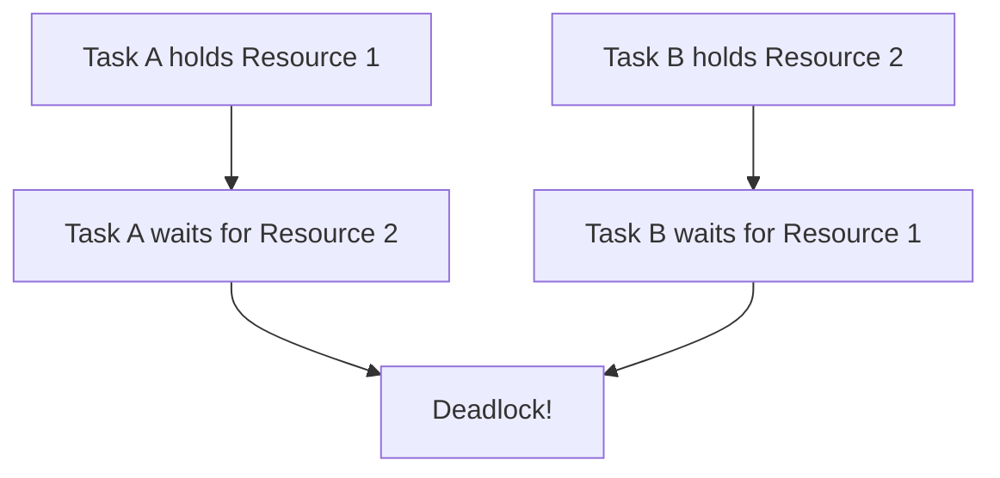

# Real-Time Communication

## Introduction

In a Real-Time Operating System (RTOS), tasks don't operate in isolation. They need to communicate with each other, share data, synchronize their activities, and coordinate their execution. Real-time communication refers to the mechanisms and protocols that enable tasks and processes to exchange information while maintaining predictable timing guarantees.

Unlike general-purpose operating systems, where communication delays might be acceptable, RTOS applications require deterministic communication with bounded latency to meet strict timing constraints. In this guide, we'll explore various communication mechanisms used in RTOSs and how they maintain real-time properties.

## Why Real-Time Communication is Critical

Real-time systems, like automotive control units, medical devices, or industrial automation systems, rely on timely communication between components. Consider an autonomous vehicle where:

1. A sensor task detects an obstacle
2. It must communicate this information to the decision-making task
3. The decision-making task must then communicate actions to the braking system

If any communication delay occurs in this chain, the consequences could be severe. Real-time communication mechanisms ensure these interactions happen predictably and within defined time constraints.

## Core Communication Mechanisms in RTOS

### 1. Semaphores

Semaphores are one of the simplest forms of communication mechanisms in an RTOS. They allow tasks to signal events to each other.

#### Binary Semaphores

A binary semaphore can be in one of two states: available (1) or unavailable (0). They're often used for signaling between tasks.

```c
// Example: Task synchronization using a binary semaphore
#include "rtos_api.h"

// Create a binary semaphore
semaphore_t signal_semaphore;

void producer_task(void *param) {
    while (1) {
        // Perform some work
        process_data();
        
        // Signal the consumer task
        semaphore_give(signal_semaphore);
        
        // Optional delay
        task_delay(100);
    }
}

void consumer_task(void *param) {
    while (1) {
        // Wait for the signal from producer
        semaphore_take(signal_semaphore, WAIT_FOREVER);
        
        // Process the data
        handle_data();
    }
}

int main() {
    // Initialize the semaphore
    semaphore_create(&signal_semaphore, 0);
    
    // Create tasks
    task_create(producer_task, "Producer", NORMAL_PRIORITY, NULL);
    task_create(consumer_task, "Consumer", NORMAL_PRIORITY, NULL);
    
    // Start the scheduler
    start_scheduler();
    
    return 0;
}
```

In this example, the `producer_task` signals the `consumer_task` when data is ready to be processed.

#### Counting Semaphores

Counting semaphores can have values greater than 1, allowing multiple resources to be managed.

```c
// Example: Managing a pool of resources with counting semaphores
#include "rtos_api.h"

#define MAX_RESOURCES 5

// Create a counting semaphore
semaphore_t resource_semaphore;
resource_t resource_pool[MAX_RESOURCES];

void task_using_resources(void *param) {
    while (1) {
        // Acquire a resource
        semaphore_take(resource_semaphore, WAIT_FOREVER);
        
        // Find an available resource
        resource_t *resource = get_available_resource(resource_pool);
        
        // Use the resource
        use_resource(resource);
        
        // Release the resource
        release_resource(resource);
        semaphore_give(resource_semaphore);
        
        // Optional delay
        task_delay(50);
    }
}

int main() {
    // Initialize the semaphore with MAX_RESOURCES
    semaphore_create(&resource_semaphore, MAX_RESOURCES);
    
    // Initialize resource pool
    init_resource_pool(resource_pool, MAX_RESOURCES);
    
    // Create multiple tasks that will use resources
    for (int i = 0; i < 3; i++) {
        task_create(task_using_resources, "ResourceUser", NORMAL_PRIORITY, NULL);
    }
    
    // Start the scheduler
    start_scheduler();
    
    return 0;
}
```

### 2. Message Queues

Message queues allow tasks to exchange data packets or messages. They provide a more structured way to communicate than semaphores.

```c
// Example: Communication using message queues
#include "rtos_api.h"

// Define message structure
typedef struct {
    int sensor_id;
    float sensor_value;
    uint32_t timestamp;
} sensor_data_t;

// Create a message queue
queue_t data_queue;

void sensor_task(void *param) {
    sensor_data_t data;
    
    while (1) {
        // Read sensor data
        data.sensor_id = 1;
        data.sensor_value = read_sensor();
        data.timestamp = get_current_time();
        
        // Send data to processing task
        queue_send(data_queue, &data, sizeof(sensor_data_t));
        
        // Wait before next reading
        task_delay(200);
    }
}

void processing_task(void *param) {
    sensor_data_t received_data;
    
    while (1) {
        // Receive data from the queue
        if (queue_receive(data_queue, &received_data, sizeof(sensor_data_t), 500) == SUCCESS) {
            // Process the data
            process_sensor_data(&received_data);
            
            // Log or act on the data
            if (received_data.sensor_value > THRESHOLD) {
                trigger_alarm();
            }
        }
    }
}

int main() {
    // Create a queue that can hold 10 sensor_data_t messages
    queue_create(&data_queue, 10, sizeof(sensor_data_t));
    
    // Create tasks
    task_create(sensor_task, "Sensor", HIGH_PRIORITY, NULL);
    task_create(processing_task, "Processor", MEDIUM_PRIORITY, NULL);
    
    // Start the scheduler
    start_scheduler();
    
    return 0;
}
```

Message queues support multiple producers and consumers, allow prioritization of messages, and can have configurable timeouts for deterministic behavior.

### 3. Mailboxes

Mailboxes are similar to message queues but typically hold only one message. They're useful for overwriting old data with the newest.

```c
// Example: Using a mailbox for latest data
#include "rtos_api.h"

// Define data structure
typedef struct {
    float x_position;
    float y_position;
    float orientation;
} position_data_t;

// Create a mailbox
mailbox_t position_mailbox;

void position_sensor_task(void *param) {
    position_data_t current_position;
    
    while (1) {
        // Update current position data
        update_position_data(&current_position);
        
        // Put the latest position in the mailbox (overwrites previous)
        mailbox_post(position_mailbox, &current_position, sizeof(position_data_t));
        
        // Sample at regular intervals
        task_delay(50);
    }
}

void navigation_task(void *param) {
    position_data_t position;
    
    while (1) {
        // Get the latest position data
        if (mailbox_get(position_mailbox, &position, sizeof(position_data_t), 100) == SUCCESS) {
            // Use the position data for navigation
            update_navigation_path(&position);
        }
        
        // Run navigation calculations
        calculate_next_move();
        
        task_delay(100);
    }
}

int main() {
    // Create a mailbox
    mailbox_create(&position_mailbox, sizeof(position_data_t));
    
    // Create tasks
    task_create(position_sensor_task, "PositionSensor", HIGH_PRIORITY, NULL);
    task_create(navigation_task, "Navigation", MEDIUM_PRIORITY, NULL);
    
    // Start the scheduler
    start_scheduler();
    
    return 0;
}
```

### 4. Shared Memory

Shared memory allows multiple tasks to access the same memory region, which can be the fastest form of communication.

```c
// Example: Using shared memory with protection
#include "rtos_api.h"

// Define shared data structure
typedef struct {
    float temperature;
    float pressure;
    float humidity;
    uint32_t update_count;
} environment_data_t;

// Shared memory
environment_data_t *shared_env_data;

// Mutex to protect access
mutex_t data_mutex;

void sensor_reader_task(void *param) {
    while (1) {
        // Read new sensor values
        float new_temp = read_temperature_sensor();
        float new_pressure = read_pressure_sensor();
        float new_humidity = read_humidity_sensor();
        
        // Update shared memory safely
        mutex_lock(data_mutex);
        
        shared_env_data->temperature = new_temp;
        shared_env_data->pressure = new_pressure;
        shared_env_data->humidity = new_humidity;
        shared_env_data->update_count++;
        
        mutex_unlock(data_mutex);
        
        // Read sensors at regular intervals
        task_delay(1000);
    }
}

void display_task(void *param) {
    environment_data_t local_copy;
    
    while (1) {
        // Get a consistent copy of the data
        mutex_lock(data_mutex);
        
        // Copy the entire structure
        local_copy = *shared_env_data;
        
        mutex_unlock(data_mutex);
        
        // Use the data without holding the mutex
        update_display(&local_copy);
        
        // Update display at regular intervals
        task_delay(500);
    }
}

int main() {
    // Allocate shared memory
    shared_env_data = (environment_data_t *)malloc(sizeof(environment_data_t));
    
    // Initialize mutex
    mutex_create(&data_mutex);
    
    // Initialize shared data
    shared_env_data->temperature = 0.0f;
    shared_env_data->pressure = 0.0f;
    shared_env_data->humidity = 0.0f;
    shared_env_data->update_count = 0;
    
    // Create tasks
    task_create(sensor_reader_task, "SensorReader", HIGH_PRIORITY, NULL);
    task_create(display_task, "Display", LOW_PRIORITY, NULL);
    
    // Start the scheduler
    start_scheduler();
    
    return 0;
}
```

When using shared memory, proper synchronization mechanisms like mutexes are essential to prevent race conditions.

### 5. Events and Signals

Events allow tasks to wait for multiple conditions before proceeding, which is ideal for complex synchronization scenarios.

```c
// Example: Using events for multiple conditions
#include "rtos_api.h"

// Define event flags
#define TEMP_DATA_READY    0x01
#define PRESSURE_DATA_READY 0x02
#define GYRO_DATA_READY    0x04
#define ALL_SENSORS_READY  (TEMP_DATA_READY | PRESSURE_DATA_READY | GYRO_DATA_READY)

// Create event group
event_group_t sensor_events;

void temperature_task(void *param) {
    while (1) {
        // Read temperature sensor
        read_temperature();
        
        // Set the temperature data ready flag
        event_group_set_bits(sensor_events, TEMP_DATA_READY);
        
        task_delay(100);
    }
}

void pressure_task(void *param) {
    while (1) {
        // Read pressure sensor
        read_pressure();
        
        // Set the pressure data ready flag
        event_group_set_bits(sensor_events, PRESSURE_DATA_READY);
        
        task_delay(120);
    }
}

void gyro_task(void *param) {
    while (1) {
        // Read gyroscope
        read_gyroscope();
        
        // Set the gyro data ready flag
        event_group_set_bits(sensor_events, GYRO_DATA_READY);
        
        task_delay(80);
    }
}

void fusion_task(void *param) {
    while (1) {
        // Wait for all sensor data to be ready
        event_group_wait_bits(sensor_events, ALL_SENSORS_READY, TRUE, TRUE, WAIT_FOREVER);
        
        // All data is ready, perform sensor fusion
        perform_sensor_fusion();
        
        // Clear all bits is usually automatic when wait with 'clear on exit' is TRUE
    }
}

int main() {
    // Create the event group
    event_group_create(&sensor_events);
    
    // Create sensor tasks
    task_create(temperature_task, "Temp", NORMAL_PRIORITY, NULL);
    task_create(pressure_task, "Pressure", NORMAL_PRIORITY, NULL);
    task_create(gyro_task, "Gyro", NORMAL_PRIORITY, NULL);
    task_create(fusion_task, "Fusion", HIGH_PRIORITY, NULL);
    
    // Start the scheduler
    start_scheduler();
    
    return 0;
}
```

## Real-Time Considerations for Communication

When implementing communication in real-time systems, consider these critical factors:

### 1. Priority Inversion

Priority inversion occurs when a high-priority task is indirectly preempted by a lower-priority task. This can happen in communication scenarios and cause timing violations.

```mermaid
sequenceDiagram
    participant High as High Priority Task
    participant Medium as Medium Priority Task
    participant Low as Low Priority Task
    participant Mutex as Shared Resource
    
    Low->>Mutex: Acquire mutex
    Note over Low, Mutex: Low priority task has resource
    High->>Mutex: Attempt to acquire mutex (blocked)
    Note over High, Mutex: High priority task waits
    Medium->>+Low: Preempt low priority task
    Note over Medium, Low: Medium priority task runs
    Note over High: High priority task remains blocked
    Medium-->>-Low: Complete execution
    Low->>Mutex: Release mutex
    Mutex->>High: Resource available
    High->>High: Can now proceed
```

To prevent priority inversion, RTOSs implement mechanisms like priority inheritance or priority ceiling protocols.

### 2. Bounded Execution Time

All communication operations must have bounded execution times to maintain real-time guarantees.

### 3. Deterministic Behavior

Communication mechanisms must behave predictably, especially under worst-case scenarios.

## Practical Example: Temperature Control System

Let's bring together these concepts in a complete temperature control system example:

```c
// Example: Temperature control system
#include "rtos_api.h"

// Define message structures
typedef struct {
    float current_temp;
    uint32_t timestamp;
} temp_reading_t;

typedef struct {
    bool heater_on;
    uint8_t fan_speed;  // 0-100%
} control_command_t;

// Communication objects
queue_t temp_queue;
queue_t command_queue;
semaphore_t new_setpoint_sem;
mutex_t setpoint_mutex;

// Shared data
float target_temperature = 22.0f;  // Initial setpoint in Celsius

void temperature_sensor_task(void *param) {
    temp_reading_t reading;
    
    while (1) {
        // Read current temperature
        reading.current_temp = get_sensor_temperature();
        reading.timestamp = get_current_time_ms();
        
        // Send to control algorithm
        queue_send(temp_queue, &reading, sizeof(temp_reading_t));
        
        // Read temperature every 500ms
        task_delay(500);
    }
}

void control_algorithm_task(void *param) {
    temp_reading_t temp_data;
    control_command_t command;
    float current_setpoint;
    
    while (1) {
        // Wait for new temperature reading
        if (queue_receive(temp_queue, &temp_data, sizeof(temp_reading_t), 1000) == SUCCESS) {
            // Get current setpoint (safely)
            mutex_lock(setpoint_mutex);
            current_setpoint = target_temperature;
            mutex_unlock(setpoint_mutex);
            
            // Simple control algorithm
            if (temp_data.current_temp < (current_setpoint - 0.5f)) {
                // Too cold, turn on heater
                command.heater_on = true;
                command.fan_speed = calculate_fan_speed(current_setpoint - temp_data.current_temp);
            } else if (temp_data.current_temp > (current_setpoint + 0.5f)) {
                // Too hot, turn off heater, maybe use fan
                command.heater_on = false;
                command.fan_speed = calculate_fan_speed(temp_data.current_temp - current_setpoint);
            } else {
                // Within acceptable range
                command.heater_on = false;
                command.fan_speed = 0;
            }
            
            // Send command to actuator task
            queue_send(command_queue, &command, sizeof(control_command_t));
            
            // Log current state
            log_temperature_control(temp_data.current_temp, current_setpoint, 
                                   command.heater_on, command.fan_speed);
        }
    }
}

void actuator_task(void *param) {
    control_command_t command;
    
    while (1) {
        // Wait for control commands
        if (queue_receive(command_queue, &command, sizeof(control_command_t), WAIT_FOREVER) == SUCCESS) {
            // Apply the commands to physical devices
            set_heater_state(command.heater_on);
            set_fan_speed(command.fan_speed);
        }
    }
}

void user_interface_task(void *param) {
    float new_setpoint;
    
    while (1) {
        // Check if user has input a new setpoint
        if (get_user_setpoint_input(&new_setpoint)) {
            // Update setpoint safely
            mutex_lock(setpoint_mutex);
            target_temperature = new_setpoint;
            mutex_unlock(setpoint_mutex);
            
            // Signal that setpoint has changed
            semaphore_give(new_setpoint_sem);
            
            // Update display
            update_display_setpoint(new_setpoint);
        }
        
        // Update other UI elements
        update_temperature_display();
        
        // Check UI at regular intervals
        task_delay(100);
    }
}

int main() {
    // Initialize communication objects
    queue_create(&temp_queue, 10, sizeof(temp_reading_t));
    queue_create(&command_queue, 5, sizeof(control_command_t));
    semaphore_create(&new_setpoint_sem, 0);
    mutex_create(&setpoint_mutex);
    
    // Create tasks with appropriate priorities
    task_create(temperature_sensor_task, "TempSensor", HIGH_PRIORITY, NULL);
    task_create(control_algorithm_task, "Controller", HIGH_PRIORITY, NULL);
    task_create(actuator_task, "Actuator", MEDIUM_PRIORITY, NULL);
    task_create(user_interface_task, "UI", LOW_PRIORITY, NULL);
    
    // Start the scheduler
    start_scheduler();
    
    return 0;
}
```

In this example:

1. The temperature sensor task reads current temperature and sends it via a queue
2. The control algorithm task processes readings and generates commands
3. The actuator task receives commands and controls physical devices
4. The user interface task handles user input and updates displays
5. Multiple communication mechanisms ensure proper coordination

## Common Challenges in Real-Time Communication

### 1. Timing Violations

If communication takes too long, it can cause tasks to miss their deadlines. Use timeouts and error handling to address this.

### 2. Resource Contention

Multiple tasks competing for the same communication resources can cause delays. Design your system to minimize contention.

### 3. Buffer Overflows

Message queues with limited capacity can overflow if producers are faster than consumers. Implement proper flow control and error handling.

### 4. Deadlocks

Tasks can deadlock if they wait for resources in a circular manner. Always acquire resources in a consistent order to prevent deadlocks.



## Communication Patterns in Real-Time Systems

### Producer-Consumer Pattern

The producer generates data that the consumer processes, often using a queue or buffer between them.

### Client-Server Pattern

One task (server) provides services that other tasks (clients) can request, typically implemented with message queues.

### Observer Pattern

Tasks register interest in certain events and are notified when they occur, often implemented with event flags or signals.

## Best Practices for Real-Time Communication

1. **Choose Appropriate Mechanisms**: Select communication mechanisms based on your timing requirements.
2. **Minimize Blocking**: Avoid indefinite blocking in high-priority tasks.
3. **Use Timeouts**: Always specify timeouts when waiting for communication resources.
4. **Handle Errors**: Implement robust error handling for all communication failures.
5. **Keep Critical Sections Short**: Minimize the time spent holding shared resources.
6. **Document Timing Properties**: Document the worst-case execution time for all communication operations.

## Summary

Real-time communication is essential for building predictable and reliable RTOS applications. By choosing appropriate communication mechanisms and following best practices, you can ensure your system meets its timing requirements while maintaining proper coordination between tasks.

The key mechanisms we've covered include:
- Semaphores for signaling and synchronization
- Message queues for structured data exchange
- Mailboxes for latest-value access
- Shared memory for high-performance data sharing
- Event flags for complex condition synchronization

Each mechanism has its advantages and trade-offs in terms of performance, complexity, and real-time guarantees.

## Exercises

1. Implement a producer-consumer system using semaphores and a circular buffer.
2. Modify the temperature control example to handle communication timeouts.
3. Identify potential priority inversion scenarios in the examples and implement solutions.
4. Design a communication system for a quadcopter that needs to process sensor data and control motors with strict timing requirements.
5. Implement the observer pattern using event flags where multiple tasks can subscribe to different combinations of events.

## Additional Resources

- "Real-Time Systems: Design Principles for Distributed Embedded Applications" by Hermann Kopetz
- "Programming Real-Time Systems" by Jane W. S. Liu
- [FreeRTOS Communication Documentation](https://www.freertos.org)
- [RT-Thread Programming Manual](https://www.rt-thread.io)
- [Zephyr Project Documentation](https://docs.zephyrproject.org)