# Real-Time Kernels

## Introduction

Real-time kernels are the core components of Real-Time Operating Systems (RTOS) that enable predictable timing behavior for embedded and time-critical applications. Unlike general-purpose operating systems that prioritize throughput and average performance, real-time kernels focus on deterministic responses within guaranteed time constraints.

In this guide, we'll explore what real-time kernels are, how they work, and why they're essential for time-sensitive applications.

## What is a Real-Time Kernel?

A real-time kernel is the central component of an RTOS responsible for:

- Task scheduling and management
- Interrupt handling
- Inter-process communication
- Resource management
- Time management

The key characteristic that distinguishes real-time kernels from general-purpose kernels is **determinism** — the ability to respond to events within predictable and guaranteed time frames.

## Types of Real-Time Kernels

Real-time kernels can be classified based on their timing guarantees:

### 1. Hard Real-Time Kernels

Hard real-time kernels guarantee that tasks will complete within their deadlines. Missing a deadline in hard real-time systems can lead to system failure or catastrophic consequences.

**Examples:** Kernels used in aircraft control systems, medical devices, automotive safety systems.

### 2. Soft Real-Time Kernels

Soft real-time kernels prioritize meeting deadlines but can tolerate occasional missed deadlines. The system remains functional even if some timing constraints aren't met, though with degraded performance.

**Examples:** Kernels used in multimedia applications, telecommunications, and some consumer electronics.

### 3. Firm Real-Time Kernels

Firm real-time kernels fall between hard and soft. Missing deadlines doesn't cause catastrophic failure but renders the results useless.

**Examples:** Kernels used in financial trading systems, some industrial automation applications.

## Key Features of Real-Time Kernels

### 1. Preemptive Scheduling

Real-time kernels typically use preemptive priority-based scheduling, where higher-priority tasks can interrupt lower-priority ones.

```c
// Pseudocode for a priority-based task creation in FreeRTOS
void createTasks() {
    // Create a high-priority task
    xTaskCreate(
        highPriorityTask,     // Function to execute
        "HighPriorityTask",   // Task name
        configMINIMAL_STACK_SIZE,  // Stack size
        NULL,                 // Parameters
        10,                   // Priority (higher number = higher priority)
        NULL                  // Task handle
    );
    
    // Create a low-priority task
    xTaskCreate(
        lowPriorityTask,      // Function to execute
        "LowPriorityTask",    // Task name
        configMINIMAL_STACK_SIZE,  // Stack size
        NULL,                 // Parameters
        5,                    // Priority (lower number = lower priority)
        NULL                  // Task handle
    );
}

// This high-priority task will preempt the low-priority task when it's ready to run
void highPriorityTask(void *pvParameters) {
    for (;;) {
        // Task code here
        vTaskDelay(pdMS_TO_TICKS(100)); // Delay for 100ms
    }
}

void lowPriorityTask(void *pvParameters) {
    for (;;) {
        // This task will be interrupted when highPriorityTask is ready
        // Task code here
        vTaskDelay(pdMS_TO_TICKS(200)); // Delay for 200ms
    }
}
```

### 2. Deterministic Behavior

Real-time kernels provide bounded and predictable execution times for kernel operations like context switching, interrupt handling, and system calls.

### 3. Priority Inheritance

To prevent priority inversion problems (where a low-priority task indirectly blocks a high-priority task), real-time kernels often implement priority inheritance protocols.

```c
// Example of using a mutex with priority inheritance in FreeRTOS
SemaphoreHandle_t xMutex;

void initializeMutex() {
    // Create a mutex with priority inheritance enabled
    xMutex = xSemaphoreCreateMutex();
}

void taskUsingSharedResource(void *pvParameters) {
    for (;;) {
        // Try to take the mutex
        if (xSemaphoreTake(xMutex, portMAX_DELAY) == pdTRUE) {
            // Access the shared resource
            // ...
            
            // Release the mutex
            xSemaphoreGive(xMutex);
        }
        vTaskDelay(pdMS_TO_TICKS(100));
    }
}
```

### 4. Small Memory Footprint

Real-time kernels are designed to be compact and efficient, suitable for embedded systems with limited resources.

### 5. Low Latency

They minimize the time between an event occurrence and the system's response to it.

## Scheduling in Real-Time Kernels

Scheduling is a critical aspect of real-time kernels. Common scheduling algorithms include:

### Rate Monotonic Scheduling (RMS)

A fixed-priority scheduling algorithm where tasks with shorter periods receive higher priorities.

### Earliest Deadline First (EDF)

A dynamic scheduling algorithm that assigns priorities based on absolute deadlines, with earlier deadlines receiving higher priorities.

### Deadline Monotonic Scheduling (DMS)

Similar to RMS, but priorities are assigned based on deadlines rather than periods.

Let's visualize a simple scheduling scenario:

```mermaid
gantt
    title Task Scheduling in a Real-Time Kernel
    dateFormat s
    axisFormat %S
    
    section Task A (High Priority)
    Execution    :a1, 0, 2s
    Preempted    :a2, 5, 1s
    Execution    :a3, 10, 2s
    
    section Task B (Medium Priority)
    Waiting      :b1, 0, 2s
    Execution    :b2, 2, 3s
    Preempted    :b3, 5, 1s
    Execution    :b4, 6, 4s
    Waiting      :b5, 10, 2s
    
    section Task C (Low Priority)
    Waiting      :c1, 0, 5s
    Execution    :c2, 5, 1s
    Waiting      :c3, 6, 6s
    Execution    :c4, 12, 3s
```



## Common Real-Time Kernels

### FreeRTOS

A popular, open-source, and portable real-time kernel designed for microcontrollers and small embedded systems.

```c
// Basic FreeRTOS application structure
#include "FreeRTOS.h"
#include "task.h"

void ledTask(void *pvParameters) {
    // Set up GPIO for LED
    
    for (;;) {
        // Toggle LED
        GPIO_ToggleBits(LED_PORT, LED_PIN);
        
        // Delay for 500ms
        vTaskDelay(pdMS_TO_TICKS(500));
    }
}

int main(void) {
    // Initialize hardware
    
    // Create the task
    xTaskCreate(
        ledTask,                // Function to implement the task
        "LED_Task",             // Name of the task
        configMINIMAL_STACK_SIZE,  // Stack size
        NULL,                   // Task parameters
        1,                      // Priority
        NULL                    // Task handle
    );
    
    // Start the scheduler
    vTaskStartScheduler();
    
    // Will only get here if there was insufficient heap memory
    for (;;);
}
```

### RTLinux

A hard real-time extension for the Linux kernel, providing real-time capabilities while maintaining Linux's features.

### µC/OS

A commercial real-time kernel with certification for safety-critical systems (medical, aerospace, etc.).

### RIOT OS

An open-source microkernel-based operating system designed for the Internet of Things (IoT).

## Real-World Applications

### Automotive Systems

Modern vehicles use real-time kernels to manage engine control units (ECUs), anti-lock braking systems (ABS), and advanced driver-assistance systems (ADAS).

```c
// Pseudocode for an anti-lock braking system task
void absControlTask(void *pvParameters) {
    for (;;) {
        // Read wheel speed sensors
        float wheelSpeeds[4];
        readWheelSpeedSensors(wheelSpeeds);
        
        // Detect wheel lock conditions
        bool wheelLocking[4] = {false};
        for (int i = 0; i < 4; i++) {
            if (isWheelLocking(wheelSpeeds[i])) {
                wheelLocking[i] = true;
            }
        }
        
        // Apply brake pressure modulation if needed
        for (int i = 0; i < 4; i++) {
            if (wheelLocking[i]) {
                reduceBrakePressure(i);
            }
        }
        
        // This task must run at precise intervals (e.g., every 5ms)
        vTaskDelayUntil(&xLastWakeTime, pdMS_TO_TICKS(5));
    }
}
```

### Medical Devices

Life-supporting and monitoring systems like infusion pumps, ventilators, and pacemakers rely on real-time kernels to ensure timely responses.

### Industrial Automation

Manufacturing robots, assembly lines, and process control systems use real-time kernels to maintain precise timing and coordination.

### Aerospace Systems

Flight control systems, navigation, and onboard computers in aircraft and spacecraft depend on hard real-time kernels for safe operation.

## Developing with Real-Time Kernels

When developing applications with real-time kernels, keep these best practices in mind:

### 1. Task Design

- Keep critical tasks short and deterministic
- Avoid busy waiting and blocking operations
- Use appropriate priorities based on task importance and deadlines

### 2. Resource Management

- Minimize shared resource usage
- Use proper synchronization mechanisms (mutexes, semaphores)
- Be aware of priority inversion issues

### 3. Timing Analysis

- Perform worst-case execution time (WCET) analysis
- Consider all paths through the code
- Account for interrupts and context switching overheads

### 4. Testing

- Test under load conditions
- Verify timing constraints are met
- Simulate fault scenarios

## Example: Building a Simple LED Controller with FreeRTOS

Let's create a simple application that controls multiple LEDs with different blinking patterns using FreeRTOS:

```c
#include "FreeRTOS.h"
#include "task.h"
#include "stm32f4xx_hal.h"  // Example HAL for STM32 microcontrollers

// LED GPIO pins (example for STM32)
#define LED1_PIN GPIO_PIN_0
#define LED2_PIN GPIO_PIN_1
#define LED3_PIN GPIO_PIN_2
#define LED_PORT GPIOA

// Task handles
TaskHandle_t xLED1TaskHandle = NULL;
TaskHandle_t xLED2TaskHandle = NULL;
TaskHandle_t xLED3TaskHandle = NULL;
TaskHandle_t xMonitorTaskHandle = NULL;

// LED task function with configurable blink rate
void vLEDTask(void *pvParameters) {
    uint32_t ledPin = *((uint32_t*)pvParameters);
    uint32_t blinkRate;
    
    // Assign different blink rates based on the LED pin
    if (ledPin == LED1_PIN) {
        blinkRate = 500;  // 500ms (2Hz)
    } else if (ledPin == LED2_PIN) {
        blinkRate = 1000; // 1000ms (1Hz)
    } else {
        blinkRate = 2000; // 2000ms (0.5Hz)
    }
    
    // Task loop
    while (1) {
        // Toggle LED
        HAL_GPIO_TogglePin(LED_PORT, ledPin);
        
        // Delay for the specified period
        vTaskDelay(pdMS_TO_TICKS(blinkRate));
    }
}

// Monitor task with higher priority that periodically checks system status
void vMonitorTask(void *pvParameters) {
    TickType_t xLastWakeTime;
    const TickType_t xPeriod = pdMS_TO_TICKS(100);  // 100ms period
    
    // Initialize the xLastWakeTime variable with the current time
    xLastWakeTime = xTaskGetTickCount();
    
    while (1) {
        // Check system status (example: monitor temperature)
        float temperature = readTemperatureSensor();
        
        // If temperature is too high, suspend the LED tasks to reduce power
        if (temperature > 50.0f) {
            if (xLED1TaskHandle != NULL) vTaskSuspend(xLED1TaskHandle);
            if (xLED2TaskHandle != NULL) vTaskSuspend(xLED2TaskHandle);
            if (xLED3TaskHandle != NULL) vTaskSuspend(xLED3TaskHandle);
        } else {
            // Resume tasks if they were suspended
            if (xLED1TaskHandle != NULL) vTaskResume(xLED1TaskHandle);
            if (xLED2TaskHandle != NULL) vTaskResume(xLED2TaskHandle);
            if (xLED3TaskHandle != NULL) vTaskResume(xLED3TaskHandle);
        }
        
        // Run this task at precise intervals using vTaskDelayUntil
        vTaskDelayUntil(&xLastWakeTime, xPeriod);
    }
}

// Function to read a temperature sensor (dummy implementation)
float readTemperatureSensor() {
    // In a real application, this would communicate with actual hardware
    static float temperature = 25.0f;
    
    // Simulate temperature changes
    temperature += (rand() % 3 - 1) * 0.1f;
    
    return temperature;
}

// Initialize GPIO pins for LEDs
void initLEDs() {
    GPIO_InitTypeDef GPIO_InitStruct = {0};
    
    // Enable the GPIO clock
    __HAL_RCC_GPIOA_CLK_ENABLE();
    
    // Configure GPIO pins as outputs
    GPIO_InitStruct.Pin = LED1_PIN | LED2_PIN | LED3_PIN;
    GPIO_InitStruct.Mode = GPIO_MODE_OUTPUT_PP;
    GPIO_InitStruct.Pull = GPIO_NOPULL;
    GPIO_InitStruct.Speed = GPIO_SPEED_FREQ_LOW;
    HAL_GPIO_Init(LED_PORT, &GPIO_InitStruct);
    
    // Initialize all LEDs to off state
    HAL_GPIO_WritePin(LED_PORT, LED1_PIN | LED2_PIN | LED3_PIN, GPIO_PIN_RESET);
}

int main(void) {
    // Initialize hardware
    HAL_Init();
    SystemClock_Config();  // System clock configuration
    initLEDs();
    
    // Static parameters for LED tasks
    static uint32_t led1Pin = LED1_PIN;
    static uint32_t led2Pin = LED2_PIN;
    static uint32_t led3Pin = LED3_PIN;
    
    // Create LED control tasks
    xTaskCreate(vLEDTask, "LED1_Task", configMINIMAL_STACK_SIZE, &led1Pin, 1, &xLED1TaskHandle);
    xTaskCreate(vLEDTask, "LED2_Task", configMINIMAL_STACK_SIZE, &led2Pin, 1, &xLED2TaskHandle);
    xTaskCreate(vLEDTask, "LED3_Task", configMINIMAL_STACK_SIZE, &led3Pin, 1, &xLED3TaskHandle);
    
    // Create monitor task with higher priority
    xTaskCreate(vMonitorTask, "Monitor_Task", configMINIMAL_STACK_SIZE * 2, NULL, 2, &xMonitorTaskHandle);
    
    // Start the scheduler
    vTaskStartScheduler();
    
    // Should never get here as the scheduler should take over
    while (1) {
        // Error loop
    }
}
```

In this example:
- Three LED tasks run at different frequencies (0.5Hz, 1Hz, and 2Hz)
- A higher-priority monitor task checks system temperature every 100ms
- If the temperature exceeds a threshold, the monitor task suspends the LED tasks
- The tasks demonstrate priority-based scheduling, precise timing, and task synchronization

## Measuring Real-Time Performance

When working with real-time kernels, it's essential to measure and verify performance metrics like:

### 1. Interrupt Latency

The time between an interrupt being triggered and the start of the interrupt service routine.

### 2. Task Switch Time

The time it takes to switch context from one task to another.

### 3. Maximum Task Execution Time

The worst-case execution time for critical tasks.

```c
// Example code to measure execution time in FreeRTOS
void taskToMeasure(void *pvParameters) {
    TickType_t startTime, endTime, executionTime;
    
    for (;;) {
        // Record start time
        startTime = xTaskGetTickCount();
        
        // Execute task code
        performCriticalOperation();
        
        // Record end time
        endTime = xTaskGetTickCount();
        
        // Calculate execution time
        executionTime = endTime - startTime;
        
        // Log or report the execution time
        logExecutionTime(executionTime);
        
        vTaskDelay(pdMS_TO_TICKS(1000));
    }
}
```

## Debugging Real-Time Systems

Debugging real-time systems presents unique challenges:

- Traditional debugging techniques may affect timing behavior
- System behavior may change when debugged
- Issues might be intermittent or timing-dependent

Some approaches to effectively debug real-time systems:

### 1. Tracing

Capture execution history without significantly affecting performance.

### 2. Logic Analyzers

Monitor digital signals and timing relationships between events.

### 3. RTOS-Aware Debugging

Use tools that understand the kernel's task structures and scheduling.

### 4. Logging

Implement lightweight logging mechanisms that minimally impact timing.

```c
// Example of a lightweight logging function
#define MAX_LOG_ENTRIES 100

typedef struct {
    uint32_t timeStamp;
    uint32_t eventID;
    uint32_t data;
} LogEntry_t;

LogEntry_t logBuffer[MAX_LOG_ENTRIES];
volatile uint32_t logIndex = 0;

void logEvent(uint32_t eventID, uint32_t data) {
    // Disable interrupts briefly
    taskENTER_CRITICAL();
    
    if (logIndex < MAX_LOG_ENTRIES) {
        logBuffer[logIndex].timeStamp = xTaskGetTickCount();
        logBuffer[logIndex].eventID = eventID;
        logBuffer[logIndex].data = data;
        logIndex++;
    }
    
    // Re-enable interrupts
    taskEXIT_CRITICAL();
}
```

## Summary

Real-time kernels are specialized operating system cores designed for time-critical applications where predictable timing behavior is essential. Key features include:

- Deterministic scheduling and execution
- Low latency response to events
- Efficient memory and resource management
- Support for priority-based task execution

Understanding real-time kernels is crucial for developing reliable embedded systems in industries like automotive, aerospace, medical devices, and industrial automation.

When designing applications with real-time kernels, focus on:
- Proper task design and prioritization
- Careful resource management
- Thorough timing analysis and testing
- Appropriate selection of kernel features

## Exercises

1. **Basic Task Creation**
   Implement a system with three tasks of different priorities that communicate using a queue.

2. **Priority Inversion Demonstration**
   Create a scenario that demonstrates priority inversion, then modify it to use priority inheritance to solve the problem.

3. **Response Time Analysis**
   Measure and analyze the response time of a system under different load conditions.

4. **Real-Time Scheduling**
   Implement both Rate Monotonic and Earliest Deadline First scheduling for a set of periodic tasks and compare their performance.

5. **Resource Synchronization**
   Design a system where multiple tasks need access to a shared resource, and implement appropriate synchronization mechanisms.

## Additional Resources

### Books
- "Real-Time Systems Design and Analysis" by Phillip A. Laplante
- "Real-Time Concepts for Embedded Systems" by Qing Li
- "Hard Real-Time Computing Systems" by Giorgio C. Buttazzo

### Online Resources
- FreeRTOS Documentation: https://www.freertos.org/documentation-and-books.html
- OSEK/VDX Standard for Automotive RTOS: https://www.osek-vdx.org/
- Real-Time Systems Journal: https://link.springer.com/journal/11241

### Development Tools
- Tracealyzer for FreeRTOS: https://percepio.com/tracealyzer/
- SEGGER SystemView: https://www.segger.com/products/development-tools/systemview/
- IAR Embedded Workbench: https://www.iar.com/products/architectures/arm/iar-embedded-workbench-for-arm/