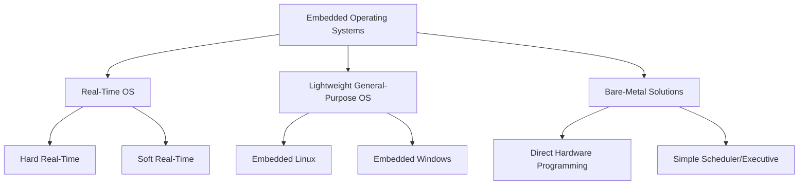

# Embedded Operating Systems

## Introduction

Embedded operating systems are specialized software platforms designed to run on embedded devices with limited resources. Unlike general-purpose operating systems (like Windows, macOS, or Linux desktop distributions), embedded OSes are optimized for specific hardware configurations, minimal memory footprints, and often real-time performance requirements.

These systems power everything from smart watches and medical devices to automotive control units and industrial automation equipment. As devices get smaller and more specialized, understanding embedded operating systems becomes crucial for developers working in IoT, wearables, and various embedded domains.

## Key Characteristics of Embedded Operating Systems

Embedded operating systems differ from desktop or server OSes in several important ways:

1. **Resource Efficiency**: Designed to operate with minimal RAM, storage, and processing power
2. **Real-Time Capabilities**: Many provide deterministic performance for time-critical applications
3. **Reliability**: Built for continuous operation, often without reboots for years
4. **Domain-Specific**: Tailored for particular applications or hardware environments
5. **Reduced Footprint**: Minimal size, often measured in kilobytes rather than gigabytes

## Types of Embedded Operating Systems



### Real-Time Operating Systems (RTOS)

Real-time operating systems are designed to process data and events with precise timing constraints. They're particularly important in applications where missed deadlines could have serious consequences.

#### Hard Real-Time vs Soft Real-Time

- **Hard Real-Time**: Absolute deadlines must be met (e.g., airbag deployment systems)
- **Soft Real-Time**: Some deadline misses are tolerable (e.g., video streaming)

#### Popular RTOS Examples

- **FreeRTOS**: Open-source, portable, and widely used in microcontroller applications
- **VxWorks**: Commercial RTOS used in critical systems like Mars rovers
- **QNX**: Microkernel RTOS used in automotive and industrial applications
- **RT-Linux**: Real-time extensions to the Linux kernel

### Lightweight General-Purpose OS

These are stripped-down versions of general-purpose operating systems modified for embedded use.

- **Embedded Linux**: Linux kernels customized for embedded devices
- **Windows IoT**: Microsoft's embedded Windows variants

### Bare-Metal Systems

Some embedded systems don't use an OS at all, running application code directly on the hardware.

## Components of Embedded Operating Systems

### Kernel

The kernel is the core of the operating system, providing essential services:

```
+------------------+
|  Applications    |
+------------------+
|   Middleware     |
+------------------+
|     Kernel       | ← The core that manages resources
+------------------+
|    Hardware      |
+------------------+
```

Key kernel responsibilities include:
- Task scheduling
- Memory management
- Device drivers
- Interrupt handling

### Scheduler

The scheduler determines which tasks run when, using different algorithms based on system requirements:

- **Preemptive**: Higher priority tasks can interrupt lower priority ones
- **Cooperative**: Tasks must voluntarily yield control
- **Round-Robin**: Tasks receive equal time slices in rotation

Let's look at a simple example of a round-robin scheduler in pseudocode:

```c
typedef struct {
    task_function_t function;
    bool active;
    // task context information
} Task;

Task tasks[MAX_TASKS];
int currentTask = 0;

void scheduler_tick() {
    // Save context of current task
    save_context(&tasks[currentTask]);
    
    // Find next active task
    do {
        currentTask = (currentTask + 1) % MAX_TASKS;
    } while (!tasks[currentTask].active && currentTask != 0);
    
    // Restore context of new task
    restore_context(&tasks[currentTask]);
    // Resume execution
}
```

### Memory Management

Embedded systems typically have limited RAM and storage, requiring specialized memory management:

- **Static allocation**: Memory assigned at compile time
- **Stack-based allocation**: Automatic memory that's freed when functions return
- **Simple heap management**: For dynamic allocation when necessary
- **Memory protection**: Isolation between tasks (if supported by hardware)

### Device Drivers

Device drivers provide the interface between hardware components and the operating system:

```c
// Simple LED driver example for ARM Cortex-M
#define LED_PORT GPIOA
#define LED_PIN  5

void led_init() {
    // Enable clock to GPIO port
    RCC->AHB1ENR |= RCC_AHB1ENR_GPIOAEN;
    
    // Configure pin as output
    LED_PORT->MODER &= ~(3 << (LED_PIN * 2));
    LED_PORT->MODER |= (1 << (LED_PIN * 2));
}

void led_on() {
    LED_PORT->BSRR = (1 << LED_PIN);
}

void led_off() {
    LED_PORT->BSRR = (1 << (LED_PIN + 16));
}
```

## FreeRTOS: A Practical Example

FreeRTOS is one of the most widely used embedded operating systems. Let's look at a simple example that creates two tasks on an Arduino:

```c
#include <Arduino_FreeRTOS.h>

// Task handles
TaskHandle_t blinkTaskHandle;
TaskHandle_t sensorTaskHandle;

// Task functions
void blinkTask(void *pvParameters);
void sensorTask(void *pvParameters);

void setup() {
  Serial.begin(9600);
  
  // Create tasks
  xTaskCreate(
    blinkTask,            // Task function
    "BlinkLED",           // Task name
    128,                  // Stack size (words)
    NULL,                 // Parameters
    1,                    // Priority (1 is low)
    &blinkTaskHandle);    // Task handle
    
  xTaskCreate(
    sensorTask,
    "ReadSensor",
    128,
    NULL,
    2,                    // Higher priority
    &sensorTaskHandle);
    
  // Start the scheduler
  vTaskStartScheduler();
}

void loop() {
  // Empty - FreeRTOS takes control
}

// Blink LED task
void blinkTask(void *pvParameters) {
  pinMode(LED_BUILTIN, OUTPUT);
  
  while(1) {
    digitalWrite(LED_BUILTIN, HIGH);
    vTaskDelay(500 / portTICK_PERIOD_MS);  // 500ms delay
    digitalWrite(LED_BUILTIN, LOW);
    vTaskDelay(500 / portTICK_PERIOD_MS);
  }
}

// Sensor reading task
void sensorTask(void *pvParameters) {
  pinMode(A0, INPUT);
  
  while(1) {
    int sensorValue = analogRead(A0);
    Serial.print("Sensor value: ");
    Serial.println(sensorValue);
    vTaskDelay(1000 / portTICK_PERIOD_MS);  // 1s delay
  }
}
```

This example demonstrates:
1. Task creation with different priorities
2. Task scheduling with the FreeRTOS scheduler
3. Delays that yield to other tasks
4. Concurrent execution of multiple functions

## Real-World Applications

### Smart Watches and Wearables

Modern wearables use embedded operating systems to balance performance with battery life:

- They manage low-power modes for extended battery life
- Handle sensor data collection and processing
- Provide real-time notifications while maintaining responsiveness

### Automotive Systems

Vehicles contain numerous embedded systems with different requirements:

- Engine control units (ECUs) use hard real-time OSes for critical timing
- Infotainment systems use lightweight general-purpose OSes
- Advanced driver assistance systems (ADAS) use specialized real-time platforms

### Industrial Automation

Factory automation relies heavily on embedded systems:

- Programmable Logic Controllers (PLCs) often use specialized OSes
- Sensors and actuators may use minimal RTOS implementations
- Human-Machine Interfaces (HMIs) might use embedded Linux or Windows

## Development Considerations

### Resource Constraints

When developing for embedded operating systems, consider:

- **Memory usage**: Both RAM and storage are typically limited
- **Processing power**: CPU cycles and energy consumption matter
- **Real-time requirements**: Determine if you need hard or soft real-time capabilities

### Development Tools

Common tools for embedded OS development include:

- **Cross-compilers**: Build code on development machines for target platforms
- **JTAG/SWD debuggers**: For hardware-level debugging
- **Emulators and simulators**: Test without physical hardware
- **Static analyzers**: Find bugs and optimize resource usage

### Example Toolchain Setup for ARM Cortex-M

Here's a simplified workflow for developing with an ARM-based embedded OS:

```bash
# Install ARM GNU toolchain
sudo apt install gcc-arm-none-eabi

# Compile example
arm-none-eabi-gcc -mcpu=cortex-m4 -mthumb -O2 -g \
  -DUSE_HAL_DRIVER -DSTM32F407xx \
  -Iinc -Idriver/inc \
  src/main.c src/system_stm32f4xx.c \
  -o build/firmware.elf

# Convert to binary
arm-none-eabi-objcopy -O binary \
  build/firmware.elf build/firmware.bin

# Flash to device using st-link utility
st-flash write build/firmware.bin 0x8000000
```

## Challenges in Embedded OS Development

### Power Management

Embedded systems often run on batteries or limited power sources:

- OSes must implement efficient sleep modes
- CPU frequency scaling to reduce power consumption
- Peripheral power management is critical

### Security Concerns

Embedded devices face unique security challenges:

- Limited resources for security features
- Often connected to networks (IoT)
- Long deployment lifespans with limited update capabilities

### Code Example: Power Management

```c
// Power management example for STM32
void enter_sleep_mode() {
  // Disable peripherals not needed during sleep
  disable_unused_peripherals();
  
  // Configure wake-up sources
  EXTI->IMR |= EXTI_IMR_MR0;  // Enable external interrupt 0
  
  // Enter sleep mode
  __WFI();  // Wait For Interrupt - CPU will sleep until interrupt occurs
  
  // Code execution continues here after waking up
  restore_peripherals();
}
```

## Embedded Linux vs. Traditional RTOS

A comparison table showing key differences:

| Feature | Embedded Linux | Traditional RTOS |
|---------|----------------|------------------|
| Footprint | 2-4MB+ | 10KB-1MB |
| Real-time | Soft real-time (with PREEMPT_RT) | Hard real-time |
| Memory Protection | Yes | Varies |
| File System | Full-featured | Minimal or none |
| Development | Familiar Linux tools | Specialized toolchains |
| Licensing | GPL or similar | Various (open/commercial) |
| Use Cases | Complex devices with more resources | Resource-constrained, timing-critical |

## Summary

Embedded operating systems provide essential capabilities for resource-constrained devices, enabling them to perform complex tasks efficiently and reliably. Key takeaways include:

1. Embedded OSes balance performance, power efficiency, and resource constraints
2. Real-time capabilities are critical for many applications
3. Different types of embedded OSes serve different application needs
4. Development requires specialized tools and considerations
5. Power management and security are ongoing challenges

## Additional Resources

To deepen your understanding of embedded operating systems:

- Explore open-source RTOS code (FreeRTOS, Zephyr, RT-Thread)
- Set up a development environment with an evaluation board
- Study hardware datasheets to understand platform constraints
- Join embedded system developer communities

## Exercises for Practice

1. Install FreeRTOS on an Arduino and implement a multi-task application
2. Modify the blink example to include inter-task communication using queues
3. Measure and optimize the memory footprint of your embedded application
4. Implement a simple power management strategy for a battery-powered device
5. Create a device driver for a sensor using an embedded OS framework