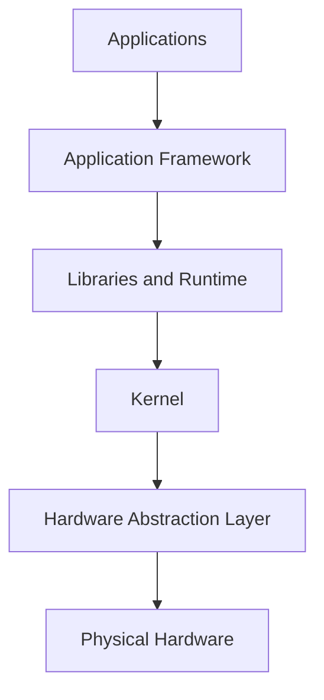
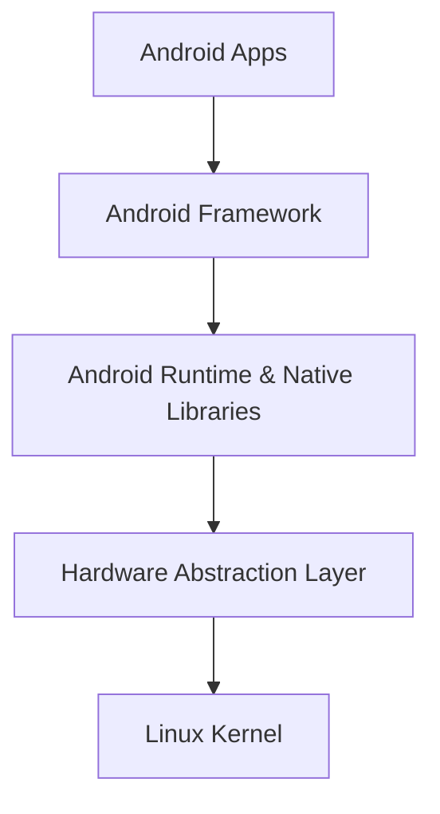
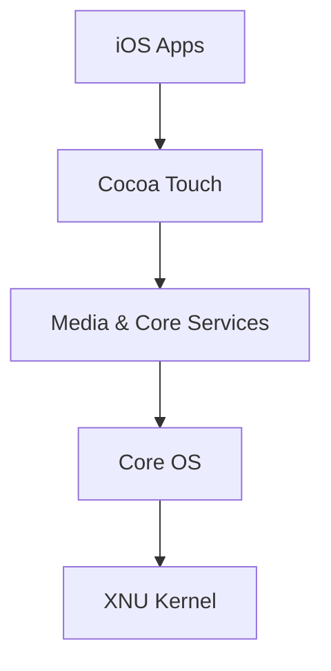
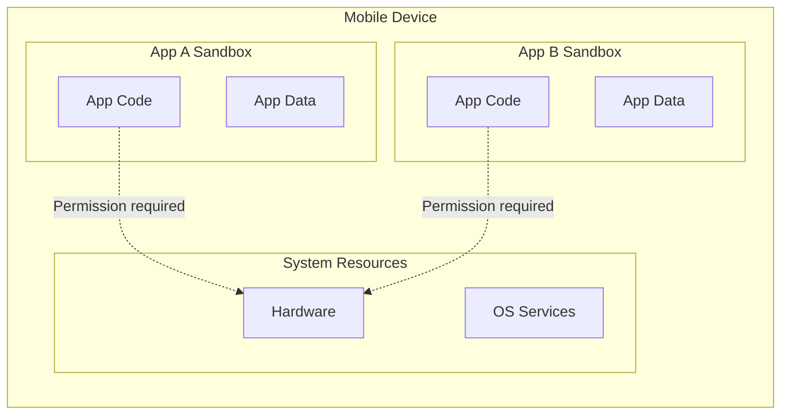
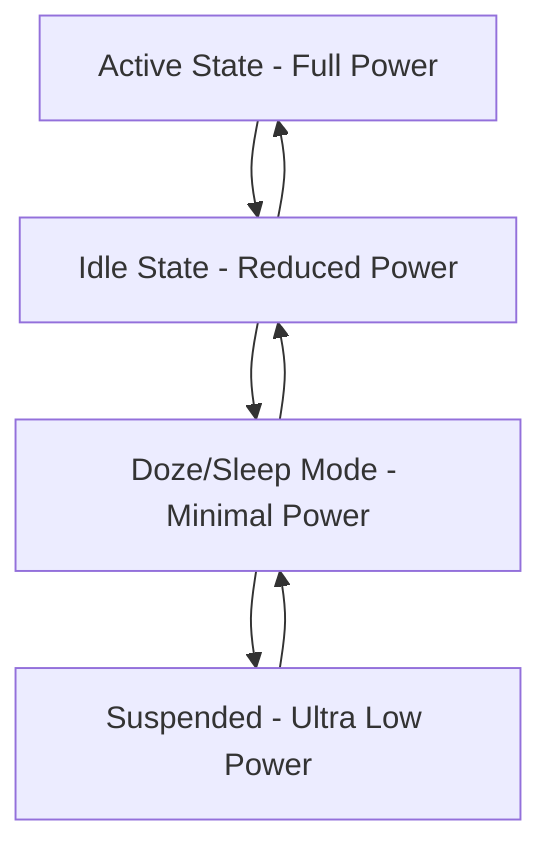

# Mobile OS Architecture

Mobile operating systems power our smartphones and tablets with complex software stacks optimized for portable devices. This guide will help you understand the core architectural components that make mobile operating systems work.

## Introduction

Mobile OS architecture refers to the structural design and organization of software components that form a mobile operating system. Unlike desktop operating systems, mobile OS architectures are designed with constraints such as limited battery life, reduced processing power, touch interfaces, and wireless connectivity as primary considerations.

Today's most prominent mobile operating systems—Android and iOS—share similar architectural principles while differing significantly in implementation details. Understanding these architectures is crucial for mobile app developers, even if you're working with high-level frameworks.

## Core Layers of Mobile OS Architecture

Mobile operating systems are typically organized in a layered architecture, with each layer providing specific services to the layers above while abstracting lower-level details.



Let's explore each of these layers in detail:

### 1. Kernel Layer

The kernel is the foundation of any operating system, acting as the bridge between hardware and software.

- **Android** uses a modified version of the Linux kernel
- **iOS** uses the XNU kernel (part of Darwin, which is based on BSD)

The kernel manages:
- Process and memory management
- Device drivers
- Power management
- Security enforcement
- Networking stack

Example of kernel-level operations (in pseudocode):

```c
// Example: Simplified process creation at kernel level
int fork_process() {
    // Allocate process descriptor
    proc_t *new_process = allocate_process();
    
    // Copy parent process attributes
    copy_process_attributes(current_process, new_process);
    
    // Allocate new memory space
    assign_memory_space(new_process);
    
    // Add to process scheduler
    scheduler_add(new_process);
    
    return new_process->id;
}
```

### 2. Hardware Abstraction Layer (HAL)

The HAL provides an interface between physical hardware and the upper layers of the OS stack.

- Standardizes hardware interfaces
- Allows for hardware independence
- Enables device drivers to work across different hardware

For example, Android's HAL includes modules for:
- Camera
- Bluetooth
- Audio
- Sensors
- GPS

### 3. Libraries and Runtime

This layer contains:

- **Core libraries**: System libraries written in C/C++ that provide core functionality
- **Runtime environment**: 
  - Android: Initially used Dalvik Virtual Machine, now uses Android Runtime (ART)
  - iOS: Uses direct native execution of compiled Swift/Objective-C code

Android example of using a system library:

```java
// Using Android's Camera2 API (which interfaces with lower-level camera HAL)
CameraManager cameraManager = (CameraManager) getSystemService(Context.CAMERA_SERVICE);
try {
    String[] cameraIds = cameraManager.getCameraIdList();
    // Work with available cameras
} catch (CameraAccessException e) {
    Log.e("CameraApp", "Cannot access camera", e);
}
```

iOS example using a system framework:

```swift
// Using Core Location framework
import CoreLocation

class LocationManager: NSObject, CLLocationManagerDelegate {
    private let locationManager = CLLocationManager()
    
    override init() {
        super.init()
        locationManager.delegate = self
        locationManager.requestWhenInUseAuthorization()
        locationManager.startUpdatingLocation()
    }
    
    func locationManager(_ manager: CLLocationManager, didUpdateLocations locations: [CLLocation]) {
        if let location = locations.first {
            print("Current location: \(location.coordinate)")
        }
    }
}
```

### 4. Application Framework

This layer provides high-level services in the form of Java classes (Android) or Objective-C/Swift frameworks (iOS). Key components include:

- **Activity/View Manager**: Controls application lifecycle and UI
- **Content Providers/Core Data**: Database and file management
- **Notification Manager**: Manages system and app notifications
- **Resource Manager**: Handles access to non-code resources

Android example of using the application framework:

```java
// Using Android's SharedPreferences for data storage
SharedPreferences preferences = getSharedPreferences("settings", MODE_PRIVATE);
SharedPreferences.Editor editor = preferences.edit();
editor.putString("username", "user123");
editor.apply();

// Later retrieving the data
String username = preferences.getString("username", "default_user");
```

iOS example using application framework features:

```swift
// Using UserDefaults for preferences storage
let defaults = UserDefaults.standard
defaults.set("user123", forKey: "username")
defaults.synchronize()

// Later retrieving the data
let username = defaults.string(forKey: "username") ?? "default_user"
```

### 5. Applications Layer

The highest level consists of both pre-installed system apps and user-installed apps:

- System apps: Phone, Contacts, Messages, etc.
- Third-party apps: Downloaded from app stores
- Widgets and services

## Key Architectural Differences: Android vs iOS

Understanding the architectural differences between major mobile operating systems can help you better design cross-platform applications.

### Android Architecture Specifics

Android follows an open-source approach with its architecture:



Key features:
- **Component-based architecture**: Activities, Services, Broadcast Receivers, Content Providers
- **Intent system**: For inter-application communication
- **Fragmented hardware ecosystem**: Multiple manufacturers with varying hardware
- **Sandboxed applications**: Each app runs in its own virtual machine

Example of Android component declaration in AndroidManifest.xml:

```xml
<activity
    android:name=".MainActivity"
    android:exported="true">
    <intent-filter>
        <action android:name="android.intent.action.MAIN" />
        <category android:name="android.intent.category.LAUNCHER" />
    </intent-filter>
</activity>
```

### iOS Architecture Specifics

iOS uses a closed-source, vertically integrated approach:



Key features:
- **Cocoa Touch Framework**: UIKit, Foundation
- **MVC design pattern emphasis**: Model-View-Controller architecture
- **Controlled hardware ecosystem**: Limited device variations
- **Deep system integration**: Among Apple's devices and services

Example of iOS app delegate setup:

```swift
import UIKit

@main
class AppDelegate: UIResponder, UIApplicationDelegate {
    var window: UIWindow?
    
    func application(_ application: UIApplication, didFinishLaunchingWithOptions launchOptions: [UIApplication.LaunchOptionsKey: Any]?) -> Bool {
        // Override point for customization after application launch
        return true
    }
    
    // Other application lifecycle methods
}
```

## Memory Management Architecture

Mobile OS memory management is particularly important due to limited resources:

### Android Memory Management

Android uses:
- **Garbage collection**: Automated memory management
- **Low Memory Killer**: Terminates processes when memory is low
- **OOM_ADJ values**: Process importance ranking system

```java
// Example of efficient memory usage with Android's SparseArray
// Instead of HashMap<Integer, Object> which requires boxing/unboxing
SparseArray<User> users = new SparseArray<>();
users.put(1, new User("John"));
users.put(2, new User("Emma"));

// Retrieving a user
User user = users.get(1);
```

### iOS Memory Management

iOS uses:
- **ARC (Automatic Reference Counting)**: Compile-time memory management
- **Memory warnings**: System notifications about low memory
- **jetsam**: Force terminates apps when memory pressure is high

```swift
// Example of proper memory management with weak references
class PhotoViewController {
    // Strong reference - View owned by the controller
    let imageView = UIImageView()
    
    // Weak reference - Delegate not owned by this class
    weak var delegate: PhotoViewControllerDelegate?
    
    // Using a closure with [weak self] to avoid retain cycles
    func loadImage() {
        NetworkManager.shared.fetchImage { [weak self] image in
            self?.imageView.image = image
            self?.delegate?.photoDidLoad()
        }
    }
}
```

## Security Architecture

Security is a critical aspect of mobile OS design:

### Sandboxing

Both Android and iOS implement application sandboxing:



### Permission Systems

Mobile OSes use permission systems to control access to sensitive data and features:

Android permissions example:

```kotlin
// Requesting camera permission in Android
if (ContextCompat.checkSelfPermission(this, Manifest.permission.CAMERA) != PackageManager.PERMISSION_GRANTED) {
    ActivityCompat.requestPermissions(this, arrayOf(Manifest.permission.CAMERA), CAMERA_PERMISSION_CODE)
} else {
    // Camera permission already granted, proceed
    openCamera()
}

// Handle permission result
override fun onRequestPermissionsResult(requestCode: Int, permissions: Array<String>, grantResults: IntArray) {
    super.onRequestPermissionsResult(requestCode, permissions, grantResults)
    if (requestCode == CAMERA_PERMISSION_CODE) {
        if (grantResults.isNotEmpty() && grantResults[0] == PackageManager.PERMISSION_GRANTED) {
            // Permission granted
            openCamera()
        } else {
            // Permission denied
            showPermissionDeniedMessage()
        }
    }
}
```

iOS permissions example:

```swift
// Requesting camera permission in iOS
import AVFoundation

func requestCameraPermission() {
    AVCaptureDevice.requestAccess(for: .video) { granted in
        DispatchQueue.main.async {
            if granted {
                // Permission granted
                self.openCamera()
            } else {
                // Permission denied
                self.showPermissionDeniedMessage()
            }
        }
    }
}
```

## Real-World Application: Building a Battery-Efficient App

Understanding mobile OS architecture helps developers build more efficient apps. Let's consider a practical example of how architecture knowledge affects app design:

```java
// Android example: Using JobScheduler for battery-efficient background work
ComponentName serviceName = new ComponentName(context, MyJobService.class);
JobInfo jobInfo = new JobInfo.Builder(JOB_ID, serviceName)
    // Run only when device is charging and on WiFi
    .setRequiresCharging(true)
    .setRequiredNetworkType(JobInfo.NETWORK_TYPE_UNMETERED)
    // Add some flexibility to when the job runs
    .setPeriodic(TimeUnit.HOURS.toMillis(1))
    .build();

JobScheduler scheduler = (JobScheduler) context.getSystemService(Context.JOB_SCHEDULER_SERVICE);
scheduler.schedule(jobInfo);
```

iOS equivalent using background tasks:

```swift
// iOS example: Using BGTaskScheduler for efficient background processing
@available(iOS 13.0, *)
func scheduleAppRefresh() {
    let request = BGAppRefreshTaskRequest(identifier: "com.example.refreshTask")
    // Set earliest begin date to 1 hour from now
    request.earliestBeginDate = Date(timeIntervalSinceNow: 3600)
    
    do {
        try BGTaskScheduler.shared.submit(request)
    } catch {
        print("Could not schedule app refresh: \(error)")
    }
}

// Register the launch handler
@available(iOS 13.0, *)
func registerBackgroundTasks() {
    BGTaskScheduler.shared.register(
        forTaskWithIdentifier: "com.example.refreshTask",
        using: nil
    ) { task in
        self.handleAppRefresh(task: task as! BGAppRefreshTask)
    }
}
```

## The Power Management Architecture

Battery life is critical for mobile devices. Mobile OS architecture includes sophisticated power management:



Android's Doze mode and iOS's background restrictions are examples of architectural features designed to extend battery life by limiting what applications can do when not in active use.

## Summary

Mobile OS architecture is a complex layered system designed specifically for portable devices with unique constraints:

1. **Kernel Layer**: Core operations, hardware bridge
2. **Hardware Abstraction Layer**: Device-independent hardware access
3. **Libraries and Runtime**: Core utilities and app execution environment
4. **Application Framework**: High-level APIs and services
5. **Applications Layer**: System and third-party applications

Understanding these architectural principles helps developers:
- Create more efficient applications
- Optimize battery usage
- Implement proper security measures
- Understand system limitations and capabilities

## Exercises for Practice

1. **Architecture Comparison**: Create a detailed comparison table of Android and iOS architecture layers and identify their equivalent components.

2. **Permission Analysis**: Select a popular mobile app and list all the permissions it requires. Explain how each permission relates to specific hardware or system services.

3. **Battery Optimization**: Write pseudocode for a location-tracking app that efficiently uses the device's GPS according to best practices for each platform.

4. **Component Lifecycle**: Diagram the lifecycle of an Android Activity and an iOS UIViewController, highlighting when memory might be reclaimed in each case.

## Additional Resources

- [Android Architecture Components](https://developer.android.com/topic/libraries/architecture)
- [iOS Architecture Best Practices](https://developer.apple.com/ios/human-interface-guidelines/)
- [Understanding the Linux Kernel](https://www.kernel.org/doc/html/latest/)
- [Apple Developer Documentation](https://developer.apple.com/documentation/)
- [Google's Battery-Saving Best Practices](https://developer.android.com/topic/performance/power)