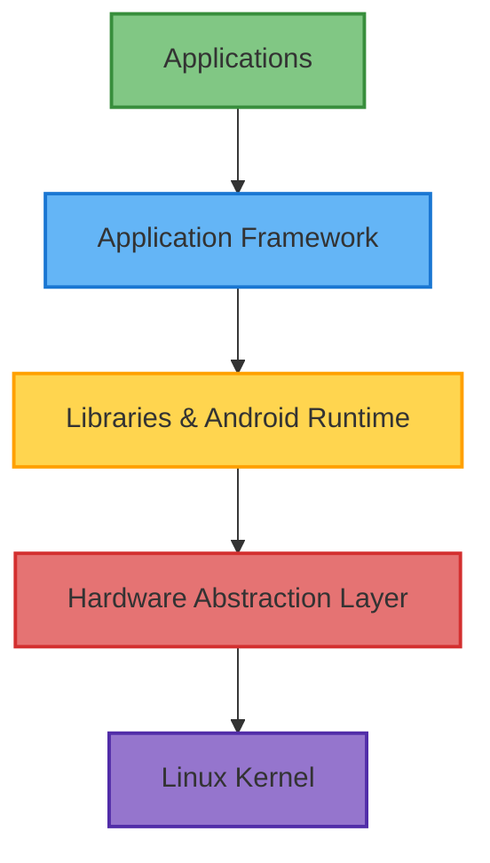

# Android OS Structure

## Introduction

Android is one of the most widely used mobile operating systems in the world, powering billions of devices ranging from smartphones and tablets to smartwatches and TVs. Understanding its architecture is essential for any developer looking to build efficient and effective Android applications.

In this guide, we'll explore the layered structure of the Android operating system, examine each component's role, and understand how they work together to create the Android experience we're familiar with.

## The Android Software Stack

Android's architecture is designed as a software stack with multiple layers, each serving specific functions. This modular approach enhances security, allows for component reusability, and facilitates updates to individual parts of the system.



Let's examine each layer in detail, from the bottom up:

## 1. Linux Kernel

The foundation of the Android platform is the Linux kernel. It provides:

- **Core system services**: Memory management, process management, networking, and security features
- **Hardware driver model**: Facilitates communication with physical device components
- **Low-level memory management**: Optimizes resource allocation for better performance and battery life

The Linux kernel in Android has been modified with enhancements specific to mobile environments, such as:

- **Binder IPC (Inter-Process Communication)**: Enables communication between applications
- **Wakelocks**: Controls processor sleep states to manage power consumption
- **Low Memory Killer**: Intelligently terminates processes when memory runs low
- **Enhanced security features**: Implements process isolation and permission enforcement

## 2. Hardware Abstraction Layer (HAL)

The Hardware Abstraction Layer bridges the gap between physical hardware and the higher-level software stack:

- Provides standard interfaces that expose device hardware capabilities to the higher-level Java API framework
- Consists of multiple library modules, each implementing an interface for a specific hardware component
- Allows hardware vendors to implement functionality without affecting the higher-level system

The HAL includes modules for:

```
├── Audio
├── Bluetooth
├── Camera
├── Sensors
├── GPS
└── Other hardware components
```

## 3. Libraries and Android Runtime

### Native Libraries

Android includes a set of C/C++ libraries used by various components of the system:

- **Bionic**: A custom implementation of the C library optimized for embedded devices
- **Surface Manager**: Manages display subsystems and composites 2D and 3D graphic layers
- **Media Framework**: Supports playback and recording of audio, video, and images
- **SQLite**: A lightweight relational database engine for local data storage
- **WebKit**: An open-source browser engine
- **OpenGL ES**: Graphics library for rendering 2D and 3D graphics
- **SSL**: Secure network communications

### Android Runtime (ART)

ART is the application runtime environment used by Android:

- Replaced Dalvik Virtual Machine (DVM) in Android 5.0 (Lollipop)
- Uses Ahead-of-Time (AOT) compilation by default, improving performance over Dalvik's Just-in-Time (JIT) compilation
- Provides better memory management and garbage collection
- Enhances application debugging and profiling

Let's examine a simple comparison between the old Dalvik VM and the newer ART:

```
// Dalvik VM Process
Java Code → .java files → javac compiler → .class files → dx tool → .dex file → JIT compilation at runtime

// ART Process
Java Code → .java files → javac compiler → .class files → dx tool → .dex file → AOT compilation during installation
```

## 4. Application Framework

The Application Framework provides higher-level services to applications in the form of Java classes. Developers access these services directly in their applications:

- **Activity Manager**: Controls the application lifecycle and activity stack
- **Window Manager**: Manages application windows
- **Content Providers**: Enables applications to share data
- **View System**: Building blocks for UI components
- **Package Manager**: Manages application packages and installations
- **Telephony Manager**: Provides access to telephony services
- **Resource Manager**: Provides access to non-code resources (strings, graphics, layout files)
- **Location Manager**: Location awareness using GPS or cell tower
- **Notification Manager**: Enables applications to display alerts in the status bar

Let's look at how you might use the Location Manager in a basic application:

```java
// Import the necessary classes
import android.content.Context;
import android.location.Location;
import android.location.LocationListener;
import android.location.LocationManager;
import android.os.Bundle;

// Get a reference to the LocationManager
LocationManager locationManager = (LocationManager) getSystemService(Context.LOCATION_SERVICE);

// Define a LocationListener
LocationListener locationListener = new LocationListener() {
    @Override
    public void onLocationChanged(Location location) {
        // Handle location updates
        double latitude = location.getLatitude();
        double longitude = location.getLongitude();
        System.out.println("New location: " + latitude + ", " + longitude);
    }
    
    @Override
    public void onStatusChanged(String provider, int status, Bundle extras) {}
    
    @Override
    public void onProviderEnabled(String provider) {}
    
    @Override
    public void onProviderDisabled(String provider) {}
};

// Request location updates (requires appropriate permissions)
locationManager.requestLocationUpdates(
    LocationManager.GPS_PROVIDER,
    1000,  // minimum time interval between updates (ms)
    10,    // minimum distance between updates (meters)
    locationListener
);
```

## 5. Applications Layer

This is the top layer of the Android architecture, containing both pre-installed system applications and third-party applications installed by users:

- **System Apps**: Pre-installed applications like Contacts, Phone, Browser, and Settings
- **User-Installed Apps**: Applications downloaded from the Google Play Store or other sources
- **Default Home Screen (Launcher)**: The interface users interact with directly

Applications are written primarily in Java or Kotlin and run in their own process with their own instance of the Android Runtime.

## Android App Components

Android applications are composed of several key components:

1. **Activities**: Single, focused screens with a user interface
2. **Services**: Background operations without a user interface
3. **Broadcast Receivers**: Components that respond to system-wide broadcast announcements
4. **Content Providers**: Components that manage shared application data

Let's look at a simple example of an Activity implementation:

```java
import android.app.Activity;
import android.os.Bundle;
import android.widget.TextView;

public class HelloWorldActivity extends Activity {
    @Override
    protected void onCreate(Bundle savedInstanceState) {
        super.onCreate(savedInstanceState);
        
        // Create a TextView programmatically
        TextView textView = new TextView(this);
        textView.setText("Hello, Android World!");
        
        // Set the TextView as our content view
        setContentView(textView);
    }
}
```

## Android Manifest

Every Android application must have an `AndroidManifest.xml` file at the root of its project source set. This file:

- Describes essential information about the app to the Android system
- Declares app components, permissions, hardware requirements, and more

Here's a simple example of a manifest file:

```xml
<?xml version="1.0" encoding="utf-8"?>
<manifest xmlns:android="http://schemas.android.com/apk/res/android"
    package="com.example.helloworld">

    <application
        android:allowBackup="true"
        android:icon="@mipmap/ic_launcher"
        android:label="@string/app_name"
        android:roundIcon="@mipmap/ic_launcher_round"
        android:supportsRtl="true"
        android:theme="@style/AppTheme">
        
        <activity android:name=".HelloWorldActivity">
            <intent-filter>
                <action android:name="android.intent.action.MAIN" />
                <category android:name="android.intent.category.LAUNCHER" />
            </intent-filter>
        </activity>
        
    </application>

</manifest>
```

## Android Build System

Android applications are typically built using:

1. **Gradle**: The build automation tool used by Android Studio
2. **Android Gradle Plugin**: Provides Android-specific Gradle functionalities

A simple build.gradle file might look like this:

```groovy
apply plugin: 'com.android.application'

android {
    compileSdkVersion 30
    defaultConfig {
        applicationId "com.example.helloworld"
        minSdkVersion 21
        targetSdkVersion 30
        versionCode 1
        versionName "1.0"
    }
    buildTypes {
        release {
            minifyEnabled true
            proguardFiles getDefaultProguardFile('proguard-android.txt'), 'proguard-rules.pro'
        }
    }
}

dependencies {
    implementation 'androidx.appcompat:appcompat:1.2.0'
    implementation 'androidx.core:core-ktx:1.3.2'
}
```

## Android Security Model

Android's security architecture is built on several key principles:

1. **Application Sandbox**: Each app runs in its own isolated environment
2. **Permissions System**: Apps must request permission to access sensitive data or features
3. **Secure IPC**: The Binder framework facilitates secure communications between processes
4. **Application Signing**: All apps must be digitally signed to establish developer identity

Here's an example of requesting permissions in the Android Manifest:

```xml
<manifest xmlns:android="http://schemas.android.com/apk/res/android"
    package="com.example.app">
    
    <!-- Request permission to access the internet -->
    <uses-permission android:name="android.permission.INTERNET" />
    
    <!-- Request permission to access fine location -->
    <uses-permission android:name="android.permission.ACCESS_FINE_LOCATION" />
    
    <!-- Rest of the manifest -->
</manifest>
```

## Real-World Application

Let's look at how this layered architecture enables the functionality of a typical Android app - a simple weather application:

1. **Applications Layer**: The weather app's user interface displays current conditions and forecasts
2. **Application Framework**: The app uses:
   - Location Manager to determine the user's current position
   - Content Providers to store forecast data
   - Notification Manager to alert users about severe weather
3. **Libraries**: Uses:
   - SQLite to store weather data locally
   - Media Framework to play alert sounds
   - SSL for secure API connections
4. **ART**: Runs the compiled app code efficiently
5. **HAL**: Accesses:
   - GPS hardware through the standard interface
   - Network hardware for internet connectivity
6. **Linux Kernel**: Manages:
   - Memory allocation for stored weather data
   - Process management for background update services
   - Network stack for API communication

## Summary

The Android operating system is structured as a software stack with multiple layers:

- **Linux Kernel**: Provides core system services and hardware drivers
- **Hardware Abstraction Layer**: Standardizes interfaces between hardware and software
- **Libraries and Runtime**: Offers core functionality and executes application code
- **Application Framework**: Provides high-level services for application development
- **Applications**: System and user-installed applications

This architecture creates a highly modular system that:
- Separates concerns between layers
- Allows components to be updated independently
- Provides a stable and secure environment for applications
- Enables hardware diversity while maintaining software compatibility

## Practice Exercises

1. **Exploration Exercise**: Use the Android Debug Bridge (ADB) to explore the file system structure of an Android device. Identify key directories like `/system`, `/data`, and `/proc`.

2. **Research Exercise**: Compare the Android OS structure with another mobile operating system like iOS. What are the key similarities and differences?

3. **Coding Exercise**: Create a simple Android application that demonstrates the use of two different Application Framework components (e.g., Location Manager and Notification Manager).

4. **Analysis Exercise**: Download and examine an open-source Android application. Identify how it interacts with different layers of the Android architecture.

## Additional Resources

- [Android Open Source Project](https://source.android.com/)
- [Android Developers Documentation](https://developer.android.com/)
- [Android Architecture Components](https://developer.android.com/topic/libraries/architecture)
- [Android Security Overview](https://source.android.com/security)