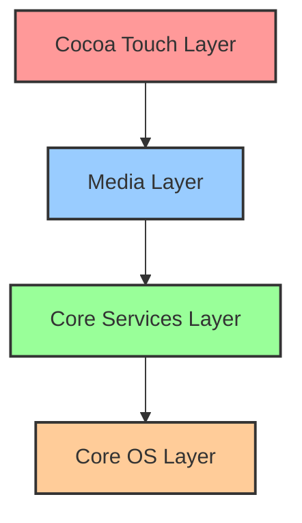
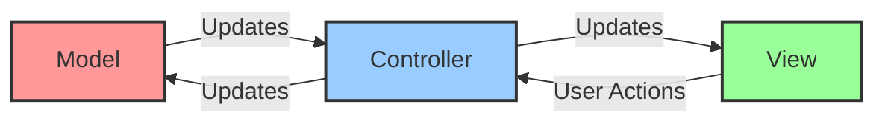
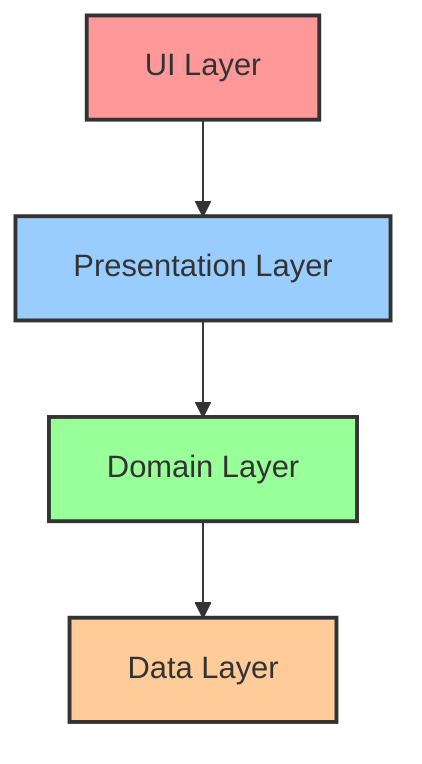

# iOS Architecture

## Introduction

iOS is Apple's proprietary mobile operating system that powers iPhones, iPads, and iPod Touch devices. Understanding iOS architecture is essential for developers who want to create efficient, performant, and user-friendly applications for Apple's ecosystem. This guide will walk you through the fundamental architectural components of iOS, explaining how different layers interact to create the seamless experience Apple users have come to expect.

iOS architecture follows a layered approach, where higher-level frameworks rely on lower-level frameworks to provide their functionality. This design enables developers to work at the appropriate level of abstraction for their needs, whether that's building user interfaces or accessing hardware features.

## Core Architectural Layers

iOS architecture is organized into several distinct layers, each with specific responsibilities:



### 1. Cocoa Touch Layer

The topmost layer contains frameworks for building iOS applications, including user interface components, event handling, and high-level system services.

Key frameworks include:

- **UIKit**: Provides essential UI infrastructure including window and view architecture, event handling, and application lifecycle management
- **SwiftUI**: Apple's modern declarative UI framework introduced in 2019
- **MapKit**: Embeds maps in your application
- **PushKit**: Handles push notifications

### 2. Media Layer

This layer provides the graphics, audio, and video technologies to create multimedia experiences in iOS applications.

Key frameworks include:

- **Core Graphics**: 2D rendering engine (also known as Quartz)
- **Core Animation**: Advanced animations and visual effects
- **AVFoundation**: Audio and video playback and recording
- **Metal**: Low-level graphics API for high-performance 3D graphics

### 3. Core Services Layer

This layer provides fundamental system services that all applications use.

Key frameworks include:

- **Foundation**: Provides fundamental data types, collections, and services
- **Core Data**: Object graph and data persistence
- **CloudKit**: Integration with iCloud services
- **Core Location**: Location and heading information

### 4. Core OS Layer

The lowest-level layer that interacts directly with the hardware.

Key frameworks include:

- **Core Bluetooth**: Communication with Bluetooth devices
- **Security**: Certificates, public/private keys, and cryptographic services
- **Local Authentication**: Face ID, Touch ID authentication
- **System**: Kernel access, drivers, and low-level Unix features

## MVC Architecture Pattern

iOS traditionally uses the Model-View-Controller (MVC) design pattern, although modern iOS development has expanded to include patterns like MVVM, Viper, and Clean Architecture.



- **Model**: Manages data, logic, and rules of the application
- **View**: The user interface elements
- **Controller**: Mediates between the Model and View

## App Lifecycle Management

iOS applications follow a specific lifecycle that developers need to understand:

1. **Not Running**: The app hasn't been launched or was terminated
2. **Inactive**: The app is running in the foreground but not receiving events
3. **Active**: The app is running in the foreground and receiving events
4. **Background**: The app is executing code but not visible
5. **Suspended**: The app is in memory but not executing code

Let's look at how we can respond to these lifecycle events using UIKit:

```swift
import UIKit

class AppDelegate: UIResponder, UIApplicationDelegate {

    func application(_ application: UIApplication, 
                     didFinishLaunchingWithOptions launchOptions: [UIApplication.LaunchOptionsKey: Any]?) -> Bool {
        // App has launched
        print("App has launched!")
        return true
    }

    func applicationWillResignActive(_ application: UIApplication) {
        // App is about to become inactive
        print("App will resign active state")
    }

    func applicationDidEnterBackground(_ application: UIApplication) {
        // App has entered the background
        print("App entered background")
    }

    func applicationWillEnterForeground(_ application: UIApplication) {
        // App is about to enter the foreground
        print("App will enter foreground")
    }

    func applicationDidBecomeActive(_ application: UIApplication) {
        // App has become active
        print("App became active")
    }

    func applicationWillTerminate(_ application: UIApplication) {
        // App is about to terminate
        print("App will terminate")
    }
}
```

In SwiftUI, lifecycle events are handled differently:

```swift
import SwiftUI

@main
struct MyApp: App {
    @Environment(\.scenePhase) private var scenePhase
    
    var body: some Scene {
        WindowGroup {
            ContentView()
                .onChange(of: scenePhase) { newPhase in
                    switch newPhase {
                    case .active:
                        print("App is active")
                    case .inactive:
                        print("App is inactive")
                    case .background:
                        print("App is in background")
                    @unknown default:
                        print("Unknown scene phase")
                    }
                }
        }
    }
}
```

## Memory Management

iOS uses Automatic Reference Counting (ARC) to manage memory. Understanding memory management is crucial for iOS development:

```swift
class Person {
    var name: String
    
    init(name: String) {
        self.name = name
        print("\(name) is being initialized")
    }
    
    deinit {
        print("\(name) is being deinitialized")
    }
}

// Creating a strong reference
var reference1: Person? = Person(name: "John")
// Output: John is being initialized

// Creating another strong reference
var reference2 = reference1
reference1 = nil
// No output because reference2 still holds a strong reference

// Removing the last strong reference
reference2 = nil
// Output: John is being deinitialized
```

### Memory Leaks and Retain Cycles

One common issue in iOS development is retain cycles, which occur when two objects hold strong references to each other:

```swift
class Teacher {
    var name: String
    var student: Student?
    
    init(name: String) {
        self.name = name
    }
    
    deinit {
        print("Teacher \(name) deinitialized")
    }
}

class Student {
    var name: String
    var teacher: Teacher?
    
    init(name: String) {
        self.name = name
    }
    
    deinit {
        print("Student \(name) deinitialized")
    }
}

// Creating instances
var teacher: Teacher? = Teacher(name: "Mrs. Smith")
var student: Student? = Student(name: "Bob")

// Creating a retain cycle
teacher?.student = student
student?.teacher = teacher

// Attempting to release objects
teacher = nil
student = nil

// No deinit messages are printed because objects are still retained in memory
```

To fix this, we use weak or unowned references:

```swift
class Student {
    var name: String
    weak var teacher: Teacher?  // Using weak reference
    
    init(name: String) {
        self.name = name
    }
    
    deinit {
        print("Student \(name) deinitialized")
    }
}
```

## Concurrency in iOS

iOS applications need to perform work concurrently to maintain responsive user interfaces. There are several approaches to concurrency in iOS:

### GCD (Grand Central Dispatch)

```swift
// Running a task on a background queue
DispatchQueue.global(qos: .background).async {
    // Perform time-consuming task
    let result = performHeavyComputation()
    
    // Update UI on the main queue
    DispatchQueue.main.async {
        updateUI(with: result)
    }
}
```

### Swift Concurrency (iOS 15+)

```swift
// Using async/await
func loadData() async throws -> Data {
    let (data, _) = try await URLSession.shared.data(from: URL(string: "https://example.com/data")!)
    return data
}

// Using Task
Task {
    do {
        let data = try await loadData()
        // Update UI with the data
        updateInterface(with: data)
    } catch {
        handleError(error)
    }
}
```

## File System Access

iOS applications operate within a sandbox environment with a specific directory structure:

```swift
// Getting the Documents directory
let documentsPath = FileManager.default.urls(for: .documentDirectory, in: .userDomainMask).first

// Writing to a file
func saveText(_ text: String, to filename: String) {
    guard let documentsDirectory = FileManager.default.urls(for: .documentDirectory, in: .userDomainMask).first else {
        return
    }
    
    let fileURL = documentsDirectory.appendingPathComponent(filename)
    
    do {
        try text.write(to: fileURL, atomically: true, encoding: .utf8)
        print("Successfully saved to \(fileURL)")
    } catch {
        print("Error saving file: \(error)")
    }
}

// Reading from a file
func readText(from filename: String) -> String? {
    guard let documentsDirectory = FileManager.default.urls(for: .documentDirectory, in: .userDomainMask).first else {
        return nil
    }
    
    let fileURL = documentsDirectory.appendingPathComponent(filename)
    
    do {
        return try String(contentsOf: fileURL, encoding: .utf8)
    } catch {
        print("Error reading file: \(error)")
        return nil
    }
}
```

## Modern iOS Architecture Patterns

While MVC has been the traditional pattern for iOS development, modern apps often use alternative architectures:

### MVVM (Model-View-ViewModel)

```swift
// Model
struct User {
    let name: String
    let email: String
}

// ViewModel
class UserViewModel {
    private var user: User
    
    init(user: User) {
        self.user = user
    }
    
    var displayName: String {
        return "Name: \(user.name)"
    }
    
    var displayEmail: String {
        return "Email: \(user.email)"
    }
}

// View (using SwiftUI)
struct UserView: View {
    let viewModel: UserViewModel
    
    var body: some View {
        VStack {
            Text(viewModel.displayName)
            Text(viewModel.displayEmail)
        }
    }
}
```

### Clean Architecture

Clean Architecture separates concerns into layers, with dependencies pointing inward:



## Building a Simple iOS App

Let's put everything together with a simple counter app example:

```swift
import SwiftUI

// Model
struct Counter {
    var count: Int = 0
    
    mutating func increment() {
        count += 1
    }
    
    mutating func decrement() {
        if count > 0 {
            count -= 1
        }
    }
}

// ViewModel
class CounterViewModel: ObservableObject {
    @Published private var counter = Counter()
    
    var count: Int {
        counter.count
    }
    
    func increment() {
        counter.increment()
    }
    
    func decrement() {
        counter.decrement()
    }
}

// View
struct CounterView: View {
    @StateObject private var viewModel = CounterViewModel()
    
    var body: some View {
        VStack(spacing: 20) {
            Text("Counter: \(viewModel.count)")
                .font(.title)
            
            HStack(spacing: 20) {
                Button(action: {
                    viewModel.decrement()
                }) {
                    Text("-")
                        .font(.system(size: 24))
                        .frame(width: 50, height: 50)
                        .background(Color.red)
                        .foregroundColor(.white)
                        .cornerRadius(10)
                }
                
                Button(action: {
                    viewModel.increment()
                }) {
                    Text("+")
                        .font(.system(size: 24))
                        .frame(width: 50, height: 50)
                        .background(Color.green)
                        .foregroundColor(.white)
                        .cornerRadius(10)
                }
            }
        }
        .padding()
    }
}

// App Entry Point
@main
struct CounterApp: App {
    var body: some Scene {
        WindowGroup {
            CounterView()
        }
    }
}
```

## Summary

iOS architecture consists of several layers, from the low-level Core OS layer to the high-level Cocoa Touch layer. Understanding these layers and how they interact is crucial for building efficient iOS applications.

Key takeaways:

1. iOS uses a layered architecture approach, with each layer providing specific functionality
2. The traditional iOS design pattern is MVC, but modern apps often use MVVM, Clean Architecture, or other patterns
3. iOS apps follow a specific lifecycle that developers must understand
4. Automatic Reference Counting (ARC) handles memory management, but developers must be aware of potential retain cycles
5. Concurrency can be achieved through GCD, Swift Concurrency, or Operation queues
6. iOS apps operate within a sandbox with a specific directory structure

## Exercises

1. Create a simple iOS app that displays a list of items using both UIKit and SwiftUI
2. Implement a basic networking layer that follows MVVM architecture
3. Add persistence to your app using Core Data
4. Identify potential memory leaks in a given code sample and fix them
5. Implement a background task that updates the UI when completed

## Additional Resources

- [Apple's iOS Developer Documentation](https://developer.apple.com/documentation/ios)
- [Swift Programming Language Guide](https://docs.swift.org/swift-book/)
- [Human Interface Guidelines](https://developer.apple.com/design/human-interface-guidelines/ios)
- [WWDC Sessions](https://developer.apple.com/videos/)
- [Stanford's CS193p - Developing Apps for iOS](https://cs193p.sites.stanford.edu/)