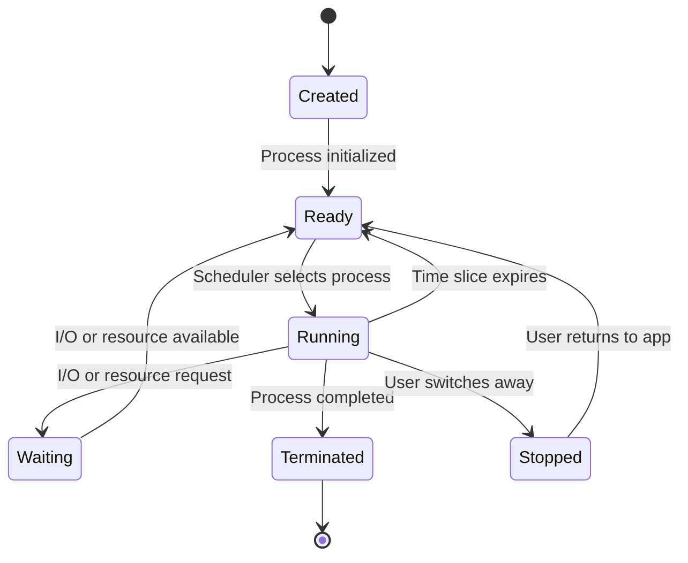

# Mobile Process Management

## Introduction

Process management is a fundamental concept in any operating system, but it takes on unique characteristics in the mobile environment. Mobile devices have limited resources (battery, memory, processing power) compared to desktop computers, which means that process management must be optimized for efficiency and power conservation.

In this guide, we'll explore how mobile operating systems handle processes - from creation to termination - and why the strategies differ from traditional computing environments. We'll focus primarily on Android and iOS, the two dominant mobile operating systems.

## What is a Process?

A process is an instance of a program in execution. It includes:
- The program code
- Current activity (represented by the program counter)
- Stack (for tracking function calls)
- Heap (for dynamic memory allocation)
- Data section (for static variables)
- Resource information (file handles, network connections, etc.)

Mobile operating systems run multiple processes simultaneously, which requires careful management to ensure smooth operation.

## Process States in Mobile OS

Mobile processes typically exist in several states:



However, mobile OSes introduce additional states to conserve resources:

1. **Foreground**: Process is visible and interacting with the user
2. **Visible Background**: Process is visible but not in focus
3. **Service**: Process is running a service in the background
4. **Background**: Process is not visible and may be paused
5. **Empty**: Process is kept in memory but not running
6. **Terminated**: Process is killed to free resources

## Process Creation in Mobile Operating Systems

### Android Process Creation

In Android, processes are created when an application component needs to run. Let's examine the basic process creation flow:

```java
// Example of how Android system might create a process internally
// This is conceptual and not actual implementation code
public Process createApplicationProcess(ApplicationInfo appInfo) {
    // Allocate a process ID
    int pid = allocateProcessId();
    
    // Create a new process with the Zygote system
    Process process = Zygote.forkAndSpecialize(
        pid,                  // Process ID
        appInfo.uid,          // User ID
        appInfo.processName,  // Process name
        appInfo.permission    // Permissions
    );
    
    // Initialize the runtime for the application
    process.initializeRuntime();
    
    // Load the application's classes
    process.loadApplication(appInfo.className);
    
    return process;
}
```

Android uses a unique approach with the **Zygote** system:

1. When Android boots, it starts a Zygote process
2. Zygote loads common framework code and resources
3. When a new app needs to launch, the system forks the Zygote process
4. The forked process then specializes into the specific application

This approach speeds up app launching by pre-loading common resources.

### iOS Process Creation

iOS follows a different approach:

```swift
// Conceptual representation of iOS process creation
// Not actual implementation code
func launchApplication(bundleId: String) -> Process {
    // Check if the app is allowed to launch
    guard isLaunchAllowed(bundleId) else {
        throw LaunchError.notAllowed
    }
    
    // Create a new process
    let process = Process()
    
    // Set up the process environment
    process.environment = getEnvironmentForApp(bundleId)
    
    // Set the executable path
    process.executableURL = getExecutablePath(bundleId)
    
    // Launch the process
    try process.run()
    
    return process
}
```

In iOS, the system:
1. Creates a new process space
2. Loads the application binary
3. Sets up security sandboxing
4. Initializes the application environment

## Process Scheduling in Mobile OS

Mobile operating systems use specialized scheduling algorithms that balance:
- Responsiveness for foreground apps
- Battery conservation
- Fair allocation of CPU time
- Thermal management

### Android Scheduling

Android uses the Completely Fair Scheduler (CFS) from Linux with mobile-specific modifications:

```java
// Conceptual representation of Android process priority assignment
public void assignProcessPriority(Process process) {
    if (process.isVisibleToUser()) {
        // Foreground process gets highest priority
        process.setNiceness(-10);
    } else if (process.isPerceptibleToUser()) {
        // Perceptible but not foreground
        process.setNiceness(0);
    } else if (process.isServiceRunning()) {
        // Background service
        process.setNiceness(10);
    } else {
        // Cached background process
        process.setNiceness(19);
    }
}
```

Android defines several priority levels:
1. **Foreground process** (highest priority)
2. **Visible process**
3. **Service process**
4. **Background process**
5. **Empty process** (lowest priority)

### iOS Scheduling

iOS uses a quality-of-service (QoS) based approach:

```swift
// Example of iOS QoS assignment
let backgroundQueue = DispatchQueue.global(qos: .background)
let userInteractiveQueue = DispatchQueue.global(qos: .userInteractive)

// For user-visible work
userInteractiveQueue.async {
    // High priority work that affects UI
    updateUserInterface()
}

// For background tasks
backgroundQueue.async {
    // Lower priority work like data syncing
    synchronizeData()
}
```

iOS QoS levels include:
1. **User-interactive**: For tasks that need immediate response
2. **User-initiated**: For tasks started by the user that require quick results
3. **Utility**: For longer-running tasks with progress indicators
4. **Background**: For maintenance tasks the user doesn't track
5. **Default**: Between user-initiated and utility

## Memory Management and Process Lifecycle

Mobile operating systems must aggressively manage memory due to constraints.

### Android Memory Management

Android's system for managing process lifecycle:

```java
// Example of how Android might decide which processes to kill
// This is conceptual and not actual implementation code
public Process selectProcessToKill(List<Process> runningProcesses) {
    // Sort processes by importance
    Collections.sort(runningProcesses, (p1, p2) -> 
        Integer.compare(p1.getImportance(), p2.getImportance()));
    
    // Take the least important process
    Process candidateToKill = runningProcesses.get(runningProcesses.size() - 1);
    
    // Check if it's safe to kill
    if (candidateToKill.getImportance() >= IMPORTANCE_BACKGROUND) {
        return candidateToKill;
    }
    
    return null; // No suitable process found
}
```

Android will kill processes in this order:
1. Empty processes
2. Background processes
3. Service processes
4. Visible processes
5. Foreground processes (rarely killed)

### iOS Memory Management

iOS takes a different approach, focusing on app states:

```swift
// iOS app delegate lifecycle methods
func applicationDidEnterBackground(_ application: UIApplication) {
    // App is now in the background, should release shared resources
    releaseSharedResources()
    
    // Save user data
    saveUserState()
    
    // Prepare for possible termination
    prepareForPossibleTermination()
}

func applicationWillTerminate(_ application: UIApplication) {
    // App is about to be terminated
    performFinalCleanup()
}
```

iOS manages processes through these application states:
1. **Not running**: The app hasn't been launched or was terminated
2. **Inactive**: The app is running but not receiving events (during a call or notification)
3. **Active**: The normal state when the app is on screen
4. **Background**: The app is executing code but not visible
5. **Suspended**: The app is in memory but not executing code

## Background Processing in Mobile OS

Both Android and iOS allow limited background processing with specific constraints.

### Android Background Processing

Android offers several options for background work:

```java
// WorkManager example for background tasks in Android
WorkRequest uploadWorkRequest =
   new OneTimeWorkRequestBuilder<UploadWorker>()
       .setConstraints(new Constraints.Builder()
           .setRequiredNetworkType(NetworkType.CONNECTED)
           .setRequiresBatteryNotLow(true)
           .build())
       .build();

WorkManager.getInstance(context).enqueue(uploadWorkRequest);

// Implementation of a Worker
public class UploadWorker extends Worker {
    public UploadWorker(Context context, WorkerParameters params) {
        super(context, params);
    }

    @Override
    public Result doWork() {
        // Upload files to server
        uploadFiles();
        
        return Result.success();
    }
}
```

Android background processing options include:
1. **WorkManager**: For deferrable background work with constraints
2. **Foreground Services**: For user-visible background operations
3. **AlarmManager**: For precise time-based operations
4. **JobScheduler**: For system-friendly background tasks

### iOS Background Processing

iOS provides more limited background execution:

```swift
// Background fetch example in iOS
func application(_ application: UIApplication, performFetchWithCompletionHandler completionHandler: @escaping (UIBackgroundFetchResult) -> Void) {
    // Perform background fetch
    dataManager.fetchNewData { result in
        switch result {
        case .newData:
            completionHandler(.newData)
        case .noData:
            completionHandler(.noData)
        case .failed:
            completionHandler(.failed)
        }
    }
}

// Background task example
func performBackgroundTask() {
    let backgroundTaskID = UIApplication.shared.beginBackgroundTask {
        // Time is about to expire, clean up
        // This block runs shortly before the app would be suspended
    }
    
    // Perform background work
    performLongRunningTask {
        // End the task when finished
        UIApplication.shared.endBackgroundTask(backgroundTaskID)
    }
}
```

iOS background modes include:
1. **Background fetch**: Brief periodic updates
2. **Background processing**: For essential but deferrable work
3. **Specific background modes**: For audio, location, etc.
4. **Background execution time**: Limited time to complete tasks when app moves to background

## Process Communication in Mobile OS

Mobile apps often need to communicate with each other and the system.

### Android Inter-Process Communication (IPC)

Android provides several IPC mechanisms:

```java
// Android Intent example for inter-process communication
Intent shareIntent = new Intent(Intent.ACTION_SEND);
shareIntent.setType("text/plain");
shareIntent.putExtra(Intent.EXTRA_TEXT, "Check out this cool website: https://example.com");
startActivity(Intent.createChooser(shareIntent, "Share via"));

// ContentProvider example
ContentValues values = new ContentValues();
values.put(ContactsContract.Contacts.DISPLAY_NAME, "John Doe");
Uri newContactUri = getContentResolver().insert(
    ContactsContract.RawContacts.CONTENT_URI, 
    values
);
```

Android IPC mechanisms include:
1. **Intents**: For activating components and passing data
2. **Content Providers**: For sharing structured data
3. **Binder**: Low-level IPC mechanism
4. **Messenger/AIDL**: For complex client-server interactions

### iOS Inter-Process Communication

iOS is more restrictive with IPC:

```swift
// URL Scheme example in iOS
if let url = URL(string: "instagram://camera") {
    if UIApplication.shared.canOpenURL(url) {
        UIApplication.shared.open(url)
    }
}

// App Extension example
let userDefaults = UserDefaults(suiteName: "group.com.example.app")
userDefaults?.set("Shared data", forKey: "sharedKey")
```

iOS IPC mechanisms include:
1. **URL Schemes**: For simple app activation
2. **Universal Links**: For web/app content sharing
3. **App Groups**: For related apps to share data
4. **Extensions**: For extending functionality to other apps

## Process Termination and Cleanup

Proper termination is crucial to prevent resource leaks and maintain user experience.

### Android Process Termination

```java
// Example of Android Activity lifecycle for proper cleanup
@Override
protected void onStop() {
    super.onStop();
    // Release resources that aren't needed while UI is hidden
    mediaPlayer.release();
}

@Override
protected void onDestroy() {
    super.onDestroy();
    // Final cleanup when Activity is being destroyed
    databaseConnection.close();
    unregisterListeners();
}
```

Android termination considerations:
1. Handle lifecycle events to properly save state and release resources
2. Prepare for sudden termination by the system
3. Use `onSaveInstanceState()` to preserve important data
4. Release resources in the appropriate lifecycle methods

### iOS Process Termination

```swift
// iOS app termination handling
func applicationWillTerminate(_ application: UIApplication) {
    // Save critical data
    saveUserData()
    
    // Close connections
    networkManager.closeAllConnections()
    
    // Release shared resources
    releaseSharedResources()
}

// State restoration
func application(_ application: UIApplication, shouldSaveSecureApplicationState coder: NSCoder) -> Bool {
    // Save app state for restoration
    coder.encode(currentUserID, forKey: "CurrentUserID")
    return true
}
```

iOS termination considerations:
1. Apps should be prepared for termination at any time
2. Critical state should be saved when entering background
3. Use state restoration APIs for seamless user experience
4. Handle cleanup in appropriate delegate methods

## Real-World Example: Battery Optimization

Let's examine how process management directly impacts battery life.

```java
// Android example of a battery-aware background task
public class EnergyAwareWorker extends Worker {
    public EnergyAwareWorker(Context context, WorkerParameters params) {
        super(context, params);
    }

    @Override
    public Result doWork() {
        // Check if battery is critically low
        BatteryManager batteryManager = (BatteryManager) 
            getApplicationContext().getSystemService(Context.BATTERY_SERVICE);
        
        int batteryLevel = batteryManager.getIntProperty(BatteryManager.BATTERY_PROPERTY_CAPACITY);
        boolean isCharging = batteryManager.isCharging();
        
        // If battery is below 15% and not charging, defer heavy work
        if (batteryLevel < 15 && !isCharging) {
            return Result.retry();
        }
        
        // Perform the actual work
        performDataSync();
        
        return Result.success();
    }
}
```

iOS battery optimization example:

```swift
// iOS background fetch optimization
func application(_ application: UIApplication, performFetchWithCompletionHandler completionHandler: @escaping (UIBackgroundFetchResult) -> Void) {
    // Get battery level
    UIDevice.current.isBatteryMonitoringEnabled = true
    let batteryLevel = UIDevice.current.batteryLevel
    let isCharging = UIDevice.current.batteryState == .charging || 
                    UIDevice.current.batteryState == .full
    
    // Adjust fetch behavior based on battery
    if batteryLevel < 0.2 && !isCharging {
        // Minimal fetch - just critical data
        fetchCriticalDataOnly { result in
            completionHandler(result ? .newData : .noData)
        }
    } else {
        // Full fetch
        performFullDataSync { result in
            completionHandler(result ? .newData : .noData)
        }
    }
}
```

## Process Management Debugging

Debugging process issues is essential for mobile developers.

### Android Debugging Tools

```bash
# Using ADB to view running processes
adb shell ps

# Check memory usage
adb shell dumpsys meminfo [package_name]

# View CPU usage
adb shell top -m 10

# Battery stats
adb shell dumpsys batterystats
```

### iOS Debugging Tools

```bash
# Using Instruments to profile app
xcrun instruments -t Allocations -D output.trace YourApp.app

# Using Console app to view logs
log stream --predicate 'processImagePath contains "YourApp"'
```

## Summary

Mobile process management is a complex but critical component of mobile operating systems. Key takeaways include:

1. **Resource Constraints**: Mobile process management prioritizes battery life, memory efficiency, and responsive UX
2. **Process States**: Mobile OSes have additional process states beyond traditional ones
3. **Prioritization**: Foreground processes get priority over background ones
4. **Background Limitations**: Background processing is limited and constrained
5. **Lifecycle Awareness**: Apps must handle lifecycle events properly to avoid data loss
6. **Power Optimization**: Process scheduling considers power consumption

By understanding how mobile operating systems manage processes, developers can create more efficient, responsive, and battery-friendly applications.

## Exercises

1. Create a simple Android application that demonstrates how to properly save and restore state when an activity is destroyed and recreated.
2. Write an iOS application that uses background fetch to periodically update content while optimizing for battery life.
3. Compare the memory usage of an Android application when using different background processing approaches (Services, WorkManager, etc.).
4. Develop a mobile app that monitors and reports its own process state changes.
5. Research and write a report on how Android's Doze mode and iOS's background execution limits affect different types of applications.

## Additional Resources

- [Android Process and Application Lifecycle](https://developer.android.com/guide/components/activities/process-lifecycle)
- [Android WorkManager Documentation](https://developer.android.com/topic/libraries/architecture/workmanager)
- [iOS App Programming Guide: Background Execution](https://developer.apple.com/documentation/backgroundtasks)
- [Battery-Efficient App Development](https://developer.android.com/topic/performance/power)
- [Understanding iOS Energy Usage](https://developer.apple.com/videos/play/wwdc2019/417/)