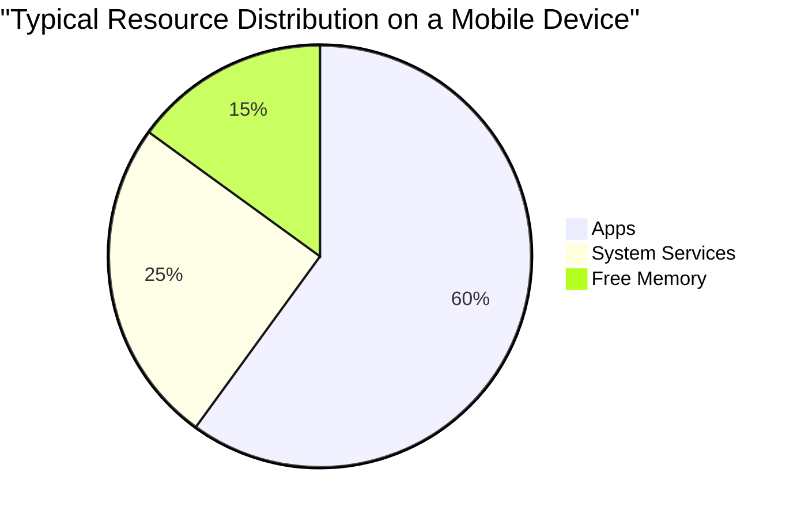
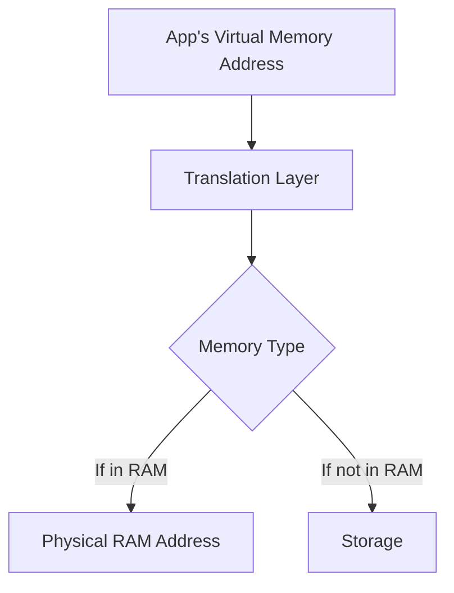
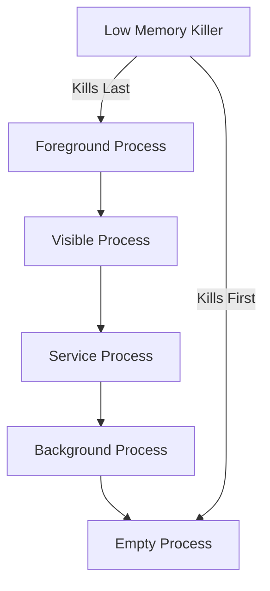

# Mobile Memory Management

## Introduction

Memory management is a critical aspect of mobile operating systems that directly impacts app performance, battery life, and user experience. Unlike desktop computers with abundant resources, mobile devices operate with strict memory constraints, making efficient memory utilization essential.

This guide explores how mobile operating systems handle memory allocation, deallocation, and optimization to ensure smooth operation even with limited resources. Whether you're developing Android, iOS, or other mobile applications, understanding these concepts will help you create more efficient and responsive apps.

## Why Memory Management Matters on Mobile Devices

Memory on mobile devices is a precious and limited resource for several reasons:

- **Limited Physical RAM**: Mobile devices typically have less RAM than desktop computers
- **Battery Considerations**: Excessive memory usage leads to higher power consumption
- **Multitasking Challenges**: Multiple apps compete for the same memory resources
- **User Experience Expectations**: Users expect responsive apps regardless of constraints

Let's visualize the challenge:



## Core Memory Management Concepts

### The Memory Hierarchy

Mobile devices use a hierarchy of memory types, each with different speed and capacity characteristics:

- **CPU Registers**: Extremely fast but very limited
- **CPU Cache**: Very fast, small capacity
- **RAM (Main Memory)**: Fast access, limited capacity
- **Storage (Flash Memory)**: Slower access, larger capacity

### Virtual Memory vs. Physical Memory

Mobile operating systems use virtual memory to provide apps with a uniform view of memory:



## Memory Management in Android

Android employs several strategies to manage memory efficiently:

### The Android Memory Model

Android uses a shared memory model where processes can share memory pages for common libraries and resources.

### Garbage Collection

Java's automatic memory management helps prevent memory leaks:

```java
// Android automatically manages the memory for these objects
void createObjects() {
    String temporaryString = "This will be garbage collected";
    List<Integer> temporaryList = new ArrayList<>();
    temporaryList.add(1);
    temporaryList.add(2);
    
    // No need to explicitly free memory
    // Once the function exits, these objects become candidates for garbage collection
}
```

### Process Lifecycle and Low Memory Killer

Android ranks processes by importance and terminates lower-priority processes when memory is scarce:



### Android Memory Profiling

Android Studio provides tools to monitor memory usage:

```java
// Example: Detecting a memory leak
public class LeakyActivity extends Activity {
    private static Context leakyContext;
    
    @Override
    protected void onCreate(Bundle savedInstanceState) {
        super.onCreate(savedInstanceState);
        leakyContext = this; // Memory leak! Static reference to Activity
    }
    
    // Correct approach
    private static WeakReference<Context> safeContext;
    protected void onCreateFixed(Bundle savedInstanceState) {
        super.onCreate(savedInstanceState);
        safeContext = new WeakReference<>(this);
    }
}
```

## Memory Management in iOS

iOS takes a different approach to memory management:

### Automatic Reference Counting (ARC)

ARC automatically manages memory by tracking references to objects:

```swift
func scopeExample() {
    // This object is created
    let person = Person(name: "John")
    
    // When the function exits, ARC decrements reference count
    // If count reaches zero, memory is freed
} // person is deallocated here automatically
```

### Memory Warnings

iOS sends notifications when memory is running low:

```swift
override func didReceiveMemoryWarning() {
    super.didReceiveMemoryWarning()
    
    // Release any cached data, images, etc that aren't in use
    imageCache.removeAll()
    
    // Dispose of any resources that can be recreated
}
```

### App Termination

iOS may terminate background apps when memory pressure is high, without warning.

## Best Practices for Efficient Memory Usage

### 1. Avoid Memory Leaks

```java
// Android: Common leak pattern
class LeakExample {
    private static List<Object> leakyList = new ArrayList<>();
    
    void addItems() {
        // Adding to a static collection that never gets cleared
        for (int i = 0; i < 10000; i++) {
            leakyList.add(new byte[1000]); // Memory leak!
        }
    }
}
```

### 2. Load Resources on Demand

```kotlin
// Only load large resources when needed
private var largeImage: Bitmap? = null

fun loadImageIfNeeded() {
    if (largeImage == null && isVisible) {
        largeImage = BitmapFactory.decodeResource(resources, R.drawable.large_image)
    }
}

fun releaseMemory() {
    if (!isVisible && largeImage != null) {
        largeImage?.recycle()
        largeImage = null
    }
}
```

### 3. Use Memory-Efficient Data Structures

```java
// Instead of using a Bitmap directly
Bitmap fullBitmap = BitmapFactory.decodeResource(getResources(), R.drawable.large_image);

// Use a scaled version if appropriate
BitmapFactory.Options options = new BitmapFactory.Options();
options.inSampleSize = 4; // Load at 1/4 the size
Bitmap scaledBitmap = BitmapFactory.decodeResource(getResources(), 
                                                   R.drawable.large_image, 
                                                   options);
```

### 4. Implement Caching Carefully

```kotlin
// Simple memory cache with size limit
class ImageCache {
    private val cache = LruCache<String, Bitmap>(
        // Use 1/8th of available memory for this cache
        (Runtime.getRuntime().maxMemory() / 8).toInt()
    )
    
    fun addBitmapToCache(key: String, bitmap: Bitmap) {
        if (getBitmapFromCache(key) == null) {
            cache.put(key, bitmap)
        }
    }
    
    fun getBitmapFromCache(key: String): Bitmap? {
        return cache.get(key)
    }
}
```

### 5. Use Memory Analysis Tools

Both Android Studio and Xcode provide memory profilers to detect inefficient memory usage.

## Real-World Applications

### Case Study: Image Loading in a Gallery App

```kotlin
class EfficientGalleryActivity : AppCompatActivity() {
    private lateinit var imageAdapter: ImageAdapter
    private val imageCache = ImageCache()
    
    override fun onCreate(savedInstanceState: Bundle?) {
        super.onCreate(savedInstanceState)
        setContentView(R.layout.activity_gallery)
        
        // Setup RecyclerView with efficient adapter
        val recyclerView = findViewById<RecyclerView>(R.id.recyclerView)
        imageAdapter = ImageAdapter(imageCache)
        recyclerView.adapter = imageAdapter
        
        // Load thumbnails instead of full images
        loadThumbnails()
    }
    
    private fun loadThumbnails() {
        // Load only visible thumbnails
        // Full images are loaded only when viewed
    }
    
    override fun onDestroy() {
        // Clean up any resources
        imageCache.clear()
        super.onDestroy()
    }
}
```

### Case Study: Memory Optimization in a Game

Mobile games require special attention to memory management, especially for graphics and assets:

1. **Texture Atlases**: Combine multiple textures into one to reduce memory overhead
2. **Level Streaming**: Load only parts of the game world that are currently visible
3. **Asset Pooling**: Reuse objects instead of creating and destroying them

```java
// Simple object pool example
public class BulletPool {
    private final Queue<Bullet> pool = new LinkedList<>();
    private final int maxPoolSize = 50;
    
    public Bullet getBullet() {
        if (pool.isEmpty()) {
            return new Bullet();
        }
        return pool.poll();
    }
    
    public void returnBullet(Bullet bullet) {
        if (pool.size() < maxPoolSize) {
            bullet.reset();
            pool.add(bullet);
        }
    }
}
```

## Memory Management Tradeoffs

Developers must balance:


## Summary

Effective memory management on mobile devices requires understanding:

- The constraints and architecture of mobile systems
- Platform-specific approaches (garbage collection vs. ARC)
- Common memory issues and how to avoid them
- Tools and techniques for monitoring and optimizing memory usage

By applying the best practices outlined in this guide, you can create mobile applications that use memory efficiently, leading to better performance, longer battery life, and improved user satisfaction.

## Exercises

1. Create a simple Android app that loads and displays a large image, then implement memory optimization techniques to reduce its memory footprint.

2. Profile an existing app using Android Studio's Memory Profiler or Xcode's Instruments tool to identify memory issues.

3. Implement an object pooling system for a game or animation app to reuse objects instead of constantly creating and destroying them.

4. Compare memory usage between different data structures (ArrayList vs. LinkedList, HashMap vs. ArrayMap) for various operations.

5. Implement a cache with an eviction policy to manage memory usage for resource-intensive operations.

## Additional Resources

- [Android Developers: Memory Management Overview](https://developer.android.com/topic/performance/memory-overview)
- [Apple Developer: Memory Usage Performance Guidelines](https://developer.apple.com/library/archive/documentation/Performance/Conceptual/ManagingMemory/ManagingMemory.html)
- [Android Profiler: Memory Profiler](https://developer.android.com/studio/profile/memory-profiler)
- [Xcode Instruments: Allocations](https://help.apple.com/instruments/mac/current/#/dev7b09c84f5)