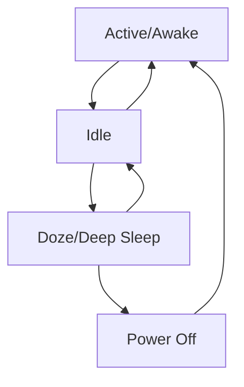
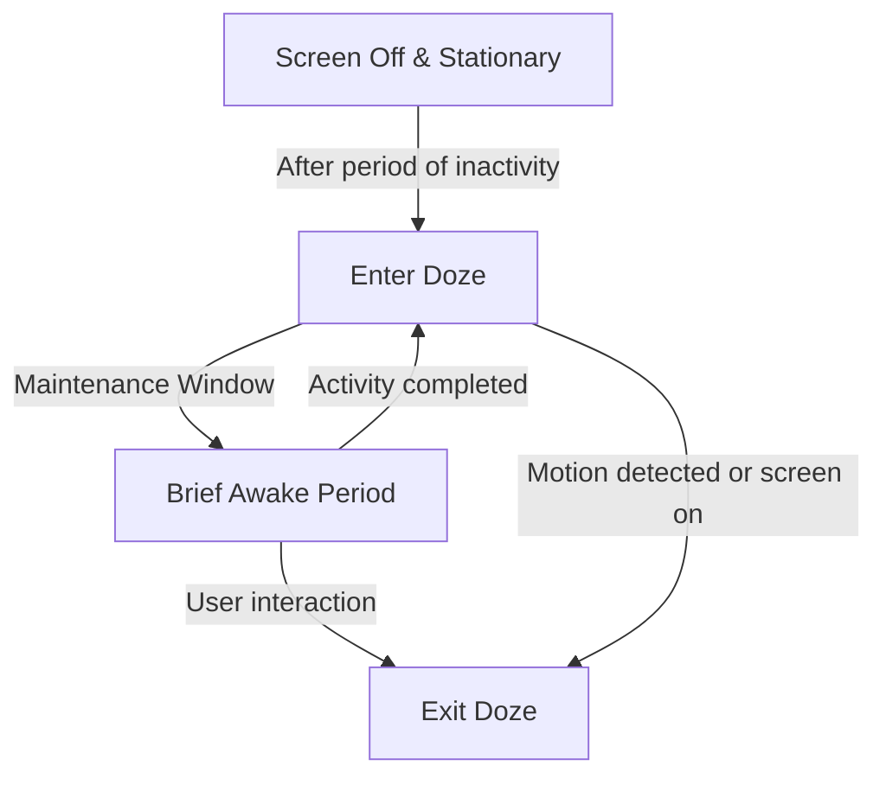

# Mobile Power Management

## Introduction

Power management is a critical aspect of mobile operating systems that directly impacts battery life, device performance, and user experience. Unlike desktop computers that are typically connected to a constant power source, mobile devices rely on limited battery capacity while needing to support an increasing number of power-hungry features and applications.

In this guide, we'll explore how mobile operating systems manage power resources, the strategies they employ to extend battery life, and how developers can optimize their applications to be more power-efficient.

## Why Power Management Matters

On average, users expect their smartphones to last at least a full day on a single charge. However, modern smartphones pack powerful processors, high-resolution displays, multiple radios (cellular, WiFi, Bluetooth, GPS), and various sensors—all of which consume significant energy.

Effective power management is the balancing act between:

1. Providing a responsive and feature-rich user experience
2. Maximizing battery life
3. Managing thermal constraints (excessive power usage generates heat)

## Core Concepts in Mobile Power Management

### 1. Power States

Mobile operating systems implement various power states to manage energy consumption:



- **Active/Awake**: Full functionality, all components powered
- **Idle**: Screen off, background processing allowed
- **Doze/Deep Sleep**: Minimal background activity, most components powered down
- **Power Off**: Complete shutdown

### 2. Components Power Management

Each hardware component has different power requirements and management strategies:

| Component | Power Usage | Management Strategies |
|-----------|-------------|------------------------|
| Display | High (30-50%) | Brightness control, timeout, dark mode |
| CPU | Variable (10-30%) | Dynamic frequency scaling, core switching |
| Radios | Variable (10-40%) | On/off cycling, signal strength adaptation |
| GPS | High when active | On-demand activation |
| Sensors | Low to moderate | Batching, duty cycling |

### 3. Power Monitoring

To manage power effectively, operating systems continuously monitor:

- Battery charge level and health
- Per-app and per-component power consumption
- System temperature
- User activity patterns

## Mobile OS Power Management Implementations

### Android Power Management

Android implements several power management features:

#### Doze Mode

Introduced in Android 6.0, Doze mode reduces battery consumption when the device is stationary and unplugged by:

- Deferring background CPU and network activity
- Suspending app syncs and standard AlarmManager alarms
- Disabling WiFi scans and other regular activities

Here's how Doze mode works:



#### App Standby

App Standby puts rarely used apps into a hibernation state, restricting their background activities:

```java
// Check if app is in standby mode
boolean isAppInStandby = powerManager.isDeviceIdleMode();

// Register a broadcast receiver to detect changes
IntentFilter filter = new IntentFilter(PowerManager.ACTION_DEVICE_IDLE_MODE_CHANGED);
registerReceiver(myReceiver, filter);
```

#### Battery Optimizations

Android allows apps to request exemption from certain battery optimizations:

```java
PowerManager powerManager = (PowerManager) getSystemService(POWER_SERVICE);
String packageName = getPackageName();

// Check if the app is ignored for battery optimizations
boolean isIgnoringBatteryOptimizations = powerManager.isIgnoringBatteryOptimizations(packageName);

if (!isIgnoringBatteryOptimizations) {
    // Request user to disable battery optimization for this app
    Intent intent = new Intent(Settings.ACTION_REQUEST_IGNORE_BATTERY_OPTIMIZATIONS);
    intent.setData(Uri.parse("package:" + packageName));
    startActivity(intent);
}
```

### iOS Power Management

iOS takes a more controlled approach to power management:

#### App Background Execution

iOS limits what apps can do in the background through specific background execution modes:

```swift
// Request background execution time
var backgroundTask: UIBackgroundTaskIdentifier = .invalid

backgroundTask = UIApplication.shared.beginBackgroundTask {
    // Clean up when time expires
    UIApplication.shared.endBackgroundTask(backgroundTask)
    backgroundTask = .invalid
}

// Perform your background task here

// End the task when finished
UIApplication.shared.endBackgroundTask(backgroundTask)
backgroundTask = .invalid
```

#### Low Power Mode

iOS offers Low Power Mode that users can enable to extend battery life by:

- Reducing CPU performance
- Limiting background activity
- Disabling automatic downloads
- Reducing visual effects

You can detect when Low Power Mode is enabled:

```swift
if ProcessInfo.processInfo.isLowPowerModeEnabled {
    // Adapt your app behavior for Low Power Mode
    // e.g., reduce refresh frequency, disable animations
}

// Register for notifications when Low Power Mode changes
NotificationCenter.default.addObserver(
    self, 
    selector: #selector(didChangeLowPowerMode(_:)), 
    name: NSNotification.Name.NSProcessInfoPowerStateDidChange, 
    object: nil
)
```

## Developer Best Practices for Power Efficiency

As a developer, your coding decisions significantly impact the battery consumption of your apps. Here are key best practices:

### 1. Minimize Wake Locks and Background Processing

Wake locks (Android) or background tasks (iOS) should be used sparingly:

```java
// Android example: Acquire and release wake lock properly
PowerManager powerManager = (PowerManager) getSystemService(POWER_SERVICE);
PowerManager.WakeLock wakeLock = powerManager.newWakeLock(
    PowerManager.PARTIAL_WAKE_LOCK, "MyApp:MyWakeLockTag");

try {
    wakeLock.acquire(10*60*1000L); // 10 minutes timeout
    // Do work that requires the CPU to stay awake
} finally {
    wakeLock.release();
}
```

### 2. Batch Network Operations

Instead of making frequent network calls, batch them together:

```java
// Bad approach: Making network calls frequently
for (Item item : items) {
    sendDataToServer(item); // Each call wakes up the radio
}

// Better approach: Batch operations
List<Item> batchItems = new ArrayList<>();
for (Item item : items) {
    batchItems.add(item);
    if (batchItems.size() >= BATCH_SIZE) {
        sendBatchToServer(batchItems);
        batchItems.clear();
    }
}
if (!batchItems.isEmpty()) {
    sendBatchToServer(batchItems);
}
```

### 3. Use JobScheduler (Android) or BackgroundTasks (iOS)

Let the system decide the best time to run background tasks:

```java
// Android JobScheduler example
ComponentName serviceComponent = new ComponentName(context, MyJobService.class);
JobInfo.Builder builder = new JobInfo.Builder(JOB_ID, serviceComponent)
    .setRequiresCharging(true)
    .setRequiredNetworkType(JobInfo.NETWORK_TYPE_UNMETERED)
    .setPersisted(true);

JobScheduler jobScheduler = (JobScheduler) context.getSystemService(Context.JOB_SCHEDULER_SERVICE);
jobScheduler.schedule(builder.build());
```

```swift
// iOS BackgroundTasks example
let request = BGProcessingTaskRequest(identifier: "com.example.app.refresh")
request.requiresNetworkConnectivity = true
request.requiresExternalPower = false

do {
    try BGTaskScheduler.shared.submit(request)
} catch {
    print("Could not schedule app refresh: \(error)")
}
```

### 4. Optimize Location Services

Location services are particularly power-hungry. Use the lowest accuracy needed:

```java
// Android example
LocationRequest locationRequest = LocationRequest.create()
    .setPriority(LocationRequest.PRIORITY_BALANCED_POWER_ACCURACY)
    .setInterval(10000)        // Update interval in milliseconds
    .setFastestInterval(5000); // Fastest update interval
```

```swift
// iOS example
locationManager.desiredAccuracy = kCLLocationAccuracyHundredMeters // Less precise but more power efficient
locationManager.distanceFilter = 100 // Only update when moved 100 meters
```

### 5. Efficient UI Updates

Reduce power consumption by optimizing UI rendering:

```java
// Android: Use efficient layouts
// Avoid deep view hierarchies
// Use ConstraintLayout instead of nested LinearLayouts
// Avoid unnecessary invalidations
```

```swift
// iOS: Reduce animations in low power mode
if ProcessInfo.processInfo.isLowPowerModeEnabled {
    UIView.animate(withDuration: 0.1) {
        // Simple animation or none at all
    }
} else {
    UIView.animate(withDuration: 0.3, delay: 0, options: .curveEaseInOut) {
        // Normal animation
    }
}
```

## Real-World Power Profiling Example

Let's examine a practical example of power profiling and optimization:

### Problem: High Battery Drain

An app is reported to drain battery quickly. Using profiling tools (Android Battery Historian or Xcode Energy Gauge), we identify these issues:

1. Frequent network calls even when the app is in the background
2. Continuous GPS usage at high accuracy
3. Wake locks that keep the device awake

### Solution Steps

1. **Analyze the Power Profile:**

```bash
# Android: Using Battery Historian
adb shell dumpsys batterystats > batterystats.txt
python historian.py batterystats.txt
```

2. **Identify and Fix Issues:**

```java
// BEFORE: Polling server every minute regardless of app state
Timer timer = new Timer();
timer.schedule(new TimerTask() {
    @Override
    public void run() {
        fetchUpdatesFromServer();
    }
}, 0, 60 * 1000);

// AFTER: Use push notifications and JobScheduler
FirebaseMessaging.getInstance().subscribeToTopic("updates");
// Server sends push notification when updates are available

// And schedule periodic sync using JobScheduler
ComponentName component = new ComponentName(context, SyncJobService.class);
JobInfo jobInfo = new JobInfo.Builder(SYNC_JOB_ID, component)
    .setPeriodic(3600 * 1000) // Once per hour instead of every minute
    .setRequiredNetworkType(JobInfo.NETWORK_TYPE_ANY)
    .build();

JobScheduler jobScheduler = (JobScheduler) getSystemService(Context.JOB_SCHEDULER_SERVICE);
jobScheduler.schedule(jobInfo);
```

3. **Optimize Location Services:**

```java
// BEFORE: Continuous high-accuracy location
LocationRequest locationRequest = LocationRequest.create()
    .setPriority(LocationRequest.PRIORITY_HIGH_ACCURACY)
    .setInterval(5000);

// AFTER: Adaptive location strategy
private void setLocationRequest() {
    LocationRequest locationRequest;
    
    if (userIsActivelyNavigating) {
        locationRequest = LocationRequest.create()
            .setPriority(LocationRequest.PRIORITY_HIGH_ACCURACY)
            .setInterval(5000);
    } else if (appInForeground) {
        locationRequest = LocationRequest.create()
            .setPriority(LocationRequest.PRIORITY_BALANCED_POWER_ACCURACY)
            .setInterval(30000);
    } else {
        locationRequest = LocationRequest.create()
            .setPriority(LocationRequest.PRIORITY_LOW_POWER)
            .setInterval(300000); // 5 minutes
    }
    
    fusedLocationClient.requestLocationUpdates(locationRequest, locationCallback, null);
}
```

### Results

After implementing these optimizations, the app's battery consumption was reduced by 65%, showing how practical application of power management principles can significantly improve user experience.

## Summary

Power management is a fundamental aspect of mobile operating system design that directly affects user experience. As mobile developers, understanding and respecting the power constraints of mobile devices is essential for creating successful applications.

Key takeaways:

1. Mobile OSes implement sophisticated power management systems to balance performance and battery life
2. Different components have different power profiles and management strategies
3. Developer decisions significantly impact an app's power consumption
4. Best practices include batching operations, using system schedulers, and adapting to device power state
5. Always test and profile your app's power consumption in real-world scenarios

## Exercises

1. Use Android's Battery Historian or iOS Energy Gauges to profile an existing app's power consumption. Identify three potential optimizations.

2. Modify an existing app to adapt its behavior when Low Power Mode is enabled (iOS) or Battery Saver is active (Android).

3. Implement a background sync feature that uses JobScheduler (Android) or BackgroundTasks (iOS) instead of timers or alarms.

4. Create a location-tracking feature that adjusts accuracy and update frequency based on battery level and app state.

5. Analyze how your favorite apps behave when the device enters low power states. Do they adapt gracefully?

## Additional Resources

- [Android Power Management Documentation](https://developer.android.com/topic/performance/power)
- [iOS Energy Efficiency Guide](https://developer.apple.com/library/archive/documentation/Performance/Conceptual/EnergyGuide-iOS/)
- [Android Battery Historian Tool](https://github.com/google/battery-historian)
- [Monitoring Energy Impact with Xcode](https://developer.apple.com/documentation/xcode/improving-your-app-s-energy-efficiency)