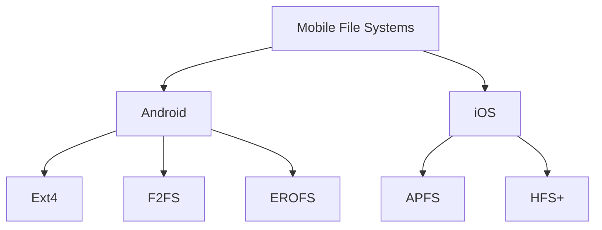

# Mobile File Systems

## Introduction

Mobile file systems are specialized storage architectures designed to meet the unique constraints and requirements of mobile devices. Unlike traditional desktop file systems, mobile file systems must handle limited resources, power constraints, frequent interruptions, and diverse storage media—all while maintaining data integrity and providing good performance.

In this guide, we'll explore how mobile operating systems organize and manage data storage, the challenges they face, and the specialized solutions they implement. Whether you're developing mobile applications or simply curious about how your smartphone manages all those files, this guide will provide you with a solid foundation.

## Core Concepts of Mobile File Systems

### Key Challenges in Mobile Environments

Mobile file systems face several unique challenges compared to their desktop counterparts:

1. **Limited Resources**: Mobile devices have constraints on memory, processing power, and storage capacity.
2. **Power Efficiency**: File operations must minimize battery usage.
3. **Reliability**: File systems must handle unexpected power loss without data corruption.
4. **Performance**: Despite constraints, users expect quick file access and application responsiveness.
5. **Flash Memory Characteristics**: Most mobile devices use flash storage, which has different wear patterns and performance characteristics than traditional hard drives.

### Common Mobile File System Types

Different mobile operating systems implement various file system solutions:



## Android File Systems

Android has used several file systems throughout its history, gradually evolving to better suit mobile requirements.

### Ext4

The Fourth Extended Filesystem (Ext4) was Android's primary file system for many years.

#### Key Features of Ext4:

- **Journaling**: Maintains a log of changes to help prevent data corruption during crashes
- **Extent-based storage**: Improves performance for large files
- **Delayed allocation**: Optimizes how blocks are written to storage
- **Backward compatibility**: With earlier ext file systems

```java
// Example: Opening a file in Android using Ext4 (transparent to the developer)
try {
    FileOutputStream fos = context.openFileOutput("myfile.txt", Context.MODE_PRIVATE);
    fos.write("Hello, Ext4 file system!".getBytes());
    fos.close();
} catch (IOException e) {
    e.printStackTrace();
}
```

### F2FS (Flash-Friendly File System)

Designed specifically for flash-based storage devices, F2FS is optimized for the NAND flash memory used in smartphones.

#### Key Features of F2FS:

- **Multi-head logging**: Distributes writes across the storage to extend flash memory lifespan
- **Adaptive logging**: Adjusts behavior based on storage conditions
- **TRIM support**: Better garbage collection
- **Fast mount time**: Quicker device startup

### EROFS (Extendable Read-Only File System)

A newer file system specifically designed for read-only partitions in Android.

#### Key Features of EROFS:

- **High compression ratios**: Saves storage space
- **Fast random read performance**: Better than other compressed file systems
- **Fixed-sized output**: Predictable storage requirements
- **Minimal RAM usage**: Efficient decompression

## iOS File Systems

Apple has its own approach to mobile file systems for iOS devices.

### APFS (Apple File System)

Introduced in iOS 10.3, APFS replaced the older HFS+ with a modern file system designed with flash storage in mind.

#### Key Features of APFS:

- **Copy-on-write metadata**: Prevents data corruption during system crashes
- **Space sharing**: Flexibly allocates storage across volumes
- **Snapshots**: Point-in-time, read-only instances of the file system
- **Native encryption**: Built-in support for encrypting individual files or entire volumes
- **Clones**: Efficient file copies that only store the differences

```swift
// Example: Creating a file in iOS using APFS (transparent to the developer)
let documentsDirectory = FileManager.default.urls(for: .documentDirectory, in: .userDomainMask)[0]
let fileURL = documentsDirectory.appendingPathComponent("myfile.txt")

do {
    try "Hello, APFS file system!".write(to: fileURL, atomically: true, encoding: .utf8)
} catch {
    print("Error writing to file: \(error)")
}
```

### HFS+ (Hierarchical File System Plus)

The predecessor to APFS, HFS+ was used on iOS devices before iOS 10.3.

#### Key Features of HFS+:

- **Journaling**: For crash protection
- **Unicode filename support**: For international character sets
- **Hard links**: Multiple references to the same file
- **Larger file size limits**: Compared to the original HFS

## Mobile Storage Hierarchy

Mobile operating systems organize storage in a hierarchical manner, with specific directories serving different purposes.

### Android Storage Structure

```
/
├── data/            # App-specific data (private)
│   └── <package_name>/
│       ├── files/  
│       ├── cache/
│       └── databases/
├── storage/         # User-accessible storage
│   ├── emulated/0/  # Internal shared storage
│   └── <sdcard>/    # External SD card if present
└── system/          # System files (read-only)
```

### iOS Storage Structure

```
/
├── Applications/        # App bundles
├── private/
│   ├── var/mobile/Containers/
│   │   ├── Data/        # App data containers
│   │   └── Bundle/      # App bundle containers
│   └── var/mobile/Media/  # Media files
└── System/              # System files
```

## Working with Mobile File Systems in Apps

### Android File Operations

Android provides several APIs to interact with the file system:

#### Internal Storage (Private to the App)

```java
// Writing to internal storage
public void writeInternalFile(String filename, String content) {
    try {
        FileOutputStream fos = context.openFileOutput(filename, Context.MODE_PRIVATE);
        fos.write(content.getBytes());
        fos.close();
    } catch (IOException e) {
        e.printStackTrace();
    }
}

// Reading from internal storage
public String readInternalFile(String filename) {
    try {
        FileInputStream fis = context.openFileInput(filename);
        InputStreamReader isr = new InputStreamReader(fis);
        BufferedReader br = new BufferedReader(isr);
        StringBuilder sb = new StringBuilder();
        String line;
        while ((line = br.readLine()) != null) {
            sb.append(line);
        }
        return sb.toString();
    } catch (IOException e) {
        e.printStackTrace();
        return null;
    }
}
```

#### External Storage Access (Shared)

Starting with Android 10, apps need to use the Storage Access Framework or MediaStore for most external storage operations:

```java
// Using Storage Access Framework to create a file
private void createFile() {
    Intent intent = new Intent(Intent.ACTION_CREATE_DOCUMENT);
    intent.addCategory(Intent.CATEGORY_OPENABLE);
    intent.setType("text/plain");
    intent.putExtra(Intent.EXTRA_TITLE, "newfile.txt");
    startActivityForResult(intent, CREATE_FILE_REQUEST_CODE);
}

// Handle the result
@Override
protected void onActivityResult(int requestCode, int resultCode, Intent data) {
    super.onActivityResult(requestCode, resultCode, data);
    if (requestCode == CREATE_FILE_REQUEST_CODE && resultCode == Activity.RESULT_OK) {
        if (data != null) {
            Uri uri = data.getData();
            try {
                OutputStream os = getContentResolver().openOutputStream(uri);
                os.write("Hello, world!".getBytes());
                os.close();
            } catch (IOException e) {
                e.printStackTrace();
            }
        }
    }
}
```

### iOS File Operations

iOS provides a more sandboxed approach to file management:

#### App-Specific Storage

```swift
// Writing to app's Documents directory
func saveFile(fileName: String, content: String) {
    let documentsDirectory = FileManager.default.urls(for: .documentDirectory, in: .userDomainMask).first!
    let fileURL = documentsDirectory.appendingPathComponent(fileName)
    
    do {
        try content.write(to: fileURL, atomically: true, encoding: .utf8)
    } catch {
        print("Failed to write file: \(error)")
    }
}

// Reading from app's Documents directory
func readFile(fileName: String) -> String? {
    let documentsDirectory = FileManager.default.urls(for: .documentDirectory, in: .userDomainMask).first!
    let fileURL = documentsDirectory.appendingPathComponent(fileName)
    
    do {
        return try String(contentsOf: fileURL, encoding: .utf8)
    } catch {
        print("Failed to read file: \(error)")
        return nil
    }
}
```

#### Using FileManager for Directory Operations

```swift
func listFilesInDocuments() -> [String] {
    let documentsDirectory = FileManager.default.urls(for: .documentDirectory, in: .userDomainMask).first!
    
    do {
        return try FileManager.default.contentsOfDirectory(atPath: documentsDirectory.path)
    } catch {
        print("Failed to list directory: \(error)")
        return []
    }
}
```

## Special Considerations for Mobile File Systems

### Optimizing for Battery Life

File operations can be power-intensive. Here are some best practices:

1. **Batch operations**: Combine multiple small I/O operations into fewer, larger ones
2. **Reduce writes**: Minimize frequency of file writes when possible
3. **Use appropriate storage**: Use caches for temporary data, not persistent storage
4. **Compression**: Consider compressing large files before storage

### Handling Limited Storage

Mobile devices often have storage constraints:

1. **Efficient formats**: Use efficient data formats and compression
2. **Clean up temporary files**: Don't let cache files accumulate indefinitely
3. **Implement quotas**: Limit how much storage your app uses
4. **Offload to cloud**: Consider using cloud storage for large files

### Example: Checking Available Storage in Android

```java
public long getAvailableInternalStorage() {
    File path = Environment.getDataDirectory();
    StatFs stat = new StatFs(path.getPath());
    long blockSize = stat.getBlockSizeLong();
    long availableBlocks = stat.getAvailableBlocksLong();
    return availableBlocks * blockSize;
}
```

### Example: Checking Available Storage in iOS

```swift
func getAvailableStorage() -> Int64? {
    let fileURL = URL(fileURLWithPath: NSHomeDirectory() as String)
    do {
        let values = try fileURL.resourceValues(forKeys: [.volumeAvailableCapacityKey])
        if let capacity = values.volumeAvailableCapacity {
            return capacity
        }
    } catch {
        print("Error retrieving storage capacity: \(error)")
    }
    return nil
}
```

## Real-World Application: Photo Gallery App

Let's consider how a photo gallery app might interact with mobile file systems:

### Android Implementation

```java
public class GalleryManager {
    private Context context;
    
    public GalleryManager(Context context) {
        this.context = context;
    }
    
    // Load images from MediaStore
    public List<String> loadImagePaths() {
        List<String> imagePaths = new ArrayList<>();
        Uri uri = MediaStore.Images.Media.EXTERNAL_CONTENT_URI;
        String[] projection = {MediaStore.Images.Media.DATA};
        Cursor cursor = context.getContentResolver().query(uri, projection, null, null, null);
        
        if (cursor != null) {
            int columnIndex = cursor.getColumnIndexOrThrow(MediaStore.Images.Media.DATA);
            while (cursor.moveToNext()) {
                imagePaths.add(cursor.getString(columnIndex));
            }
            cursor.close();
        }
        
        return imagePaths;
    }
    
    // Save image to app's private storage
    public Uri saveImageToPrivateStorage(Bitmap bitmap, String filename) {
        File directory = new File(context.getFilesDir(), "images");
        if (!directory.exists()) {
            directory.mkdirs();
        }
        
        File file = new File(directory, filename);
        try {
            FileOutputStream fos = new FileOutputStream(file);
            bitmap.compress(Bitmap.CompressFormat.JPEG, 90, fos);
            fos.close();
            return Uri.fromFile(file);
        } catch (IOException e) {
            e.printStackTrace();
            return null;
        }
    }
}
```

### iOS Implementation

```swift
class GalleryManager {
    // Load images from Photos framework
    func loadImages(completion: @escaping ([UIImage]) -> Void) {
        var images = [UIImage]()
        let requestOptions = PHImageRequestOptions()
        requestOptions.isSynchronous = true
        
        let fetchOptions = PHFetchOptions()
        fetchOptions.sortDescriptors = [NSSortDescriptor(key: "creationDate", ascending: false)]
        
        let fetchResult = PHAsset.fetchAssets(with: .image, options: fetchOptions)
        fetchResult.enumerateObjects { (asset, _, _) in
            PHImageManager.default().requestImage(
                for: asset,
                targetSize: CGSize(width: 300, height: 300),
                contentMode: .aspectFill,
                options: requestOptions
            ) { image, _ in
                if let image = image {
                    images.append(image)
                }
            }
        }
        
        completion(images)
    }
    
    // Save image to app's Documents directory
    func saveImage(_ image: UIImage, withName name: String) -> URL? {
        guard let data = image.jpegData(compressionQuality: 0.9) else { return nil }
        
        let documentsDirectory = FileManager.default.urls(for: .documentDirectory, in: .userDomainMask).first!
        let fileURL = documentsDirectory.appendingPathComponent("images/\(name).jpg")
        
        // Create directory if it doesn't exist
        let directoryURL = fileURL.deletingLastPathComponent()
        do {
            try FileManager.default.createDirectory(at: directoryURL, withIntermediateDirectories: true)
            try data.write(to: fileURL)
            return fileURL
        } catch {
            print("Error saving image: \(error)")
            return nil
        }
    }
}
```

## Future Trends in Mobile File Systems

Mobile file systems continue to evolve with new hardware and usage patterns:

1. **More efficient compression**: To maximize limited storage space
2. **Better flash memory optimization**: As new flash storage technologies emerge
3. **Enhanced security**: Protection against malware and unauthorized access
4. **Cloud integration**: Seamless transitions between local and cloud storage
5. **Machine learning optimizations**: Predictive caching and file management

## Performance Considerations

### Benchmarking Different File Systems

Here's a simplified comparison of read/write operations on different mobile file systems:


| File System | Sequential Read | Random Read | Sequential Write | Random Write | Mount Time |
|-------------|----------------|------------|-----------------|-------------|------------|
| Ext4        | Good           | Good       | Good            | Moderate    | Moderate   |
| F2FS        | Good           | Very Good  | Very Good       | Good        | Very Good  |
| APFS        | Very Good      | Very Good  | Good            | Good        | Good       |
| EROFS       | Very Good      | Very Good  | N/A (read-only) | N/A         | Very Good  |

### Optimizing File Access in Your Apps

1. **Use appropriate directories**: Store cache data in cache directories, not persistent storage
2. **Buffer data**: Collect small writes into larger batches
3. **Use transactions**: For database operations to ensure data integrity
4. **Consider file size**: Break extremely large files into manageable chunks
5. **Avoid unnecessary metadata operations**: Repeated stat calls or directory listings

## Summary

Mobile file systems are specialized solutions designed to address the unique challenges of mobile computing environments. They balance performance, reliability, and efficiency while working within the constraints of mobile hardware.

Key takeaways:

1. Mobile file systems like Ext4, F2FS, and APFS are optimized for flash storage performance and lifespan
2. Different storage locations serve different purposes (private app data, shared media, etc.)
3. Developers must carefully consider battery and storage impacts when performing file operations
4. Modern mobile file systems incorporate features like journaling, encryption, and compression
5. Understanding the file system hierarchy helps in designing effective mobile applications

## Exercises

1. **Basic File Operations**: Create a simple note-taking app that saves notes to the device's internal storage.
2. **Storage Analysis**: Write a utility that calculates and displays storage usage by file type.
3. **File Transfer**: Implement a function that efficiently copies large files between storage locations.
4. **Cache Management**: Create a cache manager that automatically purges old files when storage is low.
5. **Shared Storage**: Build a photo backup utility that saves images to shared storage (respecting permissions).

## Additional Resources

- Android Documentation: [Data and File Storage Overview](https://developer.android.com/training/data-storage)
- Apple Developer: [File System Programming Guide](https://developer.apple.com/library/archive/documentation/FileManagement/Conceptual/FileSystemProgrammingGuide/Introduction/Introduction.html)
- Linux Documentation: [F2FS Wiki](https://wiki.kernel.org/index.php/F2FS)
- Book: "Modern File Systems Design" by Jim Gray and Andreas Reuter
- Course: "Mobile Development and Storage Optimization" on major learning platforms