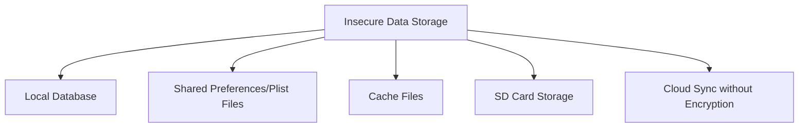

# Mobile Security

## Introduction

Mobile security refers to protecting smartphones, tablets, and other portable devices from threats and vulnerabilities. As mobile devices have become essential tools for personal and professional use, they store vast amounts of sensitive information, making them attractive targets for attackers. In this tutorial, we'll explore the fundamentals of mobile security, common threats, and how to implement secure coding practices in mobile application development.

## Why Mobile Security Matters

Mobile devices face unique security challenges compared to traditional computing environments:

- They're easily lost or stolen
- They connect to various networks (some insecure)
- They run third-party applications with varying security standards
- They store sensitive personal and corporate data
- They often lack robust security controls found on desktop systems

## Common Mobile Security Threats

### 1. Insecure Data Storage

When mobile applications store sensitive data without proper encryption or protection, attackers who gain access to the device can extract this information.



### 2. Insecure Communication

Mobile apps often communicate with backend servers over networks that might be compromised.

**Example of Insecure Network Request:**

```java
// INSECURE: Using HTTP instead of HTTPS
URL url = new URL("http://api.example.com/userdata");
HttpURLConnection connection = (HttpURLConnection) url.openConnection();
// Read response...
```

**Secure Alternative:**

```java
// SECURE: Using HTTPS with certificate pinning
URL url = new URL("https://api.example.com/userdata");
HttpsURLConnection connection = (HttpsURLConnection) url.openConnection();

// Implement certificate pinning
TrustManager[] trustManagers = new TrustManager[] {
    new X509TrustManager() {
        public X509Certificate[] getAcceptedIssuers() {
            return new X509Certificate[0];
        }
        public void checkClientTrusted(X509Certificate[] chain, String authType) {}
        public void checkServerTrusted(X509Certificate[] chain, String authType) 
            throws CertificateException {
            // Verify if certificate matches our known certificate
            // Throw exception if not matching
        }
    }
};

SSLContext sslContext = SSLContext.getInstance("TLS");
sslContext.init(null, trustManagers, new SecureRandom());
connection.setSSLSocketFactory(sslContext.getSocketFactory());
```

### 3. Insufficient Authentication and Authorization

Many mobile apps implement weak authentication mechanisms that can be bypassed.

**Example of Weak Authentication:**

```swift
// INSECURE: Simple password check without proper hashing or security
func login(username: String, password: String) -> Bool {
    if username == "admin" && password == "password123" {
        return true // Grant access
    }
    return false
}
```

**Secure Alternative:**

```swift
// SECURE: Using secure authentication with hashing and salting
import CommonCrypto

func login(username: String, password: String) -> Bool {
    // Retrieve stored user data (salt and hashed password)
    guard let userData = getUserData(username: username),
          let storedHash = userData.passwordHash,
          let salt = userData.salt else {
        return false
    }
    
    // Hash the provided password with the same salt
    let hashedPassword = hashPassword(password: password, salt: salt)
    
    // Constant-time comparison to prevent timing attacks
    return secureCompare(hashedPassword, storedHash)
}

func hashPassword(password: String, salt: Data) -> Data {
    // Implementation of PBKDF2 or similar secure hashing
    // ...
}

func secureCompare(_ a: Data, _ b: Data) -> Bool {
    // Constant-time comparison implementation
    // ...
}
```

### 4. Reverse Engineering

Mobile applications can be decompiled and analyzed to extract sensitive information or bypass security controls.

**Protection Techniques:**

```java
// ANDROID: Using ProGuard for code obfuscation
// In build.gradle:
android {
    buildTypes {
        release {
            minifyEnabled true
            proguardFiles getDefaultProguardFile('proguard-android.txt'), 'proguard-rules.pro'
        }
    }
}
```

### 5. Malware and Spyware

Malicious apps can gain access to sensitive data or functionalities on a device.

## Mobile Security Best Practices

### 1. Secure Data Storage

Always encrypt sensitive data stored on the device:

```kotlin
// ANDROID: Using EncryptedSharedPreferences
val masterKeyAlias = MasterKeys.getOrCreate(MasterKeys.AES256_GCM_SPEC)

val sharedPreferences = EncryptedSharedPreferences.create(
    "secure_prefs",
    masterKeyAlias,
    context,
    EncryptedSharedPreferences.PrefKeyEncryptionScheme.AES256_SIV,
    EncryptedSharedPreferences.PrefValueEncryptionScheme.AES256_GCM
)

// Store sensitive data
sharedPreferences.edit().putString("api_key", "secret_api_key_value").apply()

// Retrieve sensitive data
val apiKey = sharedPreferences.getString("api_key", null)
```

```swift
// iOS: Using Keychain for secure storage
import Security

func saveToKeychain(key: String, data: Data) -> Bool {
    let query: [String: Any] = [
        kSecClass as String: kSecClassGenericPassword,
        kSecAttrAccount as String: key,
        kSecValueData as String: data,
        kSecAttrAccessible as String: kSecAttrAccessibleWhenUnlockedThisDeviceOnly
    ]
    
    // Delete any existing items
    SecItemDelete(query as CFDictionary)
    
    // Add the new item
    let status = SecItemAdd(query as CFDictionary, nil)
    return status == errSecSuccess
}

func loadFromKeychain(key: String) -> Data? {
    let query: [String: Any] = [
        kSecClass as String: kSecClassGenericPassword,
        kSecAttrAccount as String: key,
        kSecReturnData as String: true,
        kSecMatchLimit as String: kSecMatchLimitOne
    ]
    
    var dataTypeRef: AnyObject?
    let status = SecItemCopyMatching(query as CFDictionary, &dataTypeRef)
    
    if status == errSecSuccess {
        return dataTypeRef as? Data
    } else {
        return nil
    }
}
```

### 2. Secure Communication

Always use secure transport protocols and implement certificate pinning:

```kotlin
// ANDROID: OkHttp with Certificate Pinning
val certificatePinner = CertificatePinner.Builder()
    .add("api.example.com", "sha256/AAAAAAAAAAAAAAAAAAAAAAAAAAAAAAAAAAAAAAAAAAA=")
    .build()

val client = OkHttpClient.Builder()
    .certificatePinner(certificatePinner)
    .build()

val request = Request.Builder()
    .url("https://api.example.com/data")
    .build()

client.newCall(request).execute().use { response ->
    if (!response.isSuccessful) throw IOException("Unexpected code $response")
    
    // Process the response
    val responseData = response.body?.string()
}
```

### 3. Implement Proper Authentication

Use modern authentication methods like OAuth 2.0, biometrics, or multi-factor authentication:

```swift
// iOS: Using LocalAuthentication for biometric authentication
import LocalAuthentication

func authenticateWithBiometrics(completion: @escaping (Bool, Error?) -> Void) {
    let context = LAContext()
    var error: NSError?
    
    if context.canEvaluatePolicy(.deviceOwnerAuthenticationWithBiometrics, error: &error) {
        let reason = "Authenticate to access secure data"
        
        context.evaluatePolicy(.deviceOwnerAuthenticationWithBiometrics, 
                               localizedReason: reason) { success, error in
            DispatchQueue.main.async {
                completion(success, error)
            }
        }
    } else {
        completion(false, error)
    }
}
```

### 4. Code Obfuscation and Tamper Detection

Implement code obfuscation and runtime integrity checks:

```java
// ANDROID: Runtime integrity check example
public boolean checkAppIntegrity() {
    try {
        // Get the app's signature
        PackageInfo packageInfo = getPackageManager().getPackageInfo(
            getPackageName(), PackageManager.GET_SIGNATURES);
        
        for (Signature signature : packageInfo.signatures) {
            MessageDigest md = MessageDigest.getInstance("SHA");
            md.update(signature.toByteArray());
            
            String currentSignature = Base64.encodeToString(md.digest(), Base64.DEFAULT);
            // Compare with the known good signature
            String validSignature = "EXPECTED_SIGNATURE_VALUE";
            
            return validSignature.equals(currentSignature);
        }
    } catch (Exception e) {
        // Consider any exception as a potential tampering attempt
        return false;
    }
    
    return false;
}
```

### 5. Secure Dependency Management

Regularly update dependencies to patch known vulnerabilities:

```javascript
// Use tools like npm audit to check for vulnerable dependencies
{
  "scripts": {
    "security-check": "npm audit"
  }
}
```

## Mobile Security Testing

Implement security testing as part of your development workflow:

1. **Static Application Security Testing (SAST)**: Analyzes source code for security issues

2. **Dynamic Application Security Testing (DAST)**: Tests running applications for vulnerabilities

3. **Mobile Application Security Verification (MASVS)**: Follow OWASP's Mobile Application Security Verification Standard

## Practical Example: Building a Secure Note-Taking App

Let's implement a simple secure note-taking functionality:

### Android Implementation

```kotlin
class SecureNoteActivity : AppCompatActivity() {

    private lateinit var noteEditText: EditText
    private lateinit var saveButton: Button
    private lateinit var encryptedSharedPreferences: SharedPreferences

    override fun onCreate(savedInstanceState: Bundle?) {
        super.onCreate(savedInstanceState)
        setContentView(R.layout.activity_secure_note)

        // Initialize views
        noteEditText = findViewById(R.id.note_edit_text)
        saveButton = findViewById(R.id.save_button)

        // Initialize encrypted shared preferences
        initEncryptedSharedPreferences()

        // Load any existing note
        loadNote()

        // Set up save button
        saveButton.setOnClickListener {
            authenticateAndSaveNote()
        }
    }

    private fun initEncryptedSharedPreferences() {
        val masterKeyAlias = MasterKeys.getOrCreate(MasterKeys.AES256_GCM_SPEC)

        encryptedSharedPreferences = EncryptedSharedPreferences.create(
            "secure_notes",
            masterKeyAlias,
            this,
            EncryptedSharedPreferences.PrefKeyEncryptionScheme.AES256_SIV,
            EncryptedSharedPreferences.PrefValueEncryptionScheme.AES256_GCM
        )
    }

    private fun loadNote() {
        val note = encryptedSharedPreferences.getString("secure_note", "")
        noteEditText.setText(note)
    }

    private fun authenticateAndSaveNote() {
        val biometricManager = BiometricManager.from(this)
        
        when (biometricManager.canAuthenticate(BiometricManager.Authenticators.BIOMETRIC_STRONG)) {
            BiometricManager.BIOMETRIC_SUCCESS -> {
                // Biometric features are available
                showBiometricPrompt()
            }
            else -> {
                // Fallback to password authentication or show error
                saveNote() // For simplicity, we're directly saving in this example
            }
        }
    }

    private fun showBiometricPrompt() {
        val executor = ContextCompat.getMainExecutor(this)
        val biometricPrompt = BiometricPrompt(this, executor,
            object : BiometricPrompt.AuthenticationCallback() {
                override fun onAuthenticationSucceeded(result: BiometricPrompt.AuthenticationResult) {
                    super.onAuthenticationSucceeded(result)
                    saveNote()
                }

                override fun onAuthenticationError(errorCode: Int, errString: CharSequence) {
                    super.onAuthenticationError(errorCode, errString)
                    Toast.makeText(this@SecureNoteActivity, 
                        "Authentication error: $errString", Toast.LENGTH_SHORT).show()
                }
            })

        val promptInfo = BiometricPrompt.PromptInfo.Builder()
            .setTitle("Authenticate to save note")
            .setSubtitle("Confirm your identity")
            .setNegativeButtonText("Cancel")
            .build()

        biometricPrompt.authenticate(promptInfo)
    }

    private fun saveNote() {
        val noteText = noteEditText.text.toString()
        encryptedSharedPreferences.edit().putString("secure_note", noteText).apply()
        Toast.makeText(this, "Note saved securely", Toast.LENGTH_SHORT).show()
    }
}
```

### iOS Implementation

```swift
import UIKit
import LocalAuthentication
import CryptoKit

class SecureNoteViewController: UIViewController {
    
    @IBOutlet weak var noteTextView: UITextView!
    @IBOutlet weak var saveButton: UIButton!
    
    private let noteKey = "secure_note"
    private let keychainService = "com.example.securenotes"
    
    override func viewDidLoad() {
        super.viewDidLoad()
        
        // Load any existing note
        loadNote()
        
        // Set up save button
        saveButton.addTarget(self, action: #selector(saveButtonTapped), for: .touchUpInside)
    }
    
    @objc private func saveButtonTapped() {
        authenticateAndSaveNote()
    }
    
    private func loadNote() {
        if let encryptedData = loadFromKeychain(service: keychainService, account: noteKey),
           let decryptedData = decryptData(encryptedData),
           let noteText = String(data: decryptedData, encoding: .utf8) {
            noteTextView.text = noteText
        }
    }
    
    private func authenticateAndSaveNote() {
        let context = LAContext()
        var error: NSError?
        
        if context.canEvaluatePolicy(.deviceOwnerAuthenticationWithBiometrics, error: &error) {
            let reason = "Authenticate to save your secure note"
            
            context.evaluatePolicy(.deviceOwnerAuthenticationWithBiometrics, localizedReason: reason) { [weak self] success, error in
                DispatchQueue.main.async {
                    if success {
                        self?.saveNote()
                    } else if let error = error {
                        self?.showAlert(title: "Authentication Failed", message: error.localizedDescription)
                    }
                }
            }
        } else {
            // Fallback to password or show error
            if let error = error {
                showAlert(title: "Biometry Unavailable", message: error.localizedDescription)
            } else {
                // For simplicity, directly save in this example
                saveNote()
            }
        }
    }
    
    private func saveNote() {
        guard let noteText = noteTextView.text, !noteText.isEmpty else {
            return
        }
        
        guard let noteData = noteText.data(using: .utf8) else {
            showAlert(title: "Error", message: "Could not process note data")
            return
        }
        
        if let encryptedData = encryptData(noteData) {
            if saveToKeychain(service: keychainService, account: noteKey, data: encryptedData) {
                showAlert(title: "Success", message: "Note saved securely")
            } else {
                showAlert(title: "Error", message: "Failed to save note")
            }
        }
    }
    
    // MARK: - Encryption Methods
    
    private func encryptData(_ data: Data) -> Data? {
        do {
            // In a real app, you would use a securely stored key
            let key = SymmetricKey(size: .bits256)
            let sealedBox = try AES.GCM.seal(data, using: key)
            return sealedBox.combined
        } catch {
            print("Encryption error: \(error)")
            return nil
        }
    }
    
    private func decryptData(_ data: Data) -> Data? {
        do {
            // In a real app, you would use the same key used for encryption
            let key = SymmetricKey(size: .bits256)
            let sealedBox = try AES.GCM.SealedBox(combined: data)
            return try AES.GCM.open(sealedBox, using: key)
        } catch {
            print("Decryption error: \(error)")
            return nil
        }
    }
    
    // MARK: - Keychain Methods
    
    private func saveToKeychain(service: String, account: String, data: Data) -> Bool {
        let query: [String: Any] = [
            kSecClass as String: kSecClassGenericPassword,
            kSecAttrService as String: service,
            kSecAttrAccount as String: account,
            kSecValueData as String: data,
            kSecAttrAccessible as String: kSecAttrAccessibleWhenUnlockedThisDeviceOnly
        ]
        
        // Delete any existing item
        SecItemDelete(query as CFDictionary)
        
        // Add the new item
        let status = SecItemAdd(query as CFDictionary, nil)
        return status == errSecSuccess
    }
    
    private func loadFromKeychain(service: String, account: String) -> Data? {
        let query: [String: Any] = [
            kSecClass as String: kSecClassGenericPassword,
            kSecAttrService as String: service,
            kSecAttrAccount as String: account,
            kSecReturnData as String: true,
            kSecMatchLimit as String: kSecMatchLimitOne
        ]
        
        var result: AnyObject?
        let status = SecItemCopyMatching(query as CFDictionary, &result)
        
        return status == errSecSuccess ? (result as? Data) : nil
    }
    
    // MARK: - Helper Methods
    
    private func showAlert(title: String, message: String) {
        let alert = UIAlertController(title: title, message: message, preferredStyle: .alert)
        alert.addAction(UIAlertAction(title: "OK", style: .default))
        present(alert, animated: true)
    }
}
```

## Mobile Security Checklist

When developing mobile applications, consider this security checklist:

```mermaid
graph TD
    A[Mobile Security Checklist] --> B[Secure Data Storage]
    A --> C[Secure Communication]
    A --> D[Authentication & Authorization]
    A --> E[Code Protection]
    A --> F[Platform Security]
    
    B --> B1[Encrypt sensitive data]
    B --> B2[Use secure storage options]
    B --> B3[Minimize data retention]
    
    C --> C1[Enforce HTTPS]
    C --> C2[Implement certificate pinning]
    C --> C3[Validate data in transit]
    
    D --> D1[Strong authentication]
    D --> D2[Biometric when available]
    D --> D3[Secure session management]
    
    E --> E1[Obfuscate code]
    E --> E2[Implement anti-tampering]
    E --> E3[Remove debug information]
    
    F --> F1[Keep OS updated]
    F --> F2[Verify device integrity]
    F --> F3[Respect platform security models]
```



## Summary

Mobile security is a critical aspect of application development in today's world. By implementing the security practices covered in this tutorial:

- Secure data storage using encryption and secure storage options
- Secure communications with HTTPS and certificate pinning
- Proper authentication and authorization methods
- Protection against reverse engineering and tampering
- Regular security testing and updates

You can significantly reduce the risk of security breaches and protect both your users and your application.

## Further Learning

To deepen your understanding of mobile security:

1. Study the OWASP Mobile Top 10 vulnerabilities
2. Learn about platform-specific security features (Android Security, iOS Security)
3. Practice secure coding with hands-on exercises
4. Stay updated on the latest mobile security threats and mitigation techniques

## Exercises

1. **Basic**: Implement secure storage of a username and password using platform-specific secure storage options.
2. **Intermediate**: Create a mobile app that implements certificate pinning for API communication.
3. **Advanced**: Develop a mobile application that uses biometric authentication and encrypted storage to securely store and retrieve sensitive user information.

By following these practices and continuing to learn about mobile security, you'll be well-equipped to build secure mobile applications that protect user data and maintain trust.