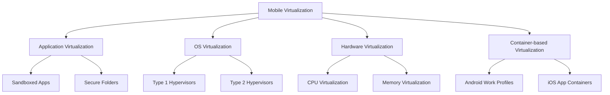
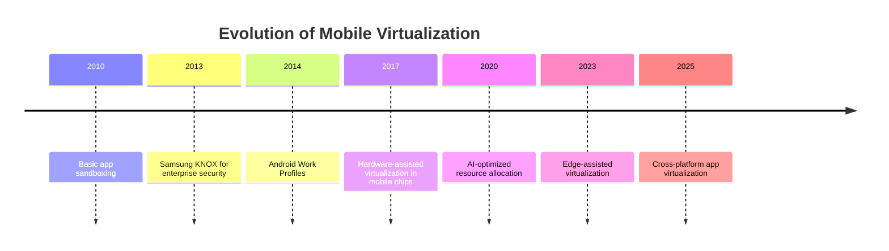

# Mobile Virtualization

## Introduction

Mobile virtualization refers to the technology that enables multiple operating systems or isolated environments to run simultaneously on a single mobile device. Just as desktop virtualization revolutionized server infrastructure, mobile virtualization is transforming how we use smartphones and tablets by creating secure, isolated spaces within our devices.

In this article, we'll explore how virtualization works on mobile platforms, its different implementations, and the benefits it provides for both personal and enterprise users. Whether you're looking to understand work profiles on Android, container technologies, or hypervisor-based solutions, this guide will cover the fundamentals in an accessible way.

## What is Mobile Virtualization?

At its core, virtualization is the process of creating a virtual (rather than actual) version of something, such as an operating system, a storage device, or a network resource. In the context of mobile devices, virtualization technologies allow a single physical device to run multiple isolated environments.

### Types of Mobile Virtualization

Mobile virtualization comes in several forms:

1. **Application Virtualization**: Isolates applications from the underlying OS
2. **OS Virtualization**: Allows multiple OS instances to run on a single device 
3. **Hardware Virtualization**: Abstracts hardware resources for use by virtual machines
4. **Container-based Virtualization**: Lightweight isolation of applications and their dependencies



## Mobile Virtualization Implementations

### Hypervisor-based Solutions

A hypervisor is software that creates and manages virtual machines. On mobile devices, hypervisors can be used to run multiple operating systems simultaneously.

#### Types of Hypervisors

- **Type 1 (Bare-metal)**: Runs directly on hardware
- **Type 2 (Hosted)**: Runs on top of an existing operating system

Here's a simplified implementation of how a basic hypervisor might be structured:

```java
public class MobileHypervisor {
    private List<VirtualMachine> virtualMachines;
    private ResourceManager resourceManager;
    
    public MobileHypervisor() {
        virtualMachines = new ArrayList<>();
        resourceManager = new ResourceManager();
    }
    
    public void createVM(OSType osType, int memoryMB, int cpuCores) {
        // Check if we have enough resources
        if (resourceManager.canAllocate(memoryMB, cpuCores)) {
            VirtualMachine vm = new VirtualMachine(osType, memoryMB, cpuCores);
            virtualMachines.add(vm);
            resourceManager.allocate(vm);
            System.out.println("Created new VM running " + osType);
        } else {
            System.out.println("Insufficient resources to create VM");
        }
    }
    
    public void startVM(int vmId) {
        if (vmId < virtualMachines.size()) {
            virtualMachines.get(vmId).start();
            System.out.println("VM " + vmId + " started");
        }
    }
    
    public void stopVM(int vmId) {
        if (vmId < virtualMachines.size()) {
            virtualMachines.get(vmId).stop();
            System.out.println("VM " + vmId + " stopped");
        }
    }
}
```

**Example Usage:**

```java
MobileHypervisor hypervisor = new MobileHypervisor();
hypervisor.createVM(OSType.ANDROID, 2048, 2);
hypervisor.createVM(OSType.CUSTOM_LINUX, 1024, 1);

// Start the VMs
hypervisor.startVM(0); // Start Android VM
hypervisor.startVM(1); // Start Linux VM
```

**Output:**
```
Created new VM running ANDROID
Created new VM running CUSTOM_LINUX
VM 0 started
VM 1 started
```

### Container-based Virtualization

Container-based virtualization is a lightweight alternative to full OS virtualization. Instead of virtualizing an entire OS, containers share the host OS kernel but run in isolated user spaces.

#### Android Work Profiles

One of the most common implementations of mobile virtualization is Android's Work Profile, which creates a separate container for work apps that is isolated from personal data.

```java
// Simplified example of how Android Work Profile might be implemented
public class WorkProfileManager {
    private Context context;
    private DevicePolicyManager dpm;
    
    public WorkProfileManager(Context context) {
        this.context = context;
        dpm = (DevicePolicyManager) context.getSystemService(Context.DEVICE_POLICY_SERVICE);
    }
    
    public void createWorkProfile() {
        // Create an intent to launch the work profile provisioning
        Intent provisionIntent = new Intent(DevicePolicyManager.ACTION_PROVISION_MANAGED_PROFILE);
        
        // Check if the device supports work profiles
        if (provisionIntent.resolveActivity(context.getPackageManager()) != null) {
            // Start the provisioning
            context.startActivity(provisionIntent);
            System.out.println("Work profile creation started");
        } else {
            System.out.println("This device doesn't support work profiles");
        }
    }
    
    public boolean isAppInWorkProfile(String packageName) {
        // Check if an app is installed in the work profile
        // Implementation details omitted for simplicity
        return false;
    }
    
    public void installAppInWorkProfile(String packageName) {
        // Install an app in the work profile
        // Implementation details omitted for simplicity
        System.out.println("Installing " + packageName + " in work profile");
    }
}
```

## Real-World Applications of Mobile Virtualization

### 1. Enterprise Mobility Management (EMM)

Organizations use mobile virtualization to create secure, managed environments for corporate data while allowing employees to use their personal devices (BYOD - Bring Your Own Device).

**Example Implementation:**

```kotlin
// Kotlin example of a simplified EMM client
class EnterpriseContainer(private val context: Context) {
    private val secureStorage = SecureStorage(context)
    private val networkManager = SecureNetworkManager()
    private val policyEnforcer = PolicyEnforcer()
    
    fun setupContainer(userCredentials: UserCredentials): Boolean {
        // Authenticate with enterprise server
        if (!networkManager.authenticate(userCredentials)) {
            return false
        }
        
        // Apply enterprise policies
        val policies = networkManager.downloadPolicies()
        policyEnforcer.applyPolicies(policies)
        
        // Setup secure storage for enterprise data
        secureStorage.initialize()
        
        println("Enterprise container setup complete")
        return true
    }
    
    fun launchApp(appId: String) {
        // Check if the app is allowed by policy
        if (policyEnforcer.isAppAllowed(appId)) {
            // Launch the app in the container
            val intent = context.packageManager.getLaunchIntentForPackage(appId)
            context.startActivity(intent)
            println("Launched $appId in enterprise container")
        } else {
            println("App $appId is not allowed by policy")
        }
    }
    
    fun wipeContainer() {
        // Wipe all enterprise data
        secureStorage.wipeAll()
        policyEnforcer.reset()
        println("Enterprise container wiped")
    }
}
```

**Example Usage:**
```kotlin
val container = EnterpriseContainer(context)
val credentials = UserCredentials("john.doe", "password123")
if (container.setupContainer(credentials)) {
    container.launchApp("com.company.email")
}
```

**Output:**
```
Enterprise container setup complete
Launched com.company.email in enterprise container
```

### 2. Secure Banking and Payment Apps

Mobile virtualization is used to create secure environments for financial applications, isolating sensitive operations from potentially malicious apps.

### 3. Multiple User Personas

Users can maintain separate environments for different aspects of their lives (personal, work, gaming) on a single device.

### 4. App Testing and Development

Developers can test applications across multiple OS versions and configurations without needing multiple physical devices.

## Benefits of Mobile Virtualization

1. **Enhanced Security**: Isolation prevents malware from accessing sensitive data
2. **Privacy Protection**: Keeps personal and work data separate
3. **Resource Efficiency**: Better utilization of device hardware
4. **Simplified Management**: Easier to deploy and manage enterprise applications
5. **Reduced Hardware Costs**: One device can serve multiple purposes

## Challenges in Mobile Virtualization

Despite its benefits, mobile virtualization faces several challenges:

1. **Performance Overhead**: Virtualization layers can consume additional resources
2. **Battery Life Impact**: Running multiple environments may drain battery faster
3. **User Experience**: Switching between environments can be cumbersome
4. **Hardware Limitations**: Mobile devices have limited resources compared to desktops

## Implementing a Simple Container in Android

Let's look at a simplified example of how you might implement a basic form of application isolation in Android:

```java
public class IsolatedAppContainer {
    private String containerId;
    private File containerDirectory;
    private ComponentName adminComponent;
    
    public IsolatedAppContainer(Context context, String id) {
        this.containerId = id;
        
        // Create isolated directory for container data
        containerDirectory = new File(context.getFilesDir(), "containers/" + id);
        if (!containerDirectory.exists()) {
            containerDirectory.mkdirs();
        }
        
        // Setup security policies
        setupSecurityPolicies(context);
    }
    
    private void setupSecurityPolicies(Context context) {
        // In a real implementation, this would use Android's security APIs
        // to isolate the container
        System.out.println("Setting up security policies for container " + containerId);
    }
    
    public void installApp(Context context, String packageName) {
        // This is a simplified version. Real implementation would
        // involve package installation APIs
        System.out.println("Installing " + packageName + " in container " + containerId);
        
        // In a real implementation:
        // 1. Download the APK
        // 2. Create a special user/profile for this container
        // 3. Install the app for that user/profile
    }
    
    public void launchApp(Context context, String packageName) {
        // This would launch the app within the container context
        Intent launchIntent = new Intent();
        launchIntent.setPackage(packageName);
        launchIntent.addFlags(Intent.FLAG_ACTIVITY_NEW_TASK);
        
        // In a real implementation, we would set up the correct user/profile context
        System.out.println("Launching " + packageName + " in container " + containerId);
        try {
            context.startActivity(launchIntent);
        } catch (ActivityNotFoundException e) {
            System.out.println("App not found in container");
        }
    }
    
    public void deleteContainer() {
        // Clean up container data
        if (containerDirectory.exists()) {
            // Delete all container files
            deleteRecursive(containerDirectory);
            System.out.println("Container " + containerId + " deleted");
        }
    }
    
    private void deleteRecursive(File fileOrDirectory) {
        if (fileOrDirectory.isDirectory()) {
            for (File child : fileOrDirectory.listFiles()) {
                deleteRecursive(child);
            }
        }
        fileOrDirectory.delete();
    }
}
```

**Example Usage:**
```java
Context context = getApplicationContext();
IsolatedAppContainer workContainer = new IsolatedAppContainer(context, "work");

// Install and launch an app in the work container
workContainer.installApp(context, "com.example.workmail");
workContainer.launchApp(context, "com.example.workmail");

// When no longer needed
workContainer.deleteContainer();
```

**Output:**
```
Setting up security policies for container work
Installing com.example.workmail in container work
Launching com.example.workmail in container work
Container work deleted
```

## The Future of Mobile Virtualization

Mobile virtualization continues to evolve with technologies like:

1. **Hardware-assisted virtualization**: Modern mobile processors include features specifically designed to support virtualization
2. **AI-driven resource allocation**: Machine learning to optimize resource allocation between virtual environments
3. **Cross-platform virtualization**: Run apps from one mobile platform on another (e.g., Android apps on iOS)
4. **Edge computing integration**: Offloading virtualization tasks to edge servers



## Summary

Mobile virtualization represents a significant advancement in how we use and secure mobile devices. By creating isolated environments within a single device, it enables a range of capabilities from enterprise security to multi-persona devices.

We've explored the different types of mobile virtualization technologies, their implementations, real-world applications, and even looked at simplified code examples of how these systems might work under the hood.

As mobile devices continue to become more powerful and central to our digital lives, virtualization technologies will play an increasingly important role in balancing security, privacy, and flexibility.

## Exercises

1. **Basic Implementation**: Create a simple app that demonstrates app isolation using Android's Work Profile API.
2. **Research Project**: Compare battery consumption between native apps and apps running in virtualized environments.
3. **Design Challenge**: Design a user interface for easily switching between personal and work environments on a mobile device.
4. **Advanced Implementation**: Implement a basic container system that isolates app data using Android's multi-user features.

## Additional Resources

- Android Enterprise documentation for Work Profiles
- Samsung KNOX technical documentation
- ARM TrustZone and virtualization extensions
- Mobile hypervisor research papers
- AOSP (Android Open Source Project) documentation on security and isolation