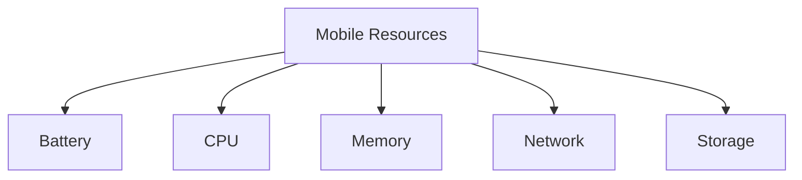
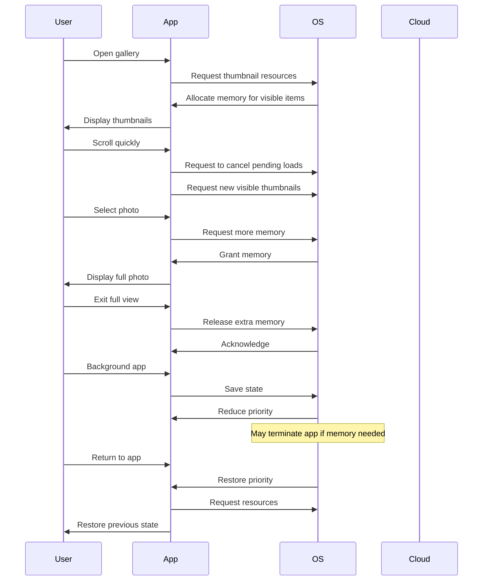

# Mobile Resource Management

## Introduction

Mobile devices operate under unique constraints compared to desktop computers - they have limited battery life, restricted processing power, and constrained memory. Mobile Resource Management (MRM) refers to how mobile operating systems efficiently allocate, monitor, and optimize these limited resources to provide the best possible user experience while maximizing device longevity.

In this guide, we'll explore the key aspects of resource management in mobile operating systems, examine the strategies employed by platforms like Android and iOS, and learn how developers can write resource-efficient applications.

## Core Mobile Resources

Mobile operating systems must carefully manage several critical resources:



Let's explore each of these resources and how they're managed.

## Memory Management

Mobile devices typically have less RAM than desktop computers, making efficient memory management crucial.

### How Mobile OS Manages Memory

Mobile operating systems use various techniques to optimize memory usage:

1. **Process Lifecycle Management**: Mobile OSes maintain strict control over application lifecycles
2. **Garbage Collection**: Automatic memory management to reclaim unused memory
3. **Memory Compression**: Compressing rarely-used memory pages instead of swapping to disk
4. **Low Memory Killer**: Terminating background processes when memory runs low

### Android Memory Management Example

Android uses the Activity lifecycle to manage application memory. When memory is low, Android might destroy activities that aren't currently visible to the user.

```java
@Override
protected void onPause() {
    super.onPause();
    // Release memory-intensive resources here
    largeImageView.setImageBitmap(null);
}

@Override
protected void onResume() {
    super.onResume();
    // Restore resources when activity becomes visible again
    loadImage();
}
```

### Memory Optimization Tips

- **Reuse objects** rather than creating new ones repeatedly
- **Check for memory leaks** using tools like Android Profiler or Xcode Instruments
- **Load resources at appropriate resolutions** instead of scaling down large images
- **Implement memory cache** with size limits for frequently accessed resources

## Battery Management

Battery life is perhaps the most critical resource on mobile devices. Mobile OSes use sophisticated strategies to extend battery life.

### Power Management Strategies

1. **Doze Mode**: Restricting background activities when the device is idle
2. **App Standby**: Limiting network and CPU access for infrequently used apps
3. **Background Execution Limits**: Restricting what apps can do in the background
4. **Job Schedulers**: Batching background tasks to optimize power usage

### Android Battery Optimization Code Example

```java
// Creating a task that respects battery optimization
JobScheduler jobScheduler = (JobScheduler) getSystemService(Context.JOB_SCHEDULER_SERVICE);

JobInfo jobInfo = new JobInfo.Builder(JOB_ID, new ComponentName(this, MyJobService.class))
    .setRequiresCharging(true)             // Run only when charging
    .setRequiredNetworkType(JobInfo.NETWORK_TYPE_UNMETERED)  // Run only on unmetered network
    .setPersisted(true)                    // Persist across reboots
    .setPeriodic(15 * 60 * 1000)           // Run every 15 minutes
    .build();

jobScheduler.schedule(jobInfo);
```

### iOS Battery Optimization Example

```swift
// Using BackgroundTasks framework in iOS 13+
let request = BGProcessingTaskRequest(identifier: "com.example.app.refresh")
request.requiresNetworkConnectivity = true
request.requiresExternalPower = false

do {
    try BGTaskScheduler.shared.submit(request)
} catch {
    print("Could not schedule app refresh: \(error)")
}
```

## CPU Management

Mobile CPUs are designed for efficiency rather than raw performance. Mobile operating systems must balance performance with power consumption.

### CPU Throttling and Scheduling

1. **Dynamic Frequency Scaling**: Adjusting CPU clock speed based on workload
2. **Big.LITTLE Architecture**: Using efficient cores for background tasks and powerful cores for intensive tasks
3. **QoS (Quality of Service)**: Prioritizing tasks based on importance and user interaction

### Example: Setting Thread Priority in Android

```java
// Setting a background thread to run at a lower priority
Thread backgroundThread = new Thread(new Runnable() {
    @Override
    public void run() {
        android.os.Process.setThreadPriority(android.os.Process.THREAD_PRIORITY_BACKGROUND);
        // Perform background work here
    }
});
backgroundThread.start();
```

### Example: QoS in iOS

```swift
// Performing background work with appropriate QoS
DispatchQueue.global(qos: .background).async {
    // Perform background work here
    
    DispatchQueue.main.async {
        // Update UI on the main thread
    }
}
```

## Network Management

Network operations consume battery and may incur data charges. Mobile OSes optimize network usage to minimize these costs.

### Network Optimization Strategies

1. **Batching and Prefetching**: Combining multiple network requests and prefetching content
2. **Adaptive Quality**: Adjusting content quality based on network conditions
3. **Background Transfer Services**: Optimizing transfers to occur during ideal conditions

### Android Network Management Example

```java
// Using WorkManager to schedule network operations
Constraints constraints = new Constraints.Builder()
    .setRequiredNetworkType(NetworkType.UNMETERED)  // Only on Wi-Fi
    .setRequiresCharging(true)                      // Only when charging
    .build();

OneTimeWorkRequest workRequest = new OneTimeWorkRequest.Builder(DataSyncWorker.class)
    .setConstraints(constraints)
    .build();

WorkManager.getInstance(context).enqueue(workRequest);
```

### iOS Background Transfer Example

```swift
// Using URLSession background transfer
let config = URLSessionConfiguration.background(withIdentifier: "com.example.app.backgroundtransfer")
config.isDiscretionary = true  // System decides best time to perform transfer
config.sessionSendsLaunchEvents = true
config.allowsCellularAccess = false  // Wi-Fi only

let session = URLSession(configuration: config, delegate: self, delegateQueue: nil)

let task = session.downloadTask(with: url)
task.earliestBeginDate = Date(timeIntervalSinceNow: 3600)  // Start in 1 hour at earliest
task.countOfBytesClientExpectsToSend = 200
task.countOfBytesClientExpectsToReceive = 500_000
task.resume()
```

## Storage Management

Mobile devices have limited storage space, requiring careful management of file storage and caching.

### Storage Optimization Techniques

1. **App Size Reduction**: Minimizing the size of application bundles
2. **Smart Caching**: Caching frequently accessed data while limiting cache size
3. **Data Compression**: Compressing stored data to save space
4. **Offloading to Cloud**: Moving infrequently accessed data to cloud storage

### Android Storage Management Example

```java
// Checking available storage before performing operation
File path = Environment.getExternalStoragePublicDirectory(Environment.DIRECTORY_PICTURES);
long freeSpace = path.getFreeSpace();

if (freeSpace < requiredSpace) {
    // Not enough space, handle appropriately
    showLowStorageWarning();
} else {
    // Proceed with storage operation
    saveHighResolutionImage();
}
```

### Using the Cache Directory for Temporary Files

```java
// Android example of using cache directory
File cacheFile = new File(context.getCacheDir(), "temp_image.jpg");

// When low on storage, clear the cache
public void clearCache() {
    File cacheDir = context.getCacheDir();
    if (cacheDir != null && cacheDir.isDirectory()) {
        deleteDir(cacheDir);
    }
}

private boolean deleteDir(File dir) {
    if (dir != null && dir.isDirectory()) {
        String[] children = dir.list();
        for (String child : children) {
            boolean success = deleteDir(new File(dir, child));
            if (!success) {
                return false;
            }
        }
        return dir.delete();
    } else if (dir != null && dir.isFile()) {
        return dir.delete();
    } else {
        return false;
    }
}
```

## Resource Monitoring and Profiling

To build efficient apps, developers need to monitor and profile resource usage.

### Android Resource Monitoring Tools

- **Android Profiler**: Monitors CPU, memory, network, and battery usage
- **systrace**: Records device activity for performance analysis
- **Battery Historian**: Visualizes battery usage data

### iOS Resource Monitoring Tools

- **Xcode Instruments**: Monitors CPU, memory, disk, and network usage
- **Energy Gauges**: Shows energy impact of the application
- **Memory Graph Debugger**: Identifies memory leaks and retention cycles

### Example: Reading Battery Status in Android

```java
// Register a BroadcastReceiver to monitor battery status
IntentFilter filter = new IntentFilter(Intent.ACTION_BATTERY_CHANGED);
Intent batteryStatus = context.registerReceiver(null, filter);

// Get battery percentage
int level = batteryStatus.getIntExtra(BatteryManager.EXTRA_LEVEL, -1);
int scale = batteryStatus.getIntExtra(BatteryManager.EXTRA_SCALE, -1);
float batteryPct = level * 100 / (float)scale;

// Check if device is charging
int status = batteryStatus.getIntExtra(BatteryManager.EXTRA_STATUS, -1);
boolean isCharging = status == BatteryManager.BATTERY_STATUS_CHARGING ||
                     status == BatteryManager.BATTERY_STATUS_FULL;
```

## Best Practices for Developers

To create resource-efficient mobile applications, follow these best practices:

1. **Lazy Loading**: Load resources only when needed
2. **Efficient Layouts**: Use ConstraintLayout (Android) or Auto Layout (iOS) to create efficient UI hierarchies
3. **Background Task Management**: Use appropriate APIs for background processing
4. **Resource Release**: Always release resources when they're no longer needed
5. **Responsive Design**: Adapt your app's behavior based on available resources
6. **Caching Strategy**: Implement smart caching with size limits
7. **Network Efficiency**: Batch network requests and compress data

## Real-World Application: A Resource-Efficient Photo Gallery App

Let's consider how we might design a photo gallery app with resource efficiency in mind:



### Key Resource-Efficient Features:

1. **Thumbnail Management**: Load only visible thumbnails, use appropriate resolution
2. **Memory Management**: Release full-resolution images when not visible
3. **Background Behavior**: Save state when backgrounded, restore efficiently when resumed
4. **Network Efficiency**: Download images at appropriate resolutions based on network type
5. **Storage Strategy**: Cache frequently accessed images, clear old cache entries automatically

## Summary

Mobile Resource Management is a critical aspect of mobile operating systems and application development. By understanding how mobile OSes manage memory, battery, CPU, network, and storage, developers can create applications that provide excellent user experiences while being respectful of device limitations.

The key principles of Mobile Resource Management include:

- Using resources only when needed
- Releasing resources promptly when finished
- Adapting behavior based on available resources
- Following platform-specific best practices
- Monitoring and profiling resource usage

## Exercises

1. Create a simple Android or iOS application that monitors and displays current battery, memory, and storage usage.
2. Modify an existing application to implement job scheduling for background tasks instead of continuous background processing.
3. Use a profiling tool to identify and fix a memory leak in a sample application.
4. Implement a caching system for network resources with appropriate size limits and expiration policies.
5. Experiment with different image loading libraries and compare their impact on memory usage and performance.

## Further Reading

- Android Developer Documentation on Performance
- iOS Developer Documentation on Energy Efficiency
- "High Performance Android Apps" by Doug Sillars
- "Advanced iOS App Architecture" by Rene Cacheaux and Josh Berlin
- "Android High Performance Programming" by G. Blake Meike and Doug Sillars