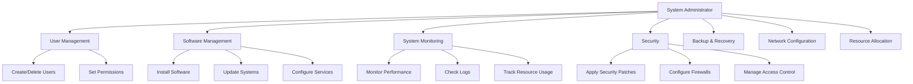

# System Administration Basics

## Introduction

System administration is the field responsible for maintaining, configuring, and ensuring reliable operation of computer systems and servers. As a beginner in programming and computing, understanding the basics of system administration will give you valuable skills to manage your development environment and troubleshoot common issues.

This guide introduces fundamental system administration concepts that apply across most operating systems, with specific examples for both Linux and Windows environments. By the end of this guide, you'll have a solid understanding of the core responsibilities and tasks performed by system administrators.

## What is System Administration?

System administration involves:

- **Managing user accounts and permissions**
- **Monitoring system performance**
- **Installing and configuring software**
- **Managing system resources**
- **Ensuring system security**
- **Performing backups and recovery**
- **Troubleshooting system issues**

Let's visualize the role of a system administrator:



## User Management

One of the primary responsibilities of a system administrator is managing users and their permissions.

### Adding and Removing Users

#### Linux

In Linux systems, you can add users with the `useradd` command:

```bash
# Add a new user
sudo useradd -m -s /bin/bash newuser

# Set password for the new user
sudo passwd newuser
```

To remove a user:

```bash
sudo userdel -r username
```

The `-r` flag removes the user's home directory and mail spool.

#### Windows

In Windows, you can manage users through the Command Prompt with administrator privileges:

```powershell
# Add a new user
net user username password /add

# Add user to administrators group
net localgroup administrators username /add

# Remove a user
net user username /delete
```

### Managing User Permissions

#### Linux

Linux uses a permissions system based on users, groups, and others:

```bash
# Change file ownership
sudo chown user:group filename

# Change file permissions
chmod 755 filename
```

Understanding permission numbers:
- 4: Read permission
- 2: Write permission
- 1: Execute permission

So 755 means:
- Owner: Read (4) + Write (2) + Execute (1) = 7
- Group: Read (4) + Execute (1) = 5
- Others: Read (4) + Execute (1) = 5

To check current permissions:

```bash
ls -l filename
```

Output example:
```
-rwxr-xr-x 1 user group 5432 Oct 15 14:30 filename
```

#### Windows

Windows uses Access Control Lists (ACLs) for permissions:

```powershell
# View permissions
icacls filename

# Grant full control to a user
icacls filename /grant username:F

# Remove a user's permissions
icacls filename /remove username
```

## Process Management

System administrators need to monitor and control running processes.

### Viewing Running Processes

#### Linux

Use `ps` to view processes:

```bash
# View all processes
ps aux

# View process tree
ps axjf
```

Example output:
```
USER       PID %CPU %MEM    VSZ   RSS TTY      STAT START   TIME COMMAND
root         1  0.0  0.3 169180  6872 ?        Ss   Oct15   0:09 /sbin/init
root       789  0.0  0.5 127224 10088 ?        Ss   Oct15   0:01 /usr/sbin/sshd
user      1234  0.2  1.0 157812 20416 pts/0    Ss   14:30   0:03 bash
```

#### Windows

Use Task Manager or the `tasklist` command:

```powershell
tasklist
```

Example output:
```
Image Name                   PID Session Name     Session#    Mem Usage
========================= ====== ================ ======== ============
System Idle Process            0 Services                0          8 K
System                         4 Services                0      5,192 K
Registry                      96 Services                0     45,748 K
```

### Managing Processes

#### Linux

```bash
# Kill a process
kill PID

# Force kill a process
kill -9 PID

# Find process by name
pgrep firefox

# Kill process by name
pkill firefox
```

#### Windows

```powershell
# End a task by PID
taskkill /PID 1234

# Force end a task
taskkill /F /PID 1234

# End a task by name
taskkill /IM program.exe
```

## Service Management

Services are programs that run in the background.

### Managing Services in Linux

Modern Linux distributions use systemd:

```bash
# Start a service
sudo systemctl start apache2

# Stop a service
sudo systemctl stop apache2

# Enable a service (starts on boot)
sudo systemctl enable apache2

# Disable a service
sudo systemctl disable apache2

# Check service status
sudo systemctl status apache2
```

Example status output:
```
● apache2.service - The Apache HTTP Server
     Loaded: loaded (/lib/systemd/system/apache2.service; enabled; vendor preset: enabled)
     Active: active (running) since Fri 2023-10-15 14:50:22 UTC; 2h 5min ago
   Main PID: 1234 (apache2)
      Tasks: 6 (limit: 4915)
     Memory: 22.0M
        CPU: 456ms
     CGroup: /system.slice/apache2.service
             ├─1234 /usr/sbin/apache2 -k start
             ├─1235 /usr/sbin/apache2 -k start
             └─1236 /usr/sbin/apache2 -k start
```

### Managing Services in Windows

Windows uses the Service Control Manager:

```powershell
# Start a service
net start service_name

# Stop a service
net stop service_name

# More detailed service management
sc query service_name
sc config service_name start= auto
sc config service_name start= disabled
```

## File System Management

### Disk Usage

#### Linux

```bash
# Check disk space
df -h

# Check directory size
du -sh /path/to/directory
```

Example output for `df -h`:
```
Filesystem      Size  Used Avail Use% Mounted on
/dev/sda1        20G   12G  7.0G  63% /
/dev/sda2       100G   23G   77G  24% /home
```

#### Windows

```powershell
# Check disk space
wmic logicaldisk get deviceid, size, freespace

# Alternative using PowerShell
Get-PSDrive -PSProvider FileSystem
```

### File Search and Management

#### Linux

```bash
# Find files by name
find /path -name "filename"

# Find files by content
grep -r "search text" /path

# Find large files
find /path -type f -size +100M
```

#### Windows

```powershell
# Find files by name
dir /s C:\path\filename*

# Find files by content
findstr /s /i "search text" C:\path\*.*

# PowerShell alternatives
Get-ChildItem -Path C:\ -Recurse -Filter "filename*"
Get-ChildItem -Path C:\ -Recurse | Select-String "search text"
```

## System Monitoring

### Checking System Resources

#### Linux

```bash
# Monitor system in real-time
top

# Memory information
free -h

# CPU information
lscpu

# Combined system stats
htop  # may need installation
```

Example `free -h` output:
```
              total        used        free      shared  buff/cache   available
Mem:           15Gi       5.2Gi       2.8Gi       288Mi       7.5Gi       9.3Gi
Swap:         8.0Gi          0B       8.0Gi
```

#### Windows

```powershell
# System information
systeminfo

# CPU utilization (PowerShell)
Get-Counter '\Processor(_Total)\% Processor Time'

# Memory usage (PowerShell)
Get-Counter '\Memory\Available MBytes'
```

### Checking Logs

#### Linux

Most system logs are in `/var/log`:

```bash
# View system logs
less /var/log/syslog

# View authentication logs
less /var/log/auth.log

# Follow logs in real-time
tail -f /var/log/syslog
```

#### Windows

Windows stores logs in the Event Viewer:

```powershell
# Open Event Viewer from command line
eventvwr

# View system logs with PowerShell
Get-EventLog -LogName System -Newest 10

# View application logs
Get-EventLog -LogName Application -Newest 10
```

## Backup and Recovery

### Creating Backups

#### Linux

```bash
# Backup a directory using tar
tar -czvf backup.tar.gz /path/to/directory

# Backup using rsync
rsync -av --delete /source/directory/ /backup/directory/
```

#### Windows

```powershell
# Create a backup using robocopy
robocopy C:\source D:\backup /MIR

# PowerShell backup of a folder
Copy-Item -Path C:\source -Destination D:\backup -Recurse -Force
```

### Scheduling Backups

#### Linux

Use crontab to schedule regular backups:

```bash
# Edit crontab
crontab -e

# Add a line to run a backup script daily at 2 AM
0 2 * * * /path/to/backup/script.sh
```

#### Windows

Use Task Scheduler or create a scheduled task from the command line:

```powershell
schtasks /create /tn "Daily Backup" /tr "C:\scripts\backup.bat" /sc daily /st 02:00
```

## Network Configuration

### Checking Network Status

#### Linux

```bash
# Check IP configuration
ip addr show

# Test connectivity
ping -c 4 google.com

# Check open ports
ss -tuln
```

Example `ip addr show` output:
```
1: lo: <LOOPBACK,UP,LOWER_UP> mtu 65536 qdisc noqueue state UNKNOWN group default qlen 1000
    link/loopback 00:00:00:00:00:00 brd 00:00:00:00:00:00
    inet 127.0.0.1/8 scope host lo
       valid_lft forever preferred_lft forever
2: eth0: <BROADCAST,MULTICAST,UP,LOWER_UP> mtu 1500 qdisc pfifo_fast state UP group default qlen 1000
    link/ether 00:15:5d:01:ca:05 brd ff:ff:ff:ff:ff:ff
    inet 192.168.1.100/24 brd 192.168.1.255 scope global dynamic eth0
       valid_lft 86390sec preferred_lft 86390sec
```

#### Windows

```powershell
# Check IP configuration
ipconfig /all

# Test connectivity
ping google.com

# Check open ports
netstat -an | findstr LISTENING
```

### Configuring Network Interfaces

#### Linux

Edit the network configuration files or use the `ip` command:

```bash
# Set IP address temporarily
sudo ip addr add 192.168.1.100/24 dev eth0

# Set default gateway
sudo ip route add default via 192.168.1.1
```

For permanent changes, edit the appropriate configuration files based on your distribution.

#### Windows

```powershell
# Set IP address
netsh interface ip set address "Ethernet" static 192.168.1.100 255.255.255.0 192.168.1.1

# Set DNS servers
netsh interface ip set dns "Ethernet" static 8.8.8.8
```

## Basic Security Measures

### Firewall Configuration

#### Linux (using ufw)

```bash
# Enable firewall
sudo ufw enable

# Allow SSH connections
sudo ufw allow ssh

# Allow web server
sudo ufw allow 80/tcp

# Check status
sudo ufw status
```

Example status output:
```
Status: active

To                         Action      From
--                         ------      ----
22/tcp                     ALLOW       Anywhere
80/tcp                     ALLOW       Anywhere
22/tcp (v6)                ALLOW       Anywhere (v6)
80/tcp (v6)                ALLOW       Anywhere (v6)
```

#### Windows Firewall

```powershell
# Enable firewall
netsh advfirewall set allprofiles state on

# Allow an application
netsh advfirewall firewall add rule name="My Application" dir=in action=allow program="C:\path\to\app.exe"

# Allow a port
netsh advfirewall firewall add rule name="Allow Port 80" dir=in action=allow protocol=TCP localport=80
```

### Checking for Security Updates

#### Linux

```bash
# Ubuntu/Debian
sudo apt update
sudo apt list --upgradable
sudo apt upgrade

# CentOS/RHEL
sudo yum check-update
sudo yum update
```

#### Windows

```powershell
# Check for updates
wuauclt /detectnow

# Install updates (Windows 10/11)
Install-WindowsUpdate -AcceptAll
```

## Automation with Scripts

System administrators often automate routine tasks using scripts.

### Bash Script Example (Linux)

Here's a simple backup script:

```bash
#!/bin/bash
# Simple backup script

# Variables
SOURCE_DIR="/home/user/documents"
BACKUP_DIR="/mnt/backup"
DATE=$(date +%Y-%m-%d)
BACKUP_FILE="backup-$DATE.tar.gz"

# Create backup
echo "Starting backup of $SOURCE_DIR"
tar -czvf "$BACKUP_DIR/$BACKUP_FILE" "$SOURCE_DIR"

# Check if successful
if [ $? -eq 0 ]; then
    echo "Backup completed successfully: $BACKUP_DIR/$BACKUP_FILE"
else
    echo "Backup failed!"
fi
```

### PowerShell Script Example (Windows)

```powershell
# Simple backup script for Windows
$sourceDir = "C:\Users\user\Documents"
$backupDir = "D:\Backups"
$date = Get-Date -Format "yyyy-MM-dd"
$backupFile = "backup-$date.zip"

# Create backup directory if it doesn't exist
if (-not (Test-Path $backupDir)) {
    New-Item -ItemType Directory -Path $backupDir
}

# Create backup
Write-Host "Starting backup of $sourceDir"
Compress-Archive -Path $sourceDir -DestinationPath "$backupDir\$backupFile" -Force

# Check if successful
if ($?) {
    Write-Host "Backup completed successfully: $backupDir\$backupFile"
} else {
    Write-Host "Backup failed!" -ForegroundColor Red
}
```

## Summary

System administration is a broad field that encompasses many aspects of managing computer systems. In this guide, we covered the basics:

- User and permission management
- Process monitoring and control
- Service management
- File system operations
- System monitoring
- Backup and recovery
- Network configuration
- Basic security measures
- Automation with scripts

These skills form the foundation of system administration and will help you maintain your own systems, whether for personal use or in a professional environment.

## Additional Resources

To further develop your system administration skills:

1. **Practice**: Set up a virtual machine to practice these commands without affecting your main system.
2. **Documentation**: Refer to official documentation for your operating system.
3. **Learn Shell Scripting**: For Linux, learn more about Bash scripting; for Windows, learn PowerShell.
4. **Monitoring Tools**: Explore more advanced tools like Nagios, Prometheus, or Grafana.

## Exercises

1. Create a new user on your system and assign them to a specific group.
2. Write a script that checks system disk usage and sends an alert if it exceeds 80%.
3. Set up a firewall rule to allow a specific application to access the network.
4. Configure automatic backups of your important documents.
5. Monitor your system's performance during high usage and identify potential bottlenecks.