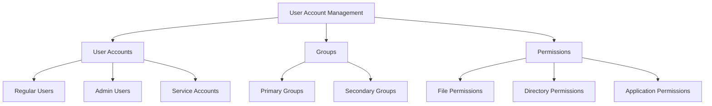

# User Account Management

## Introduction

User Account Management is a fundamental aspect of operating system administration that involves creating, modifying, and maintaining user accounts on a computer system. Proper user account management ensures that each user has appropriate access to system resources while maintaining security and compliance with organizational policies.

In multi-user operating systems like Linux, Unix, Windows Server, and macOS, user account management is essential for:

- Controlling access to system resources
- Maintaining security through the principle of least privilege
- Tracking user activities for auditing purposes
- Facilitating resource sharing among multiple users
- Ensuring accountability for actions performed on the system

In this guide, we'll explore the core concepts of user account management and provide practical examples using common operating systems.

## Core Concepts

### Types of User Accounts

Most operating systems distinguish between at least two types of accounts:

1. **Regular User Accounts**: Accounts for standard users with limited privileges
2. **Administrative Accounts**: Accounts with elevated privileges (like root in Linux/Unix or Administrator in Windows)

Some systems also have:

- **Service Accounts**: Special accounts used by services and applications
- **Guest Accounts**: Temporary accounts with very limited access

### User Identity Components

A user account typically consists of:

- **Username**: A unique identifier for the user
- **User ID (UID)**: A numerical identifier assigned to each user
- **Password**: Authentication credential
- **Home Directory**: A dedicated directory for the user's files
- **Default Shell/Environment**: The interface provided when the user logs in

### Groups

Groups are collections of users that share common access permissions. They simplify permission management by allowing administrators to assign permissions to multiple users at once.



## User Management in Linux/Unix

Linux and Unix-like systems provide powerful command-line tools for managing user accounts.

### Creating a New User

To create a new user account in Linux:

```bash
sudo useradd -m -s /bin/bash newuser
sudo passwd newuser
```

The `-m` flag creates a home directory, and `-s /bin/bash` sets the default shell to bash.

Sample output:
```
New password: 
Retype new password: 
passwd: password updated successfully
```

### Viewing User Information

To view information about a user:

```bash
id username
```

Example output:
```
uid=1001(john) gid=1001(john) groups=1001(john),4(adm),27(sudo)
```

To list all users on the system:

```bash
cat /etc/passwd
```

### Modifying User Accounts

To modify a user's properties:

```bash
# Change a user's shell
sudo usermod -s /bin/zsh username

# Add a user to a group
sudo usermod -aG groupname username

# Change username
sudo usermod -l newname oldname
```

### Deleting Users

To delete a user account:

```bash
# Delete user only
sudo userdel username

# Delete user and home directory
sudo userdel -r username
```

## Group Management in Linux/Unix

### Creating a New Group

```bash
sudo groupadd developers
```

### Adding Users to a Group

```bash
sudo usermod -aG developers username
```

### Listing Groups

To list all groups:

```bash
cat /etc/group
```

To see which groups a user belongs to:

```bash
groups username
```

Example output:
```
username : username sudo developers docker
```

## User Management in Windows

Windows provides both GUI and command-line tools for user management.

### Using Computer Management

1. Open "Computer Management" by right-clicking on "This PC" and selecting "Manage"
2. Navigate to "Local Users and Groups" > "Users"
3. Right-click in the right pane and select "New User"

### Using PowerShell

To create a new local user:

```powershell
New-LocalUser -Name "JaneDoe" -Description "Regular user account" -NoPassword
```

To add a user to a group:

```powershell
Add-LocalGroupMember -Group "Administrators" -Member "JaneDoe"
```

To list all local users:

```powershell
Get-LocalUser
```

Example output:
```
Name             Enabled Description
----             ------- -----------
Administrator    False   Built-in account for administering the computer
Guest            False   Built-in account for guest access to the computer
JaneDoe          True    Regular user account
```

## File and Directory Permissions

User management is closely tied to file and directory permissions.

### Linux/Unix Permissions

In Linux/Unix, permissions are set using the `chmod` command and are represented by read (r), write (w), and execute (x) permissions for the owner, group, and others.

```bash
# Give read, write, execute permission to owner only
chmod 700 filename

# Give read, write to owner, read to group and others
chmod 644 filename

# Change file owner
chown username:groupname filename
```

### Windows Permissions

Windows uses Access Control Lists (ACLs) to manage file and directory permissions. These can be set through File Explorer's properties dialog or using PowerShell:

```powershell
# Grant full control to a user
$acl = Get-Acl "C:\path\to\file"
$permission = "Domain\Username", "FullControl", "Allow"
$accessRule = New-Object System.Security.AccessControl.FileSystemAccessRule $permission
$acl.SetAccessRule($accessRule)
$acl | Set-Acl "C:\path\to\file"
```

## Password Management and Policies

### Setting Password Policies in Linux

In Linux, password policies can be configured through PAM (Pluggable Authentication Modules):

```bash
sudo nano /etc/pam.d/common-password
```

Add or modify rules like:
```
password requisite pam_pwquality.so retry=3 minlen=12 difok=3 ucredit=-1 lcredit=-1 dcredit=-1 ocredit=-1
```

### Setting Password Policies in Windows

In Windows, password policies are typically set through Group Policy:

1. Run `gpedit.msc`
2. Navigate to Computer Configuration > Windows Settings > Security Settings > Account Policies > Password Policy

You can also use PowerShell:

```powershell
# Set minimum password length
net accounts /minpwlen:12

# Set maximum password age (days)
net accounts /maxpwage:90
```

## Best Practices for User Account Management

1. **Principle of Least Privilege**: Grant users only the permissions they need to perform their jobs.

2. **Regular Audits**: Periodically review user accounts and permissions to ensure they remain appropriate.

3. **Strong Password Policies**: Enforce strong passwords and regular password changes.

4. **Account Lifecycle Management**: Implement processes for onboarding new users and deactivating accounts when employees leave.

5. **Use Groups**: Organize users into logical groups to simplify permission management.

6. **Separation of Admin Accounts**: Use separate accounts for administrative tasks rather than conducting daily work with elevated privileges.

7. **Monitor Failed Login Attempts**: Set up alerts for multiple failed login attempts to detect potential breaches.

8. **Mandatory Access Control**: Consider implementing MAC systems like SELinux or AppArmor for high-security environments.

## Practical Example: Setting Up a Development Team

Let's walk through setting up accounts for a small development team on a Linux server.

1. Create a group for developers:
   ```bash
   sudo groupadd developers
   ```

2. Create user accounts for each team member:
   ```bash
   sudo useradd -m -s /bin/bash -G developers alice
   sudo useradd -m -s /bin/bash -G developers bob
   sudo useradd -m -s /bin/bash -G developers charlie
   
   # Set passwords
   sudo passwd alice
   sudo passwd bob
   sudo passwd charlie
   ```

3. Create a shared project directory:
   ```bash
   sudo mkdir -p /projects/webapp
   sudo chown root:developers /projects/webapp
   sudo chmod 2775 /projects/webapp
   ```
   The `2` in `2775` sets the SGID bit, ensuring new files in this directory inherit the group ownership.

4. Create a backup user with limited access:
   ```bash
   sudo useradd -m -s /bin/bash backup
   sudo mkdir -p /backup
   sudo chown backup:backup /backup
   sudo chmod 700 /backup
   ```

5. Set up a periodic backup job that runs as the backup user:
   ```bash
   sudo crontab -u backup -e
   ```
   Add:
   ```
   0 2 * * * rsync -av --delete /projects/webapp/ /backup/webapp/
   ```

This example demonstrates:
- Creating users and assigning them to groups
- Setting up shared directories with appropriate permissions
- Creating service accounts with specific purposes
- Implementing the principle of least privilege

## Summary

User account management is a crucial aspect of operating system administration. Effective user management ensures:

- System security through proper authentication and authorization
- Efficient resource allocation and sharing
- Accountability through user activity tracking
- Simplified system maintenance

The commands and techniques covered in this guide provide a foundation for implementing robust user account management practices in various operating systems.

## Exercises

1. Create a new user account on your system and assign it to a custom group.
2. Set up a shared directory that can be accessed by multiple users with different permission levels.
3. Implement a password policy that requires minimum complexity standards.
4. Create a script that audits user accounts for those that haven't logged in within the past 90 days.
5. Design a user onboarding process for a hypothetical organization with different departments requiring different access levels.

## Additional Resources

- [Linux User Administration (The Linux Documentation Project)](https://tldp.org/LDP/sag/html/managing-users.html)
- [Microsoft Documentation on User Account Management](https://docs.microsoft.com/en-us/windows/security/identity-protection/access-control/managing-user-accounts)
- [PAM Configuration in Linux](https://www.linux.com/topic/security/linux-security-pam/)
- Book: "UNIX and Linux System Administration Handbook" by Evi Nemeth et al.
- Book: "Windows Server Administration Fundamentals" by Microsoft Official Academic Course