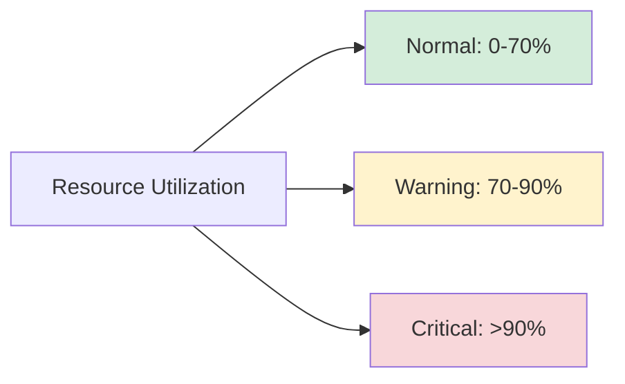

# Resource Monitoring

## Introduction

Resource monitoring is a critical aspect of operating system management that involves tracking, analyzing, and managing system resources to ensure optimal performance. As a beginner in programming and system administration, understanding how to monitor resources will help you identify bottlenecks, troubleshoot performance issues, and optimize your applications.

This guide will walk you through the fundamentals of resource monitoring, common tools, and practical techniques to keep your systems running smoothly.

## Why Resource Monitoring Matters

Operating systems manage four primary resources:

1. **CPU (Central Processing Unit)** - Processes instructions
2. **Memory (RAM)** - Stores temporary data for quick access
3. **Disk/Storage** - Persists data long-term
4. **Network** - Facilitates data transfer between systems

Without proper monitoring, your system might experience:

- Sluggish performance
- Application crashes
- Unresponsive services
- Potential data loss
- Security vulnerabilities

## Basic Resource Monitoring Concepts

### Resource Utilization

Resource utilization refers to the percentage of a resource currently in use. High utilization often indicates a potential bottleneck.



### Performance Metrics

Key metrics to monitor include:

- **CPU**: Load average, user time, system time, idle time
- **Memory**: Used/free RAM, swap usage, buffer/cache allocation
- **Disk**: I/O operations, read/write speeds, free space
- **Network**: Bandwidth usage, packets sent/received, latency

### Thresholds and Alerts

Establishing baseline thresholds helps identify abnormal behavior:

- **Baselines**: Normal operating ranges for your system
- **Thresholds**: Trigger points for warnings or alerts
- **Alerts**: Notifications when thresholds are crossed

## Resource Monitoring Tools

### Command-line Tools

#### Linux/Unix Tools

**1. top/htop**

The `top` command provides a dynamic real-time view of running processes:

```bash
$ top
```

Example output:
```
top - 14:23:36 up 7 days,  4:53,  1 user,  load average: 0.84, 0.96, 0.91
Tasks: 267 total,   1 running, 266 sleeping,   0 stopped,   0 zombie
%Cpu(s):  5.9 us,  2.0 sy,  0.0 ni, 91.7 id,  0.3 wa,  0.0 hi,  0.1 si,  0.0 st
MiB Mem :  16384.0 total,   5824.1 free,   6240.3 used,   4319.6 buff/cache
MiB Swap:   8192.0 total,   8192.0 free,      0.0 used.   9125.3 avail Mem 

  PID USER      PR  NI    VIRT    RES    SHR S  %CPU  %MEM     TIME+ COMMAND
 3423 user1     20   0 4196868 354056 112956 S  12.6   2.1   6:29.83 firefox
 2137 user1     20   0  859492 195416  89560 S   6.0   1.2  18:36.35 gnome-shell
  954 root      20   0  792960  90416  60448 S   2.3   0.5   7:53.21 Xorg
```

**2. vmstat**

The `vmstat` command reports virtual memory statistics:

```bash
$ vmstat 5 3  # Reports every 5 seconds, 3 times
```

Example output:
```
procs -----------memory---------- ---swap-- -----io---- -system-- ------cpu-----
 r  b   swpd   free   buff  cache   si   so    bi    bo   in   cs us sy id wa st
 2  0      0 5896916 348272 3925728    0    0    67    38  130  282  6  2 92  0  0
 0  0      0 5896660 348272 3925728    0    0     0     0  126  264  1  1 99  0  0
 0  0      0 5896660 348272 3925728    0    0     0     0  125  260  0  1 99  0  0
```

**3. iostat**

The `iostat` command monitors CPU and disk I/O:

```bash
$ iostat -x 2
```

Example output:
```
Linux 5.15.0-58-generic (hostname)   03/18/2025      _x86_64_        (8 CPU)

avg-cpu:  %user   %nice %system %iowait  %steal   %idle
           5.90    0.00    2.01    0.30    0.00   91.79

Device            r/s     w/s     rkB/s     wkB/s   rrqm/s   wrqm/s  %rrqm  %wrqm r_await w_await aqu-sz rareq-sz wareq-sz  svctm  %util
sda              8.32    2.84    259.21    116.01     0.03     1.34   0.36  32.04    0.57    2.23   0.01    31.16    40.85   0.13   0.15
```

**4. free**

The `free` command displays memory usage:

```bash
$ free -h
```

Example output:
```
              total        used        free      shared  buff/cache   available
Mem:            16G        6.1G        5.7G        294M        4.2G        8.9G
Swap:           8G          0B        8.0G
```

**5. netstat/ss**

The `netstat` command shows network connections:

```bash
$ netstat -tuln
```

Example output:
```
Active Internet connections (only servers)
Proto Recv-Q Send-Q Local Address           Foreign Address         State      
tcp        0      0 0.0.0.0:22              0.0.0.0:*               LISTEN     
tcp        0      0 127.0.0.1:631           0.0.0.0:*               LISTEN     
tcp6       0      0 :::22                   :::*                    LISTEN     
tcp6       0      0 ::1:631                 :::*                    LISTEN     
udp        0      0 0.0.0.0:68              0.0.0.0:*                          
udp        0      0 0.0.0.0:631             0.0.0.0:*                          
```

#### Windows Tools

**1. Task Manager**

Windows Task Manager provides a GUI for monitoring resources.

Access it by:
- Pressing `Ctrl+Shift+Esc`
- Right-clicking the taskbar and selecting "Task Manager"

**2. Performance Monitor (perfmon)**

```
> perfmon
```

**3. Resource Monitor**

```
> resmon
```

**4. Windows PowerShell Commands**

Get CPU information:
```powershell
Get-WmiObject Win32_Processor | Select-Object LoadPercentage
```

Example output:
```
LoadPercentage
--------------
            12
```

Get memory information:
```powershell
Get-WmiObject Win32_OperatingSystem | Select-Object FreePhysicalMemory, TotalVisibleMemorySize
```

Example output:
```
FreePhysicalMemory TotalVisibleMemorySize
------------------ ----------------------
          10485760               16777216
```

### Monitoring Systems and Applications

#### Simple Monitoring Scripts

Here's a basic bash script to monitor system resources:

```bash
#!/bin/bash

echo "===== System Resource Monitor ====="
echo "Date: $(date)"
echo ""

echo "CPU Usage:"
top -bn1 | grep "Cpu(s)" | awk '{print $2 + $4 "%"}'

echo "Memory Usage:"
free -m | awk 'NR==2{printf "Used: %s MB (%.2f%%)
", $3, $3*100/$2}'

echo "Disk Usage:"
df -h | awk '$NF=="/"{printf "Used: %s (%.2f%%)
", $3, $5}'

echo "Network Stats:"
netstat -i | awk 'NR>2{print $1, $4, $8}'
```

#### Python Monitoring Script

A more advanced Python script for monitoring and logging resources:

```python
import psutil
import time
import datetime

def monitor_resources(interval=5, duration=60):
    """
    Monitor system resources for a specified duration.
    
    Args:
        interval: Time between measurements in seconds
        duration: Total monitoring time in seconds
    """
    measurements = []
    intervals = int(duration / interval)
    
    print(f"Monitoring system resources every {interval} seconds for {duration} seconds...")
    
    for i in range(intervals):
        timestamp = datetime.datetime.now().strftime("%Y-%m-%d %H:%M:%S")
        cpu_percent = psutil.cpu_percent(interval=1)
        memory = psutil.virtual_memory()
        disk = psutil.disk_usage('/')
        network = psutil.net_io_counters()
        
        print(f"
--- Measurement {i+1}/{intervals} at {timestamp} ---")
        print(f"CPU Usage: {cpu_percent}%")
        print(f"Memory: {memory.used/1024/1024:.2f} MB / {memory.total/1024/1024:.2f} MB ({memory.percent}%)")
        print(f"Disk: {disk.used/1024/1024/1024:.2f} GB / {disk.total/1024/1024/1024:.2f} GB ({disk.percent}%)")
        print(f"Network: Sent {network.bytes_sent/1024/1024:.2f} MB, Received {network.bytes_recv/1024/1024:.2f} MB")
        
        measurements.append({
            'timestamp': timestamp,
            'cpu_percent': cpu_percent,
            'memory_percent': memory.percent,
            'disk_percent': disk.percent,
            'network_sent': network.bytes_sent,
            'network_recv': network.bytes_recv
        })
        
        if i < intervals - 1:
            time.sleep(interval)
    
    return measurements

if __name__ == "__main__":
    # Monitor every 5 seconds for 1 minute
    data = monitor_resources(interval=5, duration=60)
    
    # You could save this data to a file or database for further analysis
    print("
Monitoring complete. Summary of measurements:")
    for m in data:
        print(f"{m['timestamp']}: CPU {m['cpu_percent']}%, Mem {m['memory_percent']}%, Disk {m['disk_percent']}%")
```

To run this script, you'll need to install the `psutil` library:

```bash
pip install psutil
```

## Advanced Monitoring Techniques

### Process Monitoring

Focusing on specific processes can help identify problematic applications:

```bash
# Monitor a specific process by name
$ ps aux | grep nginx

# Monitor a specific process by PID
$ top -p 1234
```

### Log Analysis

System and application logs provide valuable insights:

```bash
# View system logs
$ journalctl -f

# View application logs (example: Apache)
$ tail -f /var/log/apache2/error.log
```

### Load Testing

Simulate high load to identify system limitations:

```bash
# Install stress-ng tool
$ sudo apt install stress-ng

# Test CPU with 4 workers for 60 seconds
$ stress-ng --cpu 4 --timeout 60s

# Test memory with 2 workers using 1GB each
$ stress-ng --vm 2 --vm-bytes 1G --timeout 30s
```

## Implementing Monitoring in Real-World Scenarios

### Case Study: Web Server Monitoring

Let's say you're managing a web server running a popular website. Here's how to approach monitoring:

1. **Set up baseline monitoring**:
   - CPU, memory, disk, and network usage
   - Web server-specific metrics (requests/sec, response time)

2. **Configure alerts**:
   - CPU usage > 80% for more than 5 minutes
   - Less than 20% free memory
   - Disk usage > 90%
   - Response time > 500ms

3. **Regular performance reviews**:
   - Weekly reports on resource usage trends
   - Monthly capacity planning sessions

### Practical Example: Database Server Optimization

Identifying a performance issue on a database server:

```bash
# Monitor overall system
$ top

# Notice high CPU usage by MySQL
$ ps aux | grep mysql

# Check MySQL performance
$ mysqladmin extended-status

# Identify slow queries
$ tail -f /var/log/mysql/slow-query.log

# Optimize the database
$ mysqltuner
```

## Best Practices for Resource Monitoring

1. **Establish baselines** - Know what "normal" looks like for your system
2. **Monitor proactively** - Don't wait for problems to occur
3. **Use multiple tools** - Different tools provide different insights
4. **Automate where possible** - Set up scheduled checks and reports
5. **Document everything** - Keep records of changes and performance metrics
6. **Plan for scaling** - Use monitoring data to predict future resource needs
7. **Test monitoring systems** - Ensure your monitoring tools themselves are reliable

## Troubleshooting Common Resource Issues

### High CPU Usage

Potential causes and solutions:

- **Runaway processes** - Identify with `top` and terminate if necessary
- **Too many processes** - Review system load and consolidate services
- **Inefficient code** - Profile applications and optimize
- **Malware/cryptominers** - Scan system for unauthorized software

### Memory Leaks

Detecting and addressing memory issues:

- **Monitor process memory growth** - Use `top` or `ps` with `watch`
- **Check for swap usage** - High swap might indicate memory pressure
- **Use specialized tools** - `valgrind` for application memory debugging
- **Restart services** - Sometimes necessary for services with known memory leaks

### Disk I/O Bottlenecks

Improving disk performance:

- **Identify high I/O processes** - Use `iotop` or `iostat`
- **Check disk health** - Use SMART monitoring tools
- **Consider SSD upgrade** - For frequently accessed data
- **Optimize database queries** - Reduce unnecessary disk operations

## Summary

Resource monitoring is an essential skill for anyone managing systems or developing applications. By understanding the tools and techniques covered in this guide, you'll be able to:

- Identify performance bottlenecks
- Troubleshoot resource-related issues
- Optimize system performance
- Plan for future resource needs
- Prevent outages and service disruptions

Remember that effective monitoring is an ongoing process, not a one-time task. Regular review of your monitoring data will help you maintain optimal system performance over time.

## Exercises

1. Install and explore basic monitoring tools (`top`, `htop`, `vmstat`) on your system. Compare their outputs and features.

2. Write a simple bash or Python script that reports CPU, memory, and disk usage every minute.

3. Set up a simulated high-load scenario using `stress-ng` and observe how your system responds.

4. Create a monitoring dashboard using a tool like Grafana or Prometheus (for advanced users).

5. Practice analyzing system logs to identify performance issues.

## Additional Resources

Here are some resources to further your knowledge:

- Linux System Administration documentation
- The `man` pages for the tools mentioned in this guide
- Online tutorials on performance optimization
- Books on system administration and performance tuning

Remember, effective resource monitoring is both a science and an art. As you gain experience, you'll develop intuition for identifying and resolving performance issues efficiently.