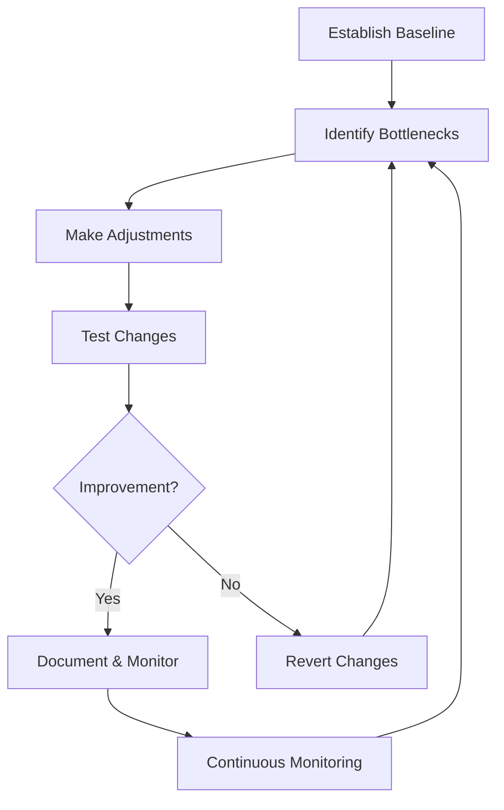

# Performance Tuning

## Introduction

Performance tuning is the systematic process of adjusting and optimizing an operating system to enhance its speed, efficiency, and resource utilization. Whether you're managing a personal computer, a web server, or an enterprise-grade system, proper performance tuning can significantly improve user experience, increase productivity, and extend hardware lifespan.

In this guide, we'll explore the fundamental concepts, tools, and techniques used in OS performance tuning. You'll learn how to identify bottlenecks, monitor system resources, and implement optimizations to ensure your system runs at its peak potential.

## Why Performance Tuning Matters

Even with powerful hardware, an improperly configured operating system can perform poorly. Some key benefits of performance tuning include:

- **Faster application response times**: Users experience less lag and waiting
- **Higher throughput**: Systems can handle more requests or operations
- **Better resource utilization**: CPU, memory, disk, and network resources are used efficiently
- **Reduced energy consumption**: Optimized systems often require less power
- **Extended hardware lifespan**: Less strain on components can increase longevity

## The Performance Tuning Process

Effective performance tuning follows a systematic approach:



Let's explore each of these steps in detail.

## 1. Establishing a Baseline

Before making any changes, you need to understand your system's current performance. This baseline serves as a reference point for measuring improvement.

### Key Metrics to Measure

- **CPU utilization**: Percentage of processor time spent on tasks
- **Memory usage**: RAM consumption and paging activity
- **Disk I/O**: Read/write operations and queue lengths
- **Network throughput**: Data transfer rates and latency
- **Application response times**: How quickly programs respond to user input

### Common Baseline Tools

#### Linux Systems

The `vmstat` command provides information about system processes, memory, paging, block I/O, and CPU activity:

```bash
# Display system statistics every 2 seconds for 5 samples
vmstat 2 5
```

Example output:

```
procs -----------memory---------- ---swap-- -----io---- -system-- ------cpu-----
 r  b   swpd   free   buff  cache   si   so    bi    bo   in   cs us sy id wa st
 1  0      0 7824512 143656 2975248    0    0     0     1    1    2  1  0 99  0  0
 0  0      0 7824512 143656 2975248    0    0     0     0  133  254  0  0 100  0  0
 0  0      0 7824512 143656 2975248    0    0     0     0  132  252  0  0 100  0  0
 0  0      0 7824512 143656 2975248    0    0     0     0  132  252  0  0 100  0  0
 0  0      0 7824512 143656 2975248    0    0     0     0  132  252  0  0 100  0  0
```

The `top` command provides a dynamic real-time view of system processes:

```bash
top
```

#### Windows Systems

Windows Task Manager gives a graphical overview of system performance:
- Press `Ctrl+Shift+Esc` to open Task Manager
- Navigate to the "Performance" tab to view CPU, Memory, Disk, and Network metrics

For more detailed analysis, use Performance Monitor:
- Press `Win+R`, type `perfmon`, and press Enter
- Add counters for specific components you wish to monitor

## 2. Identifying Bottlenecks

A bottleneck occurs when one component limits the overall system performance. Common bottlenecks include:

### CPU Bottlenecks

Signs of CPU bottlenecks:
- Consistently high CPU utilization (>80%)
- Processes frequently waiting in the run queue
- System becomes unresponsive during intensive tasks

### Memory Bottlenecks

Signs of memory bottlenecks:
- High paging activity (frequent disk swapping)
- Low available memory
- Applications crash with "out of memory" errors
- System becomes sluggish with multiple applications open

### Disk I/O Bottlenecks

Signs of disk bottlenecks:
- High disk queue lengths
- Long read/write times
- System stalls during file operations
- Applications freeze when accessing files

### Network Bottlenecks

Signs of network bottlenecks:
- High packet loss
- Increased latency
- Slow data transfer rates
- Network-dependent applications lag

## 3. Performance Tuning Techniques

Once you've identified bottlenecks, you can apply specific techniques to address them.

### CPU Optimization

#### Process Priority Management

In Linux, use the `nice` command to adjust process priority:

```bash
# Run a process with lower priority (higher nice value)
nice -n 10 ./cpu-intensive-app

# Change priority of a running process
renice +10 -p 1234  # 1234 is the process ID
```

In Windows, you can adjust process priority through Task Manager:
- Right-click on a process
- Select "Set Priority" and choose an appropriate level

#### CPU Affinity

Bind processes to specific CPU cores to improve cache utilization:

Linux:
```bash
# Run a process on CPU cores 0 and 1
taskset -c 0,1 ./application
```

Windows (using PowerShell):
```powershell
# Set CPU affinity for a process
$process = Get-Process -Id 1234
$process.ProcessorAffinity = 5  # Binds to cores 0 and 2 (binary 101)
```

### Memory Optimization

#### Swappiness (Linux)

Adjust how aggressively the system uses swap space:

```bash
# Check current swappiness value
cat /proc/sys/vm/swappiness

# Set a lower value (less swapping)
sudo sysctl vm.swappiness=10

# Make it permanent
echo "vm.swappiness=10" | sudo tee -a /etc/sysctl.conf
```

#### Virtual Memory Configuration (Windows)

1. Open System Properties (right-click on "This PC" and select "Properties")
2. Click on "Advanced system settings"
3. Under the "Advanced" tab, click "Settings" in the "Performance" section
4. Select the "Advanced" tab and click "Change" under "Virtual memory"
5. Configure paging file size based on your system requirements

### Disk I/O Optimization

#### Adjusting I/O Scheduler (Linux)

Different I/O schedulers optimize for different workloads:

```bash
# Check current scheduler for a disk
cat /sys/block/sda/queue/scheduler

# Change scheduler temporarily
echo "deadline" > /sys/block/sda/queue/scheduler

# Make it permanent in GRUB configuration
# Edit /etc/default/grub and add to GRUB_CMDLINE_LINUX:
# elevator=deadline
```

#### File System Selection and Tuning

Choose appropriate file systems for your workload:
- **ext4**: Good general-purpose file system for Linux
- **XFS**: Excellent for systems with large files
- **NTFS**: Standard for Windows with good performance
- **Btrfs/ZFS**: Advanced features like snapshots and compression

#### Disk Defragmentation (Windows)

1. Open File Explorer
2. Right-click on a drive
3. Select "Properties"
4. Go to the "Tools" tab
5. Click "Optimize" under "Optimize and defragment drive"

### Network Optimization

#### TCP Tuning (Linux)

Adjust TCP parameters for better network performance:

```bash
# Increase TCP window size
sudo sysctl -w net.core.rmem_max=16777216
sudo sysctl -w net.core.wmem_max=16777216

# Make changes permanent
echo "net.core.rmem_max=16777216" | sudo tee -a /etc/sysctl.conf
echo "net.core.wmem_max=16777216" | sudo tee -a /etc/sysctl.conf
```

#### Network QoS (Quality of Service)

Prioritize important network traffic:

Linux (using `tc`):
```bash
# Create a simple priority queue
sudo tc qdisc add dev eth0 root handle 1: prio

# Add traffic classes
sudo tc qdisc add dev eth0 parent 1:1 handle 10: sfq
sudo tc qdisc add dev eth0 parent 1:2 handle 20: sfq
sudo tc qdisc add dev eth0 parent 1:3 handle 30: sfq

# Add filters to classify traffic
sudo tc filter add dev eth0 protocol ip parent 1:0 prio 1 u32 match ip dport 22 0xffff flowid 1:1
```

Windows:
- Use Group Policy to configure QoS policies
- Or use third-party QoS management tools

## 4. Practical Example: Web Server Optimization

Let's apply these concepts to a real-world scenario: optimizing a Linux web server running Apache.

### Initial Assessment

First, establish a baseline during peak load:

```bash
# Monitor system resources
vmstat 5
iostat -x 5
netstat -s | grep -i retransmit

# Check Apache performance
apache2ctl status
```

Suppose we identify these issues:
- High CPU usage during peak hours
- Excessive memory consumption
- Slow response times for dynamic content

### Optimization Steps

#### 1. Apache Configuration Tuning

Edit `/etc/apache2/apache2.conf` to optimize settings:

```apache
# Reduce KeepAliveTimeout for better connection reuse
KeepAliveTimeout 3

# Adjust MPM prefork settings for better resource management
<IfModule mpm_prefork_module>
    StartServers          5
    MinSpareServers       5
    MaxSpareServers      10
    MaxRequestWorkers   150
    MaxConnectionsPerChild 0
</IfModule>
```

#### 2. Implement Caching

Enable and configure the cache modules:

```bash
sudo a2enmod cache
sudo a2enmod cache_disk
```

Configure caching in `/etc/apache2/mods-available/cache_disk.conf`:

```apache
<IfModule mod_cache_disk.c>
    CacheRoot /var/cache/apache2/mod_cache_disk
    CacheDirLevels 2
    CacheDirLength 1
    CacheMaxFileSize 1000000
</IfModule>
```

#### 3. Optimize MySQL (if used)

Edit `/etc/mysql/my.cnf`:

```ini
[mysqld]
# Increase buffer sizes
key_buffer_size = 256M
innodb_buffer_pool_size = 1G

# Optimize query cache
query_cache_size = 64M
query_cache_limit = 2M

# Disable performance-intensive features if not needed
skip-name-resolve
```

#### 4. System-level Tuning

Adjust system parameters for web server workloads:

```bash
# Increase file descriptor limits
echo "* soft nofile 65535" | sudo tee -a /etc/security/limits.conf
echo "* hard nofile 65535" | sudo tee -a /etc/security/limits.conf

# Optimize TCP for many connections
sudo sysctl -w net.ipv4.tcp_fin_timeout=30
sudo sysctl -w net.core.somaxconn=4096
```

### Testing Results

After implementing these changes, we might see:
- 30% reduction in CPU usage
- 40% improvement in response time
- 25% increase in the number of requests handled per second

## 5. Performance Monitoring Tools

### Linux Tools

- **htop**: Enhanced version of top with a more user-friendly interface
- **iotop**: Monitor disk I/O by process
- **iftop**: Monitor network usage by connection
- **netstat**: Network statistics
- **sar**: System Activity Reporter for historical performance data

Example `sar` usage:

```bash
# Install sar if not available
sudo apt install sysstat

# Enable data collection
sudo systemctl enable sysstat
sudo systemctl start sysstat

# View CPU statistics
sar -u

# View memory usage over time
sar -r
```

### Windows Tools

- **Resource Monitor**: Detailed view of system resource usage
- **Performance Monitor**: Create custom monitoring configurations
- **Windows Performance Recorder**: Record detailed performance traces
- **Event Viewer**: System and application logs

### Cross-Platform Tools

- **Prometheus + Grafana**: Monitoring and visualization framework
- **Nagios**: System and network monitoring
- **Zabbix**: Enterprise-class monitoring solution

## Best Practices

1. **Document everything**: Keep records of all baseline measurements, changes made, and their effects
2. **Make one change at a time**: Isolate the impact of each modification
3. **Use version control** for configuration files to track changes
4. **Schedule regular tune-ups**: Performance tuning is an ongoing process
5. **Automate monitoring**: Set up alerts for abnormal performance patterns
6. **Test in staging environments** before applying changes to production
7. **Consider workload patterns**: Optimize for your specific use case
8. **Balance performance against stability**: The fastest configuration isn't always the most reliable

## Summary

Performance tuning is a critical aspect of operating system management that can significantly improve system efficiency and user experience. By following a systematic approach—establishing baselines, identifying bottlenecks, making targeted adjustments, and continuously monitoring—you can ensure your systems operate at their optimal capacity.

Remember that performance tuning is both an art and a science. It requires technical knowledge, analytical thinking, and practical experience. As you gain more experience, you'll develop intuition about which optimizations will yield the best results for different scenarios.

## Additional Resources

- Books:
  - "Systems Performance: Enterprise and the Cloud" by Brendan Gregg
  - "Linux Performance Tuning and Capacity Planning" by Jason R. Fink

- Online Resources:
  - Linux Performance by Brendan Gregg
  - Microsoft Performance Tuning Guidelines
  - The Practical Performance Analyst

## Exercises

1. Establish a baseline for your personal computer using appropriate tools for your operating system. Document CPU, memory, disk, and network metrics.

2. Identify at least one bottleneck in your system and implement a tuning solution to address it. Measure the impact of your change.

3. Create a simple shell script (Linux) or PowerShell script (Windows) that collects key performance metrics hourly and saves them to a log file.

4. Configure a web server (Apache or Nginx) on a test system and tune it to handle maximum concurrent connections with minimal resource usage.

5. Compare the performance impact of different file systems by creating test partitions and measuring read/write performance for various workloads.