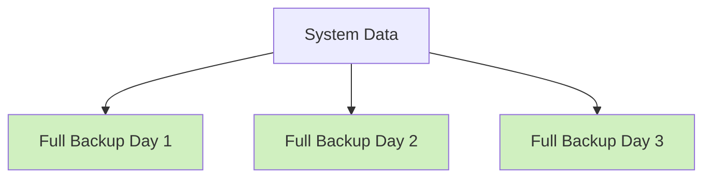
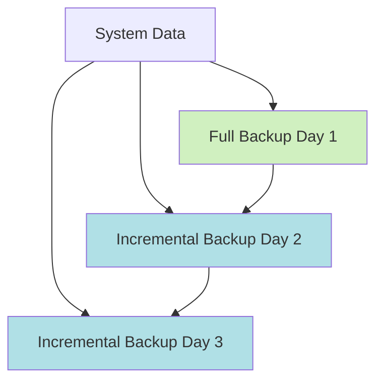
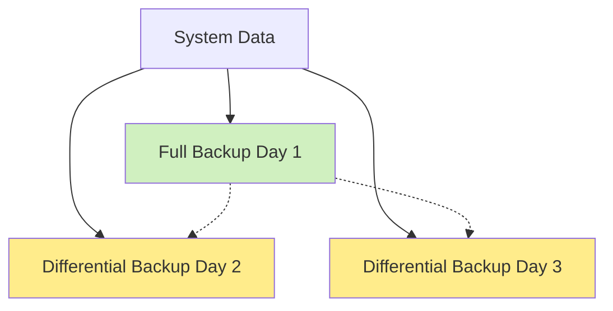

# Backup and Recovery

## Introduction

Backup and recovery are critical components of system administration that ensure data safety and business continuity. No matter how stable your systems might be, hardware failures, software bugs, user errors, or security breaches can lead to data loss. Having a robust backup and recovery strategy is like an insurance policy for your data—it's something you hope you'll never need, but will be grateful for when disaster strikes.

In this guide, we'll explore the fundamentals of backup and recovery for operating systems, discussing different backup strategies, tools, and best practices that every system administrator should know.

## Why Backup and Recovery Matters

Consider this real-world scenario: 

A small business with all their customer records and financial data stored on a single server experiences a catastrophic hard drive failure. Without proper backups, they've potentially lost years of business data. With proper backups, this scenario changes from a business-ending disaster to a mere inconvenience.

## Types of Backups

There are three primary types of backups that form the foundation of most backup strategies:

### 1. Full Backup

A full backup is exactly what it sounds like—a complete copy of all selected data.



**Pros:**
- Contains all necessary data in one place
- Simplest to restore from

**Cons:**
- Takes the longest time to create
- Requires the most storage space
- Redundant data is backed up repeatedly

### 2. Incremental Backup

An incremental backup only backs up data that has changed since the last backup of any type.



**Pros:**
- Faster than full backups
- Uses less storage space

**Cons:**
- Restoration is more complex and time-consuming
- Requires the full backup plus all incremental backups for complete restoration

### 3. Differential Backup

A differential backup contains all data changed since the last full backup.



**Pros:**
- Faster than full backups
- Simpler restoration than incremental (only need full + latest differential)

**Cons:**
- Takes more space than incremental backups
- Takes longer than incremental backups

## Backup Strategies and Best Practices

### The 3-2-1 Rule

A widely recommended strategy for backups is the 3-2-1 rule:

- **3** copies of your data
- On **2** different types of media
- With **1** copy stored offsite

This strategy provides redundancy and protects against various types of failures.

### Backup Rotation Schemes

#### Grandfather-Father-Son (GFS)

This common rotation scheme involves:

- **Son**: Daily backups (kept for a week)
- **Father**: Weekly backups (kept for a month)
- **Grandfather**: Monthly backups (kept for a year or more)

### Backup Testing

A backup is only as good as its ability to be restored. Regular testing of backup restoration is essential to ensure your backup strategy works when needed.

## Command-Line Backup Tools in Linux

Linux provides several powerful command-line tools for creating backups.

### Using `tar` for Backups

The `tar` command is one of the most common tools for creating backups in Linux.

```bash
# Create a full backup of the /home directory
tar -cvpzf backup_home_$(date +%Y-%m-%d).tar.gz /home/

# Restore from a tar backup
tar -xvpzf backup_home_2023-06-01.tar.gz -C /
```

**Output:**
```
backup_home_2023-06-01.tar.gz
```

### Using `rsync` for Efficient Backups

`rsync` is ideal for incremental backups, as it only copies files that have changed.

```bash
# Sync local directory with backup directory
rsync -avz --delete /source/directory/ /backup/directory/

# Remote backup using rsync
rsync -avz -e ssh /source/directory/ user@remote:/backup/directory/
```

**Output:**
```
sending incremental file list
./
file1.txt
file2.txt

sent 1,234 bytes  received 42 bytes  2,552.00 bytes/sec
total size is 10,485,760  speedup is 8,212.12
```

## Windows Backup Tools

### Windows Server Backup

Windows Server includes a built-in backup utility that can be managed through PowerShell.

```powershell
# Install Windows Server Backup feature
Install-WindowsFeature Windows-Server-Backup

# Create a one-time backup
wbadmin start backup -backupTarget:E: -include:C: -quiet
```

### PowerShell Backup Scripts

PowerShell can be used to create custom backup solutions:

```powershell
# Simple PowerShell backup script
$source = "C:\Users\UserName\Documents"
$destination = "E:\Backups\Documents_$(Get-Date -Format 'yyyy-MM-dd')"

# Create destination directory if it doesn't exist
if (-not (Test-Path $destination)) {
    New-Item -ItemType Directory -Path $destination | Out-Null
}

# Copy files with progress
Copy-Item -Path "$source\*" -Destination $destination -Recurse -Force
```

## Automating Backups

### Linux: Using `cron` for Scheduled Backups

The `cron` system allows you to schedule backups at regular intervals.

Create a backup script:

```bash
#!/bin/bash
# backup_script.sh

TODAY=$(date +%Y-%m-%d)
BACKUP_DIR="/backup"

# Create a timestamped directory
mkdir -p $BACKUP_DIR/$TODAY

# Backup important directories
tar -czf $BACKUP_DIR/$TODAY/home_backup.tar.gz /home/
tar -czf $BACKUP_DIR/$TODAY/etc_backup.tar.gz /etc/

# Delete backups older than 30 days
find $BACKUP_DIR -type d -mtime +30 -exec rm -rf {} \; 2>/dev/null || true
```

Make the script executable and add it to crontab:

```bash
chmod +x backup_script.sh

# Edit crontab
crontab -e

# Add this line to run the backup daily at 2 AM
0 2 * * * /path/to/backup_script.sh
```

### Windows: Using Task Scheduler

1. Create a PowerShell backup script (save as `Backup.ps1`)
2. Open Task Scheduler
3. Create a new basic task
4. Set the trigger (daily, weekly, etc.)
5. Choose "Start a program" as the action
6. Enter: `powershell.exe` as the program and `-File "C:\path\to\Backup.ps1"` as the argument

## Backup Verification and Monitoring

### Verifying Backup Integrity

It's crucial to verify that backups are not only being created but are also valid and usable.

```bash
# Verify a tar backup without extracting
tar -tvf backup_file.tar.gz | head -10

# Check the MD5 hash of a backup file
md5sum backup_file.tar.gz > backup_file.md5
# Later, verify integrity
md5sum -c backup_file.md5
```

### Monitoring Backup Jobs

For a production environment, you should implement monitoring to ensure backups are completing successfully.

```bash
#!/bin/bash
# backup_monitor.sh

BACKUP_DIR="/backup"
LATEST_BACKUP=$(find $BACKUP_DIR -type d -name "20*" | sort | tail -1)

# Check if the latest backup is from today
TODAY=$(date +%Y-%m-%d)
if [[ ! $LATEST_BACKUP == *"$TODAY"* ]]; then
    echo "ERROR: No backup was created today!" | mail -s "Backup Failure" admin@example.com
fi

# Check backup size
MIN_SIZE=1000000  # 1MB
BACKUP_SIZE=$(du -s $LATEST_BACKUP | cut -f1)
if [ $BACKUP_SIZE -lt $MIN_SIZE ]; then
    echo "WARNING: Today's backup is suspiciously small!" | mail -s "Backup Warning" admin@example.com
fi
```

## Disaster Recovery Planning

A backup strategy is part of a larger disaster recovery plan. Your disaster recovery plan should include:

1. **Recovery Time Objective (RTO)**: How quickly you need to recover
2. **Recovery Point Objective (RPO)**: How much data loss is acceptable
3. **Disaster Recovery Procedures**: Step-by-step instructions for recovery
4. **Emergency Contact Information**: Who to contact during an emergency
5. **Regular Drills**: Practice your recovery procedures

## Recovery Scenarios and Procedures

### Recovering Individual Files

Sometimes you only need to recover specific files rather than an entire system.

```bash
# Extract specific files from a tar backup
tar -xvf backup.tar.gz path/to/file

# Using find to locate files in an extracted backup
find /path/to/extracted/backup -name "filename*"
```

### Full System Recovery

For complete system failures, you might need to restore the entire operating system.

#### Linux System Restore Example

```bash
# Boot from a live CD/USB
# Mount the file systems
mkdir /mnt/recovery
mount /dev/sda1 /mnt/recovery

# Extract the backup
tar -xvpzf /path/to/backup.tar.gz -C /mnt/recovery

# Restore boot loader
chroot /mnt/recovery
grub-install /dev/sda
update-grub
exit

# Unmount and reboot
umount /mnt/recovery
reboot
```

#### Windows System Restore

Windows systems typically use system images for full recovery:

1. Boot from Windows installation media
2. Choose "Repair your computer"
3. Select "Troubleshoot" > "System Image Recovery"
4. Follow the wizard to restore from your backup image

## Cloud Backup Solutions

Cloud-based backup solutions offer additional protection and convenience.

### Using `rclone` to Backup to Cloud Storage

`rclone` is a command-line program that allows you to sync files with various cloud storage providers.

```bash
# Configure rclone for your cloud provider
rclone config

# Sync a local directory to cloud storage
rclone sync /local/path remote:backup

# Automate with cron
0 3 * * * rclone sync /important/data remote:backup --log-file=/var/log/rclone.log
```

## Summary

Backup and recovery are essential aspects of system administration. In this guide, we've covered:

- Different types of backups (full, incremental, differential)
- Backup strategies and best practices, including the 3-2-1 rule
- Command-line tools for Linux and Windows backups
- Automating backups with scheduling tools
- Verifying and monitoring your backups
- Disaster recovery planning
- Recovery procedures for different scenarios
- Cloud backup solutions

Implementing a robust backup and recovery system is an investment that pays off tremendously when disaster strikes. Remember: the best time to set up backups is before you need them.

## Exercises

1. Set up a daily backup of your home directory using `tar` and `cron`.
2. Create a differential backup strategy for a hypothetical web server.
3. Write a script that verifies the integrity of your backups and sends an alert if issues are found.
4. Design a disaster recovery plan for a small business with two servers.
5. Practice restoring files from your backups in a test environment.

## Additional Resources

- Linux man pages: `man tar`, `man rsync`, `man cron`
- Windows Server Backup documentation
- Cloud provider documentation for their backup solutions
- Books on system administration and disaster recovery