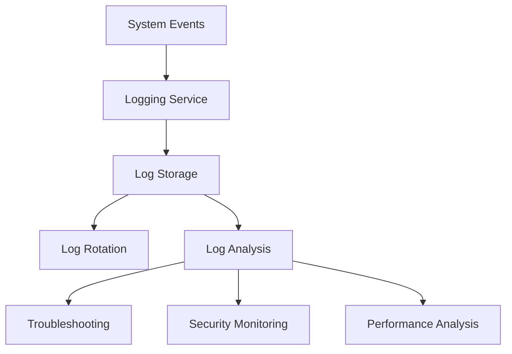

# System Logs

## Introduction

System logs are detailed records of events that occur within an operating system and its applications. They serve as the "black box" of your computer system, recording everything from routine operations to critical errors. For system administrators and developers alike, logs are invaluable tools for troubleshooting, security monitoring, and performance analysis.

In this guide, we'll explore what system logs are, where they're stored across different operating systems, how to read and analyze them, and how they can help you maintain a healthy system.

## What Are System Logs?

System logs are text files that contain time-stamped records of events generated by:
- The operating system kernel
- System services and daemons
- Applications running on the system
- Security mechanisms
- Hardware events

Each log entry typically includes:
- Timestamp (when the event occurred)
- Source (what component generated the log)
- Severity level (how important the event is)
- Message (description of what happened)



## System Logs Across Different Operating Systems

### Linux System Logs

In Linux, most system logs are stored in the `/var/log` directory. Some important log files include:

- `/var/log/syslog` or `/var/log/messages`: General system messages
- `/var/log/auth.log` or `/var/log/secure`: Authentication and authorization logs
- `/var/log/kern.log`: Kernel messages
- `/var/log/dmesg`: Boot messages
- `/var/log/apache2/` or `/var/log/httpd/`: Web server logs

Let's examine a typical line from a Linux syslog:

```
Apr 15 14:23:01 webserver systemd[1]: Started Daily apt upgrade and clean activities.
```

Breaking this down:
- `Apr 15 14:23:01`: Timestamp
- `webserver`: Hostname
- `systemd[1]`: Process name and ID
- `Started Daily apt upgrade and clean activities`: The actual message

### Windows System Logs

Windows uses the Event Viewer to store and display logs. The main log categories are:

- Application: Events logged by applications
- Security: Security-related events (login attempts, policy changes)
- System: Operating system events
- Setup: Events related to application setup

To access Event Viewer:
1. Press `Win + R`
2. Type `eventvwr.msc`
3. Press Enter

### macOS System Logs

macOS uses a system called Unified Logging. You can access logs using:

- Console application (found in Applications > Utilities)
- `log` command in Terminal

## Reading and Analyzing Logs

### Common Tools for Log Analysis

#### Linux Log Tools

The command line offers several tools for examining logs:

**Using `cat` to view an entire log file:**

```bash
cat /var/log/syslog
```

**Using `tail` to view the most recent entries:**

```bash
# View the last 10 lines
tail /var/log/syslog

# View the last 100 lines
tail -n 100 /var/log/syslog

# Follow the log in real-time (shows new entries as they happen)
tail -f /var/log/syslog
```

**Using `grep` to search for specific terms:**

```bash
# Find all entries containing "error"
grep "error" /var/log/syslog

# Find all entries containing "failed" (case insensitive)
grep -i "failed" /var/log/auth.log
```

**Combining commands for more complex filtering:**

```bash
# Find all SSH connection attempts today
grep "$(date +%b' '%d)" /var/log/auth.log | grep "sshd"
```

#### Windows Log Tools

In addition to the Event Viewer GUI, you can use PowerShell:

```powershell
# Get the most recent 10 system log events
Get-EventLog -LogName System -Newest 10

# Find error events in the Application log
Get-EventLog -LogName Application -EntryType Error

# Find login events from the Security log
Get-WinEvent -FilterHashtable @{LogName='Security'; ID=4624}
```

#### macOS Log Tools

Using the `log` command in Terminal:

```bash
# Show log stream in real-time
log stream

# Show logs from the last hour
log show --last 1h

# Show logs related to a specific process
log show --predicate 'process == "Safari"'
```

### Understanding Log Severity Levels

Most logging systems use severity levels to indicate the importance of events:

1. **Emergency/Critical**: System is unusable
2. **Alert**: Immediate action required
3. **Critical**: Critical conditions
4. **Error**: Error conditions
5. **Warning**: Warning conditions
6. **Notice**: Normal but significant conditions
7. **Info**: Informational messages
8. **Debug**: Debug-level messages

In Linux syslog, you might see these represented as:

```
<0>Emergency: System is unusable
<1>Alert: Action must be taken immediately
<2>Critical: Critical conditions
<3>Error: Error conditions
<4>Warning: Warning conditions
<5>Notice: Normal but significant condition
<6>Informational: Informational messages
<7>Debug: Debug-level messages
```

## Practical Applications of System Logs

### Troubleshooting System Issues

**Scenario**: A service fails to start

**Log Analysis Approach**:
1. Check the system log for errors around the time of failure
2. Look for specific messages related to the service name
3. Check for dependencies that might have failed

**Example**:

```bash
# Find errors related to the Apache service
grep -i "apache\|httpd" /var/log/syslog | grep -i "error\|fail"
```

This might reveal an output like:

```
Apr 15 08:47:32 webserver systemd[1]: Failed to start The Apache HTTP Server.
Apr 15 08:47:32 webserver systemd[1]: apache2.service: Failed with result 'exit-code'.
```

From here, we might check the Apache-specific logs:

```bash
tail /var/log/apache2/error.log
```

Which might show:

```
[Wed Apr 15 08:47:31.634567 2023] [core:error] [pid 1234] (13)Permission denied: AH00058: Error retrieving pid file /var/run/apache2/apache2.pid
```

This indicates a permissions issue that we can now address.

### Security Monitoring

System logs are crucial for security monitoring:

**Example**: Detecting brute force SSH login attempts

```bash
grep "Failed password" /var/log/auth.log
```

Might show:

```
Apr 15 03:12:24 server sshd[1234]: Failed password for invalid user admin from 192.168.1.100 port 53210 ssh2
Apr 15 03:12:26 server sshd[1235]: Failed password for invalid user admin from 192.168.1.100 port 53211 ssh2
Apr 15 03:12:28 server sshd[1236]: Failed password for invalid user root from 192.168.1.100 port 53212 ssh2
```

This pattern of failed logins suggests a brute force attack, which might prompt you to:
1. Block the IP address using a firewall
2. Implement fail2ban to automatically block repeated failures
3. Consider moving SSH to a non-standard port

### Performance Analysis

Logs can help identify performance bottlenecks:

**Example**: Checking for memory issues in Linux

```bash
grep -i "out of memory" /var/log/syslog
```

Might reveal:

```
Apr 15 15:23:45 server kernel: [4721122.342234] Out of memory: Kill process 1234 (mysql) score 123
```

This indicates the MySQL process was terminated due to memory pressure, suggesting you might need to:
1. Increase system memory
2. Adjust MySQL configuration to use less memory
3. Identify memory leaks in applications

## Log Rotation and Management

To prevent logs from growing indefinitely and consuming all disk space, operating systems use log rotation:

### Linux Log Rotation

Linux uses the `logrotate` utility to manage log rotation. Configuration files are stored in `/etc/logrotate.d/`.

A typical logrotate configuration:

```
/var/log/syslog {
    rotate 7
    daily
    missingok
    notifempty
    delaycompress
    compress
    postrotate
        /usr/lib/rsyslog/rsyslog-rotate
    endscript
}
```

This configuration:
- Rotates the syslog file daily
- Keeps 7 days of logs
- Compresses old logs
- Runs a script after rotation

### Creating a Simple Logging System in Python

Here's a simple example of how to implement logging in a Python application:

```python
import logging

# Configure the logger
logging.basicConfig(
    filename='app.log',
    level=logging.INFO,
    format='%(asctime)s - %(name)s - %(levelname)s - %(message)s'
)

# Create a logger
logger = logging.getLogger('my_app')

# Log messages at different levels
logger.debug('This is a debug message')
logger.info('Application started')
logger.warning('Configuration file not found, using defaults')
logger.error('Failed to connect to database')
logger.critical('System shutdown due to critical error')

# Log exceptions
try:
    result = 10 / 0
except Exception as e:
    logger.exception(f"Error occurred: {e}")
```

This will create an app.log file with entries like:

```
2023-04-15 16:20:31,245 - my_app - INFO - Application started
2023-04-15 16:20:31,245 - my_app - WARNING - Configuration file not found, using defaults
2023-04-15 16:20:31,246 - my_app - ERROR - Failed to connect to database
2023-04-15 16:20:31,246 - my_app - CRITICAL - System shutdown due to critical error
2023-04-15 16:20:31,246 - my_app - ERROR - Error occurred: division by zero
Traceback (most recent call last):
  File "example.py", line 18, in <module>
    result = 10 / 0
ZeroDivisionError: division by zero
```

## Best Practices for System Logging

1. **Set appropriate log levels**: Use debug for development, info for production
2. **Implement log rotation**: Prevent logs from consuming all disk space
3. **Centralize logs**: For multi-server environments, use a centralized logging solution like ELK (Elasticsearch, Logstash, Kibana) or Graylog
4. **Include contextual information**: Timestamps, source, user IDs, and transaction IDs
5. **Monitor logs proactively**: Set up alerts for critical errors
6. **Protect sensitive data**: Don't log passwords, credit card numbers, or personal information
7. **Maintain log integrity**: Ensure logs can't be tampered with
8. **Document log formats**: Keep documentation of what logs mean

## Summary

System logs are essential tools for understanding what's happening within your operating system and applications. They provide critical information for troubleshooting, security monitoring, and performance analysis.

Key takeaways:
- Logs record events with timestamps, sources, severity levels, and messages
- Different operating systems store logs in different locations and formats
- Command-line tools like `grep`, `tail`, and PowerShell cmdlets help analyze logs
- Log rotation prevents logs from consuming too much disk space
- Proper logging practices help maintain system health and security

## Exercises

1. Find all failed login attempts on your system from the past week.
2. Set up a simple script to alert you when critical errors appear in your logs.
3. Implement proper logging in a small application you've developed.
4. Configure log rotation for a custom application log.
5. Create a dashboard using a tool like Grafana to visualize important log metrics.

## Additional Resources

- **Books**:
  - "Linux System Administration" by Wale Soyinka
  - "Windows Server 2019 Administration Fundamentals" by Bekim Dauti

- **Online Documentation**:
  - [Linux syslog Protocol](https://www.rfc-editor.org/rfc/rfc5424)
  - [Windows Event Log](https://docs.microsoft.com/en-us/windows/win32/wes/windows-event-log)
  - [Python Logging Documentation](https://docs.python.org/3/library/logging.html)

- **Tools**:
  - [ELK Stack](https://www.elastic.co/elastic-stack)
  - [Graylog](https://www.graylog.org/)
  - [Splunk](https://www.splunk.com/)
  - [Lnav - Log File Navigator](http://lnav.org/)