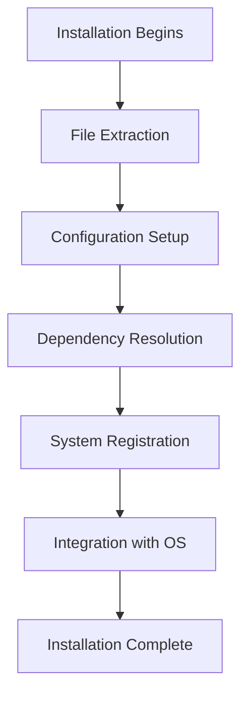
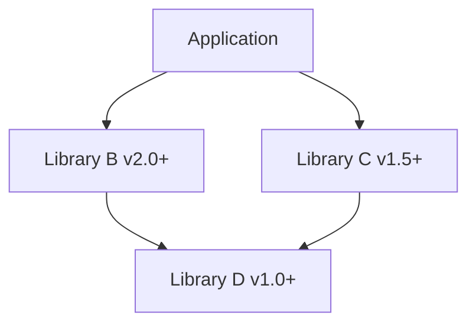

# Software Installation

## Introduction

Software installation is a fundamental aspect of operating system management and administration. Whether you're setting up a new computer, deploying applications in an enterprise environment, or just trying to get your favorite tools working, understanding how software installation works across different operating systems is essential knowledge for any computing professional.

This guide explores the various methods of software installation across major operating systems, explains package management systems, and provides best practices for maintaining software installations. By the end, you'll have a solid foundation for managing software on any system you encounter.

## Understanding Software Installation Concepts

### What Happens During Installation?

When you install software, several processes typically occur:

1. **File Extraction** - Program files are copied to appropriate locations
2. **Configuration** - Settings are established for the software to work correctly
3. **Dependencies** - Required libraries or components are installed
4. **Registry/System Updates** - System databases are updated to recognize the new software
5. **Integration** - The software is integrated with the operating system

<br />



## Installation Methods Across Operating Systems

### Windows Software Installation

Windows offers several ways to install software:

#### MSI Installers and Setup Executables

Most Windows software comes as `.msi` (Microsoft Installer) packages or `.exe` setup files.

```bash
# Running an installer from command line (typical user wouldn't do this, but it's possible)
C:\> setup.exe /silent
```

#### Windows Store

Modern Windows applications can be installed through the Microsoft Store:

```powershell
# PowerShell command to install an app from Windows Store
Install-AppxPackage -Path app_package.appx
```

#### Chocolatey Package Manager

Chocolatey brings Linux-style package management to Windows:

```powershell
# Install Chocolatey
Set-ExecutionPolicy Bypass -Scope Process -Force
iex ((New-Object System.Net.WebClient).DownloadString('https://chocolatey.org/install.ps1'))

# Install a program with Chocolatey
choco install firefox -y
```

### Linux Software Installation

Linux distributions use package managers to handle software installation:

#### APT (Debian/Ubuntu)

```bash
# Update package lists
sudo apt update

# Install software
sudo apt install firefox

# Output:
# Reading package lists... Done
# Building dependency tree... Done
# The following packages will be installed:
#   firefox firefox-locale-en ...
# Do you want to continue? [Y/n] y
# ...installation proceeds...
```

#### DNF/YUM (Fedora/RHEL/CentOS)

```bash
# Install software
sudo dnf install firefox

# Output:
# Dependencies resolved.
# =====================================================
# Package        Arch   Version        Repository Size
# =====================================================
# Installing:
#  firefox       x86_64 91.0-1.fc34    updates   89 M
# ...
# Is this ok [y/N]: y
```

#### Pacman (Arch Linux)

```bash
# Install software
sudo pacman -S firefox

# Output:
# resolving dependencies...
# looking for conflicting packages...
# Packages (1) firefox-91.0-1
# Total Download Size:   0.00 MiB
# Total Installed Size:  169.41 MiB
# :: Proceed with installation? [Y/n] 
```

### macOS Software Installation

macOS offers multiple installation methods:

#### DMG Files and Application Bundles

Most macOS software comes as `.dmg` files containing application bundles:

1. Mount the DMG file by double-clicking it
2. Drag the application to the Applications folder
3. Eject the disk image

#### Homebrew Package Manager

Homebrew provides a command-line approach to installing macOS software:

```bash
# Install Homebrew
/bin/bash -c "$(curl -fsSL https://raw.githubusercontent.com/Homebrew/install/HEAD/install.sh)"

# Install software
brew install firefox

# Output:
# ==> Downloading https://homebrew.bintray.com/bottles/firefox-91.0.mojave.bottle.tar.gz
# ######################################################################## 100.0%
# ==> Pouring firefox-91.0.mojave.bottle.tar.gz
# 🍺  /usr/local/Cellar/firefox/91.0: 145 files, 239.5MB
```

## Package Management Best Practices

### Keeping Software Updated

Regular updates are crucial for security and functionality:

```bash
# Windows (Chocolatey)
choco upgrade all -y

# Linux (Ubuntu)
sudo apt update && sudo apt upgrade -y

# macOS (Homebrew)
brew update && brew upgrade
```

### Managing Dependencies

Dependencies can become complex. Modern package managers handle most dependency issues automatically, but understanding the concept is important:



### Troubleshooting Installation Issues

Common installation problems and solutions:

1. **Permission Issues**
   ```bash
   # Fix permission problems on Linux
   sudo chown -R username:group directory
   ```

2. **Dependency Conflicts**
   ```bash
   # Check for broken dependencies on Ubuntu
   sudo apt --fix-broken install
   ```

3. **Disk Space Problems**
   ```bash
   # Check disk space on Linux
   df -h
   ```

## Real-World Applications

### Scenario 1: Setting Up a Development Environment

Let's walk through installing a complete web development environment on Linux:

```bash
# Update system
sudo apt update && sudo apt upgrade -y

# Install Node.js and npm
sudo apt install nodejs npm

# Install VS Code
sudo apt install apt-transport-https
wget -q https://packages.microsoft.com/keys/microsoft.asc -O- | sudo apt-key add -
sudo add-apt-repository "deb [arch=amd64] https://packages.microsoft.com/repos/vscode stable main"
sudo apt update
sudo apt install code

# Install Git
sudo apt install git

# Configure Git
git config --global user.name "Your Name"
git config --global user.email "your.email@example.com"
```

### Scenario 2: Enterprise Software Deployment

For system administrators managing multiple machines:

```powershell
# PowerShell script to install software via Group Policy
# Save as install-software.ps1
$software = @("firefox", "7zip", "adobereader")

foreach ($app in $software) {
    Write-Host "Installing $app..."
    choco install $app -y
}

Write-Host "Installation complete!"
```

## Advanced Topics

### Silent Installations

Silent installations are useful for automated deployments:

```bash
# Silent install on Windows
setup.exe /S /v/qn

# Silent install on macOS
installer -pkg application.pkg -target /
```

### Virtual Environments

Isolate software installations to avoid conflicts:

```bash
# Python virtual environment
python -m venv myenv
source myenv/bin/activate  # On Windows: myenv\Scripts\activate
pip install package_name
```

### Container-Based Installations

Modern deployment often uses containers:

```bash
# Docker container with pre-installed software
docker run -it ubuntu:latest

# Inside container
apt update && apt install nginx -y
```

## Summary

Software installation is a fundamental skill in OS management and administration. In this guide, we've covered:

- The basic concepts behind software installation
- Installation methods on Windows, Linux, and macOS
- Package management best practices
- Troubleshooting common installation issues
- Real-world application scenarios
- Advanced installation techniques

Understanding these concepts will help you manage software effectively across different operating systems and environments.

## Additional Resources

- Practice installing software using different methods on your system
- Try creating automated installation scripts for your commonly used software
- Experiment with virtual machines to test installation procedures safely
- Learn about containerization technologies like Docker for application deployment

## Practice Exercises

1. Set up a complete development environment for your preferred programming language
2. Create a script that automates the installation of your most-used applications
3. Install and configure a web server (Apache, Nginx) on your preferred OS
4. Practice using package managers to install, update, and remove software
5. Try resolving dependency conflicts manually to understand how package managers work