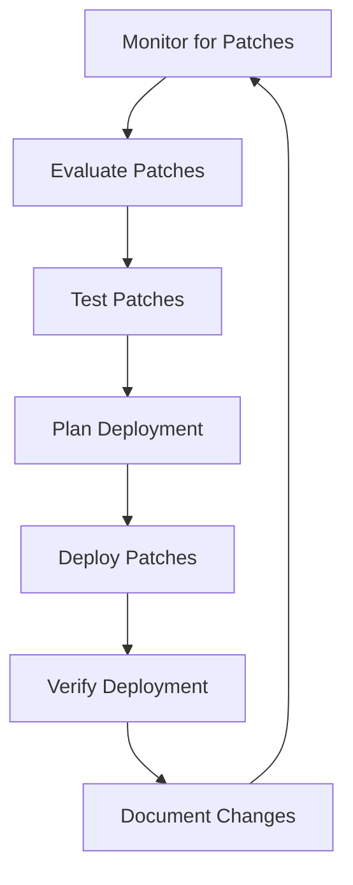

# Patch Management

## Introduction

Patch management is a critical process in operating system administration that involves identifying, acquiring, testing, and installing updates (patches) to software applications, operating systems, and embedded systems. These patches are designed to fix bugs, address security vulnerabilities, improve performance, or add new features to existing software.

In today's interconnected digital landscape, where cyber threats evolve rapidly, effective patch management is not just a maintenance task—it's a fundamental security practice that helps protect systems from exploitation and ensures operational stability.

## Why Patch Management Matters

Patch management serves several crucial purposes:

1. **Security Enhancement**: Patches often address vulnerabilities that could be exploited by malicious actors.
2. **Bug Fixes**: Software updates fix programming errors that cause crashes or unexpected behavior.
3. **Feature Improvements**: Patches may introduce new functionality or improve existing features.
4. **Compliance Requirements**: Many regulatory frameworks require timely application of security patches.
5. **System Stability**: Regular updates keep systems running smoothly and reliably.

## Patch Management Lifecycle

The patch management process follows a cyclical workflow:



Let's explore each stage in detail:

### 1. Monitor for Patches

Stay informed about available patches from vendors and security advisories.

**Example code for automated patch notification in Linux:**

```bash
# Create a simple script to check for available updates
#!/bin/bash

# Update package lists
sudo apt update

# Check for available updates
UPDATES=$(apt list --upgradable 2>/dev/null | grep -v "Listing..." | wc -l)

# Notify if updates are available
if [ $UPDATES -gt 0 ]; then
    echo "There are $UPDATES packages that can be upgraded."
    echo "Run 'sudo apt upgrade' to apply these updates."
else
    echo "System is up to date."
fi
```

**Output:**
```
There are 14 packages that can be upgraded.
Run 'sudo apt upgrade' to apply these updates.
```

### 2. Evaluate Patches

Assess each patch's importance, risks, and relevance to your environment.

When evaluating patches, consider these factors:

- Criticality (is it a security patch?)
- Potential impact on systems
- Resource requirements
- Dependencies on other components
- Vendor recommendations

### 3. Test Patches

Always test patches in a non-production environment before deployment.

**Example: Simple test script for checking application functionality after patching:**

```python
#!/usr/bin/env python3

import subprocess
import sys

def run_test(app_name, test_command):
    """Run a simple test to verify application functionality"""
    print(f"Testing {app_name}...")
    try:
        result = subprocess.run(
            test_command,
            shell=True,
            check=True,
            capture_output=True,
            text=True
        )
        print(f"✅ {app_name} test passed")
        return True
    except subprocess.CalledProcessError as e:
        print(f"❌ {app_name} test failed: {e}")
        print(f"Error output: {e.stderr}")
        return False

# List of applications and their test commands
tests = [
    ("Web Server", "curl -s -o /dev/null -w '%{http_code}' http://localhost | grep -q '200'"),
    ("Database", "mysql -e 'SELECT version();' > /dev/null"),
    ("API Service", "curl -s http://localhost:8080/api/health | grep -q 'ok'")
]

# Run all tests
failed = 0
for app, command in tests:
    if not run_test(app, command):
        failed += 1

print(f"
Test summary: {len(tests) - failed}/{len(tests)} tests passed")
sys.exit(failed)
```

**Output:**
```
Testing Web Server...
✅ Web Server test passed
Testing Database...
✅ Database test passed
Testing API Service...
✅ API Service test passed

Test summary: 3/3 tests passed
```

### 4. Plan Deployment

Create a deployment strategy considering:
- Scheduling (maintenance windows)
- Prioritization
- Rollback procedures
- User communication

### 5. Deploy Patches

Execute the deployment according to your plan.

**Example: Windows PowerShell script for installing Windows updates:**

```powershell
# Install-WindowsUpdates.ps1
# Requires PowerShell 5.1 or later and admin privileges

# Get available updates
Write-Host "Checking for Windows updates..." -ForegroundColor Yellow
$Updates = Start-WuScan

if ($Updates.Count -eq 0) {
    Write-Host "No updates available." -ForegroundColor Green
    exit 0
}

# Display available updates
Write-Host "Found $($Updates.Count) updates:" -ForegroundColor Cyan
$Updates | ForEach-Object { Write-Host "- $($_.Title)" }

# Confirm installation
$Confirm = Read-Host "Do you want to install these updates? (Y/N)"
if ($Confirm -ne "Y") {
    Write-Host "Update installation canceled." -ForegroundColor Yellow
    exit 0
}

# Install updates
Write-Host "Installing updates..." -ForegroundColor Yellow
$Result = Install-WuUpdates -Updates $Updates

# Report results
Write-Host "Installation completed." -ForegroundColor Green
Write-Host "Installed: $($Result.Installed.Count)" -ForegroundColor Green
Write-Host "Failed: $($Result.Failed.Count)" -ForegroundColor Red

if ($Result.Failed.Count -gt 0) {
    Write-Host "Failed updates:" -ForegroundColor Red
    $Result.Failed | ForEach-Object { Write-Host "- $($_.Title): $($_.ErrorCode)" }
}

# Check if reboot is required
if (Test-WuRebootRequired) {
    Write-Host "System requires a reboot to complete the update process." -ForegroundColor Yellow
}
```

### 6. Verify Deployment

Confirm that patches were successfully applied.

**Example: Linux script to verify kernel updates:**

```bash
#!/bin/bash

# Check current kernel version
CURRENT_KERNEL=$(uname -r)
echo "Current kernel: $CURRENT_KERNEL"

# Check if we have the latest installed kernel
LATEST_KERNEL=$(dpkg --list | grep linux-image | grep -v meta | sort -V | tail -n1 | awk '{print $2}' | sed 's/linux-image-//')
echo "Latest installed kernel: $LATEST_KERNEL"

# Compare versions
if [ "$CURRENT_KERNEL" = "$LATEST_KERNEL" ]; then
    echo "✅ System is running the latest installed kernel"
else
    echo "⚠️ System is NOT running the latest installed kernel"
    echo "A reboot is required to apply the kernel update"
fi

# Check for failed service restarts after updates
FAILED_SERVICES=$(systemctl list-units --state=failed --no-legend | wc -l)
if [ $FAILED_SERVICES -gt 0 ]; then
    echo "❌ $FAILED_SERVICES services failed to start after update"
    echo "Run 'systemctl --failed' to see details"
else
    echo "✅ All services are running properly"
fi
```

**Output:**
```
Current kernel: 5.15.0-78-generic
Latest installed kernel: 5.15.0-79-generic
⚠️ System is NOT running the latest installed kernel
A reboot is required to apply the kernel update
✅ All services are running properly
```

### 7. Document Changes

Keep detailed records of all patches applied, including:
- Date and time
- Systems affected
- Patch details
- Issues encountered
- Verification results

## Patch Management Tools

Several tools can help automate and streamline patch management:

### For Windows Systems:
- **Windows Server Update Services (WSUS)**: Microsoft's free update management solution
- **System Center Configuration Manager (SCCM)**: Enterprise-level management suite
- **Windows Update for Business**: Cloud-based update management

### For Linux Systems:
- **Yum/DNF**: For Red Hat-based distributions
- **APT**: For Debian-based distributions
- **Zypper**: For SUSE-based distributions
- **Landscape**: For Ubuntu systems

### Cross-Platform Solutions:
- **Ansible**: Infrastructure automation platform
- **Puppet**: Configuration management tool
- **Chef**: Infrastructure automation
- **Jenkins**: Automation server that can be used for patch deployment

## Best Practices for Patch Management

1. **Establish a Patch Management Policy**
   Define clear procedures, responsibilities, and timelines for patching.

2. **Maintain an Inventory**
   Keep an updated inventory of all systems, applications, and their patch levels.

3. **Prioritize Patches**
   Focus on critical security patches first, especially for internet-facing systems.

4. **Test Before Deployment**
   Always test patches in a controlled environment that mirrors production.

5. **Create a Rollback Plan**
   Prepare for the possibility that a patch might cause issues.

6. **Document Everything**
   Maintain detailed records of all patch-related activities.

7. **Automate Where Possible**
   Use tools to automate routine patch management tasks.

8. **Establish Regular Patching Cycles**
   Set predictable schedules for routine patches.

## Implementing a Basic Patch Management Strategy

Here's a simple implementation for beginners:

### Step 1: Inventory Your Systems

Create a spreadsheet or use an inventory tool to document all systems:

```bash
# Example script to gather basic system information
#!/bin/bash

# Get hostname
HOSTNAME=$(hostname)

# Get OS details
OS=$(cat /etc/os-release | grep "PRETTY_NAME" | cut -d '"' -f 2)

# Get kernel version
KERNEL=$(uname -r)

# Get CPU info
CPU=$(grep "model name" /proc/cpuinfo | head -1 | cut -d ':' -f 2 | xargs)

# Get memory info
MEMORY=$(free -h | grep "Mem:" | awk '{print $2}')

# Get disk info
DISK=$(df -h / | tail -1 | awk '{print $2}')

# Get IP address
IP=$(hostname -I | awk '{print $1}')

# Output the information
echo "System Inventory:"
echo "----------------"
echo "Hostname: $HOSTNAME"
echo "OS: $OS"
echo "Kernel: $KERNEL"
echo "CPU: $CPU"
echo "Memory: $MEMORY"
echo "Disk: $DISK"
echo "IP Address: $IP"
```

### Step 2: Create a Simple Patch Management Schedule

**Example schedule:**
- Critical security patches: Within 24 hours of release
- Important security patches: Within 1 week
- Non-security patches: Monthly maintenance window

### Step 3: Implement Basic Automation

**Example script to automate updates on a Ubuntu server:**

```bash
#!/bin/bash

# Log file
LOG_FILE="/var/log/patch-management-$(date +%Y-%m-%d).log"

# Function to log messages
log() {
    echo "[$(date +%Y-%m-%d\ %H:%M:%S)] $1" | tee -a "$LOG_FILE"
}

# Start logging
log "Starting automated patch management process"

# Create a snapshot/backup if possible
# This is a simplified example - in production, use proper backup tools
if [ -d "/backup" ]; then
    log "Creating basic configuration backup"
    tar -czf /backup/config-backup-$(date +%Y%m%d).tar.gz /etc 2>/dev/null
fi

# Update package lists
log "Updating package lists"
apt-get update >> "$LOG_FILE" 2>&1
if [ $? -ne 0 ]; then
    log "ERROR: Failed to update package lists"
    exit 1
fi

# List packages that would be upgraded
UPGRADE_LIST=$(apt-get --simulate upgrade 2>/dev/null)
log "Packages to be upgraded:"
echo "$UPGRADE_LIST" >> "$LOG_FILE"

# Count security updates
SECURITY_UPDATES=$(grep -c "^Inst.*security" <<< "$UPGRADE_LIST")
log "Security updates available: $SECURITY_UPDATES"

# Perform the upgrade
log "Installing updates"
DEBIAN_FRONTEND=noninteractive apt-get -y upgrade >> "$LOG_FILE" 2>&1
if [ $? -ne 0 ]; then
    log "ERROR: Failed to install updates"
    exit 1
fi

# Check if reboot is required
if [ -f /var/run/reboot-required ]; then
    log "System requires a reboot"
    # Uncomment to automatically schedule a reboot
    # log "Scheduling reboot for midnight"
    # echo "shutdown -r 00:00" | at now
fi

log "Patch management process completed"
```

### Step 4: Test and Verify Updates

After applying patches, verify that all critical services are running:

```bash
#!/bin/bash

# Define services to check
SERVICES=("nginx" "mysql" "ssh" "redis-server")

# Check each service
for SERVICE in "${SERVICES[@]}"; do
    echo -n "Checking $SERVICE: "
    if systemctl is-active --quiet "$SERVICE"; then
        echo "✅ Running"
    else
        echo "❌ Not running"
        echo "Attempting to start $SERVICE..."
        systemctl start "$SERVICE"
        if systemctl is-active --quiet "$SERVICE"; then
            echo "✅ Successfully started $SERVICE"
        else
            echo "❌ Failed to start $SERVICE - manual intervention required"
        fi
    fi
done
```

## Common Challenges and Solutions

### Challenge 1: Downtime Concerns
**Solution:** Schedule patches during maintenance windows and use rolling updates for critical systems.

### Challenge 2: Compatibility Issues
**Solution:** Thorough testing in a staging environment that mirrors production.

### Challenge 3: Resource Constraints
**Solution:** Prioritize patches based on risk and automate routine tasks.

### Challenge 4: Complex Dependencies
**Solution:** Document system dependencies and test updates together.

## Summary

Effective patch management is a foundational aspect of system administration that directly impacts security, stability, and performance. By establishing a structured approach to identifying, testing, deploying, and verifying patches, administrators can maintain secure and reliable systems while minimizing disruption to operations.

Remember these key points:
- Patch regularly and prioritize security updates
- Test thoroughly before production deployment
- Document all patching activities
- Automate where possible to improve consistency
- Verify that systems function correctly after patching

## Additional Resources

Here are some additional resources to deepen your understanding of patch management:

### Official Documentation
- [Microsoft Update Management Best Practices](https://docs.microsoft.com/en-us/windows-server/administration/windows-server-update-services/deploy/deploy-windows-server-update-services)
- [Red Hat Patch Management Guide](https://access.redhat.com/documentation/en-us/red_hat_enterprise_linux/7/html/security_guide/chap-keeping_your_system_up-to-date)
- [Ubuntu Server Guide: Package Management](https://ubuntu.com/server/docs/package-management)

### Standards and Frameworks
- NIST SP 800-40: Guide to Enterprise Patch Management Technologies
- Center for Internet Security (CIS) Controls: Critical Security Controls

## Exercises

1. **Inventory Exercise**: Create an inventory script that collects patch levels for all software on a system.
2. **Policy Development**: Draft a patch management policy for a small organization.
3. **Automation Challenge**: Write a script that automates patching and sends a report email.
4. **Risk Assessment**: Develop a simple scoring system to prioritize patches based on risk.
5. **Recovery Plan**: Create a rollback procedure for when a patch causes problems.